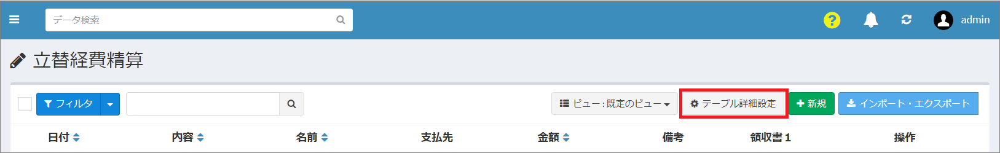
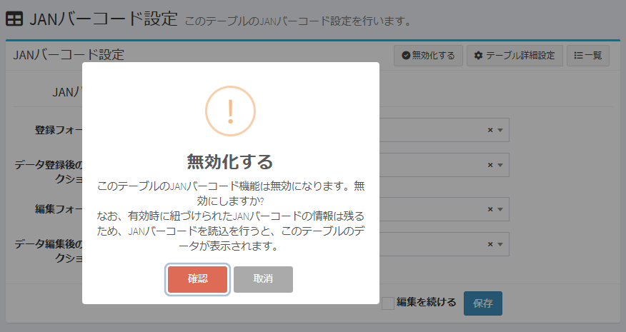

# JANバーコード設定
テーブルのJANバーコード設定を行います。

## JANバーコード機能の概要
JANバーコード機能の概要については、[こちら](https://exment.net/release_v6-2-0/)の公式サイトの投稿をご覧ください。

## ページ表示
- カスタムテーブル一覧で、設定を行うテーブルにチェックを入れて、右上の「テーブル詳細設定」をクリックします。  

> ※ 対象となるカスタムテーブルのデータ一覧画面やデータ登録画面から、直接遷移することも可能です。その場合も、右上の「テーブル詳細設定」をクリックしてください。  

- 表示されたテーブル詳細設定の画面で、JANバーコード設定のアイコンをクリックすると、JANバーコード設定画面が表示されます。  

## JANバーコードの設定項目

### JANバーコード読込
JANバーコード読込時の情報を設定します。 

- #### 登録フォーム  
JANバーコード読込後の登録フォームを設定します。  
対象テーブルに登録済のカスタムフォームから選択できます。 

- #### データ登録後のアクション  
データ登録後の表示画面を設定します。  
TOP画面、一覧画面、詳細画面、編集画面、カメラ起動画面を選択できます。

- #### 編集フォーム
JANバーコード読込後の編集フォームを設定します。  
対象テーブルに登録済のカスタムフォームから選択できます。

- #### データ編集後のアクション
データ編集後の表示画面を設定します。  
TOP画面、一覧画面、詳細画面、編集画面、カメラ起動画面を選択できます。

設定後、「保存」ボタンをクリックします。  

### JANバーコード設定を有効化する  
- 対象テーブルのJANバーコード機能を公開するためには「有効化する」必要があります。一度保存を行ってから、ページ右上の「有効化する」ボタンをクリックしてください。  
- 二次元バーコードとJANバーコードのうち、いずれか1つのみを有効化できます。  
二次元バーコードを有効化した場合は、JANバーコード機能の「有効化する」ボタンは表示されず、有効化できません。同様に、JANバーコードを有効化した場合も、二次元バーコードの有効化はできません。  

### JANバーコード設定を無効化する  
- JANバーコードでの管理を辞めるか、別のテーブルでJANバーコード管理をしたい場合は、ページ右上の「無効化する」ボタンをクリックしてください。  
- 有効時に紐づけられたJANバーコードの情報は残るため、JANバーコード読込を行うと、このテーブルのデータが表示されます。  

## Exmentからカメラ画面の起動
- Exmentのダッシュボードから、二次元／JANバーコード読込のためのカメラ画面を起動できます。  

- Exmentのダッシュボードに、アイテム「二次元／JANバーコード」を追加する手順は、[こちら](/ja/dashboard#二次元／JANバーコード)をご参照ください。
