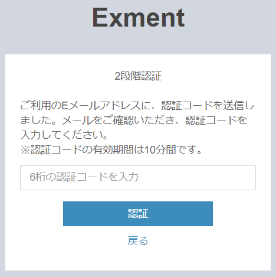

# ログイン(2段階認証)
2段階認証を使用して、Exmentにログインする方法を記載します。  
2段階認証のシステム初期設定は、管理者が行います。[こちら](/ja/login_2factor_setting)をご参照ください。

## 2段階認証の方式
現在サポートしている2段階認証の方式は、以下の2つです。  
どちらの方式を使用しているかどうかは、管理者にお問い合わせください。

- Eメール : ID/パスワードによるログイン後、登録しているメールアドレスに、認証コードのメールが送付されます。  
その認証コードをフォームに入力することで、ログインが完了されます。

- Google認証システム : ID/パスワードによるログイン後、Google認証システムを使用して、2段階認証を行います。

### 2段階認証手順(Eメール)

- ログイン画面で、ID/パスワードを入力し、ログインボタンをクリックします。
  

- 2段階認証画面が表示され、認証コード入力欄が表示されます。
  

- また、ログインを行ったユーザーのメールアドレスに、認証コードが送付されますので、確認します。
  

### 2段階認証手順(Google認証システム)

- ログイン画面で、ID/パスワードを入力し、ログインボタンをクリックします。
  

- はじめてログインを行う場合、まずはGoogle認証システムの設定が必要です。  
「送信」ボタンをクリックすることで、登録しているメールアドレスに、Google認証システムの登録を行うためのメールを送信します。
  

- ログインを行ったユーザーのメールアドレスに、Google認証システム登録用のURLが送付されますので、クリックします。  
