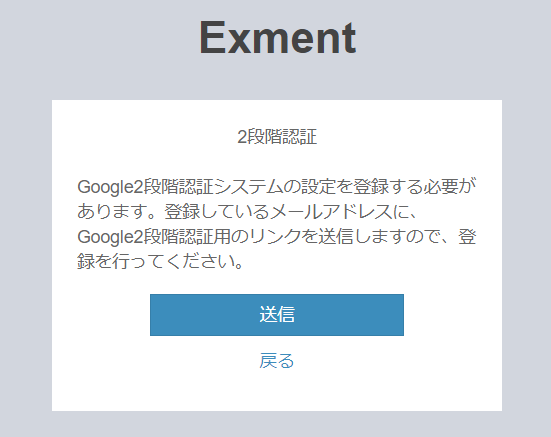
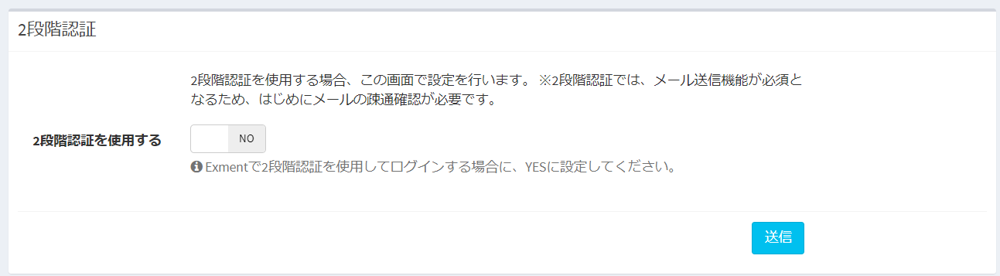
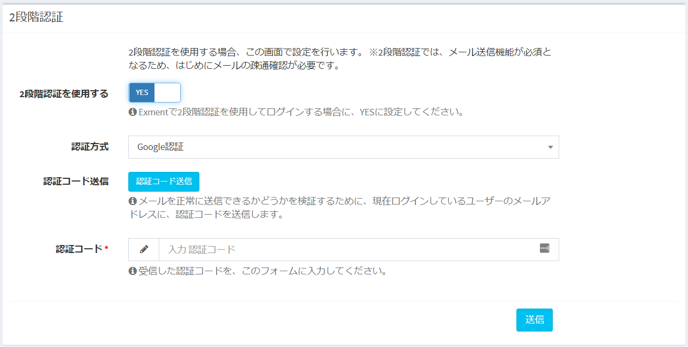
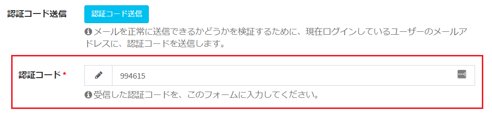
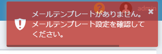
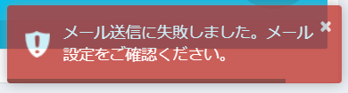

# 2段階認証 システム設定
Exmentでは、2段階認証に対応しております。  
ここでは、Exmentのシステム管理側の設定方法を記載します。

## 2段階認証の方式
現在サポートしている2段階認証の方式は、以下の2つです。  

##### Eメール
ID/パスワードによるログイン後、登録しているメールアドレスに、認証コードのメールが送付されます。  
その認証コードをフォームに入力することで、ログインが完了されます。

##### Google認証システム
ID/パスワードによるログイン後、Google認証システムを使用して、2段階認証を行います。

## 前提事項
- Exmentでの2段階認証は、ログインユーザー個々による設定ではなく、システム全体で設定を行います。  

- Exmentで2段階認証を行う場合、システムからメール送信が実行できることが必須になります。これは2段階認証の種類を「Google認証システム」に選択していた場合でも同様です。

- 2段階認証を設定し、認証方式を「Google認証システム」で設定していた場合は、ユーザーが初めてログインを行った時、登録しているメールアドレスに、Google認証システムの登録を行うためのメールを送信します。  
  
送付されたメールアドレスのリンクをクリックすることで、各ユーザーが2段階認証の設定を行うことができます。  
1度設定を行うことで、2度目以降は初期設定は行わず、Google認証システムから認証コードを入力するのみの方式となります。  

## 設定方法
2段階認証の設定方法です。

- 使用する認証が「Google認証システム」の場合、プロジェクトのルートフォルダより、以下のコマンドを実行します。

~~~
composer require pragmarx/google2fa
composer require simplesoftwareio/simple-qrcode=^2.0.0
~~~

- プロジェクトのルートフォルダより、「.env」ファイルを開き、以下のように追記を行ってください。  
※設定ファイルの編集方法について、詳細は[こちら](/ja/config)をご参照ください。

~~~
EXMENT_LOGIN_USE_2FACTOR=true
~~~

- 管理者アカウントで、ログイン設定画面に遷移します。

- まずはメール設定を行います。メール送信の設定値を記入してください。詳細は[システムメール設定](/ja/system_setting#システムメール設定)をご参照ください。  
設定が完了したら、1度［送信］をクリックし、保存します。  

- その後、ログイン設定画面下部の「2段階認証」を表示します。  
  

- 「2段階認証を使用する」項目を、「YES」に設定します。  
YESに設定することで、残りの設定項目が表示されます。  
  

- 「既定の認証方式」項目で、2段階認証に使用する方式の、「Eメール」もしくは「Google認証システム」を選択します。  

- ［認証コード送信］ボタンをクリックすることで、現在ログインしているアカウントに、2段階認証を使用するための認証コードを送付します。  
その送付されたメール内に記載された認証コードを、「認証コード」項目に記入してください。
  
  

※［認証コード送信］ボタンをクリック時に、下記の画像のようなエラーが発生する場合があります。  
このエラーは、v1.4.0未満のバージョンからアップデートした場合に発生します。  
その場合、[こちらの手順](/ja/update/v1_4)に従い、通知テンプレートを取り込んでください。  
  

※また、メール送信エラーが発生する場合があります。  
メール送信設定が正常に行われていない場合に発生します。
その場合、[システムメール設定](/ja/system_setting#システムメール設定)に従い、正しい設定を行ってください。
  

- その後、［送信］をクリックし、設定値を保存してください。

## 設定無効化
何らかの理由で、2段階認証を強制的に無効にしたい場合、以下の設定を行ってください。

- プロジェクトのフォルダより、「.env」ファイルを開き、以下のように追記を行ってください。  
※設定ファイルの編集方法について、詳細は[こちら](/ja/config)をご参照ください。

~~~
EXMENT_LOGIN_USE_2FACTOR=false
~~~

この設定を行うことで、画面で「2段階認証を使用する」設定にした場合でも、2段階認証が無効になります。
  
  
[←ログイン設定へ戻る](/ja/login_setting)
