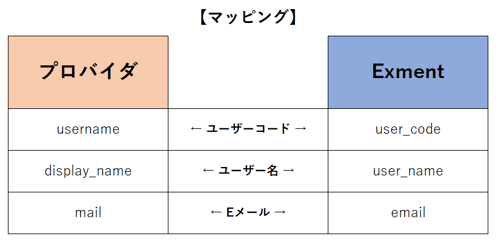
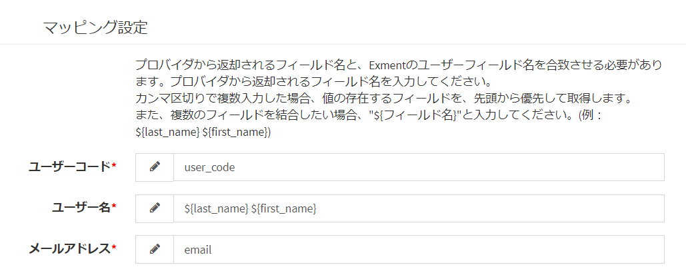
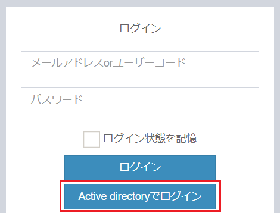
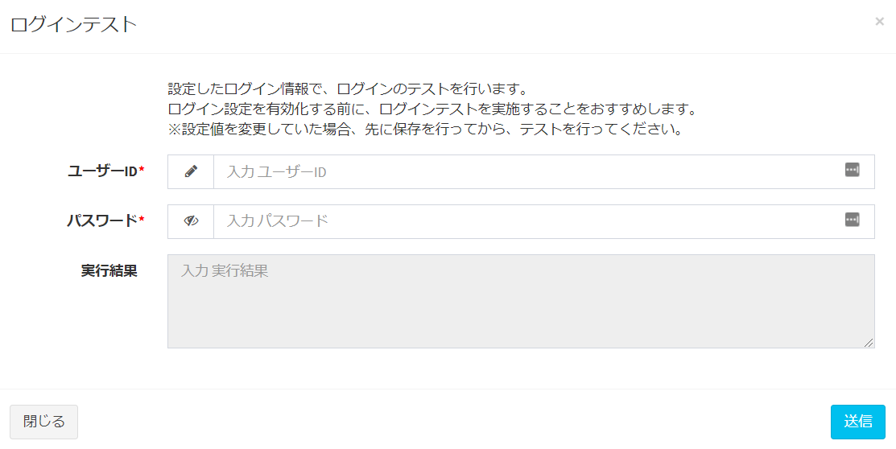
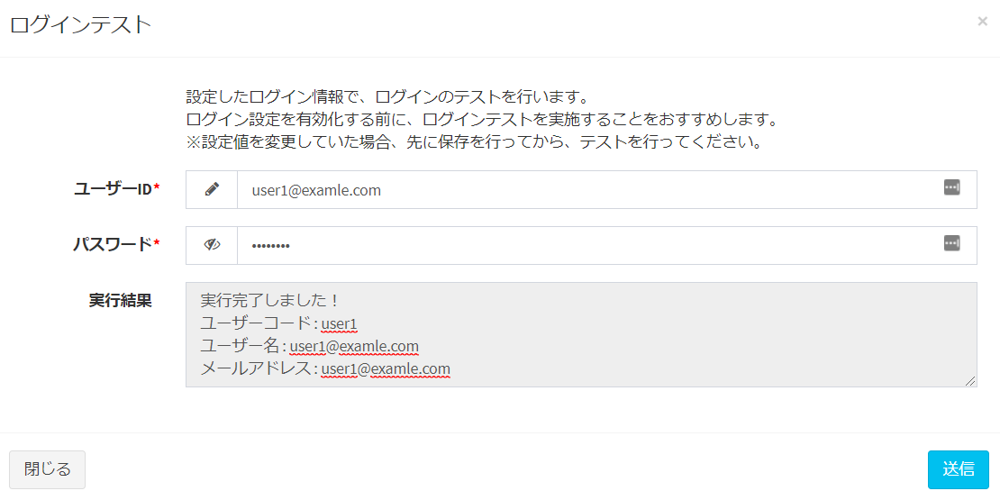

# シングルサインオン(LDAP)
Exmentでは、[ログイン設定](/ja/login_setting)により、シングルサインオン(SSO)を追加することが可能です。  
これにより、Exment専用のログインパスワードを管理することなく、各プロバイダのIDとパスワードを使用することができます。  
  
LDAPを使用したSSOの設定方法を記載します。  


#### 注意点
- **このマニュアルでは、LDAPに詳しい方向けの手順になります。各プロバイダの設定方法などは、各資料をご参照ください。**


## サーバー・プロバイダ設定
ログイン設定画面でプロバイダを追加する前に、サーバーでコマンド入力などを実施し、拡張機能をインストールする必要があります。

### Windowsの場合

- php.iniファイルを開きます。  
※php.iniファイルの場所は、サーバーのインストールによって異なります。  

- その後、以下の記述を追加してください。  

```
extension=ldap
```

- PHPを再起動します。

- 以下のコマンドを実行します。

```
composer require adldap2/adldap2-laravel
```


### Linux(CentOS)の場合

> パッケージの追加が必要なため、レンタルサーバーなどでは導入できない場合があります。

- 以下のコマンドを実行し、パッケージをインストールします。  
※事前に、[Linuxによる環境構築](/ja/install_linux)などで実施している、epelの更新・rpmインストールを行ってください。

```
sudo yum install --enablerepo=remi-php74 php-ldap
```

- php.iniファイルを開きます。  
※php.iniファイルの場所は、サーバーのインストールによって異なります。  

- その後、以下の記述を追加してください。  

```
extension=ldap.so
```


- 以下のコマンドを実行します。

```
composer require adldap2/adldap2-laravel
sudo service httpd restart
```


## 画面での設定
サーバーによる設定が完了したら、[ログイン設定画面](/ja/login_setting)に遷移し、プロバイダを追加します。

- 管理者アカウントで、システム設定画面に遷移します。  
ページの右上の「ログイン設定」ボタンから、ログイン設定画面に遷移します。
  

- 新規ボタンを押して、ログイン設定を作成します。  

- **LDAP名(英数字)** : 他と重複しないように、英数字で設定を行ってください。

### LDAP設定
LDAPの設定を行ってください。  
(Active Directory の場合)
  

(openLDAP の場合)
  

### マッピング設定
プロバイダから返却されるフィールド名と、Exmentの「ユーザー」テーブルのフィールド名を合致させる必要があります。  

  

プロバイダから返却されるフィールド名を入力してください。

  

書き方にはいくつかあります。  

#### フィールド名をそのまま記入する
プロバイダから返却されるフィールド名を、そのまま記入します。
  

#### フィールド名をカンマ区切りで複数記入する
プロバイダで使用したい返却されるユーザー情報のうち、使用したいフィールドの候補がいくつかある場合、プロバイダから返却されるフィールド名を、カンマ区切りで記入します。  
カンマ区切りの先頭からフィールド値を検索し、値があれば、その値を使用します。  
(例：できれば姓名フィールド「seimei」を使用したいが、プロバイダ側で必須項目でないので、「seimei」に値があればその値を、なければ「username」を、ユーザー名として使用する → seimei,username と記入)
  

#### フィールド名を、${フィールド名}形式で複数記入する
プロバイダで使用したい返却されるユーザー情報を複数組み合わせて、Exmentのユーザー情報として使用したい場合です。${フィールド名}形式で、フィールドを複数記入してください。  
(例：「氏名」フィールドはプロバイダにないが、「姓(last_name)」「名(first_name)」フィールドがそれぞれあるので、「姓 名」と組み合わせて使用する → ${last_name} ${first_name} と記入)
  


### ユーザー設定
ログインを行ったユーザーの設定を行います。

  

#### アカウント検索列
SSOで取得したアカウントから、どの列を使用し、Exmentのアカウントを検索するかどうかを設定します。

#### ユーザー新規作成
YESの場合、ログインしたユーザーがExmentに存在しなかった場合に、ログイン情報を使用し、Exmentユーザーを新規作成します。  
NOの場合は、事前にExmentにユーザーを作成する必要があります。ログインしたユーザーがExmentに存在しなかった場合は、エラーが表示されます。

#### 役割グループ設定
YESの場合、Exmentユーザーを新規作成時に、役割グループに紐付けることができます。  

#### ユーザー情報を更新する
YESの場合、再ログイン時に、ユーザー名などのユーザー情報を更新します。


- データを一度以上保存することで、「有効化」ボタンと「ログインテスト」ボタンが表示されます。

- 有効フラグをYESにした場合、ログイン画面にSSO認証用のボタンが表示されます。  

(Active Directory の場合)

  

(openLDAP の場合)

  


### ログインボタン設定
ログイン画面に表示する、ログインボタンの設定を行います。  

  


### 有効化とログインテスト
- データを一度以上保存することで、「有効化」ボタンと「ログインテスト」ボタンが表示されます。

  

#### 有効化
- 有効化を実行することで、ログイン画面にSSO認証用のボタンが表示されます。  
※通常の「ログイン」ボタンを非表示にしたい場合は、[ログイン設定](/ja/login_setting)より、「既定のログインを表示する」を「NO」に設定してください。
  


#### ログインテスト
- 「ログインテスト」ボタンをクリックすることで、設定したログイン情報で、ログインのテストを行うことができます。これは、ログイン設定を有効化していなくても実施できます。  

  


- 「ログイン」ボタンをクリックすることで、設定が正常に行われているか、テストを行うことができます。  
ログイン結果は、「実施結果」項目に表示されます。

  

  
  
[←ログイン設定へ戻る](/ja/login_setting)
