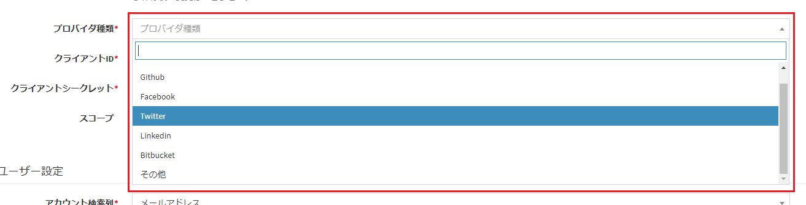
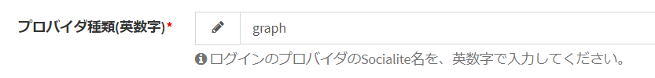
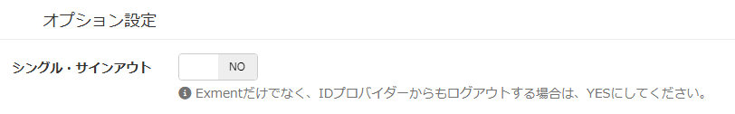
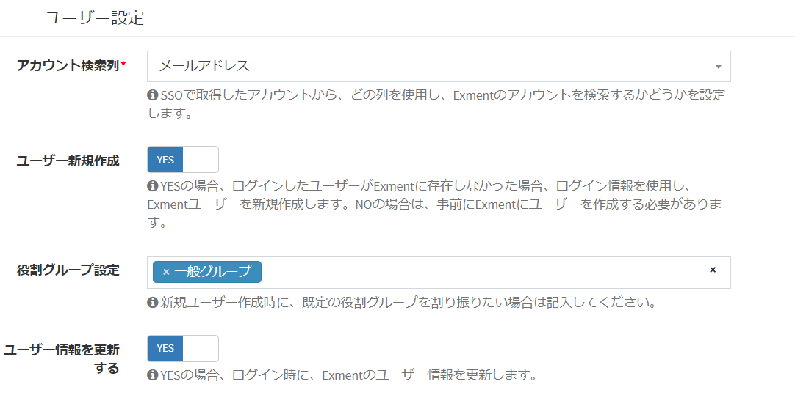
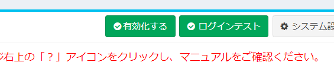
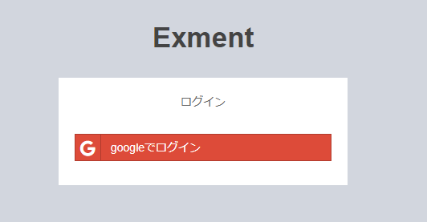
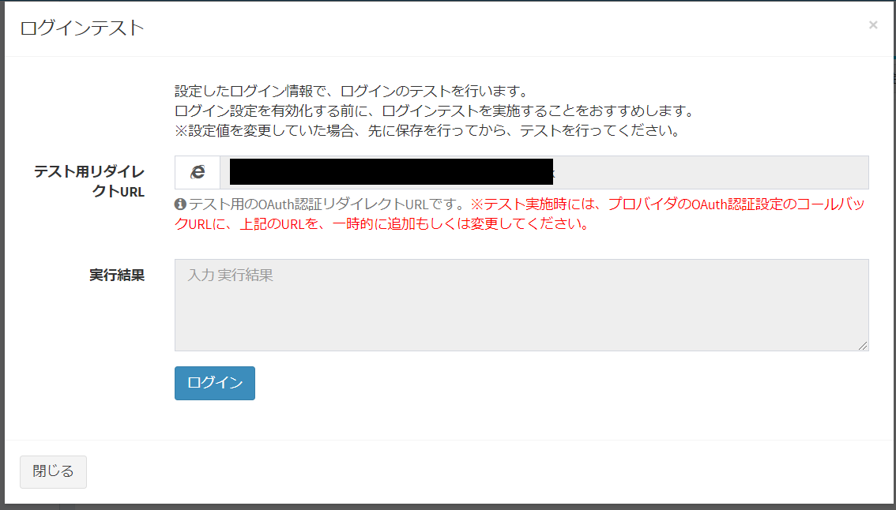

# シングルサインオン(OAuth)
Exmentでは、[ログイン設定](/ja/login_setting)により、シングルサインオン(SSO)を追加することが可能です。  
これにより、Exment専用のログインパスワードを管理することなく、各プロバイダのIDとパスワードを使用することができます。  
  
ここでは、OAuthを使用したSSOの設定方法を記載します。  


#### 注意点
- Exmentでは、[Socialite](https://github.com/laravel/socialite)でシングルサインオン処理を実装しています。
- **このマニュアルでは、OAuthに詳しい方向けの手順になります。各プロバイダのClient IDやClient Secretの作成方法などは、各資料をご参照ください。**
- <span class="red">v3.0.16以下で、Googleログインができない方は、[こちらの手順](/ja/patch/sso_google)で、対応を行ってください。</span>

#### 参考リンク
- [オープンソースWebデータベース『Exment』で、GoogleアカウントによるSSOに対応する](https://qiita.com/hirossyi73/items/70dcc35305a96abace08)


## サーバー・各プロバイダ設定
ログイン設定画面でプロバイダを追加する前に、サーバーでコマンドを入力し、拡張機能をインストールする必要があります。

### (1) Socialite標準で用意されているプロバイダの場合
- Socialite標準で用意されているプロバイダは、以下になります。（カッコの文字列は、後ほどのservice指定で使用します）
    - Google (google)
    - Facebook (facebook)
    - Twitter (twitter)
    - GitHub (github)
    - LinkedIn (linkedIn)
    - Bitbucket (bitbucket)

- 各プロバイダで、Exment用のアプリケーションを作成します。  
※callback URLは以下になります。  
http(s)://(ExmentのURL)/admin/auth/login/(socialiteのprovider名)/callback  

    - 例1 GitHubの場合：http(s)://(ExmentのURL)/admin/auth/login/github/callback  
    - 例2 Facebookの場合：http(s)://(ExmentのURL)/admin/auth/login/facebook/callback  
    - 例3 Googleの場合：http(s)://(ExmentのURL)/admin/auth/login/google/callback  

- 以下のコマンドを、Exmentのルートディレクトリで実行します。

~~~
composer require laravel/socialite=~5.1
~~~

- [画面での設定](#画面での設定)を実施します。


### (2) Exment拡張で用意しているプロバイダの場合
- 一部のプロバイダは、Exmentの拡張として、プロバイダを用意しております。（カッコの文字列は、後ほどのservice指定で使用します）
    - Office365、Microsoft Graph (graph)

- 各プロバイダで、Exment用のアプリケーションを作成します。  
※callback URLは以下になります。  
http(s)://(ExmentのURL)/admin/auth/login/(socialiteのprovider名)/callback  

    - 例 Office365の場合：http(s)://(ExmentのURL)/admin/auth/login/graph/callback

- 以下のコマンドを、Exmentのルートディレクトリで実行します。

~~~
composer require exceedone/microsoft-graph
~~~

- [画面での設定](#画面での設定)を実施します。


### (3) 各自でプロバイダを用意する場合
(1)(2)にないプロバイダの場合は、[Socialite Providers](https://socialiteproviders.github.io/)で非公式プロバイダーを追加します。  
また、非公式プロバイダーにもアバター取得のための処理が含まれていませんので、アバターを取得したい場合は、処理を追加します。(任意)  
  
※いくつかの手順がありますので、詳細は[独自プロバイダ作成方法](#独自プロバイダ作成方法)をご確認ください。

- 手順が完了したら、[画面での設定](#画面での設定)を実施します。


## 画面での設定
サーバーによる設定が完了したら、[ログイン設定画面](/ja/login_setting)に遷移し、プロバイダを追加します。

- 管理者アカウントで、システム設定画面に遷移します。  
ページの右上の「ログイン設定」ボタンから、ログイン設定画面に遷移します。
  

- 新規ボタンを押して、ログイン設定を作成します。  

### プロバイダ種類
  

- 「サーバー・各プロバイダ設定」で、(1)のプロバイダを選択した場合、そのプロバイダ名を選択してください。  

- 「サーバー・各プロバイダ設定」で、(2)(3)のプロバイダを選択した場合、「その他」を選択してください。  
また、「その他」を選択した場合に表示される「プロバイダ種類(英数字)」には、Socialiteで指定されているプロバイダ種類の英数字を入力してください。  
例 Microsoft Graphの場合："graph"

  


### クライアントID、クライアントシークレット
プロバイダから提供された文字列を設定してください。

### スコープ
ログイン時には基本的に、明確な用途はありませんが、[アクセストークン取得](#アクセストークン取得)でアクセストークンを取得する場合、設定することをおすすめします。

### オプション設定
選択したプロバイダ種類に応じた、オプションの設定を行います。
(オプション設定のないプロバイダ種類を選択した場合は、表示されません。)

#### プロバイダ種類が「その他」の場合
 

##### シングル・サインアウト
Exmentログアウト時に、SSOでログインしたプロバイダーからもログアウトします。<span class="red">※現在、Oktaには対応しておりません。</span>

<!---
  OAuth、Samlで同じものを記載
-->
### ユーザー設定
ログインを行ったユーザーの設定を行います。

  

#### アカウント検索列
SSOで取得したアカウントから、どの列を使用し、Exmentのアカウントを検索するかどうかを設定します。

#### ユーザー新規作成
YESの場合、ログインしたユーザーがExmentに存在しなかった場合に、ログイン情報を使用し、Exmentユーザーを新規作成します。  
NOの場合は、事前にExmentにユーザーを作成する必要があります。ログインしたユーザーがExmentに存在しなかった場合は、エラーが表示されます。

#### 役割グループ設定
YESの場合、Exmentユーザーを新規作成時に、役割グループに紐付けることができます。  

#### ユーザー情報を更新する
YESの場合、再ログイン時に、ユーザー名などのユーザー情報を更新します。


- データを一度以上保存することで、「有効化」ボタンと「ログインテスト」ボタンが表示されます。

- 有効フラグをYESにした場合、ログイン画面にSSO認証用のボタンが表示されます。  
※通常はユーザーIDとパスワードを入力する既定のログインフォームも併せて表示されます。[SSO設定](/ja/system_setting?id=sso設定)で画像のように非表示にすることもできます。


### ログインボタン設定
ログイン胃画面に表示する、ログインボタンの設定を行います。  
※この設定を行わなくても、上記の「例1 Socialite標準で用意されているプロバイダの場合」にあるプロバイダの場合は、それぞれのフォーマットで表示されます。

  


### 有効化とログインテスト
- データを一度以上保存することで、「有効化」ボタンと「ログインテスト」ボタンが表示されます。

  

#### 有効化
- 有効化を実行することで、ログイン画面にSSO認証用のボタンが表示されます。  
  

#### ログインテスト
- 「ログインテスト」ボタンをクリックすることで、設定したログイン情報で、ログインのテストを行うことができます。これは、ログイン設定を有効化していなくても実施できます。  
**その際に、「テスト用リダイレクトURL」に表示されているURLを、プロバイダのOAuth認証設定のコールバックURLに、上記のURLを、一時的に追加もしくは変更してください。**

  


- 「ログイン」ボタンをクリックすることで、設定が正常に行われているか、テストを行うことができます。  
ログイン結果は、「実施結果」項目に表示されます。


### アクセストークン取得

- ログイン後、アクセストークンとリフレッシュトークンを取得する場合、以下の方法で取得を行ってください。

~~~ php
use Exceedone\Exment\Services\Login\LoginService;

$access_token = LoginService::getAccessToken();
$refresh_token = LoginService::getRefreshToken();
~~~


## 独自プロバイダ作成方法
(3)の手順を実施する場合、[Socialite Providers](https://socialiteproviders.github.io/)で指定されているパッケージを追加します。  
また、アバター取得のための独自プロバイダを作成します。（任意）

### (必須)プロバイダ設定・追加
- 各プロバイダで、Exment用のアプリケーションを作成します。  
※callback URLは以下になります。  
http(s)://(ExmentのURL)/admin/auth/login/(socialiteのprovider名)/callback  

    - 例 Microsoft Graphの場合：http(s)://(ExmentのURL)/admin/auth/login/graph/callback

- 以下のコマンドを、Exmentのルートディレクトリで実行します。

~~~
composer require laravel/socialite=~5.1
~~~

- [Socialite Providers](https://socialiteproviders.github.io/)で指定されているパッケージを追加します。  

    - 例：Microsoft Graphの場合

~~~
composer require socialiteproviders/microsoft-graph
~~~

### (任意)アバター取得のための開発
※この独自プロバイダ作成は、アバター取得をするための任意手順となります。アバターの取得が不要な場合は、このプロバイダ作成は不要となります。

- アバター取得のために、既存のプロバイダーを継承したクラスを2つ、フォルダ「app/Socialite」に作成します。※フォルダ「app/Socialite」が存在しない場合は、作成してください。  
1つ目は、MicrosoftGraphProvider.phpです。インタフェースProviderAvatarをimplementsし、getAvatarを実装します。  
getAvatarメソッドでは、アバターを取得するためのAPI処理を記載してください。取得のためのURLやエンドポイントは、各種OAuthプロバイダよりご確認ください。  
下記の例は、Microsoft Graphでの手順です。

~~~ php
<?php

namespace App\Socialite;

use Exceedone\Exment\Auth\ProviderAvatar;
use SocialiteProviders\Graph\Provider;

class MicrosoftGraphProvider extends Provider implements ProviderAvatar
{
    /**
     * Get avatar stream
     * @param mixed $token
     * @return string
     */
    public function getAvatar($token = null){
        try
        {
            $client = $this->getHttpClient();
            $response = $client->get('https://graph.microsoft.com/v1.0/me/photo/$value', [
                'headers' => [
                    'Authorization' => 'Bearer '.$token,
                    'Content-Type' => 'application/json;odata.metadata=minimal;odata.streaming=true'
                ],
                'http_errors' => false,
            ]);

            if($response->getStatusCode() == 404){
                return null;
            }

            return $response->getBody()->getContents();

        }
        catch (Exception $exception)
        {
            return null;
        }
        return null;
    }
}

~~~ 

- 2つ目は、GraphExtendSocialite.phpです。作成したMicrosoftGraphProviderを指定します。

~~~ php
<?php

namespace App\Socialite;

use SocialiteProviders\Manager\SocialiteWasCalled;

class GraphExtendSocialite
{
    /**
     * Execute the provider.
     */
    public function handle(SocialiteWasCalled $socialiteWasCalled)
    {
        $socialiteWasCalled->extendSocialite(
            'graph', __NAMESPACE__.'\MicrosoftGraphProvider'
        );
    }
}

~~~ 

### (必須)サービスプロバイダ追加
- ファイルapp/Providers/EventServiceProvider.phpに、追加したプロバイダを記入し、サービスプロバイダを追加します。  
※アバターの取得のために独自開発を行ったか、そうでないかにより、記載内容が異なります。  
また、「@handle」に記載のクラス名は、[Socialite Providers](https://socialiteproviders.github.io/)で追加したプロバイダのマニュアルに、多くの場合記載されていますので、ご確認ください。

~~~ php

// 例：Microsoft Graphの場合

protected $listen = [
    ///// アバターの取得のために独自開発を行った場合
    'App\Events\Event' => [
        'App\Listeners\EventListener',
    ],
    
    /// 追加
    \SocialiteProviders\Manager\SocialiteWasCalled::class => [
        '\App\Socialite\GraphExtendSocialite@handle', ///// アバターの取得のために独自開発を行った場合
        // 'SocialiteProviders\\Graph\\GraphExtendSocialite@handle', ///// 通常の取得の場合は、こちらをコメントアウトして記載
    ],
];

~~~
~~~php

// 例：EntraIDの場合

protected $listen = [
    // ... other listeners
    \SocialiteProviders\Manager\SocialiteWasCalled::class => [
        // ... other providers
        \SocialiteProviders\Microsoft\MicrosoftExtendSocialite::class.'@handle',
    ],
];

~~~


### (プロバイダにより必須)オプション設定の追加
OAuthサインインのプロバイダにより、追加の設定を行う必要があります。  

  
例：[OKTA](https://github.com/SocialiteProviders/Okta)の場合
- config/services.phpを開き、以下の記載を追加します。

``` php
'okta' => [    
  'base_url' => env('OKTA_BASE_URL'), 
],
```

- .envファイルを開き、以下の記載を追加します。

```
OKTA_BASE_URL='https://<OKTAのドメイン>'
```

> 本来、Socialiteでは、config/services.phpの"client_id", "client_secret", "redirect"の設定値を必須としており、ExmentのOAuth認証では、画面で設定した値を、自動的に付与するようになっています。  
プロバイダ独自の設定値を入力したい場合は、config/services.phpに、上記のように値を追加するようにしてください。


### (必須)画面設定の実施

- すべてのサーバーサイドでの設定が完了したら、[画面での設定](#画面での設定)を実施します。

  
  
[←ログイン設定へ戻る](/ja/login_setting)
