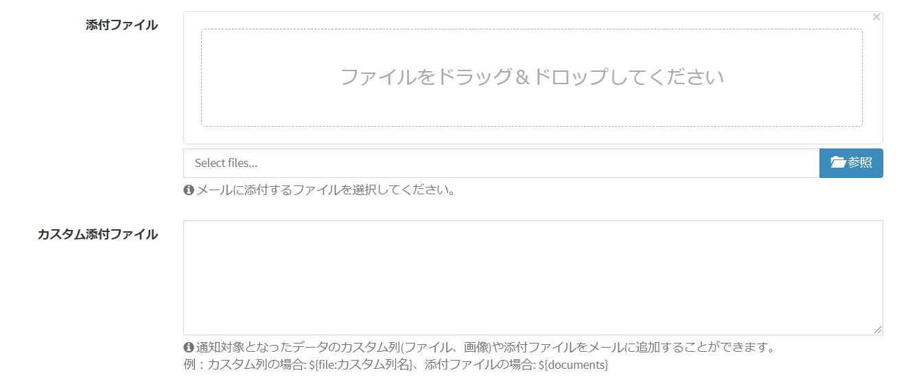
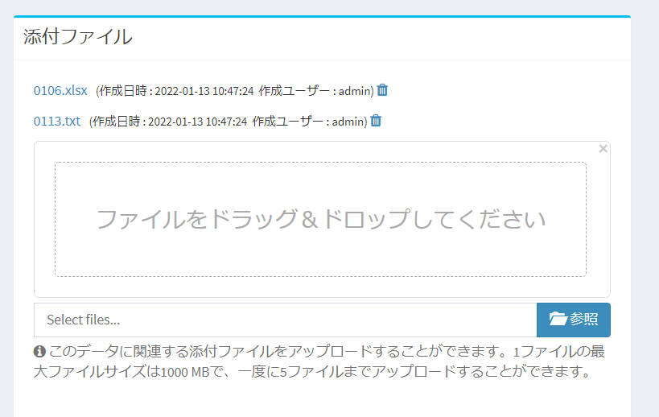

# 通知テンプレート
システムからメールを送付する時の、メールの件名、本文などを設定します。  

> v3.6.0より、名称を「メールテンプレート」から「通知テンプレート」に変更しました。  
v3.6.0未満でインストールしたバージョンでは、一部画面の名称は「メールテンプレート」のままとなります。

## 管理方法
### ページ表示
- 左メニューより、「通知テンプレート」を選択します。  
もしくは、以下のURLにアクセスしてください。  
http(s)://(ExmentのURL)/admin/data/mail_template  
これにより、通知テンプレート画面が表示されます。  
  

### テンプレートの新規追加
- 「通知テンプレート」画面で、ページ右上の［新規］ボタンをクリックします。

- 通知テンプレート新規追加画面が表示されます。

- 必要事項を入力します。  

### 保存
設定を記入したら、［保存］をクリックしてください。

### 編集
テンプレートの編集を行いたい場合、該当する行の［編集］リンクをクリックしてください。  

### 削除
列の削除を行いたい場合、該当する行の［削除］リンクをクリックしてください。  

**※ただし、通知画面で設定済のテンプレートは削除できません。**

## 添付ファイル・カスタム添付ファイル
メールによる通知の際、予め通知テンプレートに設定してあるファイルを送信することができます。  
※現在、メール通知の場合のみ有効です。  
  

#### 添付ファイル
この列に登録したファイルを、メール通知の際に固定の添付ファイルとして常に送信します。

#### カスタム添付ファイル
この列にパラメーターを設定することで、各データに応じて以下の種類のファイルをメール通知の際に送信します。  

■カスタム列の種類：「ファイル」「画像」  
パラメーター設定：${file:カスタム列名}  
  
■データ詳細画面に対して登録されている（下記の画像にあたる場所）添付ファイル  
パラメーター設定：${documents}  
  

## 変数のルール
「メール件名」と「メール本文」「メール送信元-表示名」では、変数を利用できます。  
変数を使用することで、登録しているデータやシステム名などを、件名・本文に追加することができます。  

### 変数一覧
パラメータ変数は、以下のページをご確認ください。  
[パラメータ変数](/ja/params)
