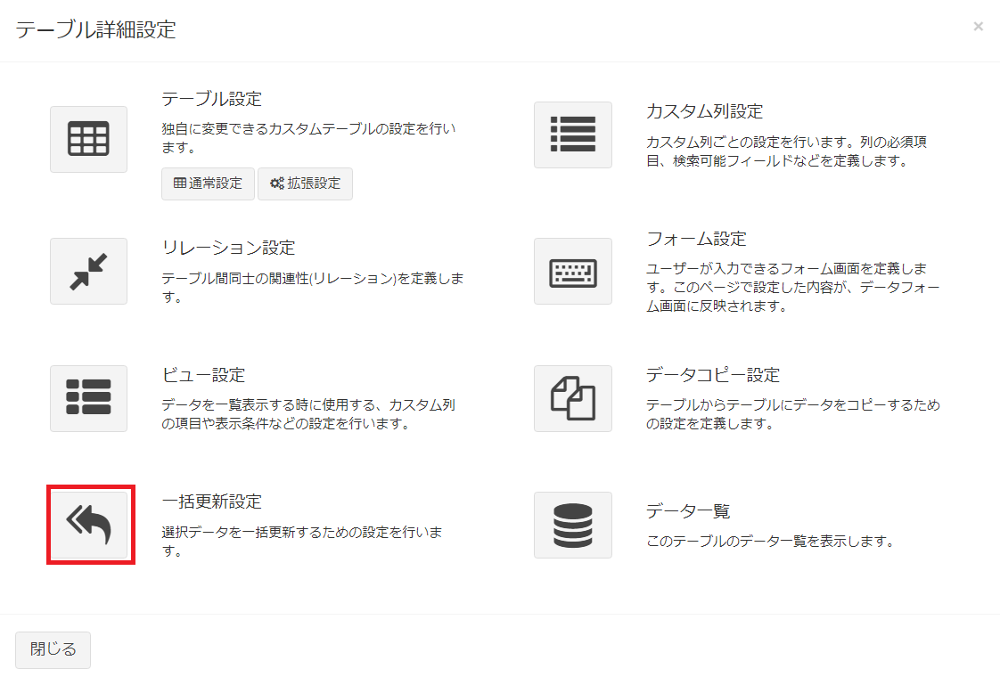
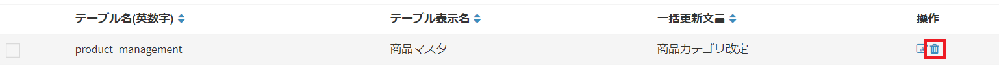

# 一括更新設定
テーブルに保存されているデータ内容を複数行で一括に更新する為の設定です。  
設定で対象列にしたデータ内容は、選択したすべての行で同じ更新値に一括更新できるようになります。

## 設定画面
- カスタムテーブル一覧で、設定を行いたいテーブルにチェックを1つ入れ、右上の「テーブル詳細設定」をクリックします。  

- もしくは、メニューから設定を行いたいテーブルを選択した後、同様に右上の「テーブル詳細設定」をクリックします。  
※該当のテーブルをメニューに表示する設定があらかじめ必要です。  

- 表示されたテーブル詳細設定の画面で、一括更新設定のアイコンをクリックします。

- これで、カスタムテーブルがもつ、一括更新設定の一覧を表示します。  

## 一括更新設定の新規追加
- 「一括更新設定」画面で、ページ右上の［新規］ボタンをクリックします。
- カスタム列の新規追加画面が表示されますので、必要事項を入力します。  
- 対象列を複数設定した場合には、設定した複数列すべてにおいて同時に一括更新が行えるようになります。

#### 一括更新文言  
更新内容を表す文言を設定してください。一括更新を行う際の選択肢として表示されます。  

#### 対象列  
データの一括更新を行う列を選択してください。

#### 更新値  
対象列のデータとして一括更新して登録したい内容を設定してください。  
※更新値の入力フィールドは対象列を選択した後に表示されます。  

## 保存
設定を入力したら、［送信］をクリックしてください。

## 編集
設定の編集を行いたい場合、該当する行の［編集］リンクをクリックしてください。  

## 削除
設定の削除を行いたい場合、該当する行の［削除］リンクをクリックしてください。  

