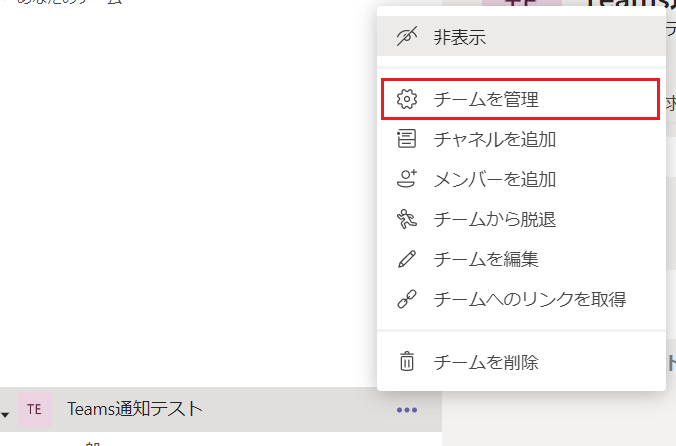
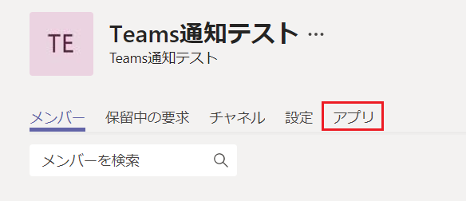
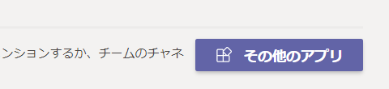
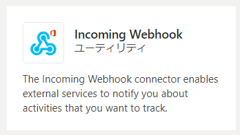
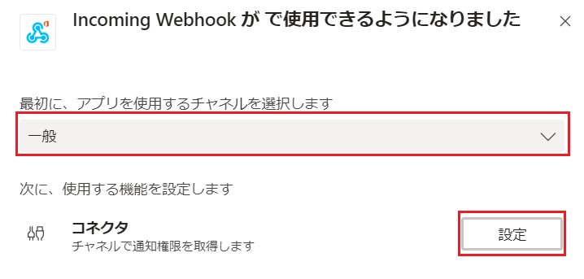
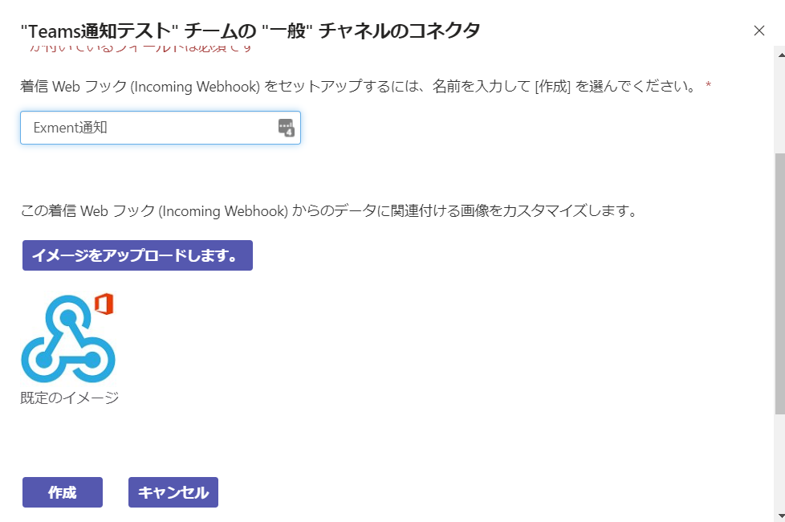
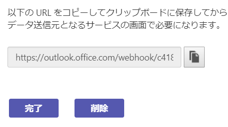

# Webhookに通知を行う場合の設定
SlackならびにMicrosoft Teamsに通知を行うには、Webhookと呼ばれるURLの取得が必要です。  
Webhook URLの取得方法について記載します。  

## Slack取得手順
- 以下のURLにアクセスします。  
https://slack.com/services/new/incoming-webhook  

- 通知先のチャンネルを選択します。  
その後、「Incoming Webhook  インテグレーションの追加」をクリックします。  
  

- Webhook URLが作成されるので、コピーします。  
  

- コピーしたWebhook URLを、Exmentの通知設定に貼り付けます。

現在Exmentでは、以下の通知の種類があります。

## Microsoft Teams取得手順
- Teamsを開き、通知を行いたいチームの、「チームを管理」をクリックします。  
  

- 「アプリ」タブをクリックします。  

- 「その他のアプリ」タブをクリックします。  

- 「Incoming Webhook」をクリックします。  

- 「インストール」をクリックします。  

- 通知を行うチャネルを選択します。その後、「設定」をクリックします。  

- 通知を使用する名前を入力し、「作成」をクリックします。

- WebhookのURLが作成されるので、URLをコピーし、完了をクリックしてください。

- コピーしたWebhook URLを、Exmentの通知設定に貼り付けます。
