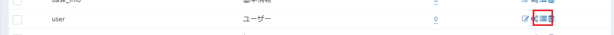
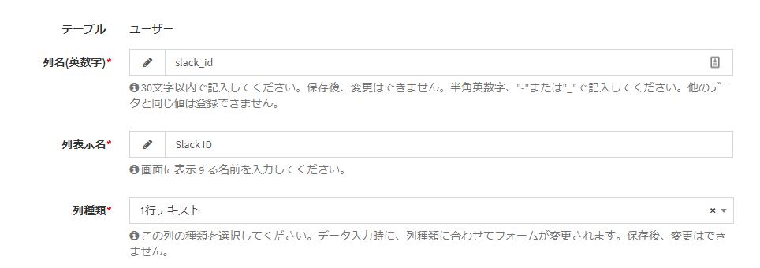
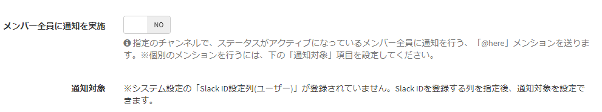
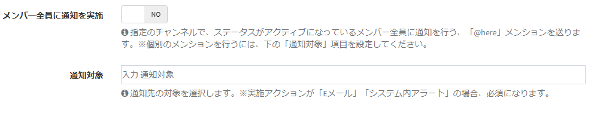
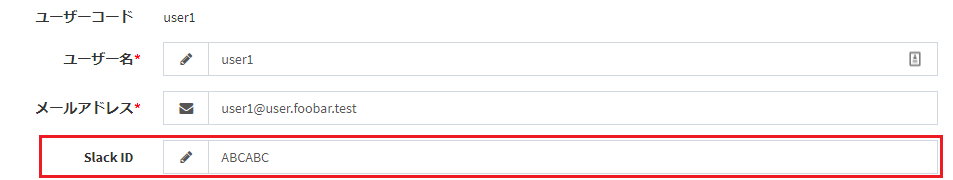

# Webhookに通知を行う場合の設定
SlackならびにMicrosoft Teamsに通知を行うには、Webhookと呼ばれるURLの取得が必要です。  
Webhook URLの取得方法について記載します。  

## Slack取得手順
- 以下のURLにアクセスします。  
https://slack.com/services/new/incoming-webhook  

- 通知先のチャンネルを選択します。  
その後、「Incoming Webhook  インテグレーションの追加」をクリックします。  
  

- Webhook URLが作成されるので、コピーします。  
  

- コピーしたWebhook URLを、Exmentの通知設定に貼り付けます。

現在Exmentでは、以下の通知の種類があります。

## Microsoft Teams取得手順
- Teamsを開き、通知を行いたいチームの、「チームを管理」をクリックします。  
  

- 「アプリ」タブをクリックします。  

- 「その他のアプリ」タブをクリックします。  

- 「Incoming Webhook」をクリックします。  

- 「インストール」をクリックします。  

- 通知を行うチャネルを選択します。その後、「設定」をクリックします。  

- 通知を使用する名前を入力し、「作成」をクリックします。

- WebhookのURLが作成されるので、URLをコピーし、完了をクリックしてください。

- コピーしたWebhook URLを、Exmentの通知設定に貼り付けます。

## Slack ID設定方法
Slackで、個別メンションを実施したい場合、ユーザー列のSlack IDを入力するためのシステム設定を行う必要があります。  
以下の手順に従い、初回設定を行ってください。

- [カスタムテーブル](/ja/table)設定で、「ユーザー」テーブルに対し、「カスタム列設定」リンクをクリックします。  
 

- ユーザーテーブルの[カスタム列](/ja/column)設定で、以下のカスタム列を追加します。
    - 列名(英数字)、列表示名：任意の名称
    - 列種類：「1行テキスト」
 

- [システム設定](/ja/system)画面の「詳細設定」で、「Slack ID設定列(ユーザー)」に、先ほど追加したSlack ID列を選択します。
 

- これで、通知設定画面で、ユーザーデータに入力されているSlack IDに、メンションを実施することができます。  
通知設定画面では、以下のように、通知対象画面の表示が変更されます。(上：Slack ID設定を行っていない場合、下：設定を行った場合)

 
 

- また、ユーザーデータの編集画面で、各ユーザーのSlack IDを入力することで、そのユーザーに通知を行う場合、メンショﾝが追加されます。  
※Slackの画面で、ユーザーIDを確認するには、[こちら](https://auto-worker.com/blog/?p=27)をご確認ください。
 

