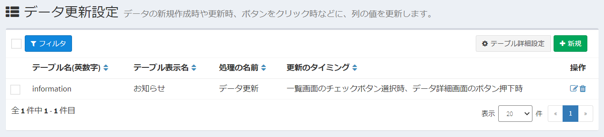
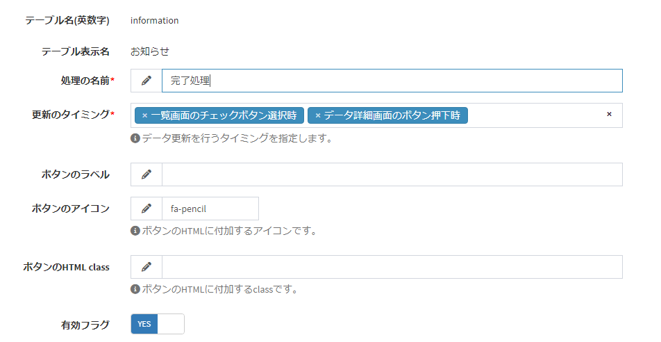

# データ更新設定
「ボタンをクリック」「データを新規作成」など、特定のトリガーで、Exmentに保存しているデータを一括で更新します。

> この機能は、v3.5.0未満では「データ一括更新」として実装されていた機能です。v3.5.0より、機能拡張しました。  
より複雑な条件や、より複雑な内容の更新を行いたい場合、[プラグイン(ボタン)](/ja/plugin_quickstart_button)や、[プラグイン(イベント)](/ja/plugin_quickstart_event)の実装を行ってください。

## 更新タイミングの種類

- ##### 一覧画面のチェック選択時

  

データ一覧画面に、ボタンが追加されます。  
一覧画面のチェックボックスにチェックを入れて、ボタンをクリックすることで、チェックしたデータを対象に、設定した内容でデータを更新します。

- ##### データ詳細画面のボタン押下時

  

データ詳細画面に、ボタンを表示します。  
ボタンをクリックすることで、設定した内容でデータを更新します。

- ##### データ新規作成時
ユーザーが画面やAPI、インポートなどによって、データを新規作成するタイミングで、設定した内容でデータを更新します。

- ##### データ更新時
ユーザーが画面やAPI、インポートなどによって、データを更新するタイミングで、設定した内容で、追加でデータを更新します。

## 設定画面
- カスタムテーブル一覧で、設定を行いたいテーブルにチェックを1つ入れ、右上の「テーブル詳細設定」をクリックします。  

  

- もしくは、メニューから設定を行いたいテーブルを選択した後、同様に右上の「テーブル詳細設定」をクリックします。  
※該当のテーブルをメニューに表示する設定があらかじめ必要です。  

  

- その後、チェックしたカスタムテーブルの、データ更新設定を表示します。

  

- データ更新設定画面が表示されます。

  

## 新規追加
- 「データ更新設定」画面で、ページ右上の［新規］ボタンをクリックします。

- データ更新設定の新規追加画面が表示されますので、必要事項を入力します。

  

## 保存
設定を入力したら、［送信］をクリックしてください。

## 編集
データ更新設定の編集を行いたい場合、該当する行の［編集］リンクをクリックしてください。  

## 削除
データ更新設定の削除を行いたい場合、該当する行の［削除］リンクをクリックしてください。  

## 記入項目の詳細

### 基本設定

  

- ##### 処理の名前
このデータ更新設定の名前です。

- ##### 更新のタイミング
このデータ更新を設定するタイミングを設定します。  
このページ最上部に記載の「更新タイミング」をご確認いただき、設定を行ってください。

- ##### ボタンのラベル
画面のボタンに表示する文言を設定してください。  
※「更新のタイミング」が「一覧画面のチェック選択時」「データ詳細画面のボタン押下時」の場合のみ表示されます。

- ##### ボタンのアイコン
画面のボタンに表示するアイコンを設定してください。  
※「更新のタイミング」が「データ詳細画面のボタン押下時」の場合のみ表示されます。

- ##### ボタンのHTML class
画面のボタンに付加する、HTMLのclassを設定してください。  
※「更新のタイミング」が「データ詳細画面のボタン押下時」の場合のみ表示されます。

### 更新列設定

  

データ更新の対象列と、更新値を設定します。  

- ##### 対象列
更新の対象列を選択します。  

- ##### 更新の種類
対象列のカスタム列種類が「日付」「時刻」「日付と時刻」「ユーザー」の場合、「固定値」「システム値」のいずれかの選択肢が表示されます。  
それ以外の場合、「固定値」のみの選択肢となります。

- ##### 更新値
    - 更新の種類で「固定値」を選択していた場合、更新したい値を入力してください。
    - 対象列のカスタム列種類が「日付」「時刻」「日付と時刻」で、更新の種類で「システム値」を選択していた場合、「実行日時」が選択肢で表示されます。
    - 対象列のカスタム列種類が「ユーザー」で、更新の種類で「システム値」を選択していた場合、「ログインユーザー」が選択肢で表示されます。

### 更新条件

  

登録した更新設定を実行することができるデータの、条件を指定します。条件を満たした場合のみ、設定した更新設定を実行できます。  
※条件を1件も設定していなかった場合、すべてのデータで更新を実行できます。  

## 更新実行
設定が完了した場合、設定項目「更新タイミング」で設定したタイミングで、更新処理が実施されます。  

### 更新内容
- 設定項目「更新列設定」で設定した値に、データの値を更新します。  
ただし、更新の種類で「システム値」を選択していた場合、以下のように更新します。  

    - 更新値が「実行日時」の場合、その更新処理を実施した実行日時をセット
    - 更新値が「ログインユーザー」の場合、その更新処理を実施したログインユーザーのIDをセット
    
### 更新条件
- 「更新条件」で設定した条件を満たしていないデータは、更新を実行することができません。  
- 「更新タイミング」が「一覧画面のチェック選択時」の場合、条件を満たしていないデータにチェックを入れて更新ボタンをクリックした場合、エラーを表示します。その場合、条件を満たしていた他のデータも、更新を行いません。

