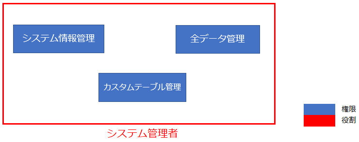
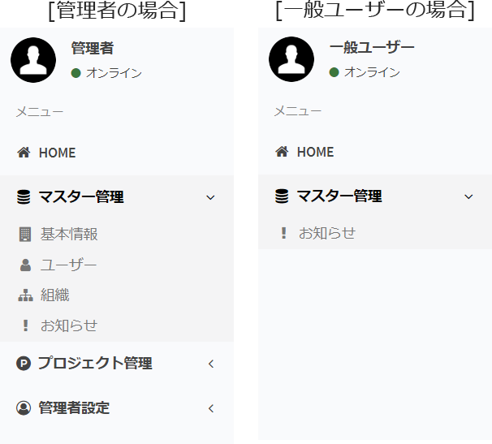
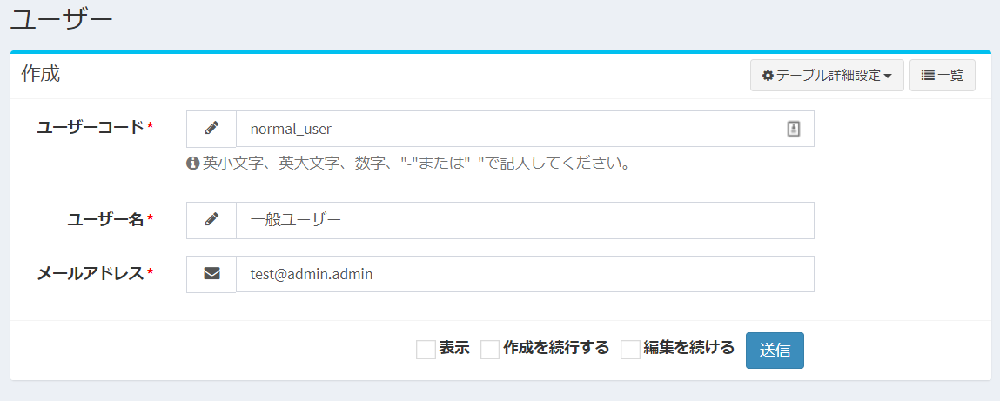
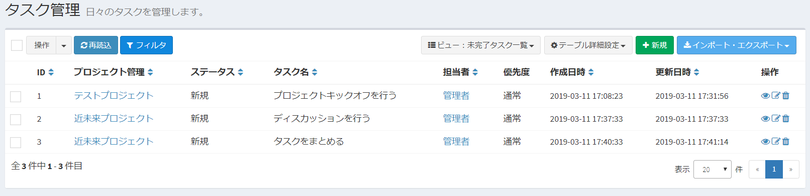
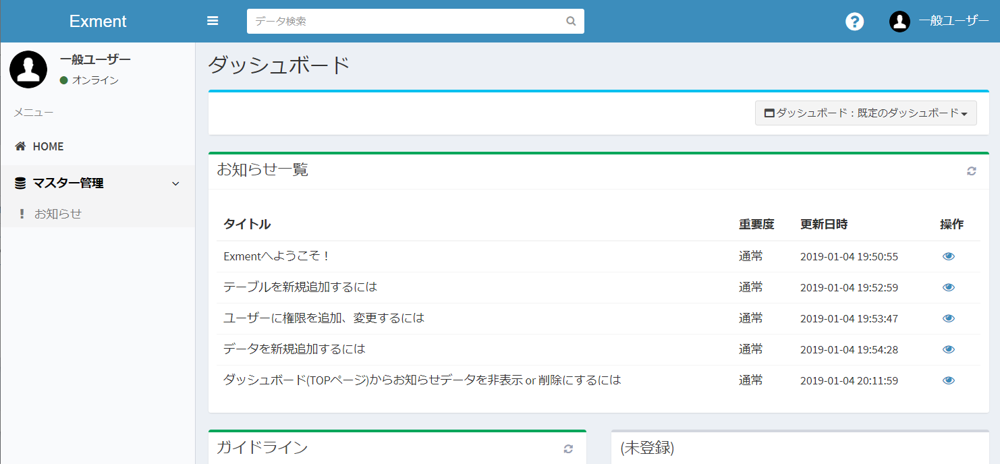
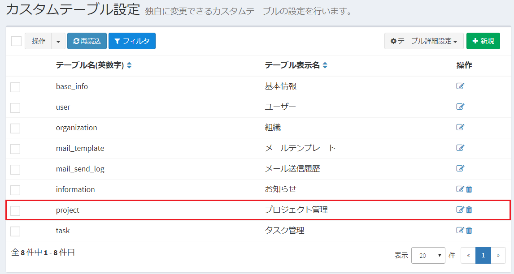
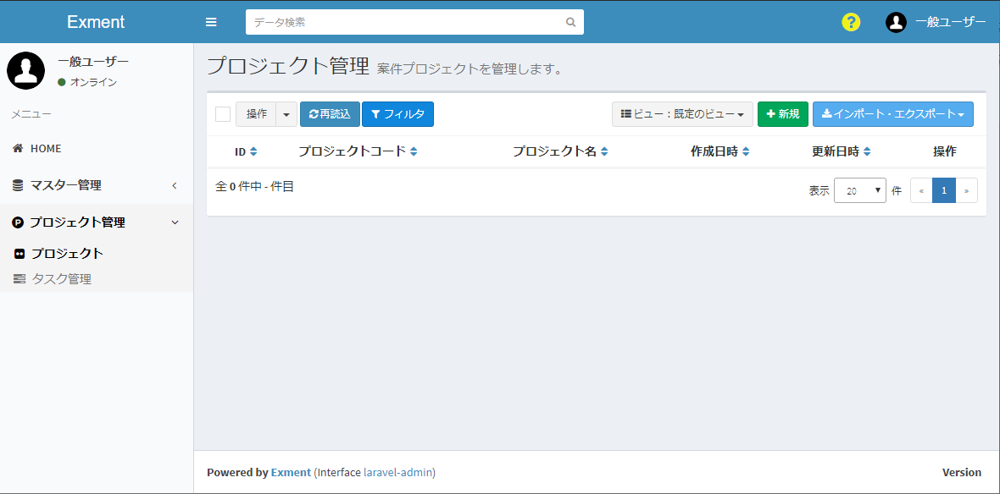

# 役割・権限
Exmentでは、「役割」ならびに「権限」の考え方を持ちます。  
これはExmentにおいて、特定のデータやページを、特定のユーザーのみが管理できるようにするために、重要な考え方です。  

新規にユーザーを追加し、そのユーザーがログインを行った場合、そのログインユーザーは、ほとんどの機能を使用できません。  
その場合、システム管理者は、新規追加したログインユーザーに、適切に役割を割り振る必要があります。  

以下、Exmentの「役割」ならびに「権限」について記載します。

## 権限(パーミッション)
権限とは、Exmentにおける特定の動作を実施してよいかの可否を決めるものです。  
例えば、以下のような権限があります。
- システム情報: システム全体の設定を行うための権限
- すべてのデータの編集: 特定のテーブル上の、すべてのデータを追加・編集・削除できる権限
- 担当者データの閲覧: 自分が担当者となっているデータの、閲覧ができる権限

これらの権限が設定されているユーザーは、その設定されている動作を実施可能です。  
一方で、権限が設定されていないユーザーが、設定されている動作を実施しようとした場合、権限エラーになります。  

## 役割(ロール)
役割とは、上記の権限をグループ化したものになります。  
複数の権限をまとめ、「役割」という名称でグループ化します。  

  
管理者は、この役割に対し、Exmentのユーザーまたは組織を設定していきます。  

## 役割の種類と一覧
Exmentにインストール時に設定されている、役割の種類と、役割の一覧を記載します。
役割の種類ごとに記載します。

### システム
Exment全体の操作を決定することができる役割です。  
あらゆる操作を可能にするシステム管理者、各テーブルのデータをすべて閲覧・編集するデータ管理者があります。  
権限設定は、左メニューの「システム設定」より行います。  

#### 役割一覧
- システム管理者 : Exmentにおけるすべての管理や操作が実行可能な役割です。  
Exment初期設定時に設定したID・パスワードのユーザーは、この「システム管理者」の役割をもちます。  

- データ管理者 : すべてのカスタムテーブルの、すべてのデータの追加・編集・削除が可能な役割です。

### テーブル
Exmentでは、データを管理するためのテーブルを作成する事ができます。  
そのテーブルごとに、ユーザーに役割を割り振ることができます。  
例えば、以下のような利用方法があります。  
    - 営業部のユーザーは、テーブル「営業活動」のすべてのデータを編集・閲覧することができる。
    - 技術部のユーザーは、テーブル「技術管理」のすべてのデータを編集・閲覧することができる。
    - パートナー会社のユーザーは、テーブル「発注依頼」の、自分に権限があるデータのみ閲覧する事ができる。  
  
権限設定は、左メニューの「カスタムテーブル」から、設定変更を行うテーブルを指定して行います。  

#### 役割一覧
- 管理者 : 指定したカスタムテーブルに対して、テーブル定義やフォームの修正などが可能です。  
また、指定したカスタムテーブル内の、すべてのデータの追加・編集・削除が可能な役割です。

- 全データ編集者 : 指定したカスタムテーブル内の、すべてのデータの追加・編集・削除が可能な役割です。

- 全データ閲覧者 : 指定したカスタムテーブル内の、すべてのデータの閲覧が可能な役割です。  
※データの編集・削除はできません。

- 編集者 : 指定したカスタムテーブル内の、ログインユーザー自身が担当者に設定されているデータの追加・編集・削除が可能な役割です。  

- 閲覧者 : 指定したカスタムテーブル内の、ログインユーザー自身が担当者に設定されているデータの閲覧が可能な役割です。  
※データの編集・削除はできません。

### データ
テーブルごとに作成するデータ1件1件に、ユーザーの役割を割り振ることができます。  
例えば、以下のような利用方法があります。  
    - ID1のデータは、パートナー会社Aに関するデータなので、パートナー会社Aのユーザーのみ編集・閲覧できるようにする。
    - ID2のデータは、パートナー会社Bに関するデータなので、パートナー会社Bのユーザーのみ編集・閲覧できるようにする。
  
権限設定は、該当するカスタムテーブル内のデータを選択し、フォームの「編集」をクリックすることで行います。  

#### 役割一覧
- 編集者 : ログインユーザー自身が担当者に設定されているデータの追加・編集・削除が可能な役割です。  

- 閲覧者 : ログインユーザー自身が担当者に設定されているデータの閲覧が可能な役割です。  
※データの編集・削除はできません。

## 権限が正常に登録されていない場合
権限が正常に登録されていない場合、以下のようなケースが発生する場合があります。  

##### ■メニューに表示される項目が少なくなる  
→権限がないメニューは表示されないためです。  

##### ■アクセスエラーになる  
→URLを直接入力などを行い、権限がないページを表示しようとした場合、アクセスエラーになります。

##### ■データフォームの選択肢に項目が表示されない  
→カスタム列設定で「選択肢 (他のテーブルの値一覧から選択)」を選択していた場合で、参照先のテーブルに適切な権限を振られていなかった場合に、選択肢の項目が表示されなくなります。  

## (参考)役割・権限設定による画面の変化
以下のような想定で、権限設定を行った場合に、画面やデータの表示がどのように変化するのかどうかを記載します。  
- すべての動作が可能となる「システム管理者」ユーザーを追加する
- テーブル「プロジェクト管理」「タスク管理」の編集権限をもつ「一般ユーザー」を追加する

### 手順
- Exmentの初期設定時に、管理者ユーザーのID、パスワードなどを入力します。

- 初期設定後、管理者ユーザーは、「システム管理者」として登録されています。

- 管理者ユーザーは、Exmentのすべての機能を使用できます。

- [ユーザー](/ja/user)画面、ならびに[ログインユーザー](/ja/user?id=ログインユーザー管理)画面にて、新規に一般ユーザーを作成します。

- また、管理者ユーザーで、[テンプレート]機能にて「プロジェクト・タスク管理」をインストールします。

- システム管理者は、すべての機能を利用できるので、管理者ユーザーで「プロジェクト管理」「タスク管理」にデータを追加します。
  
  

- ここで、別のブラウザを使用し、先ほど作成した「一般ユーザー」でログインを行います。    
  

- 左メニューには、ほとんどのメニュー項目が表示されていません。
これは、ユーザーを作成したばかりの状態なので、まだ「一般ユーザー」には役割を振られていないためです。  
※「お知らせ」は、テーブル設定画面で「すべてのユーザーが閲覧可能」がYESになっているため、表示されます。  
  

- そのため、まずは管理者ユーザーが、一般ユーザーに「プロジェクト管理」「タスク管理」を管理できるよう、役割を設定する必要があります。  

- 操作を管理者ユーザーに戻し、「カスタムテーブル」画面に遷移します。  
その後、「プロジェクト管理」の行をクリックします。    
  

- ページ下部の「権限設定」画面にて、役割を追加します。  
今回は、「一般ユーザー」に、「編集者(ユーザー)」の役割を追加します。
  

- 設定が完了したら、保存します。  
その後、「タスク管理」テーブルでも、同様の設定を行います。

- 操作を再度、一般ユーザーで行います。  
一度ログアウトを行い、再度ログインすると、先ほど役割を追加した「プロジェクト管理」「タスク管理」が、メニューに表示されます。  
    

- しかし、データ一覧を確認すると、管理者ユーザーが追加した、「プロジェクト管理」テーブル内の「テストプロジェクト」「近未来プロジェクト」のデータは、テストユーザーでは表示されません。  
これは、テストユーザーには「テストプロジェクト」「近未来プロジェクト」データの権限が無いからです。  
テストユーザーには、閲覧できるデータの権限がないため、一覧では0件となります。
    

- テストユーザーで、「プロジェクト管理」のデータを作成することにします。  
「新規」ボタンから、新規データを作成します。  
   

- 作成後は、一覧画面に、テストユーザー自身が作成したデータのみ表示されます。    
   

- 今度は、管理者ユーザーが元々作成していた「テストプロジェクト」データに、テストユーザーの閲覧権限を追加します。  
管理者ユーザーで、「プロジェクト管理」テーブル内の「テストプロジェクト」データを編集します。  
「権限管理」の「閲覧者(ユーザー)」の項目に、「一般ユーザー」を追加します。  
   

- その後、テストユーザーで再度、「プロジェクト管理」のデータ一覧を表示すると、「テストプロジェクト」のデータが表示されます。  
   

- 「テストプロジェクト」のデータを表示すると、データの詳細が表示されます。  
編集権限がないので、「編集」ボタンなどは表示されません。  
   

- また、一般ユーザーで「タスク管理」の新規作成画面を表示すると、
フォームの一番上に「プロジェクト管理」の選択肢一覧が表示されます。  
   
ここで表示される選択肢は、ログインユーザーが権限を持つデータのみです。  
今回は、一般ユーザーが閲覧できる権限は「テストプロジェクト」と「テストユーザー作成」の2件になりますので、このデータのみ表示されます。  
「近未来プロジェクト」には権限を追加していないので、選択できません。

- このように、他のテーブルのデータを参照する場合、ログインユーザー自身の権限を参照することをご確認ください。