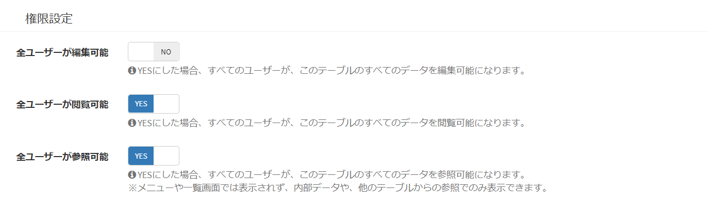

# 役割・権限の概要
Exmentにおける、役割・権限の概要についてご説明します。  
これはExmentにおいて、特定のデータやページを、指定のユーザーのみがアクション(操作)できるようにするために、重要な考え方です。  

新規にユーザーを追加し、そのユーザーがログインを行った場合、初期設定では、ほとんどの機能を使用できません。  
システム管理者は、新規追加したユーザーに対し、適切に役割・権限を設定する必要があります。  

## 権限の利用有無
権限設定を利用しない場合、[システム設定](/ja/system_setting)より、「権限を利用する」の設定をNoに切り替えてください。  
利用しない場合、すべてのユーザーが、すべての操作を実施できます。  

## 権限の有無による違い (一例)
権限の有無によって、ユーザーが行える動作や画面表示を制限することができます。

##### ■権限があるメニューのみ表示される
→ログインユーザーのメニューには、権限のある項目のみが表示されます。  

##### ■アクセスエラーになる  
→権限がないページを表示しようとした場合、アクセスエラーになります。

##### ■データフォームの選択肢に項目が表示されない  
→対象の列が「選択肢 (他のテーブルの値一覧から選択)」の場合、参照先テーブルの権限がなければ、選択肢が表示されません。  

## 権限の管理単位
Exmentでの権限管理の単位は、主に以下の3つになります。

- システム全体
- テーブル単位
- データ単位

### 全体図

### (1)システム全体

Exmentのシステム設定を操作する権限となります。  
システムで設定する権限の例として、以下のようなアクションがあります。  

- サイト名を変更する。
- ログインユーザーを管理する。
- 全テーブルの作成・編集・閲覧などを行う。

#### 権限設定方法

##### システム管理者設定
[システム設定](/ja/system_setting)より、「システム管理者」を追加・変更できます。「システム管理者」はシステムのすべての操作を実行できます。

##### その他のシステム設定
システム管理者以外のユーザーでも、[役割グループ](/ja/role_group)を付与することで、システム全体の操作を行うことができます。  
システムに関する操作の権限設定は、[役割グループ](/ja/role_group)より、「システム権限」を追加・変更してください。

### (2)テーブル単位

Exmentで作成するテーブルの権限になります。  
各テーブルごとに権限を設定し、その権限の設定内容によって、それぞれのユーザーが実施できるアクションが変わります。  
テーブルの権限がまったくないユーザーは、そのテーブルのすべてのページにアクセスすることができません。  
  
テーブルで設定する権限の例として、以下のようなアクションがあります。  

- 列の追加など、そのテーブルの設定を変更する。
- テーブル内のすべてのデータを編集できる。
- テーブル内のすべてのデータを閲覧でき、自分が担当のデータを編集できる。
- テーブル内の、自分が担当のデータを閲覧できる。

#### 権限設定方法

##### 全ユーザー一括設定
役割や組織などに関わらず、すべてのユーザーに対して、編集、閲覧などの権限を付与します。テーブル内のすべてのデータが対象となります。[テーブル設定](/ja/table)から変更できます。

##### その他のテーブル設定
ユーザーごとに異なる権限を付与する場合は、[役割グループ](/ja/role_group)を利用できます。  
テーブルに関する操作の権限設定は、[役割グループ](/ja/role_group)より、「テーブル権限」を追加・変更してください。

### (3)データ単位

Exmentで作成するデータごとの権限になります。  
データ単位に権限を付与することで、「すべてのデータではなく、特定のデータのみアクセスさせたい」といった、細かな要望に対応できます。  
権限付与の例として、以下のようなアクションがあります。

- 特定のデータを編集する。
- 特定のデータを閲覧する。

#### 権限設定方法

##### データを新規作成した時の基本動作
ユーザーがデータを保存した時、自身に対して、そのデータの編集権限が自動的に追加されます。（ユーザーがとくに意識する必要はありません）

##### データを新規作成した時に、データ作成者の所属組織にも権限を追加する
データを作成したユーザーだけでなく、データ作成者が所属する組織にも、自動的に共有設定を追加することができます。  

- 例：営業部のユーザーが作成したデータは、自動的に営業部全員にも共有する

設定方法は、[組織設定](/ja/organization)をご確認ください。

##### 後から手動で権限を追加(共有)
作成済のデータを他のユーザーに共有することができます。権限は閲覧・編集から選択可能です。  
[データ詳細画面](/ja/data_details)から「共有」を選んで実施してください。

  

##### データの新規作成・更新時に、列に設定されたユーザー・組織にも権限を追加する
Exmentでは、カスタム列設定として「ユーザー」「組織」を追加することができます。  
画面やAPIでデータを新規作成・更新した時に、この「ユーザー」「組織」列に設定されているユーザー・組織に、自動的にデータを共有することができます。  

- 例：『タスク管理』テーブルの『担当者』列に追加されたユーザーには、データ保存時に、自動的にそのデータの編集権限を付与する

設定方法は、[データ自動共有設定](/ja/table#データ自動共有設定)をご確認ください。

## 組織・ユーザー設定
Exmentの組織・ユーザー設定についての概要です。  

#### 組織の利用有無
組織設定を使用しない場合、[システム設定](/ja/system_setting)より、「組織を利用する」をNoに切り替えてください。

#### 組織の階層設定
Exmentでは、組織を階層管理することができます。  

組織に対して、[役割グループ設定](/ja/role_group)やデータ共有を行った場合に、組織階層の「親子」「親」「子」を含めるかどうかを指定することができます。  
設定方法は、[組織設定](/ja/organization)をご確認ください。

#### 別組織のユーザー・組織情報の取得範囲について
Exmentを、社内ポータルサイトのような用途で使用する場合、「システム内で、どのユーザーが使用しているか」「どの組織・どの会社がシステム登録しているか」ということは、大きな問題にはなりません。

ですが、Exmentを社外のユーザーに払い出して利用してもらうことを想定した場合、他社間でユーザー情報を取得・閲覧できることは、問題となる場合があります。

  
[こちら](/ja/multiuser)の設定を行うことで、他社間でのユーザー情報の取得・閲覧を制限することができるようになります。

## 関連ページ
- [システム設定](/ja/system_setting)
- [役割グループ設定](/ja/role_group)
- [データ詳細画面](/ja/data_details)
- [組織設定](/ja/organization)
- [外部ポータルサイト向け設定](/ja/multiuser)  