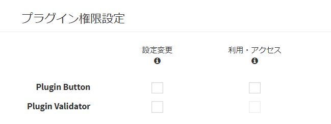
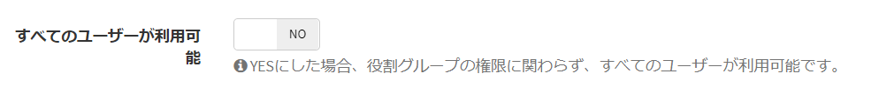

# プラグイン

## プラグインとは
Exmentでは、「プラグイン」という機能を備えています。  
Exmentが標準で備えている機能が、業務に不足している場合に、その拡張機能として、画面上からプログラムをアップロードすることで、機能を追加することができます。  
プラグインには現在、以下の種類があります。  

- [ボタン](#ボタン)
- [イベント](#イベント)
- [ページ](#ページ)
- [ダッシュボード](#ダッシュボード)
- [ビュー](#ビュー)
- [バッチ](#バッチ)
- [API](#API)
- [バリデーション](#バリデーション)
- [スクリプト](#スクリプト)
- [スタイル](#スタイル)
- [インポート](#インポート)
- [エクスポート](#エクスポート)
- [ドキュメント出力](#ドキュメント出力)
- [Docurain(PDF出力)](#docurain)
- [トリガー ※非推奨](#トリガー)

#### ボタン
Exmentの一覧画面もしくはフォーム画面にボタンを追加し、クリック時に処理を行うことができます。  
※実装方法は[こちら](/ja/plugin_quickstart_button)をご参照ください。  
  
ボタンの種類は、以下の内容があります。  
##### 一覧画面のメニューボタン
データ一覧画面の上部にボタンを追加し、クリック時にイベントを発生させます。

##### データ詳細画面のメニューボタン
データ詳細画面の上部にボタンを追加し、クリック時にイベントを発生させます。

##### データ新規作成画面のメニューボタン
データの新規作成画面の上部にボタンを追加し、クリック時にイベントを発生させます。

##### データ更新画面のメニューボタン
データの更新画面の上部にボタンを追加し、クリック時にイベントを発生させます。

#### イベント
Exmentの画面上で特定の操作を行った場合に実行され、値の更新などの処理を行うことができます。  
※実装方法は[こちら](/ja/plugin_quickstart_event)をご参照ください。  
  
特定の操作とは、以下の内容があります。  

- ##### 保存直前  
データの保存直前に、処理が起動します。  

- ##### 保存後  
データの保存後に、処理が起動します。  

- ##### ワークフロー実行直前  
ワークフロー実行の直前に、処理が起動します。  

- ##### ワークフロー実行後  
ワークフロー実行後に、処理が起動します。  

- ##### 通知実行直前  
通知実行の直前に、処理が起動します。  

- ##### 通知実行後  
通知実行後に、処理が起動します。  

#### ページ
Exmentに新しい画面を作成することができます。  
既存の機能とは全く異なるページを使用する場合にご利用ください。  
※実装方法は[こちら](/ja/plugin_quickstart_page)をご参照ください。  

#### ダッシュボード
Exmentのダッシュボードに新しい画面を作成することができます。  
ダッシュボードのアイテムとして、独自のページを使用したい場合にご利用ください。 
※実装方法は[こちら](/ja/plugin_quickstart_dashboard)をご参照ください。

#### ビュー
Exmentのカスタムデータ一覧画面に、新しいデザインや独自の機能を作成し、追加することができます。  
標準で用意されたビューである、一覧・集計・カレンダービューと、全く異なる機能を使用したい場合にご利用ください。  
※実装方法は[こちら](/ja/plugin_quickstart_view)をご参照ください。  

#### バッチ
定期的な処理を、自動的に実行させたい場合に使用できます。  
ステータスの一括更新など、特定の処理を一度に実行したい場合にも使用できます。  
※実装方法は[こちら](/ja/plugin_quickstart_batch)をご参照ください。

#### API
Exmentに新しいAPIを作成することができます。  
[APIリファレンス](https://exment.net/reference/ja/webapi.html)に存在しない機能を追加する場合にご利用ください。  
※実装方法は[こちら](/ja/plugin_quickstart_api)をご参照ください。

#### スクリプト
独自のスクリプト(javascript)を実行することができます。  
現在対応しているのは、データ一覧画面表示時、データ詳細画面表示時、データ新規作成画面表示時・更新画面表示時です。  
※実装方法は[こちら](/ja/plugin_quickstart_script)をご参照ください。

#### スタイル
独自のスタイル(スタイルシート・css)を設定し、デザインを変更することができます。  
※実装方法は[こちら](/ja/plugin_quickstart_style)をご参照ください。

#### バリデーション
カスタムテーブルのバリデーション処理を独自に実装したい場合に使用できます。  
複雑なチェックや項目間の関連チェックを実装する場合にご利用ください。  
※実装方法は[こちら](/ja/plugin_quickstart_validate)をご参照ください。

#### インポート
カスタムデータのインポート処理を独自に実装したい場合に使用できます。  
オリジナルフォーマットのファイルを取り込む場合や特殊な変換処理を実装する場合にご利用ください。  
※実装方法は[こちら](/ja/plugin_quickstart_import)をご参照ください。

#### エクスポート
カスタムデータ一覧のエクスポートを独自に実装したい場合に使用できます。  
オリジナルフォーマットのファイルをエクスポートする場合や、特殊な変換処理を実装する場合にご利用ください。  
出力形式は、Excelの他、それ以外のフォーマットでの出力も可能です。  
※実装方法は[こちら](/ja/plugin_quickstart_export)をご参照ください。

#### ドキュメント出力
見積書や帳票など、独自のドキュメント資料を作成することができます。  
ドキュメントの元となるテンプレートはExcel形式で、Excel形式で出力されます。  
※実装方法は[こちら](/ja/plugin_quickstart_document)をご参照ください。
※PDF形式での出力は、[Docurainプラグイン](/ja/plugin_quickstart_docurain)をご検討ください。  

<h4 id="docurain"><a href="#/ja/plugin?id=docurain" data-id="Docurain(PDF出力)" class="anchor">Docurain(PDF出力)</a></h4>

Excelとjsonだけで帳票開発ができるクラウド帳票エンジン **Docurain** を使用し、PDF出力を行います。  
ドキュメントの元となるテンプレートはExcel形式で、PDF形式で出力されます。  
※実装方法は[こちら](/ja/plugin_quickstart_docurain)をご参照ください。

#### トリガー
※v3.2.0より、非推奨になりました。  
今後は、「ボタン」もしくは「イベント」による実装をお願いします。

## 管理方法
### ページ表示
- 左メニューより、「プラグイン」を選択します。  
もしくは、以下のURLにアクセスしてください。  
http(s)://(ExmentのURL)/admin/plugin  
これにより、プラグイン画面が表示されます。  
  

### プラグインアップロード
［ファイルを選択］をクリックし、作成したプラグインzipファイルを選択します。
その後、［アップロード］をクリックし、画面からアップロードします。  
  
完了すると、ページ下の一覧にプラグインの情報が表示されます。  

### プラグイン管理
プラグインの有効・無効、プラグインのトリガーや、ページのURIなどの情報を変更します。  
該当する行の［編集］リンクをクリックしてください。  
  

これにより、プラグイン管理ページが表示されます。  
  

### 管理項目

##### 有効フラグ
そのプラグインを、システムで使用するかどうかを切り替えます。  
YESにした場合有効になります。NOの場合無効になり、システムでは実行されません。  
※プラグインのアップロード時には、既定でYESになっています。ただし、プラグイン種類が「バッチ」の場合は、アップロード時には既定でNOになっています。

##### 対象テーブル
プラグインを実行する対象の、カスタムテーブルを指定します。  
設定したテーブルのページを表示した場合に、プラグインが実行されます。  

##### 実施トリガー
どの操作を行った場合に、プラグインを実行するかどうかを設定します。
設定した内容の操作を行った場合に、プラグインが実行されます。  

##### ボタンの見出し
「一覧画面のメニューボタン」もしくは「フォームのメニューボタン」を表示時に、ボタンに表示する見出しを設定します。

##### ボタンのアイコン
「一覧画面のメニューボタン」もしくは「フォームのメニューボタン」を表示時に、ボタンに表示するアイコンを設定します。

##### ボタンのクラス
「一覧画面のメニューボタン」もしくは「フォームのメニューボタン」を表示時に、ボタンのHTMLに付加するclassを設定します。

## プラグイン削除
プラグインの削除を行いたい場合には、一覧画面より、該当する行の［削除］リンクをクリックしてください。  
  
※［削除］を実施すると、プラグインのファイルそのものが削除されます。    
プラグインを一時的に無効にしたい場合、「有効フラグ」をNOに設定してください。  

## 役割権限管理

プラグインの設定を行えるユーザー・組織、プラグインを利用できるユーザー・組織を、権限管理することができます。  
これにより、以下のような設定が可能です。

- 特定の部署や上長のみ、プラグインのページにアクセスできる
- 特定の部署や上長のみ、ドキュメント出力ができる

### 管理方法

#### 役割グループによる管理
- [役割グループ設定](/ja/role_group)のページにアクセスします。  
- 「プラグイン権限設定」の項目で、管理したいプラグインの権限を設定します。  

  

##### 権限一覧
- **設定変更** : 設定変更をもつプラグインの場合、このプラグインの設定を変更できます。  
※プラグインの削除やアップロードはできません。削除を行う場合、「プラグイン全体管理」を追加してください。
- **利用・アクセス** : プラグインを実際に利用したり、ページにアクセスすることができます。プラグインの種類によって、制御内容が異なります。  
    - **ボタン、ドキュメント出力** ： 画面上に表示するボタンの表示・非表示が制御されます。
    - **ページ、ダッシュボード** ： ページへのアクセス可否が切り替わります。
    - **API** ： APIの実行可否が切り替わります。(アクセス不可の場合、403エラーが発生します。)
    - **インポート、エクスポート** ： データのインポート・エクスポートの実行可否が制御されます。
    - **それ以外** : 役割グループによって制御を行うことはできません。すべてのユーザーに対し実行されます。
    
#### プラグイン個別の管理
- プラグインの編集画面に遷移します。

- 「すべてのユーザーが利用可能」をYESにし、保存します。  
(プラグインの種類が、ボタン、ドキュメント出力、ページ、ダッシュボード、API、インポート、エクスポートの場合のみ、項目が表示されます。)

  

- これにより、役割グループ設定に関わらず、すべてのユーザーが、そのプラグインを利用・アクセスできます。  

> 後方互換のため、v3.2.0未満でアップロードしたプラグインは、この「すべてのユーザーが利用可能」が、YESになっています。  
v3.2.0でアップロードしたプラグインでは、既定ではNOになります。

## その他
プラグインの開発方法については、[プラグイン開発方法](/ja/plugin_quickstart.md)をご参照ください。