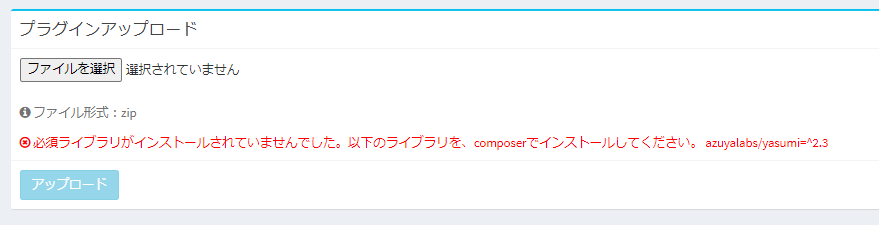

# プラグイン作成方法
## はじめに
ここでは、Exmentプラグインの作成方法について記載します。  
プラグインの機能・管理方法についての詳細は、[プラグイン](/ja/plugin.md)をご参照ください。  

## 作成方法リンク

- [ボタン](/ja/plugin_quickstart_button.md)
- [イベント](/ja/plugin_quickstart_event.md)
- [ページ](/ja/plugin_quickstart_page.md)
- [ダッシュボード](/ja/plugin_quickstart_dashboard.md)
- [ビュー](/ja/plugin_quickstart_view)
- [CRUDページ](/ja/plugin_quickstart_crud)
- [バッチ](/ja/plugin_quickstart_batch.md)
- [API](/ja/plugin_quickstart_api.md)
- [バリデーション](/ja/plugin_quickstart_validate.md)
- [スクリプト](/ja/plugin_quickstart_script.md)
- [スタイル](/ja/plugin_quickstart_style.md)
- [インポート](/ja/plugin_quickstart_import)
- [エクスポート](/ja/plugin_quickstart_export)
- [ドキュメント](/ja/plugin_quickstart_document.md)
- [Docurain(PDF出力)](/ja/plugin_quickstart_docurain.md)
- [トリガー ※非推奨](/ja/plugin_quickstart_trigger.md)


## プラグイン名のnamespace
プラグインのnamespaceは、以下の法則で付けてください。
- namespaceは、 **App\Plugins\\(プラグイン名のパスカルケース)** としてください。
    - 例：プラグイン名：testplugin　→ App\Plugins\\Testplugin
    - 例：プラグイン名：customer_list　→ App\Plugins\\CustomerList
    - 例：プラグイン名：get-user　→ App\Plugins\\GetUser


## その他、特別な設定方法
上記に記載している、基本的な作成方法の他に、特別な設定情報の記載を行います。

- [プラグイン設定画面で独自の設定を行う](#プラグイン設定画面で独自の設定を行う)
- [複数のプラグイン種類を1つのプラグインで対応する](#複数のプラグイン種類を1つのプラグインで対応する)
- [インストール時に必須ライブラリチェックを行う](#インストール時に必須ライブラリチェックを行う)
- [インストール時にテンプレートをインストールする](#インストール時にテンプレートをインストールする)


### プラグイン設定画面で独自の設定を行う

プラグイン独自の設定を、画面から行いたい場合に追加します。  
例：YouTube Data APIを実行するために必要なアクセスキーを、画面から設定  


- Plugin.phpファイルを、以下のように記載します。

~~~ php
<?php

// (1)
namespace App\Plugins\YouTubeSearch;

use Encore\Admin\Widgets\Box;
use Exceedone\Exment\Model\CustomTable;
use Exceedone\Exment\Services\Plugin\PluginXXXXBase;
use GuzzleHttp\Client;

class Plugin extends PluginXXXXBase
{
    // (1)
    protected $useCustomOption = true;

    /**
     * (2) プラグインの編集画面で設定するオプション
     *
     * @param $form
     * @return void
     */
    public function setCustomOptionForm(&$form)
    {
        $form->text('access_key', 'アクセスキー')
            ->help('YouTubeのアクセスキーを入力してください。');
    }
}
~~~

- (1)「protected $useCustomOption = true;」を追加します。
- (2) 関数"public function setCustomOptionForm(&$form)"は、プラグインの設定画面で表示される項目です。  
※カスタム設定を使用するには、「protected $useCustomOption = true;」を追加してください。  
※設定した値を取得するには、関数「$this->plugin->getCustomOption('パラメータ名')」を使用してください。

### 複数のプラグイン種類を1つのプラグインで対応する
通常、1つのプラグインファイルで対応できるプラグインの種類は、1種類です。  
そのため、例えば種類「ページ」と、「ダッシュボード」を両方を使用して機能拡張を行いたい場合、プラグインファイルを2つ作成しなければなりません。  
しかし、特別な書き方をすることで、複数のプラグイン種類を、1つのプラグインファイルで対応することができます。  
本項では、その複数種類のプラグインファイルの作成方法について記載します。  

#### config.json修正
config.json内のplugin_typeを、以下のように修正します。

~~~
// config.json 一部抜粋
"plugin_type": "dashboard,page"
~~~

plugin_typeの値を、カンマ区切りで複数記入します。


#### phpファイル修正
※プラグイン種類が「スクリプト」「スタイル」の場合は、この処理は不要です。  
  
- 1種類の場合は「Plugin.php」としていたファイル名を、「Plugin(プラグイン種類の頭大文字).php」に変更します。
    - PluginButton.php
    - PluginEvent.php
    - PluginPage.php
    - PluginDocument.php
    - PluginBatch.php
    - PluginDashboard.php
    - etc....

- 上記ファイルを一部修正し、クラス名をファイル名と同様にします。

~~~ php
<?php

// クラス名変更（イベントの場合）
class PluginEvent extends PluginEventBase
{
~~~


#### (任意)設定用のphpファイル作成
- 「[プラグイン設定画面で独自の設定を行う](#プラグイン設定画面で独自の設定を行う)」で記載した独自の設定を行いたい場合、「PluginSetting.php」ファイルを作成します。  

~~~ php
// ファイル名：PluginSetting.php
<?php

namespace App\Plugins\PageMulti;

use Exceedone\Exment\Services\Plugin\PluginSettingBase;
use Exceedone\Exment\Model\CustomTable;

// クラス名：PluginSetting
class PluginSetting extends PluginSettingBase
{
    protected $useCustomOption = true;
    
    /**
     * @param [type] $form
     * @return void
     */
    public function setCustomOptionForm(&$form)
    {
        $form->text('text', 'テキスト')
            ->help('テキストを表示します。');
    }
}
~~~


#### zipに圧縮
これらのファイルを最小構成として、zipに圧縮します。  
zipファイル名は、「(plugin_name).zip」にしてください。  
- XXXX.zip
    - config.json
    - PluginDashboard.php
    - PluginPage.php
    - PluginSetting.php(任意)
    - (その他、必要なPHPファイル、画像ファイルなど)

### サンプルプラグイン
[ページ、ダッシュボード両表示](https://exment.net/downloads/sample/plugin/PageMulti.zip)  


### インストール時に必須ライブラリチェックを行う
プラグインのインストール時に、必須ライブラリチェックを行うことができます。  
composerなどでインストールするライブラリ前提のプラグインの場合、事前にチェックを行うことによって、プラグイン実行時のエラーを防ぐことができます。  

#### 仕様
- composerによりインストールされ、チェックを行いたいライブラリのクラス名を、config.jsonに記載します。  
クラスが存在しなかった場合に、ユーザーにインストールを実施してほしいcomposer名も、同様にconfig.jsonに記載します。  

- プラグインのインストール時に、そのクラスが存在しなかった場合、プラグインのインストールはエラーになります。  
その際、画面には、インストールを実施してほしいcomposer名が表示されます。


#### config.json修正
config.jsonに、"requirement"を追加し、以下のようなオプションを追加します。

~~~
// config.json 一部抜粋
"requirement": [
    {
        "class": "(チェックするクラス名)",
        "composer": "(クラスが存在しなかった場合に、ユーザーにインストールを実施してほしいcomposer名)"
    },
    {
        "class": "(チェックするクラス名)",
        "composer": "(クラスが存在しなかった場合に、ユーザーにインストールを実施してほしいcomposer名)"
    }
]
~~~

#### 記入例
ここでは、日本の祝日を一括で取得するライブラリ「[azuyalabs/yasumi](https://github.com/azuyalabs/yasumi)」をプラグインで使用することを想定します。

~~~
// config.json 一部抜粋
"requirement": [
    {
        "class": "\\Yasumi\\Yasumi",
        "composer": "azuyalabs/yasumi=^2.3"
    }
]
~~~

この設定を行うことで、サーバーにクラス「\Yasumi\Yasumi」がない場合、プラグインのインストール時に、エラーが表示されます。



### インストール時にテンプレートをインストールする
プラグインのインストール時に、[テンプレート](/ja/template)のインストールを行うことができます。  
プラグインとしての機能だけでなく、必要となるテーブル設定なども、同時にインストールすることができます。  

#### config.json修正
config.jsonに、"templates": trueを追加します。

~~~
// config.json 一部抜粋
"templates": true
~~~

#### テンプレートファイル配置
- プラグインフォルダに「templates」フォルダを作成します。

- [テンプレート](/ja/template)のエクスポートを実施します。  

- エクスポートしたzipファイルを解凍し、作成したプラグインフォルダ内の「templates」フォルダに移動します。

- これにより、プラグインインストール時に、テンプレートファイルが自動でインストールされます。

#### その他補足
- 該当のプラグインを削除しても、この機能でインストールしたテンプレートは削除されません。


### (非推奨)クラスに属さないPHPファイルを使用する
通常、PHPの各処理はクラスの中に記述しますが、中にはクラスを使用せずに関数を記載する場合があります。  
例えば、以下のような内容です。

``` php
<?php
namespace App\Plugins\TestPluginGlobalFunction;

function testPluginGlobalFunction(){
    return true;
}
```

バージョンv4.1.0以降、プラグインの読み込みには、[spl_autoload_register](https://www.php.net/manual/ja/function.spl-autoload-register.php)を使用しています。  
この関数はclass、trait、interfaceは対応していますが、クラスに属さない関数には対応していないようです。  
そのため、通常とは異なる記載が必要です。以下の対応を実施してください。  

#### require_onceを呼び出す
呼び出し元のクラスの、コンストラクタやexecute関数などで、require_onceを実行してください。

``` php
<?php
namespace App\Plugins\TestPluginGlobalFunction;

use Exceedone\Exment\Services\Plugin\PluginBatchBase;

class Plugin extends PluginBatchBase
{
    /**
     * execute
     */
    public function execute()
    {
        // 同フォルダのfunction.php、Dir1フォルダのfunction.phpをrequire_onceする
        require_once dirname(__FILE__).'/function.php';
        require_once dirname(__FILE__).'/Dir1/function.php';

        // 実行する
        testPluginGlobalFunction();
        Dir1\testPluginGlobalFunctionDir1();
    }
}

```


#### 推奨：クラスに属するようにstatic関数を実装する
なお、他のクラスで定義した関数をstaticに呼び出したい場合、可能な限り、クラスにstaticな関数として実装をお願いします。


``` php
<?php
namespace App\Plugins\TestPluginGlobalFunction;

//　関数の定義元
class StaticFunction
{
    // staticな関数として、クラスに定義する
    public static function testPluginStaticFunction(){
        return true;
    }
}

```

``` php
<?php
namespace App\Plugins\TestPluginGlobalFunction;

use Exceedone\Exment\Services\Plugin\PluginBatchBase;

// 関数の呼び出し元
class Plugin extends PluginBatchBase
{
    /**
     * execute
     */
    public function execute()
    {
        // staticな関数として呼び出す
        StaticFunction::testPluginStaticFunction();
        Dir1\StaticFunction::testPluginStaticFunctionDir1();
    }
}

```
