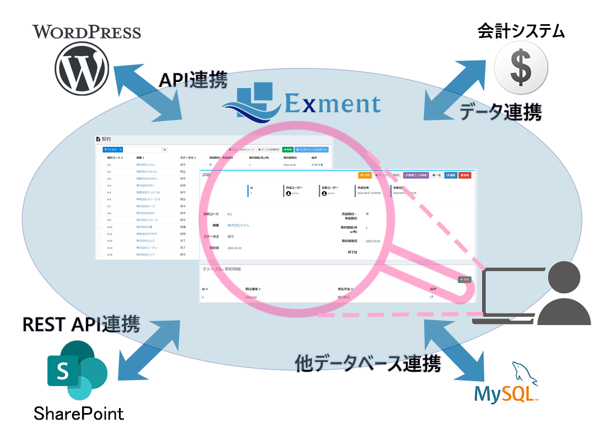

## プラグイン(CRUDページ)
Exmentに、独自のCRUDページを追加します。  

## CRUDとは
Create、Read、Update、Deleteのことです。  
これにListも追加し、CRUD + Listに特化したプラグイン開発を可能にします。  
Exmentのカスタムデータの一覧・詳細・新規作成・更新・削除とほとんど同じ画面構成で、必要最低限な開発のみで実装可能にします。  
これにより、外部データ（例：他のデータベースエンジン、WordPress、SharePointリスト、他社Webデータベース、会計システムなど）を、Exmentにデータを取り込むことなく、Exmentの画面で管理可能にします。  
また、[プラグイン(ページ)](/ja/plugin_quickstart_page)の開発と比較しても、データ取得・追加といった内部処理のみ開発すれば済み、基本的にUI部分の開発は不要なため、開発工数が大幅に削減されます。

  

## 主なできること
- 外部データ（例：他のデータベースエンジン、WordPress、SharePointリスト、他社Webデータベース、会計システムなど）を、Exmentにデータを取り込むことなく、Exmentの画面で管理可能にする
- Exmentの複数テーブルを自由に結合・絞り込み・並べ替えして表示
- データ一覧・表示・新規作成・編集・削除を、機能や権限によって実行可否を制御
- データ一覧は、外部サービスに合わせ、「すべてのデータを一覧表示」「20件・50件・100件毎に件数を分けてページネーション表示」の両方に対応
- 複数のエンドポイントに対応。1つのプラグインで、複数のエンドポイントを設定し、それぞれのエンドポイントでCRUD表示
- 認証設定可能。「キー」「ID・パスワード」もしくは「OAuth認証」に対応。これらの設定値があり、認証されている場合のみ、CRUDページにアクセスできるよう制御可能

## 作成方法(必要最小限)
ここではサンプルとして、「Exmentとは異なるMySQLのデータベース『world』のデータを、Exmentで一覧・表示・作成・更新・削除を実施する」という画面を例として、作成手順を記載します。  

### 事前準備
事前準備として、以下の処理を実行してください。
- 外部データベースを作成します。本プラグインではMySQLのサンプルデータベース「world」を利用しています。[公式サイト](https://dev.mysql.com/doc/index-other.html)からzipをダウンロードした上で、お使いのMySQL（またはMariaDB）環境で解凍したSQLを実行してください。
  

- config/database.phpを開き、connectionsに以下を追加します。

```
        'world' => [
            'driver' => 'mysql',
            'url' => env('DATABASE_URL'),
            'host' => env('DB_HOST', '127.0.0.1'),
            'port' => env('DB_PORT', '3306'),
            'database' => env('DB_DATABASE_WORLD', 'world'),
            'username' => env('DB_USERNAME', 'forge'),
            'password' => env('DB_PASSWORD', ''),
            'unix_socket' => env('DB_SOCKET', ''),
            'charset' => 'utf8mb4',
            'collation' => 'utf8mb4_unicode_ci',
            'prefix' => '',
            'prefix_indexes' => true,
            'strict' => true,
            'engine' => null,
            'options' => extension_loaded('pdo_mysql') ? array_filter([
                PDO::MYSQL_ATTR_SSL_CA => env('MYSQL_ATTR_SSL_CA'),
            ]) : [],
        ],
```


### config.json作成
- 以下のconfig.jsonファイルを作成します。  

~~~ json

{
    "plugin_name": "MySQLWorld",
    "plugin_view_name" : "MySQL World連携",
    "description": "MySQLのサンプルデータベース「World」とExmentを連携します。",
    "uuid":  "2641201a-ba35-2bd9-af59-9440643ca206",
    "author":  "(Your Name)",
    "version": "1.0.0",
    "uri":  "mysql_world",
    "plugin_type": "crud"
}

~~~

- plugin_nameは、半角英数で記入してください。
- uuidは、32文字列+ハイフンの、合計36文字の文字列です。プラグインを一意にするために使用します。  
以下のURLなどから、作成を行ってください。  
https://www.famkruithof.net/uuid/uuidgen
- uriには、 このプラグインにアクセスするためのURIを記入してください。  
（未指定の場合はplugin_nameから生成されます）  
- plugin_typeは、crudと記入してください。  

### Pluginファイル作成
以下のようなPHPファイルを作成します。ファイル名は「Plugin.php」としてください。  
**※下記の例は、最小限のものになります。プラグイン(CRUD)では、下記以外にも多数の機能や関数を用意しています。詳細は[プラグインリファレンス](/ja/plugin_reference_crud)をご確認ください。**  

~~~ php
<?php

// (1)
namespace App\Plugins\MySQLWorld;

use Encore\Admin\Widgets\Grid\Grid;
use Encore\Admin\Widgets\Form;
use Exceedone\Exment\Services\Plugin\PluginCrudBase;
use Illuminate\Support\Collection;
use Illuminate\Pagination\LengthAwarePaginator;

class Plugin extends PluginCrudBase
{
    /**
     * (2)タイトル
     * content title
     *
     * @var string
     */
    protected $title = '世界の都市';

    /**
     * (3)説明文
     * content description
     *
     * @var string
     */
    protected $description = '世界の都市を一覧で表示します。';

    /**
     * (4)アイコン
     * content icon
     *
     * @var string
     */
    protected $icon = 'fa-globe';

    /**
     * (5) 列定義を取得
     * Get fields definitions
     *
     * @return array|Collection
     */
    public function getFieldDefinitions()
    {
        return [
            ['key' => 'ID', 'label' => 'ID', 'primary' => true, 'grid' => 1, 'show' => 1, 'edit' => 1],
            ['key' => 'Name', 'label' => '都市名', 'grid' => 2,'show' => 2, 'create' => 1, 'edit' => 2],
            ['key' => 'CountryCode', 'label' => '国コード', 'grid' => 3, 'show' => 3, 'create' => 2,'edit' => 3],
            ['key' => 'Population', 'label' => '人工', 'show' => 5, 'create' => 4,'edit' => 5],
        ];
    }

    /**
     * (6) データ一覧(Paginate)を取得
     * Get data paginate
     *
     * @return LengthAwarePaginator
     */
    public function getPaginate(array $options = []) : ?LengthAwarePaginator
    {
        $query = \DB::connection('world')
            ->table('city');

        // フリーワード検索がある場合
        $q = array_get($options, 'query');
        if(isset($q)){
            $query->where(function($query) use($q){
                $query
                    ->where('Name', 'LIKE', "%{$q}%")
                    ->orWhere('CountryCode', 'LIKE', "%{$q}%")
                ;
            });
        }

        return $query->paginate(array_get($options, 'per_page') ?? 20, ['*'], 'page', array_get($options, 'page'));
    }

    /**
     * (7) データ詳細(1件のデータ)を取得
     * read single data
     *
     * @return array|Collection
     */
    public function getData($id, array $options = [])
    {
        return \DB::connection('world')
            ->table('city')
            ->where('ID', $id)->first();
    }

    /**
     * (8) 新規作成ならびに編集時のフォームを設定
     * set form info
     *
     * @return Form|null
     */
    public function setForm(Form $form, bool $isCreate, array $options = []) : ?Form
    {
        if(!$isCreate){
            $form->display('ID');    
        }
        $form->text('Name');

        // 国一覧取得
        $countries = \DB::connection('world')->table('country')->pluck('Name', 'Code');
        $form->select('CountryCode')->options($countries);
        
        $form->number('Population');

        return $form;
    }

    /**
     * (9) 新規作成実施
     * post create value
     *
     * @return mixed
     */
    public function postCreate(array $posts, array $options = [])
    {
        // 独自のデータベースに保存する。
        $value = \DB::connection('world')
            ->table('city')
            ->insertGetId($posts);

        return $value;
    }

    /**
     * (10) 編集の実施
     * edit posted value
     *
     * @return mixed
     */
    public function putEdit($id, array $posts, array $options = [])
    {
        // 独自のデータベースに保存する。
        \DB::connection('world')
            ->table('city')
            ->whereOrIn('ID', $id)
            ->update($posts);

        return $id;
    }

    /**
     * (11) データの削除
     * delete value
     *
     * @param $id string|array target ids. If multiple check, calls as array.
     * @return mixed
     */
    public function delete($id, array $options = [])
    {
        $ids = stringToArray($id);
        $value = \DB::connection('world')
            ->table('city')
            ->whereIn('ID', $ids)
            ->delete();
    }
}

~~~

- (1) namespaceは、**App\Plugins\\(プラグイン名のパスカルケース)**としてください。[詳細はこちら](/ja/plugin_quickstart#プラグイン名のnamespace)  
また、クラス名は「Plugin」とし、PluginCrudBaseを継承してください。

- (2) プロパティtitleは、各ページに表示にするタイトルです。

- (3) プロパティdescriptionは、各ページに表示にする説明文です。

- (4) プロパティiconは、各ページに表示にするアイコンです。

- (5) 関数getFieldDefinitionsは、列定義を連想配列で取得する関数です。  
    - 必ず"primary" => trueとなるキーを1つ追加してください。(現在、複合キーには対応していません)  
    - "key"は、データ取得やHTMLの各要素のnameなどに設定する、項目名です。英数字で入力してください。  
    - "label"は、一覧画面などの項目名に使用します。  
    - "grid"は、一覧画面で表示する項目に設定してください。表示順に整数を記入してください。
    - "show"は、詳細画面で表示する項目に設定してください。表示順に整数を記入してください。
    - "create"は、新規作成画面で表示する項目に設定してください。表示順に整数を記入してください。
    - "edit"は、編集画面で表示する項目に設定してください。表示順に整数を記入してください。

- (6) 関数getPaginateは、データの一覧をページネーション形式で取得する関数です。  
取得したデータを、LengthAwarePaginator形式で返却してください。  
また、一覧の各要素は連想配列とし、この連想配列のキー値は、getFieldDefinitionsで設定しているキーと同値としてください。  
※画面で検索を行った場合、引数$optionsに値が設定されます。詳細はリファレンスをご確認ください。

- (7) 関数getDataは、データ詳細(1件のデータ)を取得します。  
詳細は連想配列とし、この連想配列のキー値は、getFieldDefinitionsで設定しているキーと同値としてください。

- (8) 関数setFormは、新規作成時ならびに編集時のフォームを設定します。  
フォームを任意の形式で指定したい場合、この関数を実装してください。  
※この関数を実装しない場合、関数getFieldDefinitionsで"create"もしくは"edit"が設定された項目が画面に表示されます。

- (9) 関数postCreateは、新規作成画面で保存を実行した時に呼び出される関数です。新規作成データの登録を実施してください。  

- (10) 関数putEditは、編集画面で保存を実行した時に呼び出される関数です。編集データの登録を実施してください。  

- (11) 関数deleteは、画面で削除を実行した時に呼び出される関数です。データの削除を実施してください。  
※画面により、引数$idに配列が設定される場合があります。


### zipに圧縮
上記2ファイルを最小構成として、zipに圧縮します。  
zipファイル名は、「(plugin_name).zip」にしてください。  
- MySQLWorld.zip
    - config.json
    - Plugin.php


## サンプルプラグイン
以下のサンプルを用意しています。

| 名前 | 概要 | 認証 | サンプルリンク |
| ---- | ---- | ---- | ---- |
| MySQLWorld | Exmentとは異なるデータベースと接続し、データの取得・追加・編集・削除を実施します。 | - | [他のMySQL連携](https://github.com/exment-git/plugin-sample/tree/main/crud/mysqlworld) |
| WordPress | REST APIを使用し、指定のWordpressサイトの投稿を一覧表示・詳細表示します。 | - | [WordPress連携](https://github.com/exment-git/plugin-sample/tree/main/crud/wordpress) |
| WordPresses | REST APIを使用し、複数のWordpressサイトの投稿を一覧表示・詳細表示します。複数のエンドポイントに対応し、画面からボタンで対象サイトを切り替えます。 | - | [複数サイトのWordPress連携](https://github.com/exment-git/plugin-sample/tree/main/crud/wordpresses) |
| WordPressPost | REST APIを使用し、指定のWordpressサイトの投稿を一覧表示・詳細表示します。また、事前設定したアクセスキーを使用し、投稿の追加・編集・削除も実施します。 | ID・パスワード | [WordPress投稿](https://github.com/exment-git/plugin-sample/tree/main/crud/wordpress_post) |
| OtherExment | 別サーバーのExmentとRest API連携し、データを取得を実施します。 | OAuth | [他のExmentとREST API連携](https://github.com/exment-git/plugin-sample/tree/main/crud/other_exment) |
