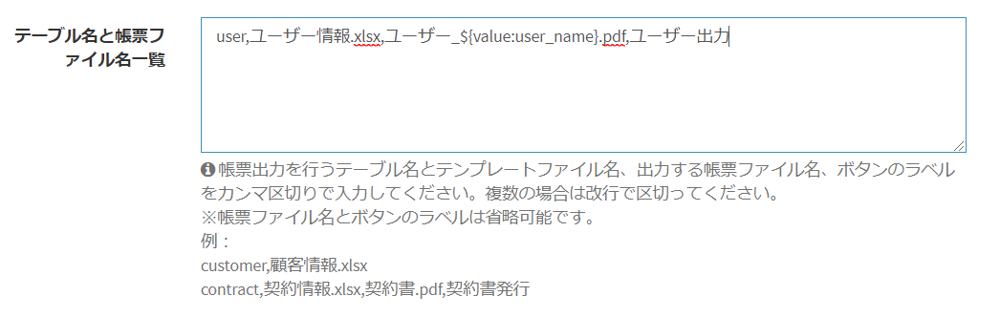
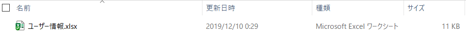

# ドキュメント出力(Docurain)
Excelとjsonだけで帳票開発ができるクラウド帳票エンジン **Docurain** を使用し、PDF出力またはExcel(xlsx)出力を行います。  

## Docurainとは
Docurainは、Excelとjsonだけで帳票開発ができるクラウド帳票エンジンです。  
さまざまなレイアウトの帳票も、Excelファイルのテンプレートから作成することができ、またPDF形式の出力にも対応しています。
[Docurainのサイトはこちら](https://docurain.jp/)

> Docurainは、ルート42株式会社が開発・運用のサービスになります。  
ご利用の際には、ライセンスキーが必要となります。帳票出力の回数ごとの従量課金となります。（試用キーの発行は可能です。）  
Exmentの開発・運用会社である株式会社カジトリは、DocurainのXXXXXです。試用のご要望、お申し込み、お問い合わせは、[こちら](https://exment.net/inquiry)からお願いします。

## 実行方法
- [こちらのプラグイン](https://exment.net/downloads/product/plugin/Docurain.zip)をダウンロードします。

- Exmentのプラグインとしてアップロードします。  
手順は[こちら](/ja/plugin?id=プラグインアップロード)をご参照ください。

- アップロード後、Docurainプラグインの行をクリックし、プラグイン設定画面に入ります。  

  

- 以下の内容を入力します。

- 対象テーブル：Docurainを実行する対象のテーブル

  

- トークン：Docurain実行トークン。トークン発行は、[こちら](https://exment.net/inquiry)にてお問い合わせください

  

- テーブル名と帳票ファイル名一覧： 帳票出力を行うテーブル名と、帳票ファイル名を組み合わせを、カンマ区切りで入力してください。複数の場合は改行区切りを行ってください。  

  

- 解凍したフォルダ内の「documents」フォルダ内に、帳票の元となるExcelファイルを配置します。  
複数の帳票をDocurainで作成する場合、複数のExcelファイルをdocumentsで配置してください。  
※フォルダパスは、「(プロジェクトルートフォルダ)/storage/app/plugins/Docurain/documents」になります。  
※帳票の作成方法は、以下の「帳票作成方法」をご確認ください。

  
  

- ここまでの設定を行うことで、「対象テーブル」で選択したテーブルに、ボタンが表示されます。  

  

- ボタンをクリックすることで、帳票が作成されます。  

  

## パラメータ一覧
Docurainを使用する場合、通常のExmentのパラメータ記載方法とは別の、パラメータ記載方法が必要です。
