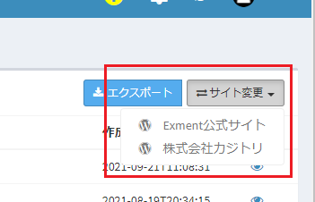
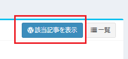

# プラグインリファレンス(CRUDページ)
各プラグイン独自の関数やプロパティ一覧になります。  
※カスタムテーブルやカスタム列、カスタムデータのリファレンスは、[こちら](/ja/func_reference)をご参照ください。  
※CRUDページ専用のリファレンスです。それ以外の種類のリファレンスについては、[こちら](/ja/plugin_reference)をご参照ください。  
※主にプラグイン開発者が定義するものを記載します。システムで使用し、プラグイン開発者では変更を実施させたくない内容は割愛します。  
※「★」が表記されている関数は、ほぼ必ず定義が必要です。「☆」が表記されている関数は、場合により定義が必要です。

## PluginCrudBase
プラグイン(CRUDページ)の抽象クラスです。CRUDページプラグインを開発する場合、こちらのクラスを継承してください。  

- namespace Exceedone\Exment\Services\Plugin
- trait Exceedone\Exment\Services\Plugin\PluginBase
- trait Exceedone\Exment\Services\Plugin\PluginPageTrait

##### プロパティ

| 名前 | 種類 | 説明 |
| ---- | ---- | ---- |
| title | string | 各ページに表示するタイトル |
| description | string | 各ページに表示する説明文 |
| icon | string | 各ページに表示するアイコン |


### 関数一覧

#### ★getFieldDefinitions
列定義を連想配列で取得する関数です。  
- 必ず"primary" => trueとなるキーを1つ追加してください。(現在、複合キーには対応していません)  
- "key"は、データ取得やHTMLの各要素のnameなどに設定する、項目名です。英数字で入力してください。  
- "label"は、一覧画面などの項目名に使用します。  
- "grid"は、一覧画面で表示する項目に設定してください。表示順に整数を記入してください。
- "show"は、詳細画面で表示する項目に設定してください。表示順に整数を記入してください。
- "create"は、新規作成画面で表示する項目に設定してください。表示順に整数を記入してください。
- "edit"は、編集画面で表示する項目に設定してください。表示順に整数を記入してください。


##### 引数
なし


##### 戻り値
| 種類 | 説明 |
| ---- | ---- |
| array | 列定義の配列 |


##### 例
``` php
/**
     * (2) 列定義を取得
     * Get fields definitions
     *
     * @return array|Collection
     */
    public function getFieldDefinitions()
    {
        return [
            ['key' => 'id', 'label' => 'ID', 'primary' => true, 'grid' => 1, 'show' => 1],
            ['key' => 'title', 'label' => 'タイトル', 'grid' => 2, 'show' => 2, 'create' => 1, 'edit' => 1],
            ['key' => 'date', 'label' => '作成日時', 'grid' => 3, 'show' => 3, 'create' => 2, 'edit' => 2],
            ['key' => 'content', 'label' => '本文', 'show' => 4, 'create' => 3, 'edit' => 3],
        ];
    }
```

---


#### getAuthType
CRUDページの認証種類文字列を返却します。  
※Exmentのログインとは別に、このCRUDページにアクセスするための認証を設定することができます。アクセスしたいサービスの種類によって、認証種類を設定してください。


##### 認証種類
| 返却文字列 | 種類 | 説明 |
| ---- | ---- | ---- |
| (null) | 認証なし | CRUDページ専用の認証を行わない場合です。既定値です。 |
| key | アクセスキー | プラグインの設定ページにて、アクセスキーを設定します。アクセスキーが入力されていなかった場合、エラーが表示されます。 |
| id_password | IDパスワード | プラグインの設定ページにて、IDとパスワードを設定します。IDとパスワードが入力されていなかった場合、エラーが表示されます。 |
| oauth | OAuth | ログイン設定画面にて、OAuth設定を行います。ユーザーがCRUDページにアクセスを行う時に、OAuthログインを行います。OAuthログインが実行できた場合のみ、CRUDページにアクセスできます。ならびに、アクセストークンも使用できます。 |


##### 引数
なし

##### 戻り値
| 種類 | 説明 |
| ---- | ---- |
| ?string | 認証種類を表す文字列 |


##### 例
``` php
    /**
     * Get auth type.
     * Please set null or "key" pr "id_password" or "oauth".
     *
     * @return string|null
     */
    public function getAuthType() : ?string
    {
        return 'oauth';
    }
```

---


#### enablePaginate
データの一覧をページネーション形式で表示するかを記載します。  
取得対象のサービスが、ページネーション形式（データの総数、ページ番号を指定してのデータ取得、ページごとのデータ取得）に対応している場合は、trueを返却してください。対応していない場合は、falseを返却してください。

##### 引数
なし


##### 戻り値
| 種類 | 説明 |
| ---- | ---- |
| boolean | ページネーション形式に対応しているかどうか。既定値：true |


##### 例
``` php
     /**
     * Whether use paginate
     * Default: true
     *
     * @return bool
     */
    public function enablePaginate() : bool
    {
        return true;
    }
```

---


#### ★getPaginate
データの一覧をページネーション形式で取得する関数です。  
取得したデータを、\Illuminate\Pagination\LengthAwarePaginator形式で返却してください。  
また、一覧の各要素は連想配列とし、この連想配列のキー値は、getFieldDefinitionsで設定しているキー値と同値としてください。  
※関数enablePaginateがtrueの場合は実装してください。


##### 引数
| 名前 | 種類 | 説明 |
| ---- | ---- | ---- |
| $options | array | 一覧画面表示で使用するオプション |
| $options['per_page'] | int | 1ページで表示する件数 |
| $options['page'] | int | ページ番号 |
| $options['query'] | string | 検索を実施する際の検索文字列 |


##### 戻り値
| 種類 | 説明 |
| ---- | ---- |
| LengthAwarePaginator | 検索結果モデル |


##### 例
``` php
    /**
     * (3) データ一覧(Paginate)を取得
     * Get data paginate
     *
     * @return LengthAwarePaginator
     */
    public function getPaginate(array $options = []) : ?LengthAwarePaginator
    {
        $client = new Client([
            'base_uri' => $this->getSiteUrl(),
        ]);

        $query = [
            'per_page' => $options['per_page'] ?? 20,
            'page' => $options['page'] ?? 20
        ];

        if(array_has($options, 'query')){
            $query['search'] = array_get($options, 'query');
        }

        $response = $client->get('wp-json/wp/v2/posts', ['query' => $query]);

        $json = json_decode((string)$response->getBody());

        $result = collect($json)->map(function($j){
            $j = json_decode(json_encode($j), true);
            return (object)[
                'id' => array_get($j, 'id'),
                'title' => array_get($j, 'title.rendered'),
                'content' => array_get($j, 'content.rendered'),
                'date' => array_get($j, 'date'),
            ];
        });
        
        return new LengthAwarePaginator(
            $result, 
            array_get($response->getHeaders(), 'X-WP-Total')[0], 
            $query['per_page'],
            $query['page'],
            [
                'path' => $this->getFullUrl(),
            ]
        );
    }
```


---

#### ☆getList
データの一覧を取得する関数です。  
取得したデータを、Collection形式で返却してください。  
また、一覧の各要素は連想配列とし、この連想配列のキー値は、getFieldDefinitionsで設定しているキー値と同値としてください。  
※関数enablePaginateがfalseの場合は実装してください。


##### 引数
| 名前 | 種類 | 説明 |
| ---- | ---- | ---- |
| $options | array | 一覧画面表示で使用するオプション |
| $options['query'] | string | 検索を実施する際の検索文字列 |


##### 戻り値
| 種類 | 説明 |
| ---- | ---- |
| \Illuminate\Support\Collection | 結果一覧 |


##### 例
``` php
    /**
     * (3) データ一覧を取得
     * Get data paginate
     *
     * @return Collection
     */
    public function getList(array $options = []) : Collection
    {
        $client = new Client([
            'base_uri' => $this->getSiteUrl(),
        ]);

        if(array_has($options, 'query')){
            $query['search'] = array_get($options, 'query');
        }

        $token = $this->getOauthAccessToken();
        $response = $client->get('v1.0/me/todo/lists', [
            'query' => $query, 
            'headers' => [
                'Authorization' => "Bearer $token",
                'Accept'        => 'application/json',
            ]
        ]);

        $json = json_decode((string)$response->getBody());

        $result = collect($json->value)->map(function($j){
            $j = json_decode(json_encode($j), true);
            return (object)[
                'id' => array_get($j, 'id'),
                'displayName' => array_get($j, 'displayName'),
            ];
        });

        return $result;
    }
```

---


#### getChunkCount
データの一覧をページネーション形式で取得する際、一度に表示する件数を返却します。  

##### 引数
なし


##### 戻り値
| 種類 | 説明 |
| ---- | ---- |
| int | 1度に取得する件数。既定値：1000 |


##### 例
``` php
    /**
     * Get max chunk count.
     *
     * @return int
     */
    public function getChunkCount() : int
    {
        return 1000;
    }
```


---

#### ★getData
指定したIDのデータを1件取得し、返却します。  
また、データの各要素は連想配列とし、この連想配列のキー値は、getFieldDefinitionsで設定しているキー値と同値としてください。  

##### 引数
| 名前 | 種類 | 説明 |
| ---- | ---- | ---- |
| $id | string | データのキー値 |
| $options | array | 現在未使用。予約引数。 |


##### 戻り値
| 種類 | 説明 |
| ---- | ---- |
| arrayもしくはCollection | 取得したデータ |


##### 例
``` php
    /**
     * (3) データ詳細(1件のデータ)を取得
     * read single data
     *
     * @return array|Collection
     */
    public function getData($id, array $options = [])
    {
        $client = new Client([
            'base_uri' => $this->getSiteUrl(),
        ]);
        $response = $client->request('GET', "wp-json/wp/v2/posts/{$id}");
        $json = json_decode((string)$response->getBody());
        
        $j = json_decode(json_encode($json), true);
        return (object)[
            'id' => array_get($j, 'id'),
            'title' => array_get($j, 'title.rendered'),
            'content' => array_get($j, 'content.rendered'),
            'date' => array_get($j, 'date'),
        ];
    }
```


---

#### ★postCreate
データの新規作成を実施します。  
戻り値には、作成したデータのキー値を返却してください。  

##### 引数
| 名前 | 種類 | 説明 |
| ---- | ---- | ---- |
| $posts | array | ユーザーが入力したデータ。連想配列。 |
| $options | array | 現在未使用。予約引数。 |


##### 戻り値
| 種類 | 説明 |
| ---- | ---- |
| string | 作成したデータのキー値を返却してください |


##### 例
``` php
    /**
     * post create value
     *
     * @return mixed
     */
    public function postCreate(array $posts, array $options = [])
    {
        $client = new Client([
            'base_uri' => $this->getSiteUrl(),
        ]);

        // create Authorization header 
        $id_password = $this->getAuthIdPassword();
        $Authorization = "Basic " . base64_encode("{$id_password['id']}:{$id_password['password']}");

        $response = $client->request('POST', "wp-json/wp/v2/posts", [
            'headers' => [
                'Authorization' => $Authorization,
                //'Content-Type' => 'application/json',
            ],
            'form_params' => [
                'title' => array_get($posts, 'title'),
                'content' => array_get($posts, 'content'),
                'status' => 'publish',
            ],
        ]);
        $json = json_decode((string)$response->getBody());
        $j = json_decode(json_encode($json), true);
        return array_get($j, 'id');
    }

```


---

#### ★putEdit
データの編集を実施します。  
戻り値には、編集したデータのキー値を返却してください。  

##### 引数
| 名前 | 種類 | 説明 |
| ---- | ---- | ---- |
| $id | string | 編集を実施する対象のキー値 |
| $posts | array | ユーザーが入力したデータ。連想配列。 |
| $options | array | 現在未使用。予約引数。 |


##### 戻り値
| 種類 | 説明 |
| ---- | ---- |
| string | 更新したデータのキー値を返却してください |


##### 例
``` php
    /**
     * edit posted value
     *
     * @return mixed
     */
    public function putEdit($id, array $posts, array $options = [])
    {
        $client = new Client([
            'base_uri' => $this->getSiteUrl(),
        ]);

        // create Authorization header 
        $id_password = $this->getAuthIdPassword();
        $Authorization = "Basic " . base64_encode("{$id_password['id']}:{$id_password['password']}");

        $response = $client->request('POST', "wp-json/wp/v2/posts/{$id}", [
            'headers' => [
                'Authorization' => $Authorization,
                //'Content-Type' => 'application/json',
            ],
            'form_params' => [
                'title' => array_get($posts, 'title'),
                'content' => array_get($posts, 'content'),
                'status' => 'publish',
            ],
        ]);
        $json = json_decode((string)$response->getBody());
        $j = json_decode(json_encode($json), true);
        return array_get($j, 'id');
    }

```


---

#### ★delete
データの削除を実施します。  

##### 引数
| 名前 | 種類 | 説明 |
| ---- | ---- | ---- |
| $id | string | 削除を実施する対象のキー値 |
| $options | array | 現在未使用。予約引数。 |


##### 戻り値
なし


##### 例
``` php
    /**
     * delete value
     *
     * @param $id string
     * @return mixed
     */
    public function delete($id, array $options = [])
    {
        $client = new Client([
            'base_uri' => $this->getSiteUrl(),
        ]);

        // create Authorization header 
        $id_password = $this->getAuthIdPassword();
        $Authorization = "Basic " . base64_encode("{$id_password['id']}:{$id_password['password']}");

        $response = $client->request('DELETE', "wp-json/wp/v2/posts/{$id}", [
            'headers' => [
                'Authorization' => $Authorization,
                //'Content-Type' => 'application/json',
            ],
        ]);
    }
```


---

#### enableCreate
新規作成を実施できるかどうかを判定し、boolean型で返却します。  
連携サービスが新規作成に対応していない場合や、ユーザーによって新規作成を行わせない場合は、falseを返却してください。

##### 引数
| 名前 | 種類 | 説明 |
| ---- | ---- | ---- |
| $options | array | 現在未使用。予約引数。 |


##### 戻り値
| 種類 | 説明 |
| ---- | ---- |
| boolean | 新規作成が可能な場合はtrue返却。既定値：true |

---


#### enableEditAll
編集を実施できるかどうかを判定し、boolean型で返却します。  
連携サービスが編集に対応していない場合や、ユーザーによって編集を行わせない場合は、falseを返却してください。

##### 引数
| 名前 | 種類 | 説明 |
| ---- | ---- | ---- |
| $options | array | 現在未使用。予約引数。 |


##### 戻り値
| 種類 | 説明 |
| ---- | ---- |
| boolean | 編集が可能な場合はtrue返却。既定値：true |

---


#### enableEdit
指定のデータに対し、データ編集を実施できるかどうかを判定し、boolean型で返却します。  
連携サービスが編集に対応していない場合や、ユーザーによって編集を行わせない場合は、falseを返却してください。

##### 引数
| 名前 | 種類 | 説明 |
| ---- | ---- | ---- |
| $value | mixed | IDに該当する値。 |
| $options | array | 現在未使用。予約引数。 |


##### 戻り値
| 種類 | 説明 |
| ---- | ---- |
| boolean | 編集が可能な場合はtrue返却。既定値：true |

---


#### enableDeleteAll
データ削除を実施できるかどうかを判定し、boolean型で返却します。  
連携サービスが削除に対応していない場合や、ユーザーによって削除を行わせない場合は、falseを返却してください。

##### 引数
| 名前 | 種類 | 説明 |
| ---- | ---- | ---- |
| $options | array | 現在未使用。予約引数。 |


##### 戻り値
| 種類 | 説明 |
| ---- | ---- |
| boolean | 削除が可能な場合はtrue返却。既定値：true |

---

#### enableDelete
指定のデータに対し、データ削除を実施できるかどうかを判定し、boolean型で返却します。  
連携サービスが削除に対応していない場合や、ユーザーによって削除を行わせない場合は、falseを返却してください。

##### 引数
| 名前 | 種類 | 説明 |
| ---- | ---- | ---- |
| $value | mixed | IDに該当する値。 |
| $options | array | 現在未使用。予約引数。 |


##### 戻り値
| 種類 | 説明 |
| ---- | ---- |
| boolean | 削除が可能な場合はtrue返却。既定値：true |

---


#### enableExport
データエクスポートを実施できるかどうかを判定し、boolean型で返却します。  
データエクスポートは、場合によって、サービスのすべてのデータの取得を実施します。そのため、大量データの取得などに注意してください。

##### 引数
| 名前 | 種類 | 説明 |
| ---- | ---- | ---- |
| $options | array | 現在未使用。予約引数。 |


##### 戻り値
| 種類 | 説明 |
| ---- | ---- |
| boolean | データエクスポートが可能な場合はtrue返却。既定値：false |

---


#### enableFreewordSearch
データ検索を実施できるかどうかを判定し、boolean型で返却します。  

##### 引数
| 名前 | 種類 | 説明 |
| ---- | ---- | ---- |
| $options | array | 現在未使用。予約引数。 |


##### 戻り値
| 種類 | 説明 |
| ---- | ---- |
| boolean | データ検索が可能な場合はtrue返却。既定値：false |

---


#### callbackGridTool
GRID(データ一覧)画面で、ページの右上に独自のボタンを表示したい場合などに定義します。

##### 引数

| 名前 | 種類 | 説明 |
| ---- | ---- | ---- |
| $tools | \Encore\Admin\Widgets\Grid\Tools | ツール |


##### 戻り値
なし


##### 例
``` php
    /**
     * Callback tools. If add event, definition.
     * ※この例の場合：WordPress一覧ボタンを表示し、データ取得対象のWordPressを切り替える
     *
     * @param $tools
     * @return void
     */
    public function callbackGridTool($tools)
    {
        $menulist = [];

        foreach ($this->getSiteDefinitions() as $site) {
            $menulist[] = [
                'href' => admin_urls('plugins', $this->plugin->getOption('uri'), array_get($site, 'endpoint')),
                'label' => array_get($site, 'label'),
                'icon' => 'fa-wordpress',
            ];
        }
        $tools->prepend(view('exment::tools.menu-button', [
            'button_label' => 'サイト変更',
            'menulist' => $menulist,
        ])->render(), 'right');
    }

```

  

---


#### callbackShowTool
SHOW(データ詳細)画面で、ページの右上に独自のボタンを表示したい場合などに定義します。

##### 引数

| 名前 | 種類 | 説明 |
| ---- | ---- | ---- |
| $id | string | キー値 |
| $box | \Encore\Admin\Widgets\Box | Box |


##### 戻り値
なし


##### 例
``` php
    /**
     * Callback show page tools. If add event, definition.
     *
     * @param Box $box
     * @return void
     */
    public function callbackShowTool($id, Box $box)
    {
        $box->tools(view('exment::tools.button', [
            'href' => $this->getSiteUrl() . "?p={$id}",
            'label' => '該当記事を表示',
            'icon' => 'fa-wordpress',
            'btn_class' => 'btn-primary',
            'target' => '_blank',
        ])->render());
    }
```

  

---


#### callbackFormTool
CREATE(データ新規作成)画面もしくはEDIT(データ編集)画面で、ページの右上に独自のボタンを表示したい場合などに定義します。

##### 引数

| 名前 | 種類 | 説明 |
| ---- | ---- | ---- |
| $id | string | キー値 |
| $box | \Encore\Admin\Widgets\Box | Box |


##### 戻り値
なし


##### 例
``` php
    /**
     * Callback create or edit page tools. If add event, definition.
     *
     * @param Box $box
     * @return void
     */
    public function callbackFormTool($id, Box $box)
    {
        $box->tools(view('exment::tools.button', [
            'href' => $this->getSiteUrl() . "?p={$id}",
            'label' => '該当記事を表示',
            'icon' => 'fa-wordpress',
            'btn_class' => 'btn-primary',
            'target' => '_blank',
        ])->render());
    }
```

  

---

