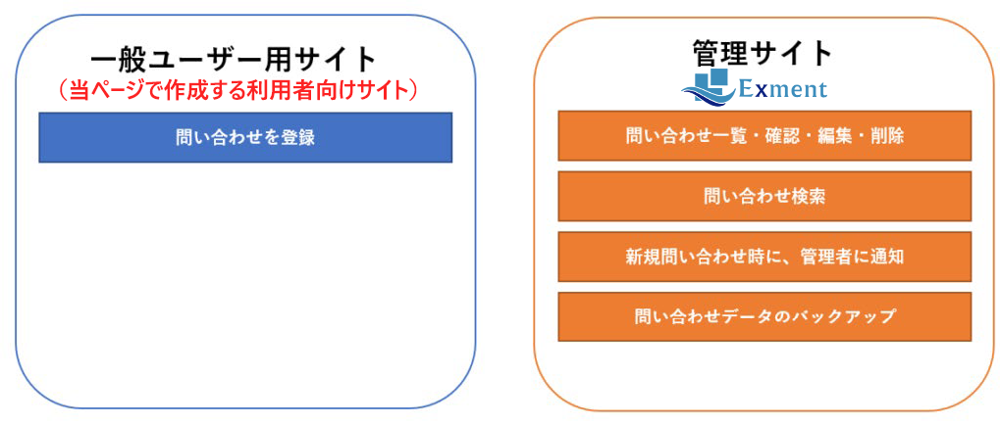
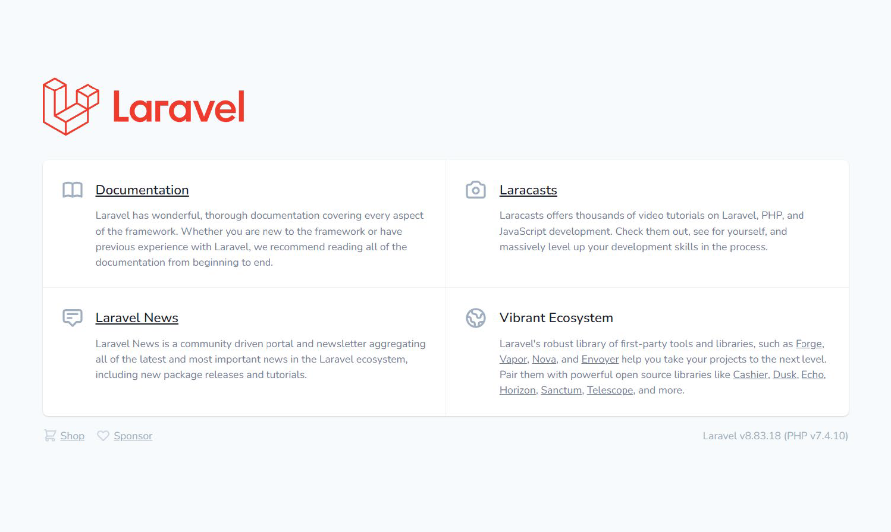
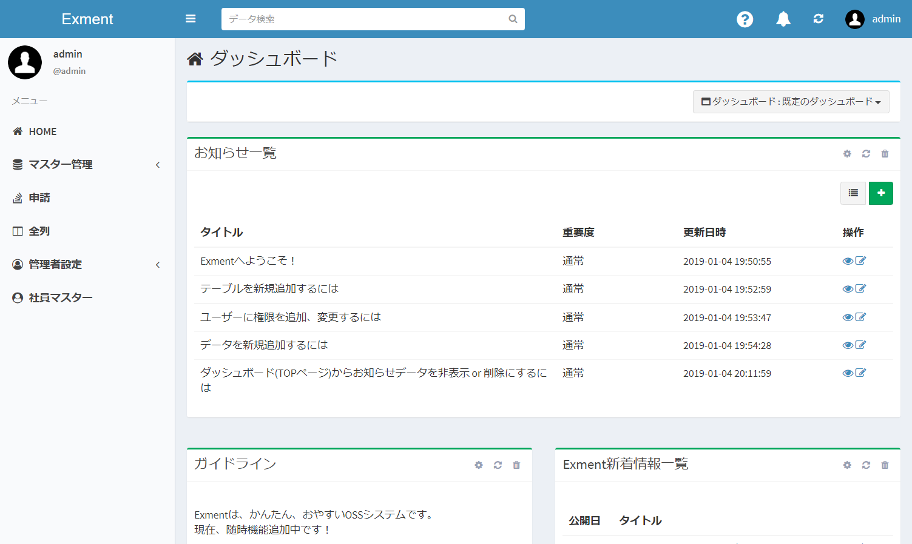
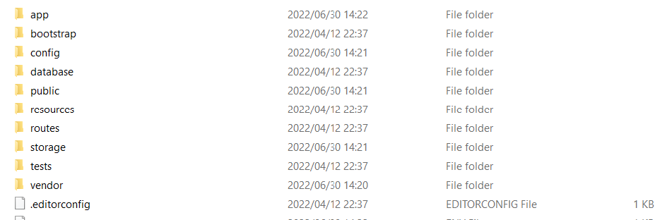
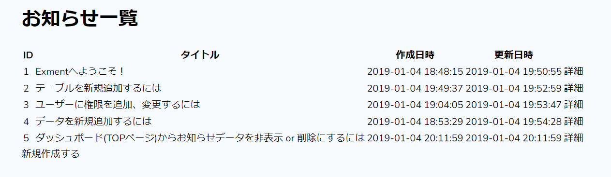
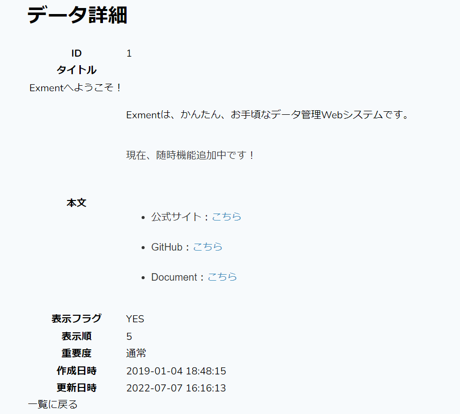
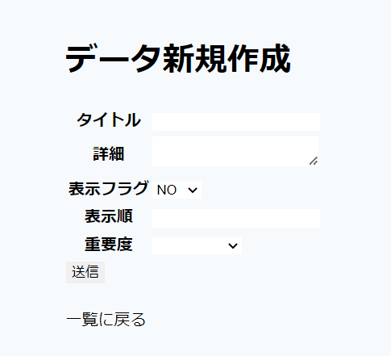
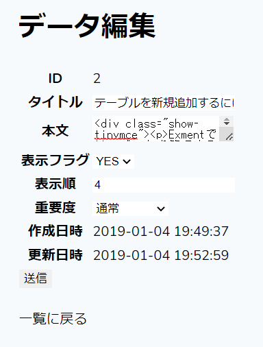
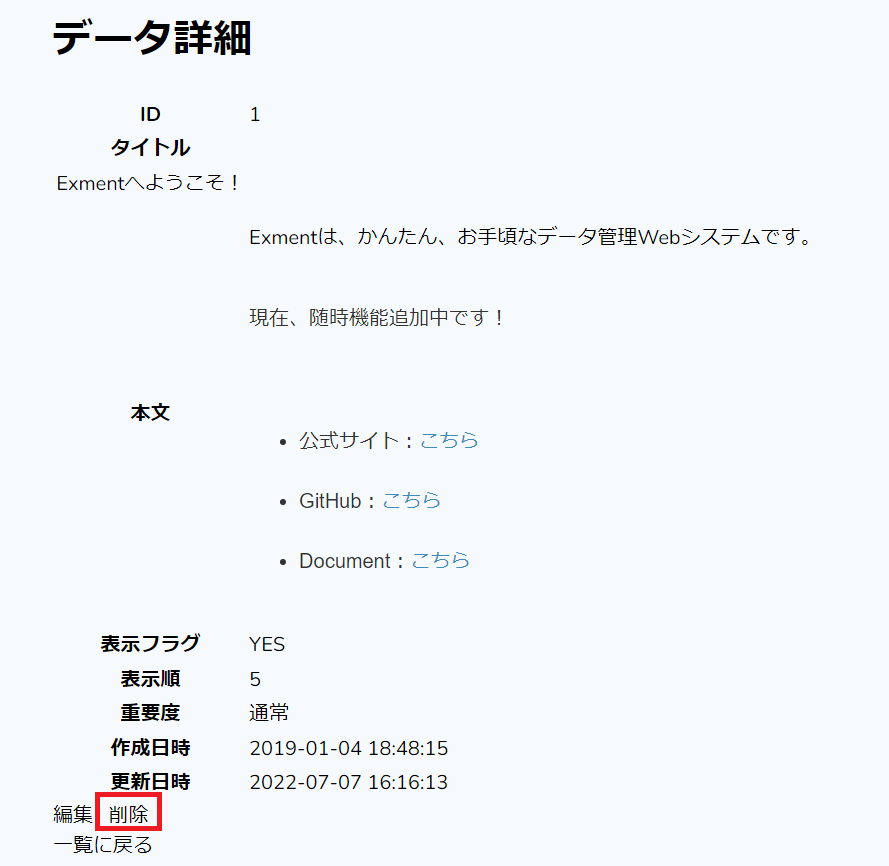

# 利用者向けサイト構築

Exmentでは、エンドポイントを変えることによって、Exmentサイトの他に、開発者が独自に開発した一般ユーザー向けサイトを構築することが出来ます。  

今回当マニュアルで作成するページは、以下のものです。  
・お知らせデータの一覧  
・お知らせデータの詳細表示  
・お知らせデータの新規作成  
・お知らせデータの編集  
・お知らせデータの削除  

## アクセス確認
利用者向けサイトは、Exment構築後であってもアクセス出来ます。  
URL末尾に「/admin」を付与することで管理者サイト(Exment)に、「/」で利用者向けサイトにアクセスします。  

■エンドポイント「/」

■エンドポイント「/admin」

## ページ作成
利用者向けサイトは、基本的に一般的なLaravelによるシステム開発と同じ構成・手順で開発していきます。  
Laravelのルートフォルダ構成です。この内、主に以下のフォルダに対し、phpファイルを作成していきます。  
・app/Http/Controllers：コントローラー  
・routes：エンドポイント情報  
・resources/views：ビューを作成。blade記法に倣って作成する  
・public：css、js、画像など

#### routes：ルーティング
routes/web.phpにて、以下のように今回作成する一覧ページのルーティングを記載します。  
※その他のルーティング記法は[こちら](https://readouble.com/laravel/8.x/ja/routing.html)

~~~
<?php

use Illuminate\Support\Facades\Route;

/*
|--------------------------------------------------------------------------
| Web Routes
|--------------------------------------------------------------------------
|
| Here is where you can register web routes for your application. These
| routes are loaded by the RouteServiceProvider within a group which
| contains the "web" middleware group. Now create something great!
|
*/

//Route::get('/', function () {
//    return view('welcome');
//});

///// 一覧ページ
Route::get('/', [\App\Http\Controllers\IndexController::class, 'index']);
~~~

#### Controller：コントローラー
app/Http/Controllersフォルダに、IndexController.phpを作成します。  
IndexController.phpにて、以下のように記載します。  
・CustomTable：Exmentの「カスタムテーブル」に該当するModel  
・CustomTable::getEloquent('information')->getValueModel()：Exmentのテーブルのデータ用Model。ユーザーが記入した各データ。  
※その他のコントローラーの記法は[こちら](https://readouble.com/laravel/8.x/ja/controllers.html)

~~~
<?php

namespace App\Http\Controllers;

use Illuminate\Routing\Controller as BaseController;
use Illuminate\Http\Request;
use Exceedone\Exment\Model\CustomTable;

class IndexController extends BaseController
{
    //一覧画面
    public function index(Request $request){
        $items = CustomTable::getEloquent('information')->getValueModel()->get();
        return view('index', [
            'items' => $items,
        ]);
    }
}
~~~

#### view：ビュー
resources/viewに、_layout.blade.phpを作成し、以下のように記載します。  
~~~
<!DOCTYPE html>
<html lang="{{ str_replace('_', '-', app()->getLocale()) }}">
    <head>
        <meta charset="utf-8">
        <meta name="viewport" content="width=device-width, initial-scale=1">

        <title>Laravel</title>

        <!-- Fonts -->
        <link href="https://fonts.googleapis.com/css2?family=Nunito:wght@400;600;700&display=swap" rel="stylesheet">

        <!-- Styles -->
        

        
    </head>
    <body class="antialiased">
        

            @if (Route::has('login'))
                

                    @auth
                        <a href="{{ url('/home') }}" class="text-sm text-gray-700 dark:text-gray-500 underline">Home</a>
                    @else
                        <a href="{{ route('login') }}" class="text-sm text-gray-700 dark:text-gray-500 underline">Log in</a>

                        @if (Route::has('register'))
                            <a href="{{ route('register') }}" class="ml-4 text-sm text-gray-700 dark:text-gray-500 underline">Register</a>
                        @endif
                    @endauth
                

            @endif

            <main>
                @yield('content')
            </main>
        

    </body>
</html>

~~~

resources/viewに、index.blade.phpを作成し、以下のように記載します。  
※その他のBladeの記法は[こちら](https://readouble.com/laravel/8.x/ja/blade.html)

~~~
@extends('_layout')

@section('content')
    <h1>お知らせ一覧</h1>
    <table>
        <thead>
            <tr>
                <th>ID</th>
                <th>タイトル</th>
                <th>作成日時</th>
                <th>更新日時</th>
                <th></th>
            </tr>
        </thead>

        <tbody>
        @foreach($items as $item)
            <tr>
                <td>{{$item->id}}</td>
                <td>{{$item->getValue('title', 'html')}}</td>
                <td>{{$item->created_at}}</td>
                <td>{{$item->updated_at}}</td>
                <td><a href="{{asset($item->id)}}">詳細</a></td>
            </tr>
        @endforeach
        </tbody>
    </table>

    

        <a href="{{asset('/create')}}">新規作成する</a>
    

@endsection
~~~

#### 結果表示
ここまでの開発が正常に完了していれば、以下のようにExmentの「お知らせ」テーブルのデータ一覧が表示されます。  
※「新規作成する」「詳細」のリンクは現時点ではまだリンク切れとなります。

#### データ詳細画面作成
データ詳細画面を作成していきます。以下のような追記をしていきます。

routes/web.php
~~~
///// 詳細ページ
Route::get('/{id}', [\App\Http\Controllers\IndexController::class, 'show']);
~~~

app/Http/Controllers/IndexController.php（index関数の下に追記）
~~~
  //詳細画面
    public function show(Request $request, $id){
        $item = CustomTable::getEloquent('information')->getValueModel()->find($id);
        if(!$item){
            return redirect('');
        }
        return view('show', [
            'item' => $item,
        ]);
    }
~~~

resources/views/show.blade.php（新規作成）
~~~
@extends('_layout')

@section('content')
    <h1>データ詳細</h1>
    <table>
        <tbody>
            <tr>
                <th>ID</th>
                <td>{{$item->id}}</td>
            </tr>
            <tr>
                <th>タイトル</tr>
                <td>{{$item->getValue('title', 'html')}}</td>
            </tr>
            <tr>
                <th>本文</th>
                <td>{!! $item->getValue('body', 'html') !!}</td>
            </tr>
            <tr>
                <th>表示フラグ</th>
                <td>{!! $item->getValue('view_flg', 'html') !!}</td>
            </tr>
            <tr>
                <th>表示順</th>
                <td>{!! $item->getValue('order', 'html') !!}</td>
            </tr>
            <tr>
                <th>重要度</th>
                <td>{!! $item->getValue('priority', 'html') !!}</td>
            </tr>
            <tr>
                <th>作成日時</th>
                <td>{{$item->created_at}}</td>
            </tr>
            <tr>
                <th>更新日時</th>
                <td>{{$item->updated_at}}</td>
            </tr>
        </tbody>
    </table>

    

        <a href="{{asset('/')}}">一覧に戻る</a>
    

@endsection
~~~

#### 結果表示
開発が正常に完了していれば、以下のようにExmentの「お知らせ」テーブルの、指定のIDのデータ詳細が表示されます。

#### データ新規作成画面
データ新規作成画面を作成していきます。以下のような追記をしていきます。

routes/web.php（詳細ページより上に記載する）
~~~
///// 新規作成ページ
Route::get('/create', [\App\Http\Controllers\IndexController::class, 'create']);
Route::post('/', [\App\Http\Controllers\IndexController::class, 'store']);
~~~

app/Http/Controllers/IndexController.php（show関数の下に追記）
~~~
    //新規画面
    public function create(Request $request){
        return view('create');
    }

    //新規登録実施
    public function store(Request $request){
        //データ保存のModel作成
        $custom_value = CustomTable::getEloquent('information')->getValueModel();

        //値のセット
        $custom_value->setValueStrictly([
            'title' => $request->get('title'),
            'body' => $request->get('body'),
            'view_flg' => $request->get('view_flg'),
            'order' => $request->get('order'),
            'priority' => $request->get('priority'),
        ]);

        //データ保存
        $custom_value->save();

        //該当のデータへリダイレクト
        return redirect($custom_value->id);
    }
~~~

resources/views/create.blade.php（新規作成）
~~~
@extends('_layout')

@section('content')
    <h1>データ新規作成</h1>

    <form method="post" action="{{asset('/')}}">
        @csrf
        <table>
            <tbody>
                <tr>
                    <th>タイトル</th>
                    <td><input type="text" name="title" value="{{old('title')}}" /></td>
                </tr>
                <tr>
                    <th>詳細</th>
                    <td><textarea name="body" value="{{old('body')}}"></textarea></td>
                </tr>
                <tr>
                    <th>表示フラグ</th>
                    <td>
                        <select name="view_flg">
                            <option value="0" selected>NO</option>
                            <option value="1">YES</option>
                        </select>
                    </td>
                </tr>
                <tr>
                    <th>表示順</th>
                    <td><input type="number" name="order" value="{{old('order')}}"></input></td>
                </tr>
                <tr>
                    <th>重要度</th>
                    <td>
                        <select name="priority">
                            <option value="{{old('priority')}}" selected></option>
                            <option value="1">非常に低い</option>
                            <option value="2">低い</option>
                            <option value="3">通常</option>
                            <option value="4">高い</option>
                            <option value="5">非常に高い</option>
                        </select>
                    </td>
                </tr>
            </tbody>
        </table>

        <button type="submit">送信</button>
          
        
        

            <a href="{{asset('/')}}">一覧に戻る</a>
        

    </form>
@endsection
~~~

#### 結果表示
開発が正常に完了していれば、以下のようにExmentの「お知らせ」テーブルにデータを追加するページが表示されます。

#### データ編集画面
データ編集画面を作成していきます。以下のような追記をしていきます。

routes/web.php（詳細ページより上に記載する）
~~~
///// 編集ページ
Route::get('/edit/{id}', [\App\Http\Controllers\IndexController::class, 'edit']);
Route::put('/{id}', [\App\Http\Controllers\IndexController::class, 'update']);
~~~

app/Http/Controllers/IndexController.php（store関数の下に追記）
~~~
 // 編集画面
    public function edit(Request $request, $id){
        $item = CustomTable::getEloquent('information')->getValueModel()->find($id);
        if(!$item){
            return redirect('');
        }
        return view('edit', [
            'item' => $item,
        ]);
    }

    // 編集実施
    public function update(Request $request, $id){
        // データ保存のModel作成
        $custom_value = CustomTable::getEloquent('information')->getValueModel()->find($id);

        // 値のセット
        $custom_value->setValueStrictly([
            'title' => $request->get('title'),
            'body' => $request->get('body'),
            'order' => $request->get('order'),
            'view_flg' => $request->get('view_flg'),
            'priority' => $request->get('priority'),
        ]);

        // データ保存
        $custom_value->save();

        // 該当のデータへリダイレクト
        return redirect($custom_value->id);
    }
~~~

resources/views/edit.blade.php（新規作成）
~~~
@extends('_layout')

@section('content')
    <h1>データ編集</h1>

    <form method="post" action="{{asset('/' . $item->id)}}">
        @csrf
    <table>
        <tbody>
            <tr>
                <th>ID</th>
                <td>{{$item->id}}</td>
            </tr>
            <tr>
                <th>タイトル</th>
                <td><input type="text" name="title" value="{{old('title', $item->getValue('title', 'html'))}}" /></td>
            </tr>
            <tr>
                <th>本文</th>
                <td>
                    <textarea name="body">{{old('body', $item->getValue('body', 'html'))}}</textarea>
                </td>
            </tr>
            <tr>
                <th>表示フラグ</th>
                <td>
                    <select name="view_flg">
                    <option value="{{old('view_flg', $item->getValue('view_flg', 'html'))}}" selected>{{old('view_flg', $item->getValue('view_flg', 'html'))}}</option>
                            <option value="0">NO</option>
                            <option value="1">YES</option>
                    </select>
                </td>
            </tr>
            <tr>
                <th>表示順</th>
                <td>
                    <input type="number" name="order" value="{{old('order', $item->getValue('order', 'html'))}}"></input>
                </td>
            </tr>
            <tr>
                <th>重要度</th>
                <td>
                    <select name="priority">
                            <option value="{{old('priority', $item->getValue('priority', 'html'))}}" selected>{{old('priority', $item->getValue('priority', 'html'))}}</option>
                            <option value="1">非常に低い</option>
                            <option value="2">低い</option>
                            <option value="3">通常</option>
                            <option value="4">高い</option>
                            <option value="5">非常に高い</option>
                        </select>
                </select>
                </td>
            </tr>
            <tr>
                <th>作成日時</th>
                <td>{{$item->created_at}}</td>
            </tr>
            <tr>
                <th>更新日時</th>
                <td>{{$item->updated_at}}</td>
            </tr>
        </tbody>
    </table>

        <button type="submit">送信</button>
          
        @method('PUT')
    </form>

    
    

        <a href="{{asset('/')}}">一覧に戻る</a>
    

@endsection
~~~

resources/views/show.blade.php（一覧に戻る のdivタグの上に追加）
~~~
    

        <a href="{{asset('/edit/' . $item->id)}}">編集</a>  
    

~~~

resources/view/index.blade.php（td タグの中身を書き換え）
~~~
<td><a href="{{asset($item->id)}}">詳細</a>&nbsp;&nbsp;<a href="{{asset('edit/'.$item->id)}}">編集</a></td>
~~~

#### 結果表示

#### データ削除画面
データ削除画面を作成していきます。以下のような追記をしていきます。

routes/web.php
~~~
///// 削除
Route::get('/delete/{id}', [\App\Http\Controllers\IndexController::class, 'delete']);
~~~

app/Http/Controllers/IndexController.php（update関数の下に追記）
~~~
// 削除実施
    public function delete(Request $request, $id){
        // データ保存のModel作成
        $custom_value = CustomTable::getEloquent('information')->getValueModel()->find($id);

        // データ削除
        $custom_value->delete();

        // 該当のデータへリダイレクト
        return redirect('/');
    }
~~~

resources/views/show.blade.php（１つ目の div タグの中身を書き換え）
~~~
    

        <a href="{{asset('/edit/' . $item->id)}}">編集</a>
        &nbsp;&nbsp;<a href="{{asset('/delete/' . $item->id)}}">削除</a>
    

~~~

resources/view/index.blade.php（td タグの中身を書き換え）
~~~
<td><a href="{{asset($item->id)}}">詳細</a>&nbsp;&nbsp;<a href="{{asset('edit/'.$item->id)}}">編集</a>&nbsp;&nbsp;<a href="{{asset('/delete/' . $item->id)}}">削除</a></td>
~~~

#### 結果表示
