# 公開フォーム設定
一般ユーザー（ログインしていないユーザー）がデータを入力できる、公開フォームを設定することができます。  
  
通常の[データフォーム画面](/ja/data_form.md)は、Exmentの管理ページにID・パスワードを入力してログインする必要がありますが、公開フォームでは、ID・パスワードによるログインを行う必要なく、ユーザーにデータを入力させることができます。  
これにより、アンケートや問い合わせフォーム、申請フォームなどを作成し、URLを共有して、公開することが出来ます。  

## 公開フォーム設定の仕様について

<span class="red bold">公開フォーム設定より入力したデータは、公開フォーム設定を登録したユーザーが、作成ユーザー・更新ユーザーとして登録されます。</span>  
また、データ入力画面では、動的に他テーブルの選択肢を取得したり検索したりすることがありますが、その際の役割・権限も、公開フォーム設定を登録したユーザーとして扱います。  
  
そのため、システム管理者が公開フォームを登録することは、あまり推奨しません。  
後述の「<a href="#/ja/publicform?id=role_user">公開フォーム設定を行うユーザー・役割グループ設定</a>」の手順で、ユーザー・役割グループを設定することを推奨します。   
  
また、以下のテーブルは、公開フォームの対象外です。  
- 「ユーザー」や「組織」などのマスターテーブル
- テーブル設定で「1件のみ登録可能」にしているテーブル


## 設定の流れ
以下の流れで、公開フォームを設定します。

1. コマンド実行します。(Google reCAPTCHAを使用する場合)

2. システム設定画面で、公開フォーム設定を有効にします。

3. [カスタムフォーム設定](/ja/form)を行い、フォームに表示する項目・見出しなどの情報を設定します。

4. 公開フォーム設定を行うユーザー・役割グループを設定します。

5. 本ページの公開フォーム設定を行い、公開するフォームの選択、色、Googleアナリティクスなどの情報を設定します。

6. URLが発行されるので、公開します。

## 設定手順

### 1. コマンド実行
公開フォームで、Google reCAPTCHAを使用する場合にのみ、実行します。  
プロジェクトのルートフォルダで、以下のコマンドを実行してください。  

```
composer require arcanedev/no-captcha=^10.1
```

### 2. システム設定画面
- [システム設定画面](/ja/system_setting)の「STEP2 詳細設定」に遷移し、「公開フォームを使用する」をYESにします。  
※既定ではNOになっています。これは、公開フォームを使用したい環境でのみ、公開フォームを使用できるようにするためです。  

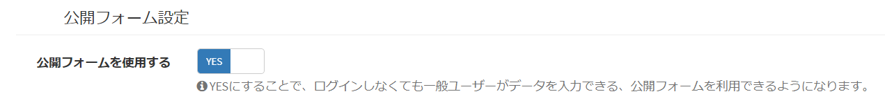

- Google reCAPTCHAを使用したい場合には、「Google reCAPTCHA」の項目を、V2もしくはV3に設定してください。  
選択後、Google reCAPTCHAのサイトキーとシークレットキー項目が表示されるので、[Google reCAPTCHAの管理ページ](http://www.google.com/recaptcha/admin)よりコピーした値を設定してください。  
※設定後、各公開フォーム設定画面で、Google reCAPTCHAを使用するかどうかを選択します。

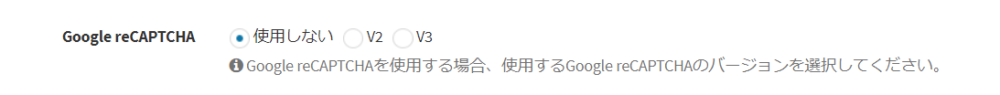


### 3. カスタムフォーム設定
- [カスタムフォーム設定](/ja/form)を行い、フォームに表示する項目・見出しなどの情報を設定します。この手順は、基本的に、通常のフォーム設定と同様です。


<h3 id="role_user"><a href="#/ja/publicform#role_user" data-id="role_user" class="anchor"><span>4. 公開フォーム設定を行うユーザー・役割グループ設定</span></a></h3>
公開フォーム設定を行うユーザー・役割グループを設定します。  
公開フォームから登録されたデータは、このユーザーで登録・更新したものとして扱います。

- [役割グループ設定](/ja/role_group)を新規作成します。
    - 「公開フォーム管理」権限を追加します。
	- 公開フォームを設定したいテーブルに対し、編集権限を追加します。
    - ならびに、その公開フォームでアクセスさせるテーブルの、閲覧権限も追加します。  

- 例：「お問い合わせ」テーブルの公開フォームを設定予定で、お問い合わせテーブルでは、すべての「製品」「カテゴリ」テーブルへの参照を行っている場合：  
    - 「お問い合わせ」テーブルに「公開フォーム管理」「担当者データの編集」権限
    - 「製品」「カテゴリ」テーブルに「すべてのデータの閲覧」権限

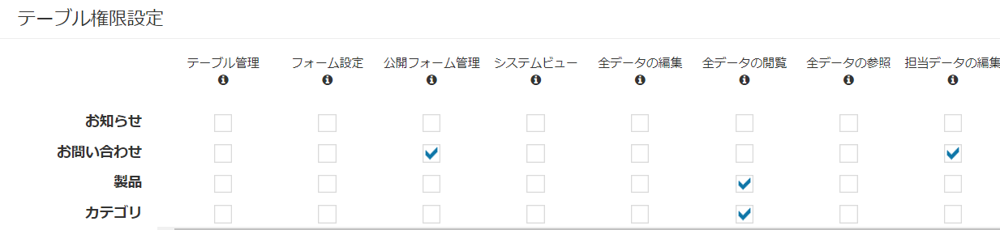

- 公開フォームを管理するユーザーを追加します。
    - 役割グループは、上記で作成した役割グループを選択します。

- 上記で作成したユーザーでログインを行い、公開フォーム設定画面を表示し、公開フォームを登録してください。


### 5. 公開フォーム設定

- カスタムテーブル一覧で、設定を行いたいテーブルにチェックを1つ入れ、右上の「テーブル詳細設定」をクリックします。  

- もしくは、メニューから設定を行いたいテーブルを選択した後、同様に右上の「テーブル詳細設定」をクリックします。  
※該当のテーブルをメニューに表示する設定があらかじめ必要です。  

- 表示されたテーブル詳細設定の画面で、フォーム設定のアイコンをクリックします。


- フォーム一覧画面の下部に、「公開フォーム設定」ボックスが追加されています。  
このボックス内の「＋新規」ボタンをクリックして、設定を行っていきます。

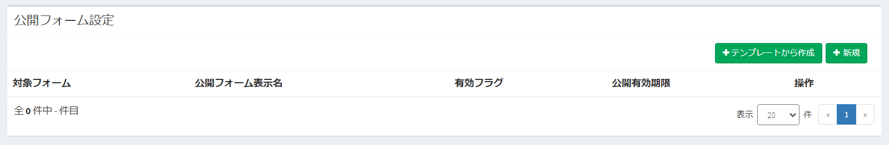

- 公開フォーム設定画面に遷移します。各項目を設定していきます。

#### 設定内容 - 基本設定
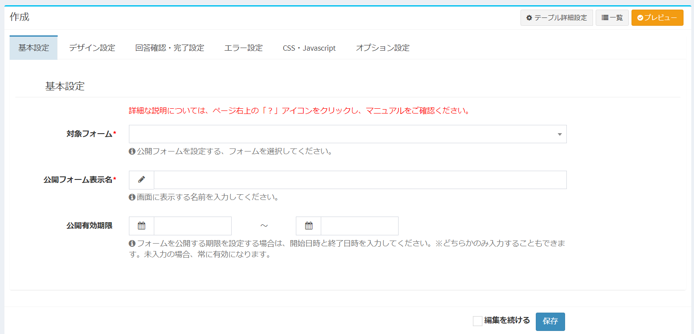

- ##### 対象フォーム
公開フォームとして設定するフォームを選択します。上記の「カスタムフォーム設定」で作成したフォームを選択してください。

- ##### 公開フォーム表示名
一覧画面などで表示する表示名を入力してください。

- ##### 公開有効期限
フォームを公開する期限を設定する場合は、開始日時と終了日時を入力してください。  
※「開始日時」もしくは「終了日時」のみ入力することもできます。どちらも未入力の場合、常に有効になります。  
※公開有効期限外の場合、この公開フォームが使用できなくなります。


#### 設定内容 - デザイン設定
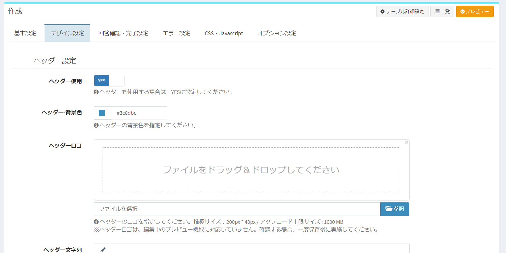

ヘッダー、フォームレイアウト、フッターの色や文言、画像を設定します。  


#### 設定内容 - 回答確認・完了設定
ユーザーがフォームに値を入力後の、回答確認画面・完了画面の設定を行います。

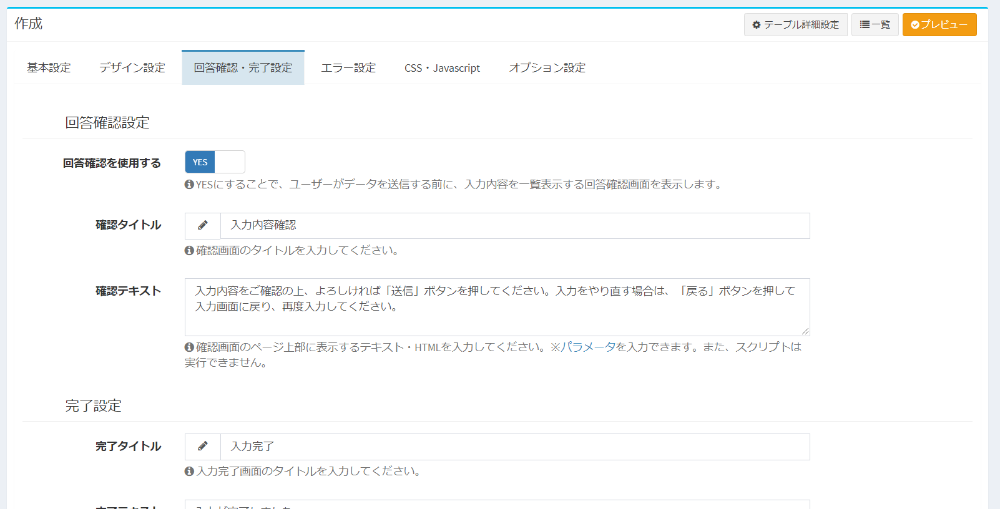

- ##### 回答確認を使用する
YESの場合、ユーザーの入力遷移が以下のような流れになります。

```
入力画面 → 確認画面 → 完了画面(データ登録)
```

※NOの場合、ユーザーの入力遷移が以下のような流れになります。

```
入力画面 → 完了画面(データ登録)
```

- ##### 確認タイトル
回答確認画面の確認タイトルの文言を入力してください。

- ##### 確認テキスト
確認画面のページ上部に表示するテキスト・HTMLを入力してください。  
※[パラメータ](/ja/params)を入力できます。また、スクリプトは実行できません。


- ##### 完了タイトル
完了画面のタイトルの文言を入力してください。

- ##### 完了テキスト
完了画面のページ上部に表示するテキスト・HTMLを入力してください。  
※[パラメータ](/ja/params)を入力できます。また、スクリプトは実行できません。

- ##### 完了リンク先URL
完了画面に、リンクを表示することができます。入力後に別画面に遷移させたい場合に、入力後のURLを入力してください。  
※「完了リンク先テキスト」の入力がなかった場合、こちらで入力したURLが、リンクのテキストとしても表示されます。

- ##### 完了リンク先テキスト
完了画面に、リンクを表示することができます。入力後に別画面に遷移させたい場合に、リンクとして画面に表示する文言を入力してください。  


#### 完了通知(一般ユーザー)
データを入力した一般ユーザーに、登録完了後、メールを送信することができます。  
※システムにログインしていない一般のユーザー向けの通知のため、通知方法はEメール送信のみになります。  
また、通知先は、一般ユーザーが記入したEメールアドレスのみになります。

- ##### 完了通知を一般ユーザーに行う
YESをにすることで、完了通知が有効になります。 

- ##### 通知テンプレート
一般ユーザーに送付するテンプレートを選択してください。テンプレートを新規作成する場合、事前に通知テンプレート画面にて、新規テンプレートを作成してください。

- ##### 通知対象
通知対象となるメールアドレスが設定されている、カスタム列を選択してください。  
例：入力項目に、「返信先メールアドレス」列がある場合、この列を通知対象に選択することで、データ入力完了後に、そのメールアドレスに通知が送信されます。  


#### 完了通知(管理者)
データ入力完了後、管理者に通知を送信することができます。  
※「管理者」と記入していますが、管理者ならびにExmentに登録しているユーザー、Slackなどに通知を行うことも可能です。

- ##### 完了通知を管理者に行う
YESをにすることで、完了通知が有効になります。 

- ##### 通知テンプレート
管理者に送付するテンプレートを選択してください。テンプレートを新規作成する場合、事前に通知テンプレート画面にて、新規テンプレートを作成してください。

- ##### 通知対象
通知対象を選択してください。  
※通知対象の項目や設定方法は、[通知アクション設定](/ja/notify#通知アクション設定)をご確認ください。


#### 設定内容 - エラー設定
エラーが発生した場合の制御を行います。

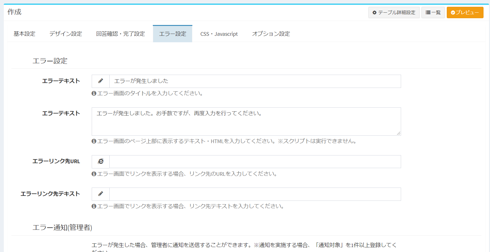


- ##### エラータイトル
エラー画面のタイトルの文言を入力してください。

- ##### エラーテキスト
エラー画面のページ上部に表示するテキスト・HTMLを入力してください。  

- ##### エラーリンク先URL
エラー画面に、リンクを表示することができます。入力後に別画面に遷移させたい場合に、入力後のURLを入力してください。  
※「エラーリンク先テキスト」の入力がなかった場合、こちらで入力したURLが、リンクのテキストとしても表示されます。

- ##### エラーリンク先テキスト
エラー画面に、リンクを表示することができます。入力後に別画面に遷移させたい場合に、リンクとして画面に表示する文言を入力してください。  

#### エラー通知
エラーが発生した場合に、管理者に通知を行うことができます。

- ##### エラー通知を行う
YESの場合、エラーが発生した場合に、管理者に通知を行うことができます。

- ##### 通知テンプレート
管理者に送付するテンプレートを選択してください。テンプレートを新規作成する場合、事前に通知テンプレート画面にて、新規テンプレートを作成してください。

- ##### 通知対象
通知対象を選択してください。  
※通知対象の項目や設定方法は、[通知アクション設定](/ja/notify#通知アクション設定)をご確認ください。


#### CSS・Javascript
独自のCSSならびにJavascriptを追加することができます。

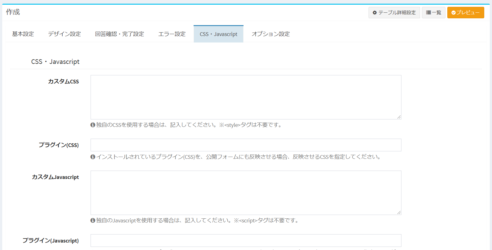

- ##### カスタムCSS
独自のCSSを使用する場合は、記入してください。※&lt;style&gt;タグは不要です。cssの中身のみ記入してください。

- ##### プラグイン(CSS)
インストールされているプラグイン(CSS)を、公開フォームにも反映させる場合、反映させるCSSを指定してください。

- ##### カスタムJavascript
独自のJavascriptを使用する場合は、記入してください。※&lt;script&gt;タグは不要です。Javascriptの中身のみ記入してください。  
※Javasciptは、以下のjquery内に追加されます。

``` javascript
<script data-exec-on-popstate>
    $(function () {
        (追加したコード)
    });
</script>
```

- ##### プラグイン(Javascript)
インストールされているプラグイン(Javascript)を、公開フォームにも反映させる場合、反映させるJavascriptを指定してください。


#### 設定内容 - オプション設定
その他のオプション設定を行います。

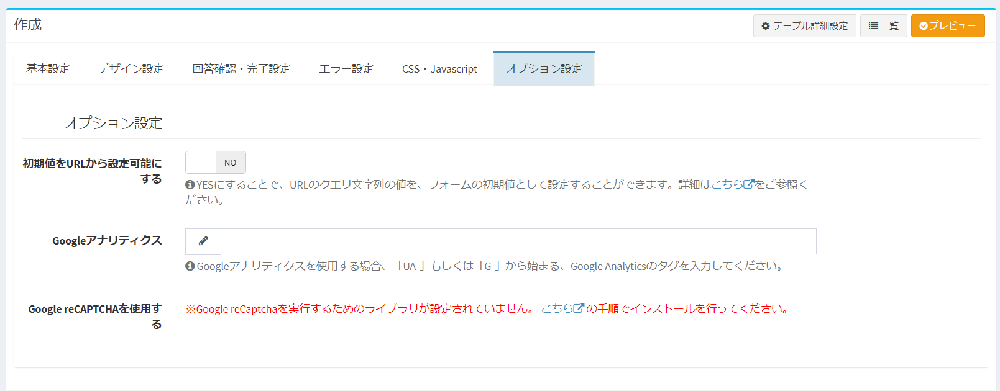

- ##### 初期値をURLから設定可能にする
YESにすることで、URLのクエリ文字列の値を、フォームの初期値として設定することができます。詳細は[こちら](#初期値をURLから設定)をご確認ください。

- ##### Googleアナリティクス
フォームにGoogleアナリティクスを設定する場合、「UA-」もしくは「G-」から始まる、Google Analyticsのタグを入力してください。

- ##### Google reCAPTCHAを使用する
Google reCAPTCHAを使用する場合、YESにしてください。  
※システム設定画面で、Google reCaptchaのキーを入力していた場合のみ、有効になります。


#### プレビュー
- 設定している内容を元に、公開フォームのプレビューを表示することができます。※データを保存していなくてもプレビュー可能です。  

- 画面右上の「プレビュー」ボタンをクリックすることで、別ウィンドウで公開フォームのプレビュー画面が表示されます。  
※javascriptにより、別ウィンドウ表示を実施します。ブラウザ設定によって、ポップアップがブロックされる場合があります。その際は、ブロックを解除し、再度ボタンをクリックしてください。

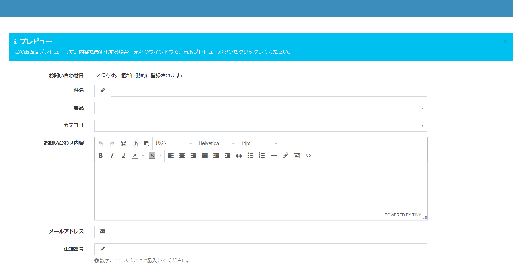

#### 公開フォームを有効化する
- このフォームを有効化し、一般ユーザーでも使用できるようにする場合、ページ右上の「有効化する」ボタンをクリックしてください。  

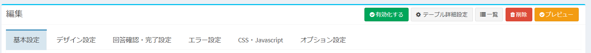

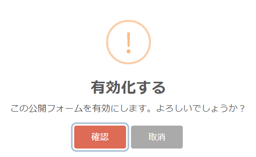


- また、公開しようとしているフォームで、他のテーブルへのアクセスを含んでいる場合は、一般ユーザーが、これらのテーブルのデータを読み取ることが可能になります。  
その場合、以下の画面のような確認メッセージが表示されますので、アクセスするテーブルに問題がないかどうか、ご確認をお願いします。  

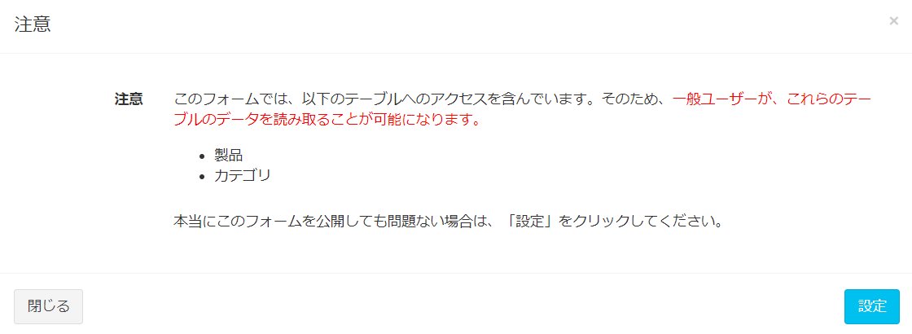

- 「他のテーブルへのアクセス」とは、主に以下のようなものがあります。
    - 公開フォームの列に、列種類「選択肢(他のテーブルの値一覧から選択)」がある場合、選択肢候補として表示、検索などを実施する
    - 公開フォームが1:nの子テーブルの場合、紐付く親テーブルを選択するための選択肢として表示・検索する


#### 保存後、URLなど表示
- 公開フォームを保存することで、基本設定に、以下の項目が追加されます。

- ##### 公開フォームURL
公開フォームのURLが表示されます。このURLをコピーして、ユーザーに配布などを行ってください。  
※項目をクリックすることで、URLをコピーすることができます。

- ##### 実行ユーザー
この公開フォームを登録したユーザーです。この公開フォームは、表示されているユーザーとして実行、データ登録を行います。


### 6. 公開フォーム使用
- 上記でコピーしたURLにアクセスすることで、公開フォームが表示されます。  
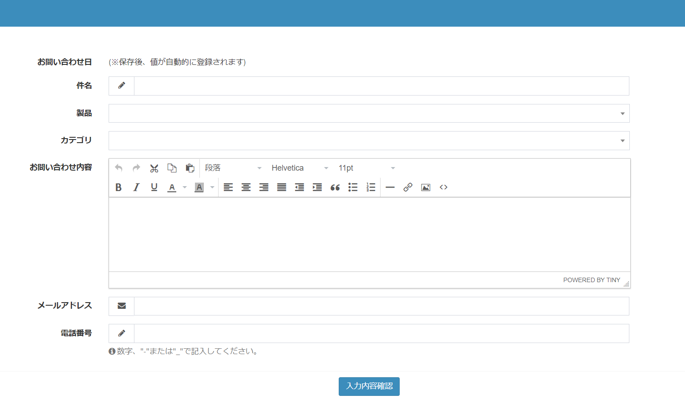

- 公開フォーム設定の「有効フラグ」がNOの場合、有効期間外の場合、URLに誤りがある場合には、以下のような表示になります。  

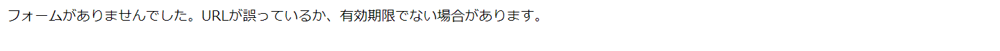


## その他詳細設定

### 初期値をURLから設定
- 設定「初期値をURLから設定可能にする」をYESにした場合、公開フォームにアクセスするためのURLに、項目の初期値を入力することができるようになります。  
会社名やカテゴリなど、URLを共有する相手の初期値が分かっている場合に、あらかじめURLに含めておくことで、入力の負担を減らすことができます。

#### 付与方法
以下のクエリ文字列です。

```
http://(公開フォームまでのURL)?value.(カスタム列名)=(初期値)

複数列に対して設定する場合には、2つ目以降のvalueは & で繋ぎます。
http://(公開フォームまでのURL)?value.(カスタム列名)=(初期値)&value.(カスタム列名)=(初期値)


# 例
http://localhost/publicform/c4f31330-7a75-11eb-a8b0-279816836d79?value.title=こんにちは

http://localhost/publicform/c4f31330-7a75-11eb-a8b0-279816836d79?value.client_name=株式会社ABC&value.category=初期導入
```

- 例：以下のようなフォームがあった場合  

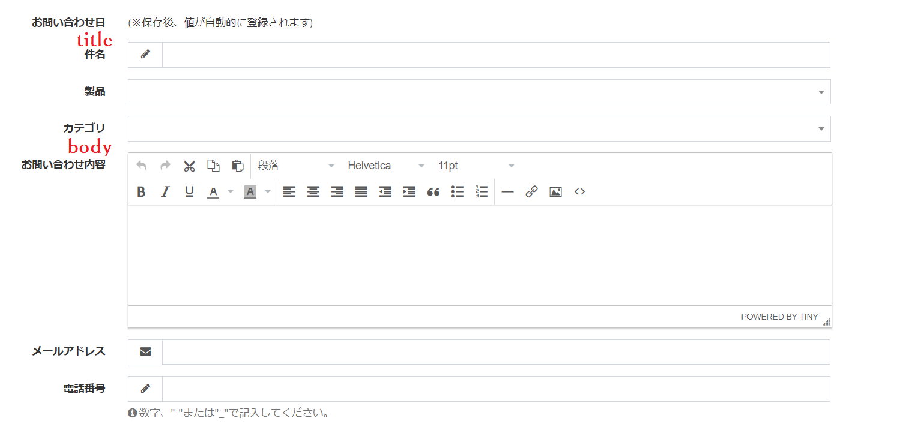

- このフォームのURLに、以下のようなクエリ文字列を追加することで、フォームを開いた時の初期値が設定されます。

```
http://localhost/publicform/ab3d55e4-1afc-d1de-ac1b-bc64c51d4d7d?value.title=問い合わせについて&value.body=こちらは本文です。
```

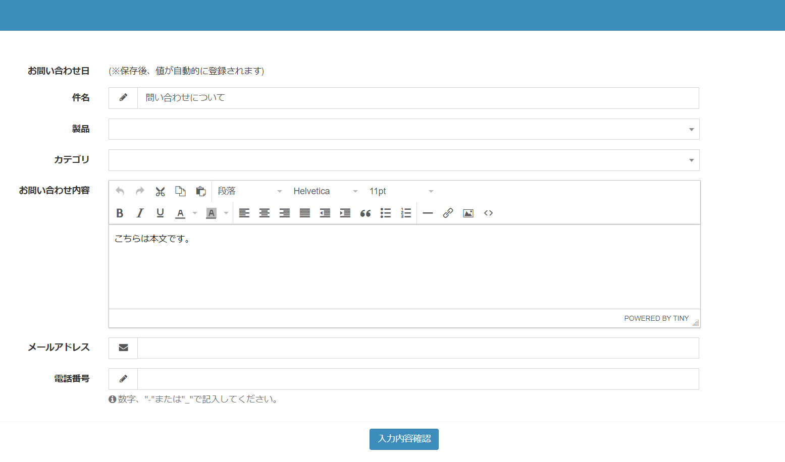


### URLに含む「publicform」の変更
- 公開フォームに付与される、"publicform"文字列を変更するための手順です。  
※この文字列は、すべての公開フォームで統一になります。フォーム毎に変更することはできません。

#### 変更手順

- 変更には、[設定値の変更](/ja/config)を実施します。

- Exmentのルートディレクトリで、「.env」ファイルを開きます。

- 以下の値を追加します。

~~~
### 「publicform」を別の名前に変更する場合
EXMENT_PUBLICFORM_ROUTE_PREFIX=afiewqbfwehghwb
# http://localhost/afiewqbfwehghwb/(UUID) が、公開フォームのURLになる
~~~

※なお、本マニュアルではすべて、URIは「publicform」という前提で記載しておりますので、ご了承ください。


### 公開フォーム特有の仕様
その他、公開フォーム特有の仕様です。  

- カスタム列「選択肢(他のテーブルの値一覧から選択)」「ユーザー」「組織」などで表示される「サーチ」ボタンは、公開フォームでは表示されません。  

- テーブル詳細設定の「通知設定」で登録できる、実施トリガー「データ新規作成」の通知は、公開フォームでは実施されません。  
これは、公開フォーム設定で個別に「一般ユーザー向け」「管理者向け」の通知があり、それらの通知と同時に実施しないようにするためです。