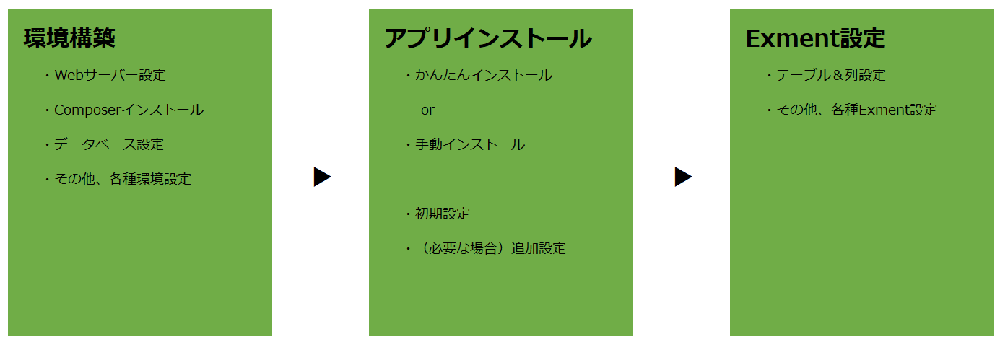

# インストール-概要
Exmentを開始するために必要となる手順です。  

## 注意点
- インストール時にエラーが発生した場合、[トラブルシューティング](/ja/troubleshooting)をご参照ください。
- ※現在、大変申し訳ございませんが、インストール手順やサーバー構築についての個別のお問い合わせは承っておりません。個別対応をご希望の場合、有償のサポートをご希望ください。　　

## 初期設定全体像
Exmentの初期設定を行うためには、主に以下の流れで、環境構築・アプリのインストール・初期設定などを行う必要があります。  
※クリックすることで、画像が拡大されます。
  

## 設定手順
### 1. 環境構築
Exmentの動作させるための環境を構築する必要があります。主に以下の構築を行います。

- Webサーバー設定
- Composerインストール
- データベース設定

構築方法は、[こちら](/ja/server)をご確認ください。

### 2. アプリインストール
Exmentのアプリケーションをインストールします。ならびに、初回のみ必要となるいくつかの手順を実施します。

#### インストール方法
インストール方法は、以下の2種類を用意しております。どちらかを選択してください。

1. **かんたんインストール(推奨)**  
→Web画面に表示される手順に従い、アプリケーションをインストールする手順です。インストール方法は、[こちら](/ja/quickstart_easy)をご確認ください。

1. **手動インストール**  
→コマンドにより、手動でExmentのアプリケーションをインストール手順です。インストール方法は、[こちら](/ja/quickstart_manual)をご確認ください。

#### 初期設定
どちらの方法でも、インストール完了後に、初期設定画面が表示されます。

初期設定方法は、[こちら](/ja/first_setting)をご確認ください。

#### (必要な場合)追加設定
「URLに含む『admin』の変更・削除」、「タスクスケジュール設定」など、一部設定を追加・変更したい場合には、[こちら](/ja/quickstart_more)をご確認ください。

### 3. Exment設定
インストール完了後は、画面に従い、Exment各種設定を行ってください。  
基本的には、まずは[テーブル設定](/ja/table)をおすすめしております。
