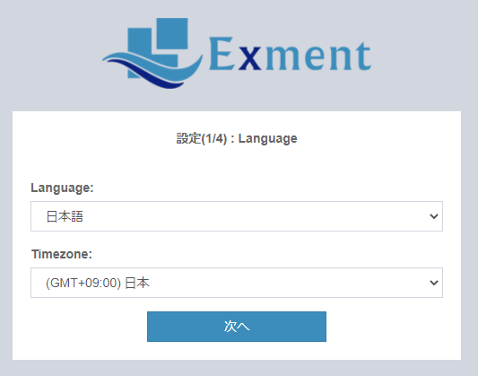
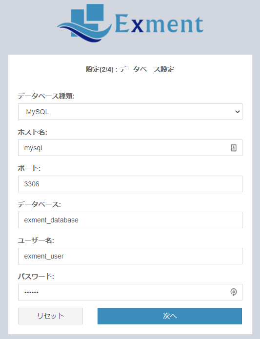

# インストール手順
Exmentを開始するために必要となる手順です。画面で設定を行い、インストールを行うことができます。  

## 注意点
- **Webサーバーを構築していない場合、はじめに[サーバー設定](/ja/server)を行ってください。**  
(「サーバー構築したかどうか分からない」という方も、一度ご確認をお願いします)
- 本インストール方法に失敗した場合、[手動インストール](/ja/quickstart_manual)をご参照ください。
- インストール時にエラーが発生した場合、[インストール時にエラーが発生したら](/ja/install_error)をご参照ください。
- その他お問い合わせは、お気軽にこちらの[無料お問い合わせ](https://exment.net/inquiry)にてお願いいたします。

## サーバー設定
Exmentには、PHP7.1.3以上が必要です。ならびに、MySQL 5.7.8以上8.0.0未満 または MariaDB 10.2.7以上が必要です。  
PHPやApache、MySQLのある環境構築を、開発環境としてはじめから構築する場合、XAMPPをおすすめしております。  
サーバー設定は、[こちら](/ja/install_xampp)をご参照ください。  
※すでに環境がある方は、当設定は不要です。

## composer導入
Exmentには、composerの導入が必要です。導入方法はこちらをご参照ください。  
※すでに導入済の方は不要です。  
- [公式サイト](https://getcomposer.org/download/)
- [Windows版 解説サイト](https://weblabo.oscasierra.net/php-composer-windows-install/)
- [Linux版 解説サイト](https://weblabo.oscasierra.net/php-composer-centos-install/)
- [Mac版 解説サイト](https://weblabo.oscasierra.net/php-composer-macos-homebrew-install/)

## zipダウンロード・展開
- 以下のURLより、zipファイルをダウンロードします。  
[Exment zipファイル](https://exment.net/downloads/ja/exment.zip)  

- zipファイルを、PHP実行可能なパスに展開します。  
例1(XAMPP Windows)： C:\xampp\local\exment  
例2(XAMPP Mac)： /Applications/XAMPP/local/exment  
例3(XServer) : $HOME/domain.com.foobar/exment/  
  
- 各サーバーの公開フォルダ(例linuxの場合 : /var/www/html)直下に、zipファイルをそのまま入れないでください。データベースの設定値や、メールのパスワードなどが記載された設置ファイルなどが外部公開され、致命的な情報流出に繋がります。  
インストール時の手順は、必ず各手順の[サーバー設定](/ja/server)をご確認ください。

## データベース作成
- Exment用のデータベースを、MySQLで作成してください。

## 初期データのインストール
- Exmentページにアクセスして設定を行います。  
例1(XAMPP)： http(s)://(あなたのサイトURL)/admin  

- 言語とタイムゾーン設定を行います。  
必要に応じて初期値から変更してください。  
  

- データベース設定を行います。  
ご利用の環境に応じて以下の内容を変更してください。 
~~~
データベースの種類
データベースのホスト名
データベースのポート番号
Exment用データベース名
Exment用データベースのユーザー名
Exment用データベースのパスワード
~~~  

  
  
- インストール実行をクリックしてください。  
  

## 設定完了
クイックスタートが完了したら、引き続き[初期設定](/ja/first_setting.md)を行ってください。  

## その他の初期設定
以上の作業で、Exmentを開始することは可能ですが、一部の機能を使うために、追加で設定が必要になる場合があります。  
以下のリンクをご確認ください。  
- [追加設定](/ja/quickstart_more)
