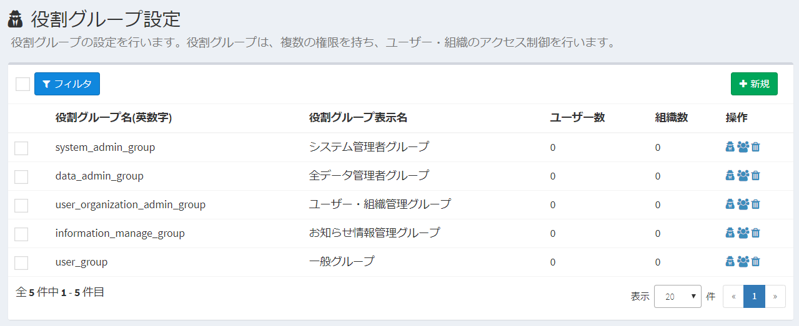
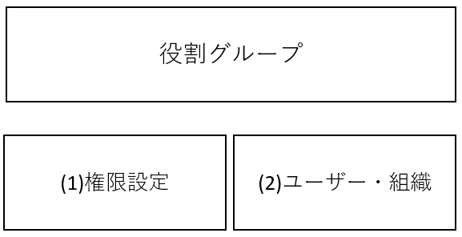
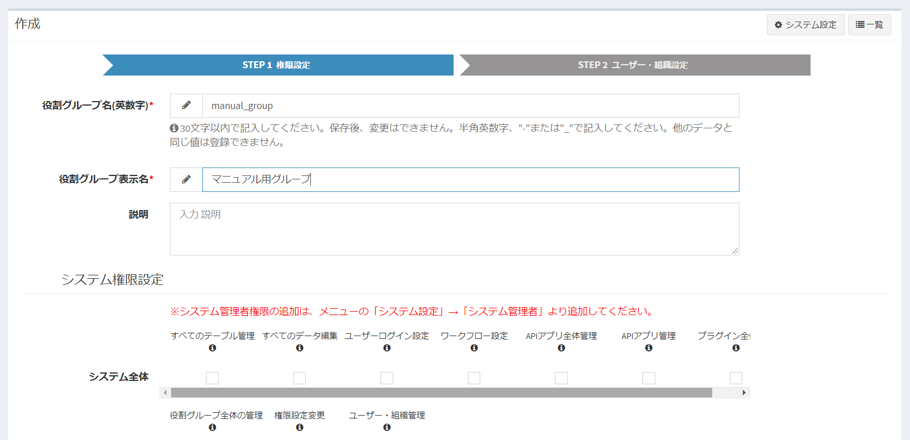
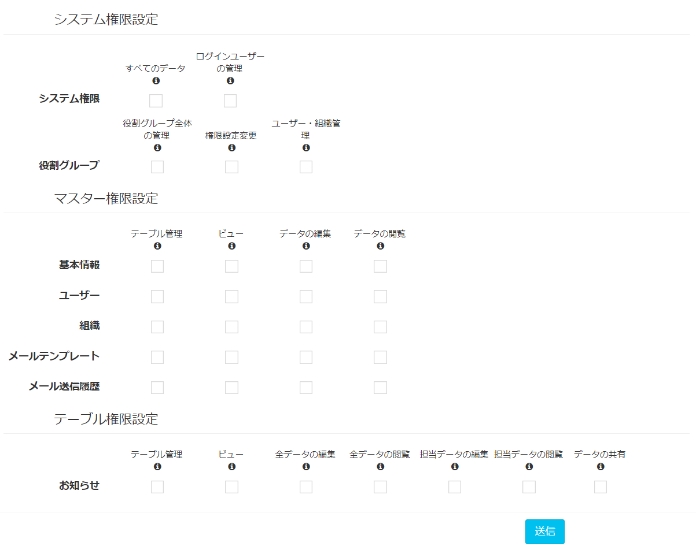
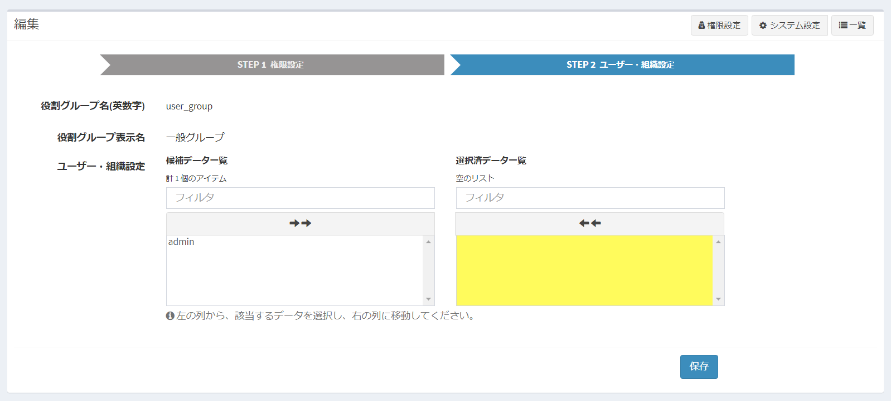

# 役割グループ・権限設定

Exmentでは、システムを操作するための権限を制御するために、「役割グループ」という管理方法を使用します。  
これはExmentにおいて、特定のデータやページを、指定のユーザーのみが管理できるようにするために、重要な考え方です。  

新規にユーザーを追加し、そのユーザーがログインを行った場合、そのログインユーザーは、ほとんどの機能を使用できません。  
システム管理者は、新規追加したユーザーに対し、適切に役割グループを割り振る必要があります。  

> 役割グループの設定を行う前に、[Exmentにおける役割・権限の概要](/ja/permission)ページのご確認を推奨しております。

## 役割グループのイメージ図
Exmentを使用するユーザーの部署や役職によって、各ユーザーに実施させたい内容を制御することができます。  
例えば、以下のような部署や役職で、適切に権限を割り振ることができます。

## 初期役割グループの一覧
インストール時に初期設定されている、役割グループの説明です。

### 全データ管理者グループ
ユーザーが登録した、すべてのテーブルのデータを編集・閲覧可能な役割グループです。

### ユーザー・組織管理グループ
ユーザー・組織情報、ならびにログインユーザーの設定を管理する役割グループです。  
役割グループに所属するユーザー・組織の変更も行うことができます。

### お知らせ情報管理グループ
Exmentに初期インストールされている「お知らせ情報」に、データを新規作成、編集、削除することができる役割グループです。  

### 一般グループ
上記以外のユーザーに登録させるグループです。  
※初期インストールの場合、特に権限は設定されていません。

## 役割グループのデータ構成
役割グループでは、以下のようなデータ構成を持ちます。

### (1)権限設定
権限(パーミッション)とは、Exmentにおける特定の動作を実施してよいかの可否を決めるものです。  
例えば、以下のような権限があります。
##### ログインユーザーの管理   
各ユーザーにログイン権限の付与や、パスワードリセットを行う権限
##### すべてのデータの編集  
特定のテーブル上の、すべてのデータを追加・編集・削除できる権限
##### 担当者データの閲覧
自分が担当者となっているデータの、閲覧ができる権限
権限設定は、役割グループに紐付かれます。

### (2)ユーザー・組織
役割グループに所属するユーザー・組織を設定します。  
この設定を行ったユーザーがログインを行った時、設定されている権限の操作を実行できるようになります。

## 設定方法

### 設定の全体的な流れ
1. 役割グループ名の設定など、役割グループの初期設定を行います。
1. その役割グループで実施できる権限の設定を行います。
1. その役割グループに所属するユーザー・組織の設定を行います。

※システム管理者の設定は、<a href="https://exment.net/docs/#/ja/system_setting">システム設定ページ</a>にて行ってください。

### 一覧
メニューにある「役割グループ」をクリックしてください。  
作成してある役割グループ設定の一覧画面が表示されます。  

### 役割グループ新規作成
役割グループを新規作成する方法です。

- 一覧画面の右上の［新規］ボタンをクリックします。

- 役割グループ新規作成画面が表示されるので、必要事項を入力し、［送信］をクリックします。  

- 保存後、一覧画面が再度表示され、作成した役割が作成されています。

### 権限設定変更方法
権限設定を変更する方法です。

- 役割グループ一覧画面で、作成した役割グループの行をクリックします。  
もしくは、［権限設定］リンクをクリックします。

- 権限設定画面が表示されるので、権限設定を行っていきます。

### 権限の種類と一覧
設定可能な権限の種類を記載します。

#### システム全体
Exment全体の操作を決定することができる権限です。  

##### 権限一覧
- ##### すべてのテーブル管理  
カスタムテーブルの追加や、すべてのカスタムテーブルの変更・削除を行えます。また、カスタムテーブル内のすべてのデータを追加・変更・削除できます。
- ##### すべてのデータ編集  
カスタムテーブル内のすべてのデータを追加・変更・削除できます。
- ##### ユーザーログイン設定  
Exmentにログインするユーザーを管理できます。ログイン権限の付与や、パスワードリセットなどを行うことができます。
- ##### ワークフロー設定  
ワークフローの設定を変更できます。
- ##### APIアプリ全体管理  
すべてのAPIアプリを追加・変更・削除できます。
- ##### APIアプリ管理  
自分が作成したAPIアプリのみ追加・変更・削除できます。※他のユーザーが作成したAPIアプリは閲覧・追加・変更・削除できません。
- ##### プラグイン全体管理
すべてのプラグインを追加・変更・削除できます。また、プラグインを利用できます。

#### 役割グループ
役割グループの操作を決定することができる権限です。  

##### 権限一覧
- ##### 役割グループ全体の管理  
役割グループ全体の設定を変更できます。グループの追加・変更・削除、グループの権限設定変更、ユーザー・組織の設定変更ができます。
- ##### 権限設定変更  
役割グループの権限の設定を変更できます。
- ##### ユーザー・組織管理  
役割グループに登録する、ユーザー・組織の設定を変更できます。

#### プラグイン権限設定
Exmentのプラグインへのアクセス権限を割り振ることができます。  
  
##### 権限一覧
- ##### 設定変更
設定変更をもつプラグインの場合、このプラグインの設定を変更できます。  
※プラグインの削除やアップロードはできません。削除を行う場合、「プラグイン全体管理」を追加してください。

- ##### 利用・アクセス
プラグインを実際に利用したり、ページにアクセスすることができます。プラグインの種類によって、制御内容が異なります。

- **ボタン、ドキュメント出力** ： 画面上に表示するボタンの表示・非表示が制御されます。
- **ページ、ダッシュボード** ： ページへのアクセス可否が切り替わります。
- **API** ： APIの実行可否が切り替わります。(アクセス不可の場合、403エラーが発生します。)
- **インポート、エクスポート** ： データのインポート・エクスポートの実行可否が制御されます。
- **それ以外** : 役割グループによって制御を行うことはできません。すべてのユーザーに対し実行されます。
    

#### マスター権限設定
Exmentのマスターデータを管理するためのテーブル権限を割り振ることができます。  
  
##### 権限一覧
- ##### マスター管理  
マスターの定義を変更できます。また、マスターデータを追加・編集・削除できます。
- ##### システムビュー  
指定したカスタムテーブルの、システムビューを管理することができます。  
- ##### データの編集  
マスターデータを追加・編集・削除できます。
- ##### データの閲覧  
マスターデータを閲覧できます。※データの編集・削除はできません。

#### テーブル権限
Exmentでは、データを管理するためのテーブルを作成する事ができます。  
そのテーブルごとに、権限を割り振ることができます。  
例えば、以下のような利用方法があります。  
- 営業部のユーザーは、テーブル「営業活動」のすべてのデータを編集・閲覧することができる。
- 技術部のユーザーは、テーブル「技術管理」のすべてのデータを編集・閲覧することができる。
- パートナー会社のユーザーは、テーブル「発注依頼」の、自分に権限があるデータのみ閲覧する事ができる。  
  
##### 権限一覧
- ##### テーブル管理  
指定したカスタムテーブルに対して、テーブル定義やフォームの修正などが可能です。  
また、指定したカスタムテーブル内の、すべてのデータの追加・編集・削除が可能な権限です。
- ##### システムビュー  
指定したカスタムテーブルの、システムビューを管理することができます。  
- ##### 全データの編集  
指定したカスタムテーブル内の、すべてのデータの追加・編集・削除が可能な権限です。
- ##### 全データの閲覧  
指定したカスタムテーブル内の、すべてのデータの閲覧が可能な権限です。  
※データの編集・削除はできません。
- ##### 担当データの編集  
指定したカスタムテーブル内の、ログインユーザー自身が担当者に設定されているデータの追加・編集・削除が可能な権限です。  
- ##### 担当データの閲覧  
指定したカスタムテーブル内の、ログインユーザー自身が担当者に設定されているデータの閲覧が可能な権限です。  
※データの編集・削除はできません。
- ##### データの共有  
自分が編集権限を持つデータを、他のユーザーや組織に共有することが可能な権限です。  
- ##### 削除データの表示  
論理削除されたデータを再表示することができます。※データの復元には、そのデータに対する編集権限が必要です。  

### ユーザー・組織設定方法
役割グループに所属する、ユーザーならびに組織の設定を変更する方法です。

- 一覧画面で、ユーザーリンクをクリックします。
  
もしくは、権限設定画面の右上の［ユーザー・組織設定］ボタンをクリックします。  
  

- ユーザー・組織設定画面が表示されます。この役割グループに所属する、ユーザー・組織を登録してください。  

### 削除
- 役割グループ一覧画面で、［削除］リンクをクリックします。

### その他

#### 複数の役割グループを追加した場合
任意のユーザーや組織に、複数の役割グループを追加した場合は、それぞれの役割グループに紐付く権限を、すべて結合させます。

- 例：ユーザーA
    - 役割グループX
        - テーブル1
            - 担当データの編集
        - テーブル2
            - 担当データの閲覧
        - テーブル3
            - 全データの閲覧
        
    - 役割グループY
        - テーブル1
            - 全データの閲覧
        - テーブル4
            - 担当データの編集

    - →最終的なユーザーAの権限
        - テーブル1
            - 全データの閲覧
            - 担当データの編集
        - テーブル2
            - 担当データの閲覧
        - テーブル3
            - 全データの閲覧
        - テーブル4
            - 担当データの編集