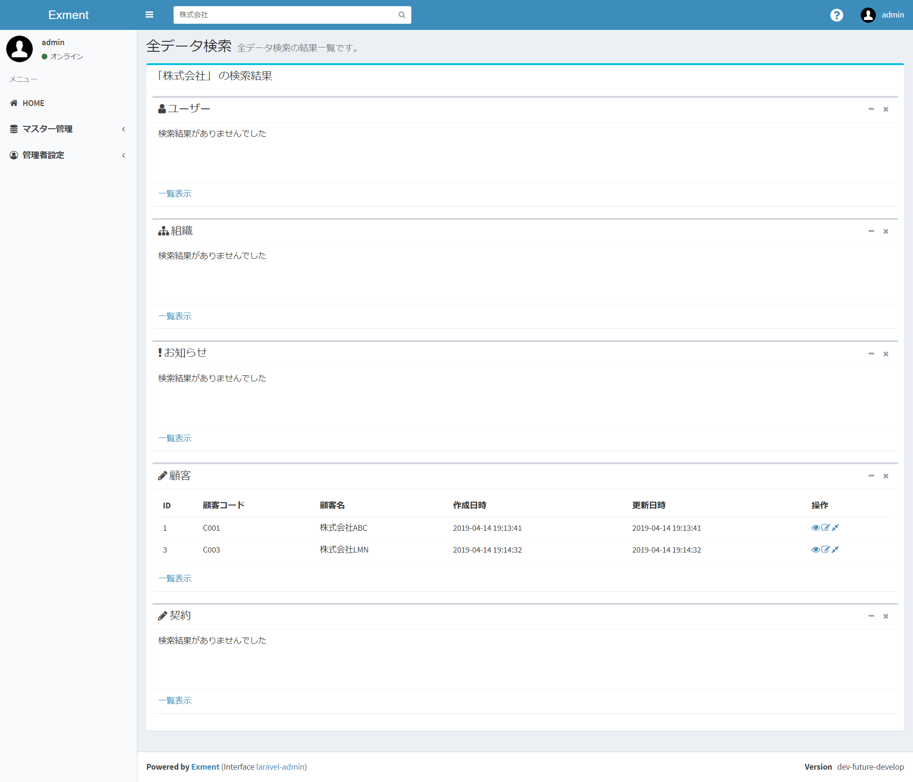
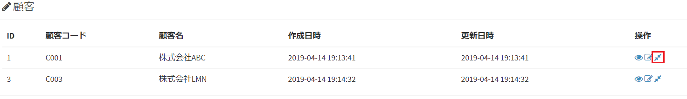

# 検索
各ページの上部には、検索バーが表示されています。  
  
この検索バーに単語を入力することで、Exmentに登録しているデータを検索することができます。  
検索には2種類の機能があります。  

## 単語検索
通常の検索です。入力した単語を含む（前方一致する）データが結果に表示されます。  
  
- 検索対象のテーブルは、カスタムテーブル設定で「検索対象とする」がYESになっているテーブルです。  
- 検索対象となるカスタム列は、カスタム列設定で「検索インデックス」がYESになっている列です。  
※「検索インデックス」がYESになっているカスタム列が1件も存在しないテーブルは、検索結果に表示されません。  
- 検索対象は、ユーザーが閲覧することができる権限のあるテーブルのみです。  
- **※v1.2.0より、デフォルトの設定を前方一致に変更いたしました。**これは検索パフォーマンスの都合です。  
部分一致に変更したい場合、以下の「(補足)データ検索を部分一致に切り替え」をご参照ください。

検索バーに単語を入力し、そのまま検索ボタンをクリックすると、検索が実行されます。  
検索対象となるテーブル一覧が最初に表示され、その後合致するデータを検索します。

検索結果データには、「表示」「編集」「関連データ検索」というアイコンが表示されます。  
    
関連データ検索アイコンをクリックした場合、下記の「関連データ検索」が実行されます。  

## 関連データ検索
関連データ検索が実行されるのは、以下のパターンです。  
- 検索バーに単語を入力し、表示される候補を選択した場合  
  

- 単語検索を実行し、その結果に表示される「関連データ検索」アイコンを選択した場合  
  

関連データ検索とは、そのデータに紐付くデータを検索する機能です。  
例えば「顧客」テーブルがあった場合、その顧客に紐付く「契約」のデータ一覧を表示したい場合があります。  
  
その場合、この「関連データ検索」を行うことで、顧客に紐付く契約データを一覧表示することができます。  
  
関連データ検索は、以下の条件で紐付くデータを一覧表示することができます。  
- カスタム列の「選択肢」で、検索対象で選択したデータを選んでいるデータ(ただし、カスタム列設定で「検索インデックス」がYESになっている必要があります)  
- リレーション設定で、1:nもしくはn:nとして、検索対象で選択したデータを親として登録しているデータ  
  
関連データ検索では、選択したデータそのものと、上記の条件の関連データが一覧で表示されます。  
下記の例では、選択した顧客「株式会社ABC」のデータと、その顧客に関連する契約が一覧で表示されます。  
  

## (補足)データ検索を部分一致に切り替え
データの単語検索はv1.2.0より、部分一致から、前方一致に変更しました。  
これは検索パフォーマンスの向上のためです。部分一致では、検索パフォーマンスが十分に発揮されないことが分かりました。  
  
しかし、検索方法を部分一致に切り替えることはできます。  
システム管理者がサーバー側の設定で、以下の設定を行ってください。

- ファイル"config/exment.php"を開く。

- 以下の設定値を追加する。

~~~ php
  'disabled_outside_api' => env('EXMENT_DISABLED_OUTSIDE_API', false),

  // 追加ここから
  'filter_search_full' => true,
  // 追加ここまで
~~~

この設定で、検索を部分一致にすることができます。  
※この設定により、検索パフォーマンスが落ちる可能性があります。ご了承ください。