# 検索
ページ上部の検索バーによる検索と、データ一覧画面の検索についての説明になります。

## 検索バーによる検索（フリーワード検索）
各ページの上部には、検索バーが表示されています。  
  
この検索バーに単語を入力することで、Exmentに登録しているデータを検索することができます。  
検索には2種類の機能があります。  

### 単語検索
通常の検索です。入力した単語を含む（前方一致する）データが結果に表示されます。  
  

- 検索対象のテーブルは、カスタムテーブル設定で「検索対象とする」がYESになっているテーブルです。  

- 検索対象となるカスタム列は、カスタム列設定で「検索インデックス」がYESに、「フリーワード検索対象」がYESになっている列です。  
※「検索インデックス」がYESになっているカスタム列が1件も存在しないテーブルは、検索結果に表示されません。  

> v3.4.0より、検索対象となる条件として、「フリーワード検索対象」がYESになっていることが必要となりました。  
それ以前だと、「検索インデックス」がYESとなっている列すべてで検索を行っていたのですが、検索インデックスが10～20個設定されているとパフォーマンスの低下が懸念されるので、フリーワード検索の対象を絞ることができるようにしました。

- 検索対象は、ユーザーが閲覧することができる権限のあるテーブルのみです。  

- **デフォルトの検索設定は前方一致です。** これは検索パフォーマンスの都合です。  
部分一致に変更したい場合、以下の「(補足)データ検索を部分一致に切り替え」をご参照ください。

検索バーに単語を入力し、そのまま検索ボタンをクリックすると、検索が実行されます。  
検索対象となるテーブル一覧が最初に表示され、その後合致するデータを検索します。

検索結果データには、［表示］［編集］［関連データ検索］というアイコンが表示されます。  
    
［関連データ検索］アイコンをクリックした場合、下記の「関連データ検索」が実行されます。  

### 関連データ検索
関連データ検索が実行されるのは、以下のパターンです。  
- 検索バーに単語を入力し、表示される候補を選択した場合  
  
>候補として一覧に表示される文言は、[見出し表示列設定](/ja/table#見出し表示列設定)で変更できます。

- 単語検索を実行し、その結果に表示される［関連データ検索］アイコンを選択した場合  
  

関連データ検索とは、そのデータに紐付くデータを検索する機能です。  
例えば「顧客」テーブルがあった場合、その顧客に紐付く「契約」のデータ一覧を表示したい場合があります。  
  
その場合、この「関連データ検索」を行うことで、顧客に紐付く契約データを一覧表示することができます。  
  
関連データ検索は、以下の条件で紐付くデータを一覧表示することができます。  
- カスタム列の「選択肢」で、検索対象で選択したデータを選んでいるデータ(ただし、カスタム列設定で「検索インデックス」がYESになっている必要があります)  
- リレーション設定で、1:nもしくはn:nとして、検索対象で選択したデータを親として登録しているデータ  
  
関連データ検索では、選択したデータそのものと、上記の条件の関連データが一覧で表示されます。  
下記の例では、選択した顧客「株式会社ABC」のデータと、その顧客に関連する契約が一覧で表示されます。  
  

## データ一覧画面の検索
データ一覧画面にて、検索を行うことができます。
データ一覧画面では、検索バーによる検索と、列を指定してのフィルタ検索の2種類があります。

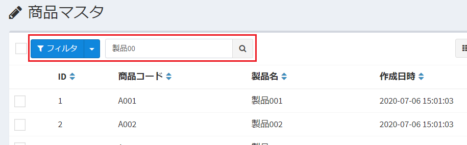  

### 検索バーによる検索（フリーワード検索）
この検索バーに単語を入力することで、表示しているテーブル内のデータを対象に、検索することができます。  

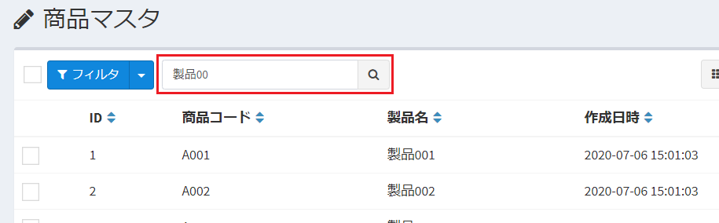  

- 検索対象となるカスタム列は、カスタム列設定で「検索インデックス」がYESに、「フリーワード検索対象」がYESになっている列です。  

> v3.4.0より、検索対象となる条件として、「フリーワード検索対象」がYESになっていることが必要となりました。  
それ以前だと、「検索インデックス」がYESとなっている列すべてで検索を行っていたのですが、検索インデックスが10～20個設定されているとパフォーマンスの低下が懸念されるので、フリーワード検索の対象を絞ることができるようにしました。

- **デフォルトの検索設定は前方一致です。** これは検索パフォーマンスの都合です。  
部分一致に変更したい場合、以下の「データ検索を部分一致に切り替え」をご参照ください。

検索バーに単語を入力し、そのまま検索ボタンをクリックすると、検索が実行されます。  

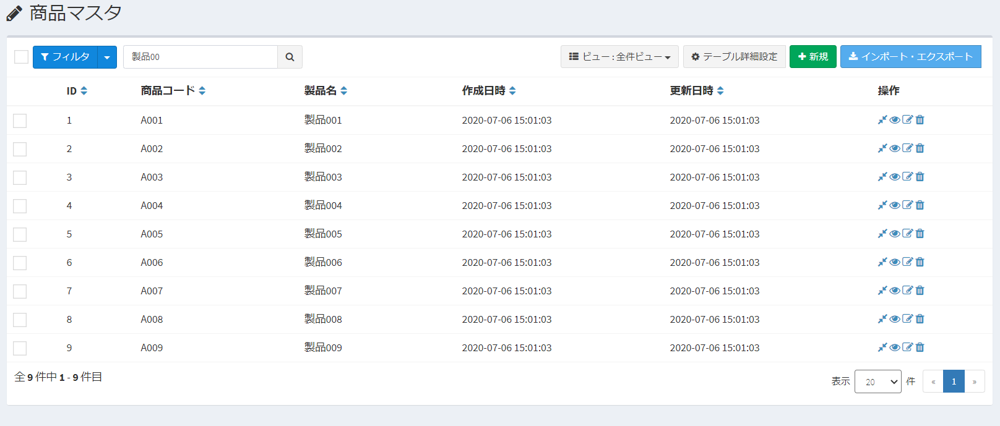  

### 列を指定してのフィルタ検索
「フィルタ」ボタンをクリックすると、列を指定しての詳細検索を行うためのボックスが表示されます。

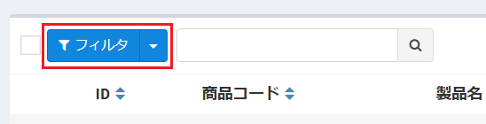  

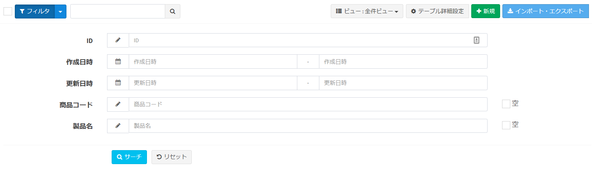  

- 検索列の項目として表示されるのは、以下の通りです。
    1. ID、作成日時、更新日時
    2. ワークフロー設定が行われている列の場合、「ワークフローステータス」と、「自分が担当者のデータ」の絞り込み
    3. そのテーブルを子とするリレーション設定が行われている場合、親データを絞り込む選択肢を表示
    4. そのテーブルの、カスタム列設定「検索インデックス」がYESになっているカスタム列

※このうち、1と2については、システム設定の詳細設定画面で非表示にできます。

  

## 補足事項

### データ検索を部分一致に切り替え
データの単語検索は、デフォルトだと前方一致になります。  
これは検索パフォーマンスの向上のためです。部分一致では、検索パフォーマンスが十分に発揮されないためです。  
  
しかし、検索方法を部分一致に切り替えることはできます。  
部分一致に変更するには、メニュー「管理者設定 > システム設定(詳細設定)」より、「データ検索方法」を部分一致に変更してください。  
  
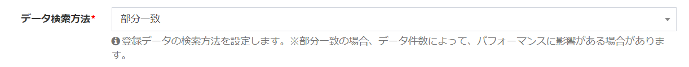  

この設定で、検索を部分一致にすることができます。  
※この設定により、検索パフォーマンスが落ちる可能性があります。ご了承ください。

### カスタム列の種類による、フリーワード検索の仕様について
フリーワード検索を行う場合、基本的にデータベース内に格納されている値でのみ、検索が可能です。  
しかし、一部のカスタム列では、フリーワード検索を行う前に、ユーザーが入力した検索値を、システムで事前に書き換えてから、検索を行うことができます。  
以下、その仕様を記載します。

#### 選択肢(値とテキスト)
設定値「値」に設定された値、もしくは設定値「テキスト」に設定された値で、検索が可能です。

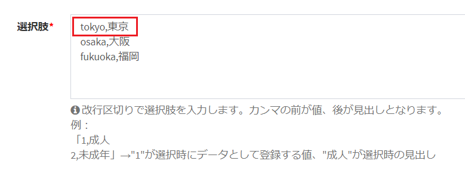  

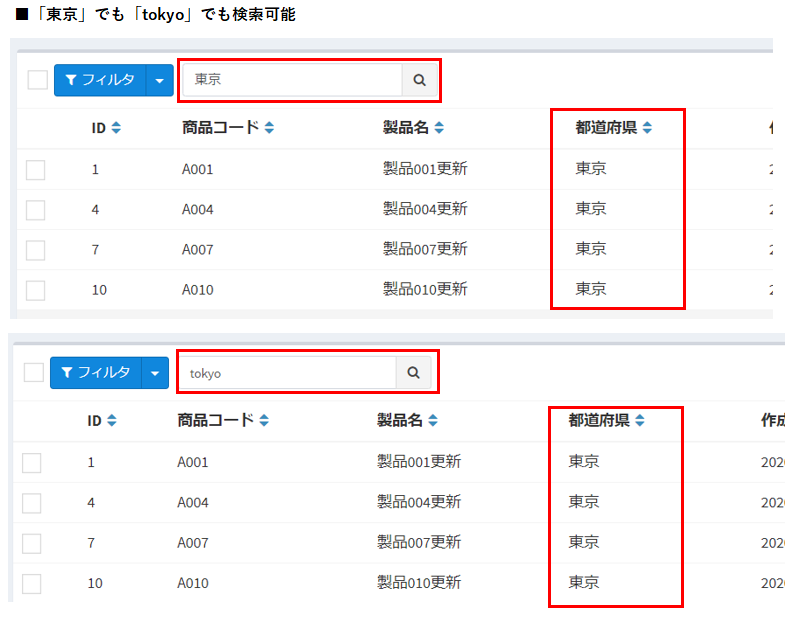  

#### 選択肢 (他のテーブルの値一覧から選択)
「見出し列」に設定されている文言で、検索を行うことができます。  

例：  
- 「商品マスター」がある。  

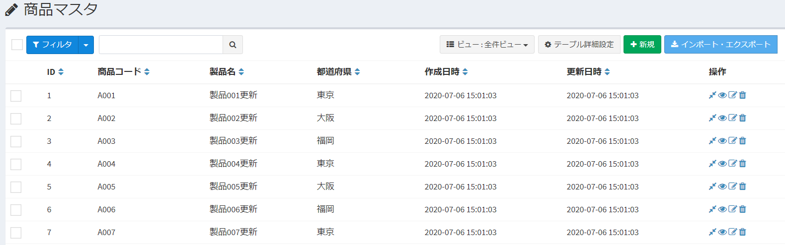  

- その「商品マスター」では、「テーブル設定(拡張設定)」の「見出し列設定」に「商品コード」が設定されている。  

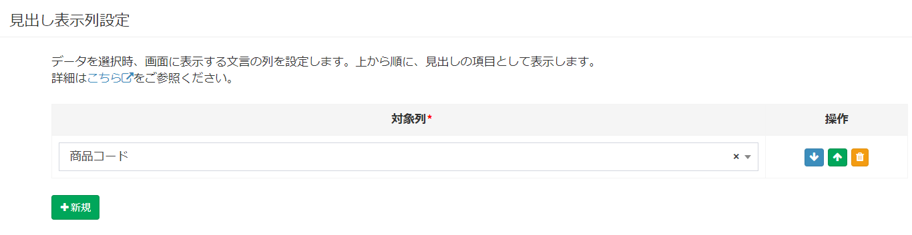  

- テーブル「商品在庫情報」に、その「商品マスター」を参照先とする列「商品マスター」を追加する。  

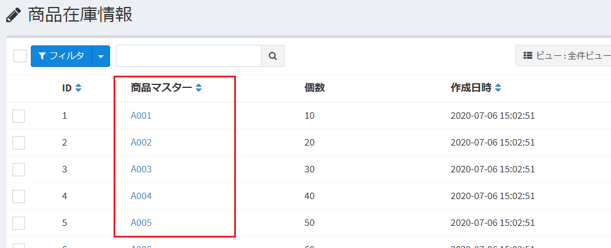  

- このような設定の時に、フリーワード検索で商品コード「A001」と入力することで、商品マスター「A001」を参照先とする「商品在庫情報」一覧を取得できます。

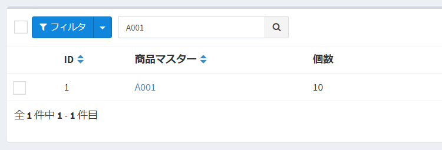  

#### YES/NO
0/1、もしくはNO/YES文字列で検索できます。  
（「0」や「1」、「NO」や「YES」という汎用的な文字列で検索を行う都合上、「フリーワード検索」の対象とすることはあまりオススメしません。）

#### 2値の選択
選択肢の値、もしくは見出しで検索できます。  

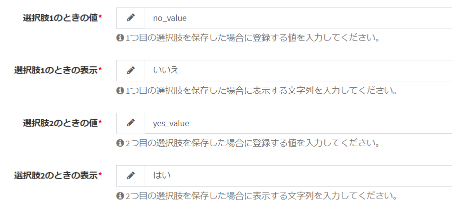  
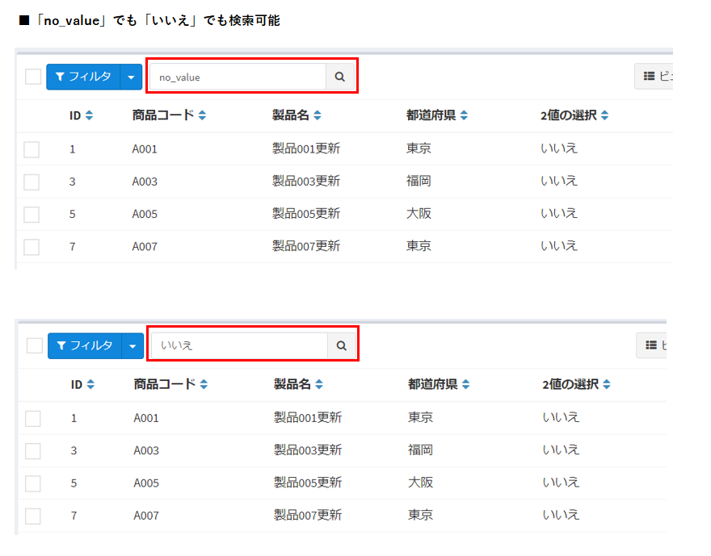  

