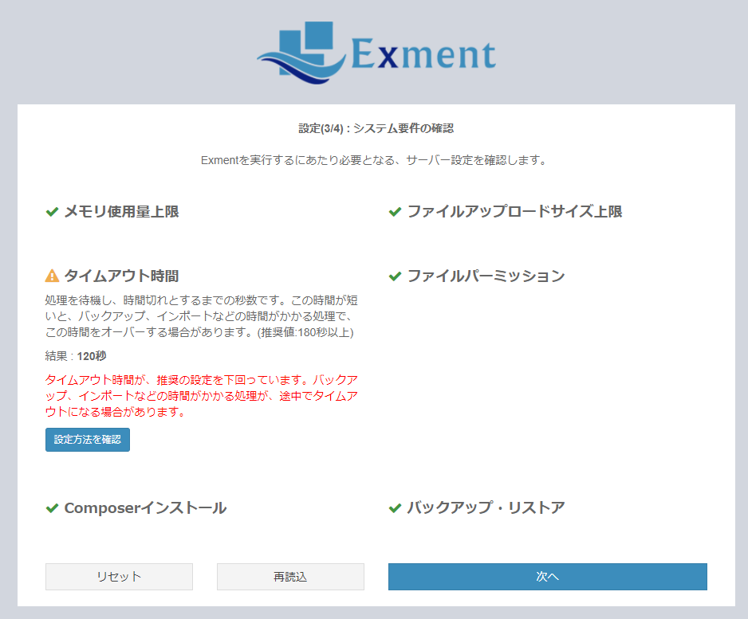
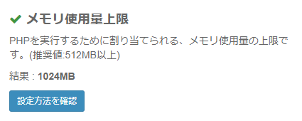
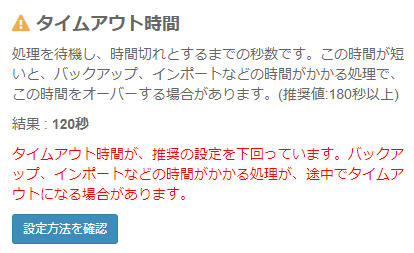
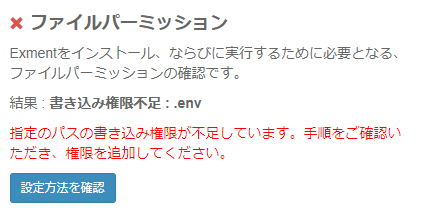

# サーバー設定
- Exmentをご利用いただく場合、はじめにWebサーバー設定と、データベース設定が必要です。  
ご利用する環境によって、以下の手順で設定を行ってください。  

- <span class="red bold">※現在、大変申し訳ございませんが、インストール手順やサーバー構築についての個別のお問い合わせは承っておりません。個別対応をご希望の場合、有償のサポートをご希望ください。</span>　　

- 現在、下記以外の環境の、マニュアルのご用意はございません。ご了承ください。

## Webサーバー
Webサーバーの構築手順です。以下のいずれかの手順で、Webサーバーを構築してください。  
※PHPやApache、MySQLのある環境構築を、開発環境としてはじめから構築する場合、XAMPPをおすすめしております。  

- [XAMPP構築(開発・検証環境) Windows](/ja/install_xampp)  
→まずは手持ちのパソコンに、Exmentをインストールしたい場合(Windows版)

- [XAMPP構築(開発・検証環境) Mac](/ja/install_xampp_mac)  
→まずは手持ちのパソコンに、Exmentをインストールしたい場合(Mac版)

- [レンタルサーバー構築](/ja/install_rental)  
→Exmentを公開し、手軽に他のメンバーやスマートフォンからもアクセスを行いたい場合

- [Linuxに構築](/ja/install_linux)  
→ExmentをLinux(CentOS)にインストールする場合の手順

- [IISに構築](/ja/install_iis)  
→ExmentをIISに構築する場合の手順

- [AWSに構築](/ja/install_aws)  
→ExmentをAWSに構築する場合の手順

- [Dockerで構築](/ja/install_docker)  
→ExmentをDockerで構築する場合の手順


### ファイルパーミッション設定
Exmentのプロジェクトフォルダのうち、以下のフォルダに、Webサーバーを実行するユーザー(apache, www-dataなど)の書き込み権限が必要になります。  

- storage
- bootstrap/cache

また、Web画面からインストールを実行する「[かんたんインストール](/ja/quickstart)」の場合は、追加で以下のフォルダに、Webサーバーを実行するユーザー(apache, www-dataなど)の書き込み権限が必要になります。  
※インストール時のみ必要です。より厳密に権限設定する場合は、かんたんインストール実行後に、フォルダの書き込み権限を削除してください。

- .env
- app
- config
- public


## composer導入
Exmentには、Webサーバーにcomposerの導入が必要です。導入方法はこちらをご参照ください。  
- [公式サイト](https://getcomposer.org/download/)
- [Windows版 解説サイト](https://weblabo.oscasierra.net/php-composer-windows-install/)
- [Linux版 解説サイト](https://weblabo.oscasierra.net/php-composer-centos-install/)
- [Mac版 解説サイト](https://weblabo.oscasierra.net/php-composer-macos-homebrew-install/)


## データベース
Exmentのデータベースエンジンには、以下のいずれかが必要です。

- MySQL 5.7.8以上8.0.0未満
- MariaDB 10.2.7以上
- SQL Server 13.0.0以上(現在、自動のバックアップ・リストアが未対応です)

### データベース環境構築
- データベースサーバーの設定をまだ行っていない場合、データベースサーバーの構築を行ってください。  
構築方法は、以下のリンク先をご確認ください。  
※すでに導入済の場合は不要です。  

    - [MySQL](/ja/install_mysql)
    - [SQL Server](/ja/install_sqlserver)

### データベース作成

- Exment用のデータベースを、各データベースエンジンで作成してください。  


## アプリのインストール
環境構築が完了したら、以下のいずれかの手順で、Exmentアプリのインストールを行ってください。

1. **かんたんインストール**  
→Web画面に表示される手順に従い、アプリケーションをインストールする手順です。インストール方法は、[こちら](/ja/quickstart_easy)をご確認ください。

1. **手動インストール**  
→コマンドにより、手動でExmentのアプリケーションをインストール手順です。インストール方法は、[こちら](/ja/quickstart_manual)をご確認ください。


## 動作環境
### サーバー
- PHP 7.1.3以上
- Laravel5.6
- データベース：以下のいずれか
    - MySQL 5.7.8以上、8.0.0未満
    - MariaDB 10.2.7以上
    - SQL Server 13.0.0以上

### 動作確認ブラウザ

> Internet Explorerは、技術的負債が大きい点に加え、[マイクロソフトが使用を止めるよう求めている](https://japanese.engadget.com/2019/02/08/internet-explorer-ie/)という現状から、Exmentでは対応しておりません。  
使用しているjavascriptも、IEは対応していないものを採用しております。ご了承をお願いいたします。

- Google Chrome
- Microsoft Edge


### 推奨設定

- PHPメモリ最大許容値：512MB
- ファイルアップロード最大値：10MB
- タイムアウト時間：180秒


## システム要件確認

システム要件やサーバー設定値を、画面もしくはコマンドから確認できます。  

  


### 確認方法
以下の方法で、システム要件などを確認することができます。

- [かんたんインストール](/ja/quickstart_easy)での、インストール画面
- インストール後、[システム設定画面](/ja/system_setting)
- コマンド。詳細は下記

### 確認項目詳細

#### メモリ使用量上限
PHPを実行するために割り当てられる、メモリ使用量の上限です。    
設定変更方法は、[こちら](/ja/additional_php_ini)をご確認ください。

#### ファイルアップロードサイズ上限
ファイルをアップロードするファイルサイズの上限です。必要なサイズは、管理したいファイルの要件によって異なります。  
設定変更方法は、[こちら](/ja/additional_php_ini)をご確認ください。

#### タイムアウト時間
処理を待機し、時間切れとするまでの秒数です。この時間が短いと、バックアップ、インポートなどの時間がかかる処理で、この時間をオーバーする場合があります。  
設定変更方法は、[こちら](/ja/additional_php_ini)をご確認ください。

#### ファイルパーミッション
Exmentを実行するために必要となる、ファイルパーミッションの確認です。  
以下のフォルダの書き込み権限を確認します。権限がない場合、エラーを表示します。

- storage
- bootstrap/cache

なお、[かんたんインストール](/ja/quickstart_easy)から呼び出した場合、追加で以下のフォルダの権限を確認します。  
※インストール時のみ必要です。より厳密に権限設定する場合は、かんたんインストール実行後に、フォルダの書き込み権限を削除してください。

- .env
- app
- config
- public

#### Composerインストール
Exmentのアップデートに使用するComposerが、Webサーバーにインストールされているかどうかを確認します。  
※実際にcomposerがインストールされているにも関わらず、警告が表示される場合があります。これは、Webサーバーを動作させるユーザーからcomposerのパスが通っていない、権限が足りないなどの理由があります。  
composerが正常にインストールされており、実際にアップデートを実施するユーザーが実行可能な場合は、この警告は無視してください。


#### バックアップ・リストア
バックアップ・リストアを実行するためのサーバー設定が完了しているかの確認です。  
※エラーになる場合、[こちら](/ja/troubleshooting)の「バックアップ・リストアに失敗する」をご確認ください。  
※SQL Serverをご利用の場合、常に警告になります。手動でのバックアップ・リストアが必要です。手順は[こちら](/ja/backup_sqlserver)をご確認ください。


### 結果表示
#### 正常
緑色のチェックで表示されます。

  

なお、行をクリックすることで、詳細が表示されます。

  

#### 警告
黄色の警告マークが表示されます。設定方法を推奨、もしくは運用に一部留意点が必要な内容になります。

  

#### エラー
赤色のバツマークが表示されます。設定変更が必要です。

  


### コマンドから実行

以下のコマンドからも、システム要件確認を実行できます。

```
php artisan exment:checkrequire
```


[←インストール-概要へ戻る](/ja/quickstart)