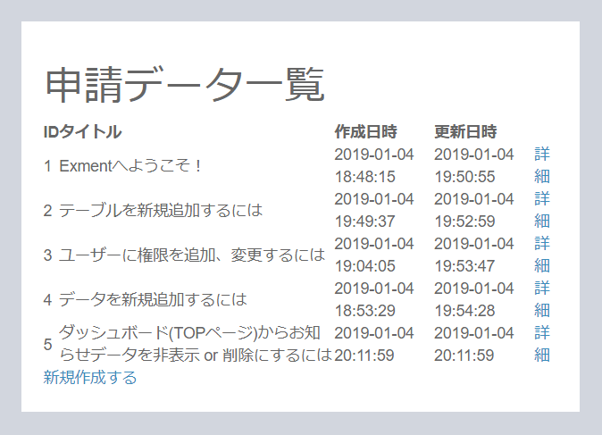
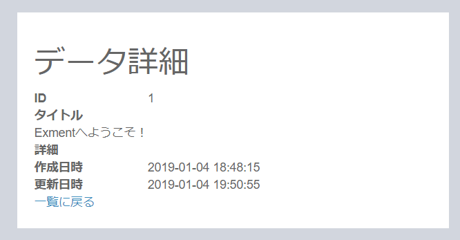

# 利用者向けサイト構築

Exmentでは、エンドポイントを変えることによって、Exmentサイトの他に、開発者が独自に開発した一般ユーザー向けサイトを構築することが出来ます。  

今回当マニュアルで作成するページは、以下のものです。  
・お知らせデータの一覧  
・お知らせデータの詳細表示  
・お知らせデータの新規作成  

## アクセス確認
利用者向けサイトは、Exment構築後であってもアクセス出来ます。  
URL末尾に「/admin」を付与することで管理者サイト(Exment)に、「/」で利用者向けサイトにアクセスします。  

■エンドポイント「/」

■エンドポイント「/admin」

## ページ作成
利用者向けサイトは、基本的に一般的なLaravelによるシステム開発と同じ構成・手順で開発していきます。  
Laravelのルートフォルダ構成です。この内、主に以下のフォルダに対し、phpファイルを作成していきます。  
・app/Http/Controllers：コントローラー  
・routes：エンドポイント情報  
・resources/views：ビューを作成。blade記法に倣って作成する  
・public：css、js、画像など

#### routes：ルーティング
routes/web.phpにて、以下のように今回作成する一覧ページのルーティングを記載します。  
※その他のルーティング記法は[こちら](https://readouble.com/laravel/8.x/ja/routing.html)

~~~
<?php

use Illuminate\Support\Facades\Route;

/*
|--------------------------------------------------------------------------
| Web Routes
|--------------------------------------------------------------------------
|
| Here is where you can register web routes for your application. These
| routes are loaded by the RouteServiceProvider within a group which
| contains the "web" middleware group. Now create something great!
|
*/

//Route::get('/', function () {
//    return view('welcome');
//});

///// 一覧ページ
Route::get('/', [\App\Http\Controllers\IndexController::class, 'index']);
~~~

#### Controller：コントローラー
app/Http/Controllersフォルダに、IndexController.phpを作成します。  
IndexController.phpにて、以下のように記載します。  
・CustomTable：Exmentの「カスタムテーブル」に該当するModel  
・CustomTable::getEloquent('information')->getValueModel()：Exmentのテーブルのデータ用Model。ユーザーが記入した各データ。  
※その他のコントローラーの記法は[こちら](https://readouble.com/laravel/8.x/ja/controllers.html)

~~~
<?php

namespace App\Http\Controllers;

use Illuminate\Routing\Controller as BaseController;
use Illuminate\Http\Request;
use Exceedone\Exment\Model\CustomTable;

class IndexController extends BaseController
{
    //一覧画面
    public function index(Request $request){
        $items = CustomTable::getEloquent('information')->getValueModel()->get();
        return view('index', [
            'items' => $items,
        ]);
    }
}
~~~

#### view：ビュー
resources/viewに、_layout.blade.phpを配置します。（共通部品です。）  
index.blade.phpを作成し、以下のように記載します。  
※その他のBladeの記法は[こちら](https://readouble.com/laravel/8.x/ja/blade.html)

~~~
@extends('_layout')

@section('content')
    <h1>お知らせデータ一覧</h1>
    <table>
        <thead>
            <tr>
                <th>ID</th>
                <th>タイトル</th>
                <th>作成日時</th>
                <th>更新日時</th>
                <th></th>
            </tr>
        </thead>

        <tbody>
        @foreach($items as $item)
            <tr>
                <td>{{$item->id}}</td>
                <td>{{$item->getValue('title', 'html')}}</td>
                <td>{{$item->created_at}}</td>
                <td>{{$item->updated_at}}</td>
                <td><a href="{{asset($item->id)}}">詳細</a></td>
            </tr>
        @endforeach
        </tbody>
    </table>

    

        <a href="{{asset('/create')}}">新規作成する</a>
    

@endsection
~~~

#### 結果表示
ここまでの開発が正常に完了していれば、以下のようにExmentの「お知らせ」テーブルのデータ一覧が表示されます。  
※「新規作成する」「詳細」のリンクは現時点ではまだリンク切れとなります。

#### データ詳細画面作成
データ詳細画面を作成していきます。以下のような追記をしていきます。

routes/web.php
~~~
///// 詳細ページ
Route::get('/{id}', [\App\Http\Controllers\IndexController::class, 'show']);
~~~

app/Http/Controllers/IndexController.php（index関数の下に追記）
~~~
  //詳細画面
    public function show(Request $request, $id){
        $item = CustomTable::getEloquent('information')->getValueModel()->find($id);
        if(!$item){
            return redirect('');
        }
        return view('show', [
            'item' => $item,
        ]);
    }
~~~

resources/views/show.blade.php（新規作成）
~~~
@extends('_layout')

@section('content')
    <h1>データ詳細</h1>
    <table>
        <tbody>
            <tr>
                <th>ID</th>
                <td>{{$item->id}}</td>
            </tr>
            <tr>
                <th>タイトル</tr>
                <td>{{$item->getValue('title', 'html')}}</td>
            </tr>
            <tr>
                <th>詳細</th>
                <td>{!! $item->getValue('explain', 'html') !!}</td>
            </tr>
            <tr>
                <th>作成日時</th>
                <td>{{$item->created_at}}</td>
            </tr>
            <tr>
                <th>更新日時</th>
                <td>{{$item->updated_at}}</td>
            </tr>
        </tbody>
    </table>

    

        <a href="{{asset('/')}}">一覧に戻る</a>
    

@endsection
~~~

#### 結果表示
開発が正常に完了していれば、以下のようにExmentの「お知らせ」テーブルの、指定のIDのデータ詳細が表示されます。

#### データ新規作成画面
データ新規作成画面を作成していきます。以下のような追記をしていきます。

routes/web.php（詳細ページより上に記載する）
~~~
///// 新規作成ページ
Route::get('/create', [\App\Http\Controllers\IndexController::class, 'create']);
Route::post('/', [\App\Http\Controllers\IndexController::class, 'store']);
~~~

app/Http/Controllers/IndexController.php（show関数の下に追記）
~~~
    //新規画面
    public function create(Request $request){
        return view('create');
    }

    //新規登録実施
    public function store(Request $request){
        //データ保存のModel作成
        $custom_value = CustomTable::getEloquent('information')->getValueModel();

        //値のセット
        $custom_value->setValueStrictly([
            'title' => $request->get('title'),
            'explain' => $request->get('explain'),
        ]);

        //データ保存
        $custom_value->save();

        //該当のデータへリダイレクト
        return redirect($custom_value->id);
    }
~~~

resources/views/create.blade.php（新規作成）
~~~
@extends('_layout')

@section('content')
    <h1>データ新規作成</h1>

    <form method="post" action="{{asset('/')}}">
        @csrf
        <table>
            <tbody>
                <tr>
                    <th>タイトル</th>
                    <td><input type="text" name="title" value="{{old('title')}}" /></td>
                </tr>
                <tr>
                    <th>詳細</th>
                    <td><textarea name="explain" value="{{old('explain')}}"></textarea></td>
                </tr>
            </tbody>
        </table>

        <button type="submit">送信</button>
          
        
        

            <a href="{{asset('/')}}">一覧に戻る</a>
        

    </form>
@endsection
~~~

#### 結界表示
開発が正常に完了していれば、以下のようにExmentの「お知らせ」テーブルにデータを追加するページが表示されます。

