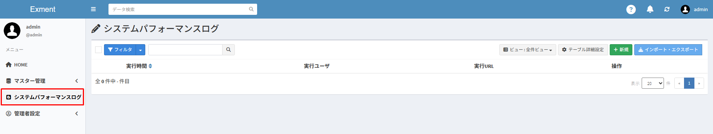

# システム設定
サイトの基本情報や権限の付与など、Exmentのシステム全体を対象とした設定を行います。  

## 設定画面
メニューにある「システム設定」をクリックしてください。  
システム設定の画面が表示されます。  
システム設定は［基本設定］と［詳細設定］に分かれています。  
右上のボタンをクリック後、ダイアログの中から選択することで切り替えが行えます。

  
  

## サイト基本情報
Exmentで情報管理をするにあたり、サイトとしての基本情報を設定します。

- Exmentのメニューレイアウトに関しては、「標準」と「小アイコン」２種類の表示形式があります。  
表示の違いは下記画像をご参考ください。  
- メニューレイアウトに関して、既定の表示形式は[サイトメニューレイアウト](#サイトメニューレイアウト)にて設定しますが、画像の赤枠部分をクリックすることにより、その都度の切り替えも可能です。

標準
  

小アイコン
  

#### サイト名 ※必須
- メニューレイアウトが標準時にページの左上に表示するサイト名です。  
- 初期値は「Exment」です。  

#### サイト名(略) ※必須
- メニューレイアウトが小アイコン時に左上に表示するサイト名です。
- 初期値は「Exm」です。  

#### サイトロゴ
- メニューレイアウトが標準時にページの左上に表示するサイトのロゴです。  
- ［参照］ボタンをクリックして使用したい画像を選択してください。  
- 推奨サイズ：200px * 40px  

※サイトロゴを設定すると、メニューレイアウトが標準時には、左上の該当箇所にサイト名ではなくサイトロゴが表示されます。

#### サイトロゴ(小)
- メニューレイアウトが小アイコン時にページの左上に表示するサイトのロゴです。  
- ［参照］ボタンをクリックして使用したい画像を選択してください。  
- 推奨サイズ：40px * 40px  

※サイトロゴ(小)を設定すると、メニューレイアウトが小アイコン時には、左上の該当箇所にサイト名ではなくサイトロゴ(小)が表示されます。

#### サイトファビコン(ico)  
- 下記画像のように、サイト閲覧時や、ブックマークを行う時に使用されるアイコン画像です。  
- ［参照］ボタンをクリックして使用したい画像を選択してください。  
- 推奨サイズ：16px * 16px  

  

#### サイトスキン
- サイトのテーマ色の設定です。ヘッダーとサイドバーの色を下記の組み合わせから選択します。  
- ヘッダー(初期設定は青)：青・黄・緑・紫・赤・白  
- サイドバー(初期設定は白)：黒・白  

※設定の保存後にWEBページの再読込を行うと、設定が反映されて表示されます。

#### サイトメニューレイアウト
- 「標準」or「小アイコン」どちらかのレイアウトをサイトメニューとして選択します。  
それぞれのレイアウト例は上部の画像をご参考ください。
- 初期値は「標準」です。  

※設定の保存後にWEBページの再読込を行うと、設定が反映されて表示されます。

#### APIを使用する
- 「YES」にすることで、APIを使用することができます。
- 初期値は「NO」です。

#### サーバー外部通信を行う
- 設定がYESの場合、Exmentの最新バージョンの通知など、外部サーバー通信（データ受信のみ）を行う処理を実行できます。
- 初期値は「YES」です。  

#### 権限管理を使用する
- 設定がYESの場合、[システム全体に対する権限](#権限設定)や、[カスタムテーブル毎の権限](/ja/table.md?id=権限)を設定することができます。  
- この設定がYESの場合、ユーザーを指定した権限の付与が可能になります。
- 初期値は「YES」です。  

#### 組織管理を使用する
- 設定がYESの場合、[権限管理を使用する](#権限管理を使用する)にあたり、組織を指定した権限の付与が可能になります。  
- 初期値は「YES」です。  

#### 操作ログを有効にする
- 「YES」に設定すると、操作ログ機能が有効になり、ユーザーのすべての操作が記録されます。
- 初期値は「NO」です。

  
- ZIPファイルをダウンロードし、テンプレートをインストールしてください。
[Template zip file] (https://exment.net/template/system_logs.zip)
- 更新コマンドを実行します。
~~~
   php artisan exment:update
~~~
  

#### システム管理者
- システム監視者となるユーザーを設定することができます。
- Exmentのインストール時に初期設定を行ったユーザーが初期値として登録されています。

#### データ一覧の表示件数
- データ一覧のページにおける既定のデータ表示件数です。  
  「10件」「20件」「30件」「50件」「100件」いずれかを選択します。
- 初期値は「20件」です。  

#### 検索・ダッシュボードの表示件数
- [キーワード検索](/ja/search.md?id=単語検索)を行った際や、[ダッシュボードのデータ一覧](/ja/dashboard.md?id=データ一覧)における既定のデータ表示件数です。  
「5件」「10件」「20件」いずれかを選択します。  
- 初期値は「5件」です。  

#### 日時表示書式
- 日付の表示形式を３種類の中から設定することができます。

#### データ検索方法
- 登録データの検索方法を「前方一致」「部分一致」どちらかに設定します。
- 初期値は「前方一致」です。

#### データ一覧のフィルタ非表示
- チェックした項目は、データ一覧画面のフィルタで非表示になります。

#### データ画面のシステム項目表示位置
- データ編集画面及びデータ詳細画面でシステム項目を表示する位置を設定します。  
- 「上部」「下部」「非表示」から選択可能です。初期値は「上部」です。  

#### データ保存後の既定リダイレクト先
- [データ登録](/ja/data_form#データ保存後の遷移先)画面で、データ保存後のリダイレクト先を選択するチェックボックスに、既定でチェックを入れることができます。

#### ヘッダーのユーザー情報の表示内容
- ヘッダーのユーザー情報に表示する内容を設定することができます。空欄にした場合は非表示になります。
- ユーザーテーブルのカスタム列と作成日時から選択可能です。

## 組織設定
各設定の範囲に組織を含むかどうかを設定します。

#### 組織階層設定(役割グループ)
-  役割グループの「ユーザー・組織設定」に組織を設定したとき、親子階層の組織を含める範囲を設定します。
- 初期値は「所属組織の親子階層を含める」に設定されています。

#### 組織階層設定(データ)
- 各カスタムデータの共有設定に組織を設定したとき、親子階層の組織を含める範囲を設定します。
- 初期値は「組織階層設定(データ)」に設定されています。

#### カスタムデータ共有設定
-  ユーザーがデータを新規作成する際の、自動共有する対象範囲をユーザーのみか、所属する組織も含むか設定を行います。
- 初期値は「ログインユーザーのみ」です。

## システムメール設定
システムからメールを送信する場合の設定を行います。  
画面から設定を行う場合、SMTPによる設定値を記入します。  
詳細は[こちら](/ja/mailsend_setting)をご確認ください。

## IPフィルタ設定
通信を許可するIPアドレスを、固定IP（例：12.3.5.6）、および範囲指定形式（例：123.4.5.0/24）にて設定します。  
未設定の場合は、すべてのIPアドレスを許可します。
詳しくは[こちら](/ja/additional_ip_filter.md)をご覧ください。

## パスワードポリシー

> [こちら](/ja/login_setting)に移動しました。

## SSO設定

> [こちら](/ja/login_sso)に移動しました。
