# カスタムテーブル設定
Exmentでは、情報管理を行うために「カスタムテーブル」を使用します。  
登録データに対して許可する機能や権限など、必要な設定を行います。

## 一覧
メニューにある「カスタムテーブル」をクリックしてください。  
作成してあるカスタムテーブル設定の一覧画面が表示されます。  

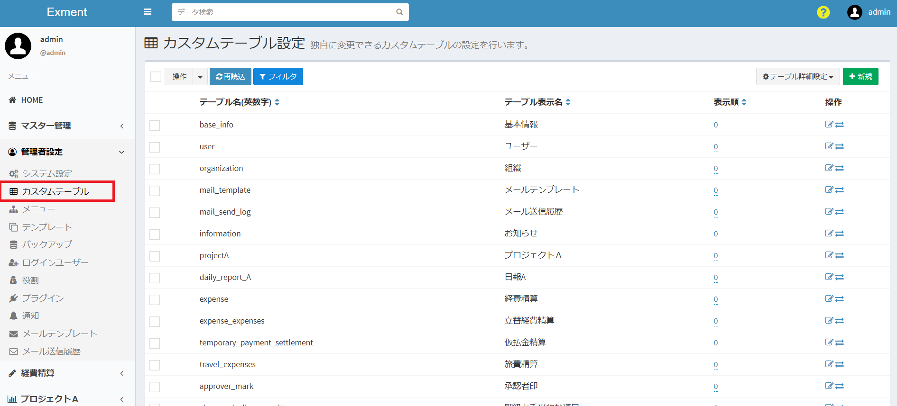

※「基本情報」「ユーザー」「組織」「通知テンプレート」「メール送信履歴」「お知らせ」  
これらのテーブルはExmentインストール時に初期設定されています。  
その他、テンプレートとしてインポートしているテーブルも一覧画面に表示されます。  

## 新規作成

- 一覧画面右上の［新規］ボタンをクリックします。
  
  
- テーブル作成画面が表示されるので、必要事項を入力していきます。
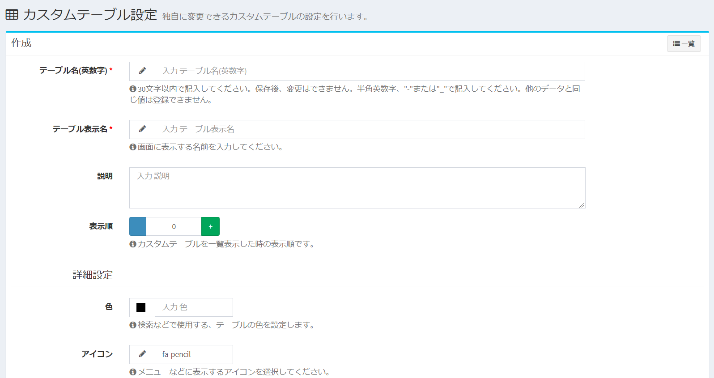

## 設定項目の詳細

#### テーブル名(英数字) ※必須
- テーブルの名前を表します。(例：user , information , estimate )  
- 設定した英数字はテーブルを開いた際のURLなどで使用されます。(例：http(s)://(ExmentのURL)/admin/data/user)  
- 使用できるのは、半角英数字と記号の "-" と "_" です。
- 他のテーブルで使用しているテーブル名は使用できません。  
- テーブル名の文字数は30文字以内、テーブル名の先頭は英字を指定してください。  
- テーブルの新規作成時にのみ設定できます。保存後は変更できません。  

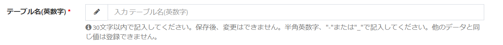

#### テーブル表示名 ※必須
- 画面に表示する名称です。日本語の使用も可能です。(例：ユーザー 、お知らせ 、見積 )  

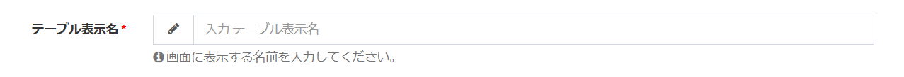  

#### 説明
- テーブルに関する説明です。

- 下記画像のように、データ画面においてテーブル表示名の右に入力した説明が表示されます。  

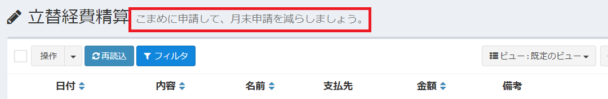

#### 表示順
- カスタムテーブル設定の一覧画面における表示順です。  
- 半角入力、もしくは左右の［－］［＋］ ボタンで数字を指定してください。

#### 色
- テーブルの色を設定します。ここで設定した色は、検索時のサジェストなどで使用します。

- 現在指定している色をクリックすると選択画面が表示されます。

#### アイコン
- テーブルのアイコンを設定します。設定したアイコンは、メニューのアイコンや、検索結果のアイコンとして表示します。  

- 現在指定しているアイコンをクリックすると選択画面が表示されます。

#### 検索可能
- 検索バーから[検索](/ja/search.md)を行う場合に、そのテーブルを検索対象に含めるかどうかを設定します。既定値はYESです。  
隠しテーブルにしたい場合など、検索結果から除外したい場合には、NOに設定してください。

#### IDをラベルに使用する
- 検索バーを使用した際に表示される検索候補において、ラベルの頭にデータのIDを追加することができます。詳細は[見出し表示列設定](#見出し表示列設定)をご参照ください。既定値はNOです。  

#### 1件のみ登録可能
- データを複数件登録せず、1件のみ許可するテーブルの場合には、YESに設定してください。既定値はNOです。  

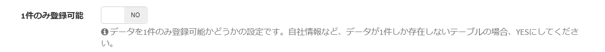

#### 添付ファイル使用
- テーブルのデータに、[添付ファイル](/ja/data_details?id=添付ファイル)のアップロードを可能にする場合には、YESに設定してください。既定値はYESです。  

#### コメント使用
- テーブルのデータに、[コメント](/ja/data_details?id=コメント)を可能にする場合には、YESに設定してください。既定値はYESです。  

#### データ変更履歴使用
- テーブルのデータを、誰がどのような内容で更新したか、リビジョン（履歴）として管理したい場合には、YESに設定してください。既定値はYESです。  

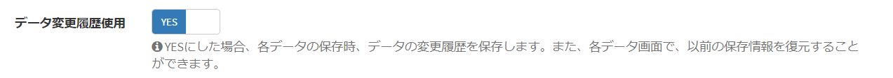

#### 変更履歴バージョン数
- 「データ変更履歴使用」がYESの場合、その変更履歴を保持しておくバージョン数を、整数で記入します。  
「200」と入力した場合、201回目の更新で、1回目の変更履歴情報は削除されます。既定値は100です。  

#### 全ユーザーが編集可能

> テーブルの権限の概要については、[Exmentにおける役割・権限の概要](/ja/permission)ページを、はじめにご確認ください。

- YESにした場合、すべてのユーザーが、そのテーブル内の全データを編集可能になります。個別に権限を振る必要がなくなります。既定値はNOです。  

#### 全ユーザーが閲覧可能

> テーブルの権限の概要については、[Exmentにおける役割・権限の概要](/ja/permission)ページを、はじめにご確認ください。

- YESにした場合、すべてのユーザーが、そのテーブル内の全データを閲覧可能になります。個別に権限を振る必要がなくなります。既定値はNOです。  

※Exmentインストール時に、「お知らせ」テーブルのみ「すべてのユーザーが閲覧可能」がYESに初期設定されています。これは、すべてのユーザーが、お知らせ情報を閲覧できるようにするためです。  
一方で、お知らせ情報を編集できるのは、管理者のみとなります。

#### 全ユーザーが参照可能

> テーブルの権限の概要については、[Exmentにおける役割・権限の概要](/ja/permission)ページを、はじめにご確認ください。

- YESにした場合、すべてのユーザーが、そのテーブル内の全データを参照可能になります。個別に権限を振る必要がなくなります。既定値はNOです。  

※「すべてのユーザーが参照可能」のみをYESにした場合、そのテーブルをメニューや一覧画面で表示することはできませんが、他のテーブルから参照することは可能になります。  

例：「消費税」テーブルは、一般ユーザーにとって一覧画面への表示は必要ありませんが、選択肢として「消費税」を選択してもらう必要があります。このようなテーブルの場合、「すべてのユーザーが参照可能」をYESに設定してください。  

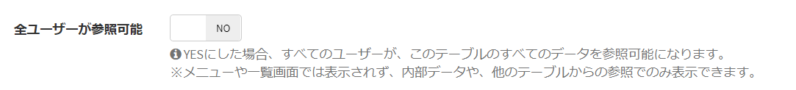

#### メニューに追加する
- YESにした場合、テーブルの保存に併せて、そのテーブルをメニューに追加します。既定値はNOです。  

※テーブルの新規作成時にのみ表示される項目です。メニューに追加した後、メニューとしての設定変更を行う場合は、[メニュー](/ja/menu.md)画面にて設定を行ってください。  

#### 追加先の親メニュー
- 「メニューに追加する」をYESにした場合表示される項目です。メニュー追加時に、親となるメニュー名を選択してください。  

例：「マニュアル」テーブルの新規作成において、親メニューに「管理者設定」を選択した場合、画像のように新規作成する「マニュアル」テーブルのメニューは、「管理者設定」内の一番下に作成されます。

#### 通知に追加する
- YESにした場合、データの新規作成・更新・共有、コメント時に、権限のあるユーザーにシステム内通知を行う通知の設定を、テーブルの保存に併せて追加します。  

※テーブルの新規作成時にのみ表示される項目です。通知に追加した後、通知としての設定変更を行う場合は、[通知](/ja/notify.md)画面にて設定を行ってください。  

## 保存
- 設定した内容を保存するには［送信］ボタンをクリックしてください。設定内容にてテーブルが作成されます。

- テーブルを新規作成した場合、保存後に[カスタム列一覧画面](/ja/column.md)に移行します。  
引き続きカスタム列の登録を行ってください。

## 編集
- カスタムテーブル一覧に表示されている、該当テーブルの［編集］ボタンをクリックしてください。  
編集画面に移行するので、設定の変更が行えます。  

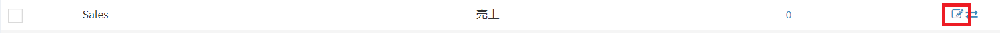

## 削除
- テーブルの削除を行いたい場合、まずは上記の編集と同じ手順で編集画面に移行してください。

- 次に編集画面右上にある［削除］ボタンをクリックしてください。  

  

- 下記画像のように確認画面が表示されるので、テキストエリアにdelete meと入力し、［確認］ボタンをクリックしてください。テーブルの削除が行われます。  
**※ただし、次の種類のテーブルに関しては削除できません。 ・システムでインストールしているテーブル ・リレーションを子として設定されているテーブル**

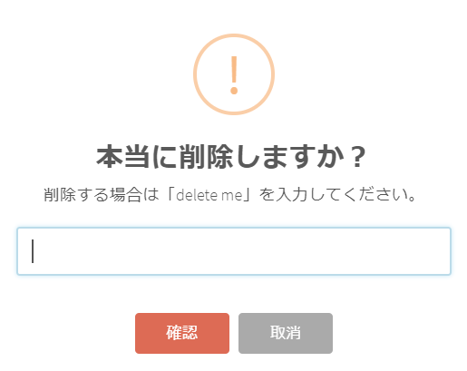

## 拡張設定
テーブル内の複数の列を使用した、拡張設定を行うことができます。

- カスタムテーブル一覧に表示されている、該当テーブルの［拡張設定］ボタンをクリックしてください。  

- 設定画面に遷移します。

  

### 複合ユニークキー設定
ユニークキーとして複数の列を設定することにより、データの新規登録時に特定の組み合わせによる重複登録を防ぐことが出来ます。  

- 特定の組み合わせによる重複登録を防ぎたい列を２～３種類選択してください。
- データを新規登録する際、設定の列いずれに対しても、登録しようとする値が登録済の値と合致する場合にエラーとなります。  

例：下記画像のような設定の場合、「次回予定日」「名前」をユニークキーとすることで、同じ次回予定日に同じ名前が複数登録される状態を防ぐことが出来ます。  

※１種類の列のみで重複判定を行い、重複登録を防ぎたい場合には、[カスタム列設定](/ja/column.md)にて該当する列のユニークをYESに設定してください。

### 2つの列を比較
データの新規作成時ならびに更新時、2つの列を比較します。列の値が、設定した条件と一致した場合のみ、保存ができます。一致しない場合は、エラーメッセージを表示します。  
以下のようなパターンでご利用ください。  

- 「開始日」は「終了日」以前の場合のみ保存できる。
-  「X」の値は「Y」の値以上の場合のみ保存できる。
- 「担当者」と「確認者」は異なる場合のみ保存できる。

    

#### 未入力の場合の扱い
片方もしくは両方の項目が未入力の場合、選択した条件によって結果が異なります。  
ここでは、正常に保存できる場合を"true"、エラーになる場合を"false"と記載します。

- **AとBで合致する** : 値が両方とも未入力の場合true。どちらかのみ未入力の場合false。
- **AとBで合致しない** : 値がどちらかのみ未入力の場合true。両方とも未入力の場合false。
- **それ以外** : 常にtrue。これは、日付や数値は、一般的に値が空の場合は、比較ができないためです。  
未入力にさせたくない場合は、カスタム列設定やカスタムフォーム設定で、必須設定を行ってください。

#### 列の種類ごとの扱い
- 大小（AはBより大きい、AはBより小さい、AはB以上である、AはB以下である）の比較は、以下の列種類でのみ行えます。
    - 整数
    - 小数
    - 通貨
    - 日付
    - 時間
    - 日時

- それ以外の列種類で比較を行おうとした場合、常にtrueになります。

- また、厳密には、この設定の保存時に、列の種類が揃っていない場合は、エラーを発生させる必要があります。(「整数」と「日時」の大小関係は比較できないため)  
現在はこのような検証は行っていません。適切な2つの列の種類の選択を行ってください。

#### その他
- 3列以上の値での比較、特別な条件を用いた比較、他のテーブルの値を連携した比較などを行いたい場合は、[プラグインのバリデーション](/ja/plugin_quickstart_validate)を作成してください。

### 見出し表示列設定
この設定では、検索バーの候補表示や、選択肢での一覧を表示する場合に、表示する文言を制御することができます。  
  
例えば下記のように、「顧客情報」というテーブルがあるとします。  
顧客情報テーブルには、「顧客コード」「顧客名」「電話番号」「メールアドレス」といった情報があったとします。  
    

検索バーで検索ワードを入力すると、検索候補が表示されますが、  
そのとき、以下のように表示したいとします。  
「(顧客コード) (顧客名)」  
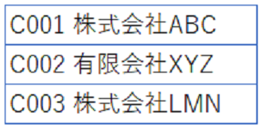    
  
その場合、カスタムテーブルの拡張設定画面で、見出しとして表示したい列に対し、以下のように設定を行います。  
  
  
このように登録することで、ページ上部の検索バーに文字を入力時、候補としてこのように表示されます。  
拡張設定画面で上から順に列を登録することで、その列の順で、候補文字列が表示されます。  
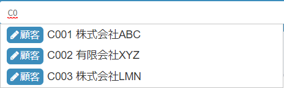  
  
また、「メールアドレス」も表示したい場合は、「メールアドレス」の列を追加してください。  
  
  
  
また、カスタムテーブル設定に、「IDをラベルに表示する」の項目があります。
  
この設定をYESにすると、ラベルの頭に、「#(id)」という文言が追加されます。  
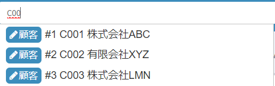  

#### その他
- この見出し表示列設定を登録していない場合、カスタム列設定で1番目の列の値を表示します。
- カスタム列設定で1番目の列の値が空の場合、IDを表示します。
- IDを追加できるのは、ラベルの先頭固定です。それ以外の箇所には追加できません。  

### データ自動共有設定

> データ共有設定については、[Exmentにおける役割・権限の概要](/ja/permission)ページを、はじめにご確認ください。

データ保存時、列の値として設定されている組織またはユーザーに、自動的にデータを共有することができます。  
以下のような用途でご利用ください。  

- データ「契約情報」の新規作成時に、列「主担当者」に割り振られたユーザーに、自動的に編集権限を追加する。  
- データ「契約情報」の更新時に、列「関係組織」に割り振られた組織に、自動的に閲覧権限を追加する。  
- データ「タスク管理」の新規作成時に、列「担当者」に割り振られたユーザーに、自動的に編集権限を追加する。  

※あらかじめ、カスタムテーブルの列に「ユーザー」もしくは「組織」が必要です。

#### 例  
「顧客管理」テーブルで、このような列設定が定義されている場合に、

『「新規作成時」に、列「担当者」に割り振られたユーザーに、「編集」権限を追加する』という設定をします。
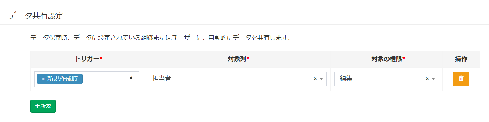

その後、担当者をユーザー「user1」とするデータを新規作成時に、
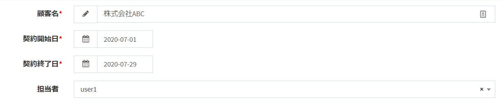

ユーザー「user1」に、この契約情報が、編集権限で共有されます。

#### 設定方法

- ##### トリガー
データを共有するタイミングです。  
「新規作成時」または「更新時」を選択できます。  

- ##### 対象列
データ共有の対象となる、ユーザーまたは組織です。

- ##### 対象の権限
共有の実施時に、編集権限と閲覧権限のどちらで共有するかを選択します。

#### 共有の同期設定
標準設定では、トリガーが「更新時」の時、対象のユーザー・組織の値の変更を行っても、元々設定されていたユーザー・組織の共有情報は削除されず、共有されたままになります。  

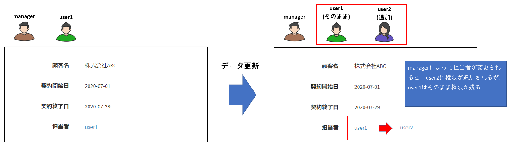

設定を変更することで、データの更新時に、列に設定されているユーザー・組織、ならびに更新ユーザー以外のユーザー・組織を、共有設定から削除することができるようになります。

この設定を変更するには、オプション設定の「更新時、データ自動共有設定を同期する」をYESにしてください。

### 画面からの実行不可設定

データの新規作成、編集、削除や、インポート・エクスポートを、画面から実行させたくない場合に設定します。  
この設定を行うことで、画面からボタンが非表示になります。  

- エキスパートモードを有効にし、拡張設定画面を開きます。

- 「画面からの変更不可」項目が表示されます。

  

- 設定例：「エクスポート」を非表示にした場合

  

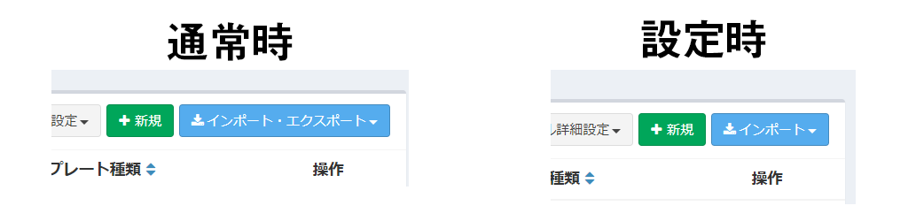  

### 見出しフォーマット設定
> この設定は、[エキスパートモード](/ja/additional_expert)を有効にしていた場合のみ表示されます。

パラメータ変数を使用することで、見出しとして表示する値を、柔軟に設定することができます。  

- エキスパートモードを有効にし、拡張設定画面を開きます。

- 「フォーマット文字列入力」項目が表示されます。  

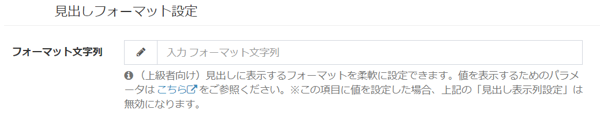  

- データに保存している値を見出しとして表示する場合、[パラメータ変数](/ja/params)を使用します。  
例：ユーザー情報で、「ユーザー名&lt;admin@admin.admin&gt;」と表示する場合  
${value:user_name}&lt;${value:email}&gt;  
  

- このように入力することで、見出しとして表示する項目を設定できます。  
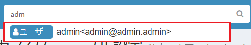  

#### その他
- この見出し表示フォーマット設定を設定していた場合、「見出し表示列設定」は無効になります。
