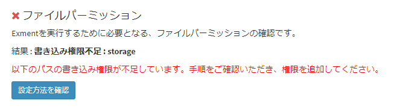

# よくある質問、トラブルシューティング
Exmentのインストールやアップデート、操作に関するよくある質問、トラブルシューティングをまとめております。  
内容は随時更新していきます。  

## ログファイル
Exmentのログファイルは、Exmentのルートプロジェクトフォルダを基準にし、以下のパスに配置されます。エラーなどが発生した場合、このファイル内に、ログが記載されます。  
/storage/logs/laravel.log


## インストール・アップデート

### ファイル・フォルダのPermission Deniedが発生する
かんたんインストール実施時や、ログファイルの書き込みの時に、権限エラーが発生する場合があります。  
また、システム要件の確認を実施時に、以下のエラーが表示される場合があります。  

  

Webサーバーを実行するユーザー(apache, www-dataなど)の権限が不足している可能性があります。  
Exmentのプロジェクトフォルダのうち、以下のフォルダに、Webサーバーを実行するユーザー(apache, www-dataなど)の書き込み権限を追加してください。  

- storage
- bootstrap/cache

また、Web画面からインストールを実行する「[かんたんインストール](/ja/quickstart)」の場合は、追加で以下のフォルダに、Webサーバーを実行するユーザー(apache, www-dataなど)の書き込み権限が必要になります。  
※インストール時のみ必要です。より厳密に権限設定する場合は、かんたんインストール実行後に、フォルダの書き込み権限を削除してください。

- .env
- app
- config
- public

### composer requireや、アップデートバッチが途中で終了する
Linuxへのインストール時、composer requireコマンドや、アップデートバッチを実行時に、以下の表示になることがあります。  

```
# パターン1
Killed

# パターン2
mmap() failed: [12] Cannot allocate memory
PHP Fatal error:  Out of memory (allocated XXXXX) (tried to allocate XXXXX bytes) in phar:///usr/local/bin/composer/src/Composer/Console/Application.php on line 82

# パターン3
Fatal error: Allowed memory size of XXXXXXXX bytes exhausted
```

これはメモリ不足によるエラーです。  

その場合、以下のいずれかの内容を実施することで、解決する場合があります。

#### swap作成
以下のコマンドでswapを作成後、再度インストールやアップデートを実施してください。  
※環境に応じ、適宜コマンドの頭に"sudo"を追加してください。

~~~
dd if=/dev/zero of=/swapfile bs=2M count=2048
chmod 600 /swapfile
mkswap /swapfile
swapon /swapfile
~~~

#### メモリ上限の変更
以下の内容を実施してください。

- php.iniファイルのmemory_limitを修正します。

```
memory_limit=000M #適宜、現在よりサイズを大きくする
memory_limit=-1 #もしくはこちらの指定。メモリを無制限に使用する可能性があるので、自己責任で設定してください
```

- composerの環境変数を設定(アップデート時の問題の場合、バッチに追加してください)
COMPOSER_MEMORY_LIMIT=-1 composer update


### 手動インストールやアップデート時、composerエラーが発生する

手動インストールやアップデート時、以下のようなエラーが発生する場合があります。

```
Installation failed, reverting ./composer.json to its original content.

  [RuntimeException]
  Could not load package XXX/XXX in http://repo.packagist.org: [UnexpectedValueException] Could not parse version constraint ~4.*: Invalid version string "~4.*"
```

この場合、composerのバージョンを上げることにより、解決する場合があります。以下のコマンドで、composerのバージョンを最新版に更新してください。  
**※環境により、アップデート方法が異なるようです。以下の内容のいずれかで、composer更新をご検証ください。**


#### (1)以下のコマンドを実施

```
composer selfupdate
```

#### (2)以下のコマンドを実施

```
composer self-update
```

#### (3)上記のどちらでも更新ができない場合、以下の手順を実施

- ##### composer削除
すでにインストールされているcomposerを、一度削除します。

```
which composer
#結果例 : /usr/bin/composer
###以下のコマンドを実施
rm /usr/bin/composer
```

- ##### composer再インストール
以下の手順で、composerを再インストールしてください。
    - [公式サイト](https://getcomposer.org/download/)
    - [Windows版 解説サイト](https://weblabo.oscasierra.net/php-composer-windows-install/)
    - [Linux版 解説サイト](https://weblabo.oscasierra.net/php-composer-centos-install/)
    - [Mac版 解説サイト](https://weblabo.oscasierra.net/php-composer-macos-homebrew-install/)


### 初回インストール後、管理画面にアクセス時、「SQLSTATE[HY000][202] Permission denied」エラーが発生する
ApacheからMySQLにアクセスを行う場合、SELinuxの設定が必要になる場合があります。  

上記の現象が発生した場合、以下のようにコマンドを実行してください。

~~~
sudo setsebool -P httpd_can_network_connect_db=1
~~~


### レンタルサーバーで、「composer require」などのコマンドを実行時に、「Killed」と表示される
これはメモリに負荷がかかる場合に、時々発生する現象です。  
※常に発生するわけではありません  

上記の現象が発生した場合、以下のようにコマンドを実行してください。

~~~
nice -n 20 composer .....
~~~

コマンドの冒頭に「nice -n 20」と付けて、composerを実行してください。  
これにより、優先度を下げてコマンドを実行します。  
※上記のようにコマンドを実行しても、再度「Killed」が表示される場合があります。ご了承ください。


## バックアップ・リストア

### バックアップ・リストアに失敗する
バックアップ画面やコマンドで、以下のようなメッセージが表示される場合があります。

  

このエラーが表示される場合、Exmentのバックアップ・リストアに必要な設定が行われていない場合があります。  
以下の内容をご確認ください。

#### mysql-clientがWebサーバーにインストールされていない、パスが通っていない  
Exmentのバックアップ・リストアでは、以下のコマンドを、Webサーバー上で実行しています。  

- mysqlコマンド
- mysqldumpコマンド  

これらのコマンドがインストールされていない場合、mysqlコマンド・mysqldumpコマンドをインストールする必要があります。  
これらのコマンドのインストール方法は、環境によって異なります。  
例：[Amazon Linux 2](http://tech-wiki.pomme-verte.net/?p=793)  

また、Webサーバーを動作させるユーザーでは、mysqlコマンド・mysqldumpコマンドまでのパスが通っていない可能性があります。  
その場合、以下の方法で、フルパスでコマンドを実行できるよう、修正してください。  
※設定変更の詳細は、[こちら](/ja/config)からご確認ください。  

- envファイルを開く。  
- 以下の記載を追加する。  

```
EXMENT_MYSQL_BIN_DIR=("mysql"実行ファイルがあるフォルダまでのパス)
#例
EXMENT_MYSQL_BIN_DIR=/usr/bin
```

#### php.iniで"safe_mode=Off"を追加する
mysqlコマンド・mysqldumpコマンドをサーバーから実行する都合上、safe_modeをOffにする必要があります。  
以下の内容を実施してください。

- php.iniファイルを開く。
- 以下の内容を追記する。

```
safe_mode=Off
```

## その他
### 大量の入力項目の送信に失敗する
現在、一部の設定画面で、同一画面で非常に多数の入力が発生した場合に、正常に動作しない場合があります。  
これは、PHPの設定値「max_input_vars（一度にPOSTできる上限数）」を、実際のPOST値が超えた場合に発生します。  
この問題が発生した場合、[PHP設定値変更](/ja/additional_php_ini)を実施し、パラメータ値を変更してください。  
  
現在、以下の機能で発生しやすいことを確認しています。

- ワークフロー利用設定で、テーブル数・ワークフロー数が多い時
- カスタムデータ入力画面にて、1:nリレーション設定されている場合に、n側の件数が多い場合

> 本来、このようなエラーが発生しないことが望ましいのですが、現在の画面設計で、このような問題が発生することがあります。  
今後、改善を行ってまいりますので、お手数ですがよろしくお願いします。