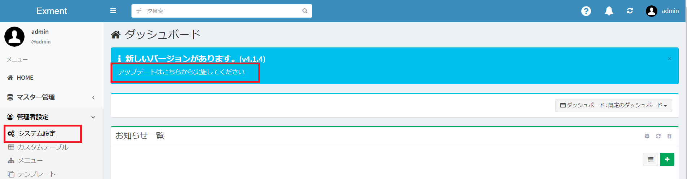
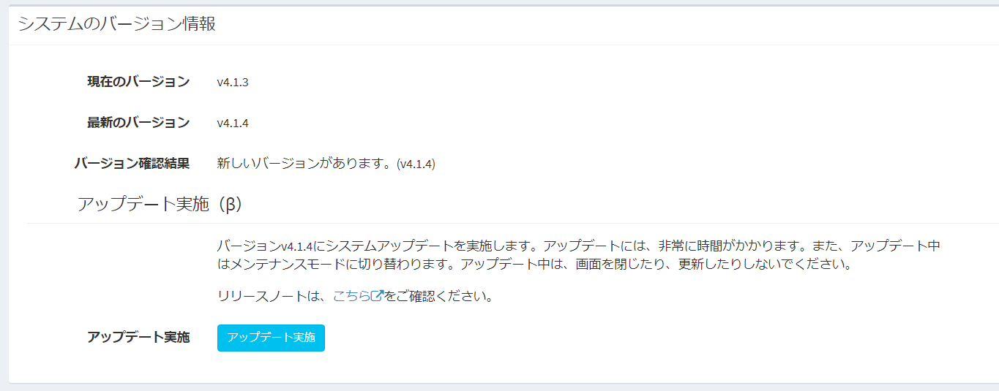
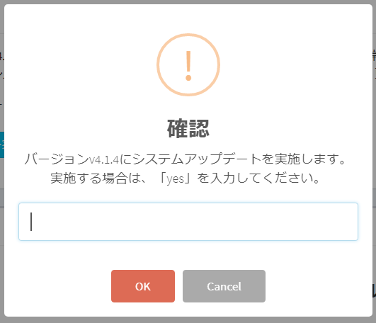
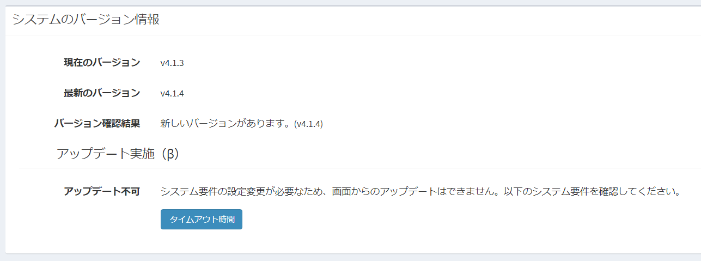

# アップデート
Exmentのバージョンが更新され、アップデートが必要になった場合の手順です。  
更新履歴は[こちら](/ja/release_note)をご確認ください。

- v3.X.X以下から、v4.0.Xへのアップデートは、手動でのアップデートが必要です。[こちら](/ja/update/v4_0)の内容を一度ご確認の上、更新を行ってください。

- アップデート時にエラーが発生した場合、[トラブルシューティング](/ja/troubleshooting)をご参照ください。

- 自動アップデート対応を公開しました。詳細は[こちら](/ja/update_auto)をご確認ください。

- 開発版を導入する、一時的にソースコードを入れ替える、といった作業を実施する場合、[こちら](/ja/update_tmp)をご確認ください。

## 画面からのアップデート
Exmentの新しいバージョンが存在する場合、管理画面からアップデートを実施することができます。

### 実施手順

新しいバージョンが存在する場合に、ダッシュボードで表示されるリンク、アップデートはこちらから実施してください。  
もしくは、メニューの［システム設定］をクリックして、システム基本設定を開きます。

システム基本設定の下部に、「システムのバージン情報」が表示されています。  
アップデート可能なバージョンがある場合には、［アップデート実施］のボタンが表示されているので、クリックしてください。

アップデートの確認ダイアログが表示されます。  
「yes」を入力し、［OK］をクリックしてください。  
アップデートが完了した後、自動的にログイン画面へと遷移します。

### 設定の変更が必要な場合
「システムのバージン情報」に アップデート不可 と表示されている場合には、その下に表示されているシステム要件に関して、設定の変更が必要です。  
設定の変更に関する詳しい方法は、[PHP設定値変更](/ja/additional_php_ini)をご参照ください。

## (初回のみ)アップデートバッチのダウンロード

### Windowsの場合
- 以下のファイルをダウンロードします。  
[ExmentUpdateWindows.bat](https://exment.net/downloads/cmd/ExmentUpdateWindows.bat)

- ダウンロードしたファイルを、プロジェクトのルートディレクトリに配置してください。

### さくらインターネットの場合
- 以下のコマンドを、プロジェクトのルートディレクトリで実行し、ダウンロードを行ってください。

~~~
wget https://exment.net/downloads/cmd/ExmentUpdateLinuxSakura.sh
chmod 775 ExmentUpdateLinuxSakura.sh
~~~

### Xserverの場合
- 以下のコマンドを、プロジェクトのルートディレクトリで実行し、ダウンロードを行ってください。

~~~
wget https://exment.net/downloads/cmd/ExmentUpdateLinuxXserver.sh
chmod 775 ExmentUpdateLinuxXserver.sh
~~~

### Linuxの場合
- 以下のコマンドを、プロジェクトのルートディレクトリで実行し、ダウンロードを行ってください。

~~~
wget https://exment.net/downloads/cmd/ExmentUpdateLinux.sh
chmod 775 ExmentUpdateLinux.sh
~~~

### Macの場合
- 以下のファイルをダウンロードします。  
https://exment.net/downloads/cmd/ExmentUpdateLinux.sh

- ダウンロードしたファイルを、プロジェクトのルートディレクトリに配置してください。

- 以下のコマンドを実行してください。

~~~
chmod 775 ExmentUpdateLinux.sh
~~~

## アップデートバッチの実行
アップデートバッチを実行してください。

### Linux・Macの場合
- 以下のコマンドを、プロジェクトのルートディレクトリで実行してください。

~~~
sh ExmentUpdateLinux.sh
# さくらインターネットの場合
# sh ExmentUpdateLinuxSakura.sh
# Xserverの場合
# sh ExmentUpdateLinuxXserver.sh
~~~

### Windowsの場合
- 以下のバッチファイルを実行してください。  

~~~
ExmentUpdateWindows.bat
~~~

## アップデートバッチの実行内容
アップデートバッチでは、以下の内容を実行しています。  
 - データのバックアップ
 - 最新ソース取得、反映
 - データベース更新

## （補足）アップデート後の画面表示について
最新バージョンが存在する場合、ダッシュボード画面に以下のような表示が行われます。  

この画面表示を行うために、「現在インストールされているバージョン」と、「最新バージョン」を、システムで取得しています。  
この項目は、画面表示の度に都度取得を行わないように、「セッション」と呼ばれる仕組みで管理しており、ログアウトされるまで値を保持しています。  

そのため、**アップデートを行った場合でも、「新しいバージョンがあります」の表記は消えず、表示されたままになります。**  
アップデート実施後は、一度ログアウトし、再度ログインすることで、最新バージョン表記になります。  

## (old)手動によるアップデート方法
以下、v1.3.0以前のバックアップ方法です。手動でコマンドからアップデートを実行する場合、こちらを実施してください。

### (推奨)データのバックアップ
データのバックアップを実行します。詳細は[バックアップ](/ja/backup)をご確認ください。  
- 管理者でExmentにログインし、左メニューより「管理者設定」→「バックアップ」を選択します。
- 「バックアップ」ページ右上の［バックアップ］ボタンをクリックします。
- 最新のデータ、ならびに添付ファイルなどのバックアップが作成されます。
- その後、実行した時刻のバックアップファイルをクリックし、ダウンロードします。

### 最新ソース取得、反映、データベース更新
- コマンドラインで、以下のコマンドを実行します。  
※リリース直後だと、最新バージョンが検知されない場合があります。その場合、10～20分ほど経過後、再度下記コマンドを実行してください。  

~~~
cd (プロジェクトのルートディレクトリ)
composer require exceedone/laravel-admin
composer require exceedone/exment
php artisan exment:update
~~~
