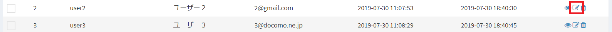
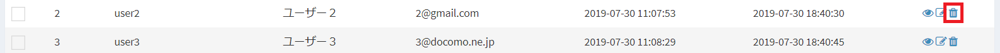
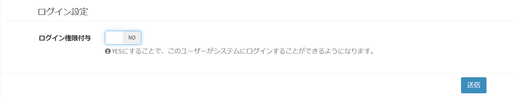
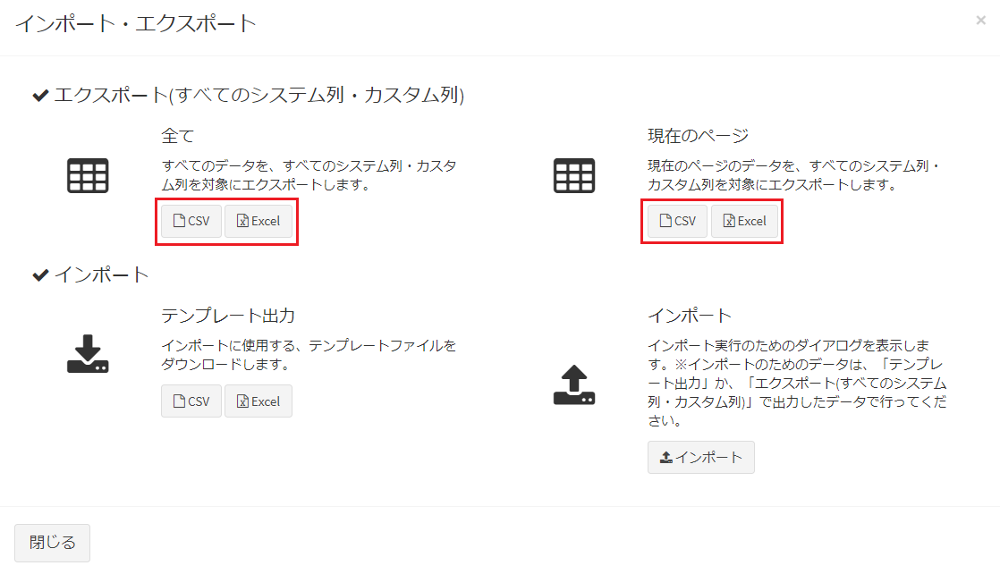
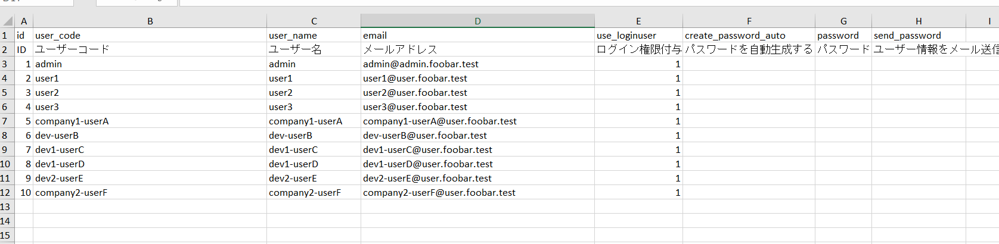

# ユーザー・ログインユーザー
このシステムを使用するユーザー、またはログインユーザーの管理を行います。

## 名称定義
#### ユーザー
自社や組織に所属する社員や、人物です。  
このシステムを使用しない方も、ユーザーとして追加することができます。  
ユーザーコード、Eメールアドレスが必須になります。  
他のテーブルとの関連付けなどで、ユーザーを紐付けて登録することはできますが、システムにログインすることは出来ません。

#### ログインユーザー
ユーザーのうち、Exmentにログインすることができる社員・人物です。  
ユーザー情報にパスワードが割り振られますので、Exmentのログイン画面からログインすることができるようになり、データの登録や参照などを行うことができます。  

#### ユーザー、ログインユーザーの設定手順

Exmentにログイン出来るようになるまでの流れは、上記のような手順となります。  
①ユーザー管理画面で、ユーザーのユーザーコード、ユーザー名、メールアドレスを登録します。  
その後、②のログインユーザー管理画面で、①で登録したユーザーのパスワードを設定します。  
これで、登録したユーザーがExmentにログイン出来るようになります。  

> ログイン時、ユーザーに設定したパスワードを一定の回数間違えると、そのユーザーは一定時間ログインができなくなります。  

## ユーザー管理
全ユーザー情報を管理する方法について記載します。  

### 一覧画面表示
左メニューより、「ユーザー」をクリックします。  
もしくは、以下のURLにアクセスしてください。  
これにより、ログインユーザー設定画面が表示されます。
http(s)://(ExmentのURL)/admin/data/user  
現在システムで登録されているユーザーの一覧が表示されます。

### ユーザーの新規追加
- 「ユーザー」の一覧画面で、ページ右上の「新規」ボタンをクリックします。

- 新規追加画面が表示されますので、必要事項を入力します。

#### 所属組織設定
ユーザーを所属させる組織がある場合、候補データ一覧から選択し、選択済データに移動してください。  
※組織が作成されていない場合、この項目は表示されません。

#### 役割グループ設定
ユーザーに割り振る役割グループがある場合、候補データ一覧から選択し、選択済データに移動してください。

#### ログイン設定
ログイン権限付与をYESにすることにより、ログインユーザーとしてユーザーを作成することができます。
設定方法は下記の[ログインユーザー管理](#ログインユーザー管理)をご参照ください。

### 保存
設定を記入したら、「送信」をクリックしてください。

### 編集
ユーザーの編集を行いたい場合、該当する行の「編集」リンクをクリックしてください。  

### 削除
ユーザーの削除を行いたい場合、該当する行の「削除」リンクをクリックしてください。  

## ログインユーザー管理
上記画面で作成したユーザーをもとに、ログインユーザーの管理を行います。  
パスワード情報の追加や、パスワードの再発行、ログイン権限の削除などを行うことができます。  

### 画面表示
左メニューより、「ログインユーザー」をクリックします。  
もしくは、以下のURLにアクセスしてください。  
これにより、ユーザー設定画面が表示されます。
http(s)://(ExmentのURL)/loginuser  
現在システムで登録されているユーザーと、そのログイン情報が表示されます。

### ログイン情報追加
- ログイン情報を追加するユーザーの行の、「編集」リンクをクリックしてください。  

- ログイン情報編集画面が表示されます。  

ログイン権限を追加する場合、「ログイン権限付与」をYESにします。  
YESにすることで、「パスワードを自動生成する」項目が表示されます。

#### パスワードを自動生成する
YESの場合、ログイン権限を追加時にパスワードを自動生成します。    
自動生成後、該当するメールアドレスに、パスワードメールが自動送信されます。  
**※この機能を実行する場合、[メール設定](/ja/system_setting#システムメール設定)を行う必要があります。**

NOの場合、パスワードを入力する為のテキストボックスと「ユーザー情報をメール送信する」項目が表示されます。

#### パスワード入力
「パスワードを自動生成する」がNOの場合に表示されます。  
ログインユーザーのパスワードを入力してください。  

#### ユーザー情報をメール送信する
「パスワードを自動生成する」がNOの場合に表示されます。  
この項目がYESの場合、該当するメールアドレスに、パスワードメールが送信されます。  
**※この機能を実行する場合、[メール設定](/ja/system_setting#システムメール設定)を行う必要があります。**

#### 初回ログイン時にパスワードを変更させる
YESにした場合、ユーザーがはじめてログインを行った際に、パスワードを変更させる画面を表示します。  
新規登録、またはパスワードをリセットしたユーザーに対し、有効になります。

### ログイン権限削除
ログイン権限の削除を行います。  
一覧画面で、列「ログインユーザー設定」が「YES」のユーザーの、「編集」リンクをクリックしてください。  
  

「ログイン権限付与」をNOに変更します。  
  
その後、「送信」をクリックしてください。  

### ログインユーザー情報の一括インポート
ログインユーザー情報を、一括でインポートすることができます。  
これにより、ユーザー画面から1件ずつログイン設定しなくても、一括でログイン設定を行うことができます。

#### ユーザー情報登録
あらかじめ、ログイン情報を付与したいユーザー情報を、[ユーザー管理](#ユーザー管理)画面で追加してください。

#### ログインユーザー情報出力
- 左メニューより、「ログインユーザー」をクリックします。  
もしくは、以下のURLにアクセスしてください。  
これにより、ログインユーザー設定画面が表示されます。
http(s)://(ExmentのURL)/loginuser  
現在システムで登録されているユーザーと、そのログイン情報が表示されます。

- 画面右上の「インポート・エクスポート」ボタンをクリックします。  
その後、「エクスポート」をクリックします。

  

- 登録しているユーザー情報と、そのユーザーのログインユーザー情報が出力されます。

  

#### 各列の内容
- id  
ユーザーのidです。後述のインポート時には、この値を変更しないようにしてください。  

- ユーザー名、ユーザーコード、メールアドレス  
ユーザー情報です。  
※後述のインポート時、この値を変更していても、ユーザー情報には反映されません。「ユーザー」画面で設定していただくよう、お願いします。

- ログイン権限付与  
そのユーザーに、Exment標準のログイン情報が付与されているかどうかです。1の場合、ログイン情報が付与されています。

- パスワードを自動生成する、パスワード、ユーザー情報をメール送信する  
エクスポート時は、値は空です。インポート時に使用します。

#### インポートファイルの作成
上記でエクスポートした情報を編集し、取込ファイルを作成します。  
各列の設定内容は、以下を入力してください。

- ログイン権限付与  
    - そのユーザーに、Exment標準のログイン権限を付与させたい場合は、1を設定してください。  
    - すでにログイン権限を付与していて、引き続きそのユーザーにログイン権限を付与させる場合は、1のままにしてください。
    - すでにログイン権限を付与しているユーザーに対し、ログイン権限を削除させたい場合は、0を設定してください。

- パスワードを自動生成する  
そのユーザーのパスワードを自動生成したい場合は、1を入力してください。  
すでにログイン権限を付与しているユーザーに対して設定した場合は、パスワードリセットになります。

- パスワード  
ユーザーのパスワードを明示的に指定したい場合は、パスワード文字列を入力してください。  
すでにログイン権限を付与しているユーザーに対して設定した場合は、パスワードリセットになります。

- ユーザー情報をメール送信する  
ログイン情報を新規に付与した場合、またはパスワードを変更していた場合で、パスワード情報をメールで送信したい場合に、1を入力してください。

#### インポート
- ログインユーザー設定画面で、画面右上の「インポート・エクスポート」ボタンをクリックします。  
その後、「インポート」をクリックします。

  

- 作成したインポートファイルをアップロードします。

- ログイン情報が付与されます。
