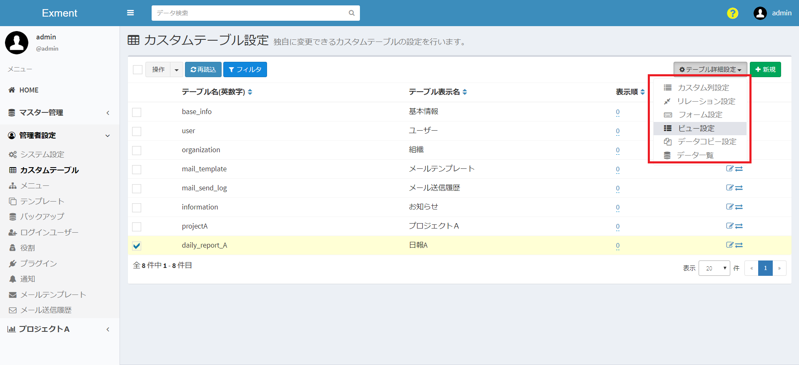

# カスタムビュー
Exmentの[データ一覧画面](/ja/data_grid.md)に表示する、列や絞り込み条件など、ビューの設定を行います。  

ビュ―の設定は下記の表示例のように
- ビュー（通常のデータ一覧）
- 集計ビュー
- カレンダービュー  

3種類の設定が可能です。
### ビュー（通常のデータ一覧）の表示例

### 集計ビューの表示例

### カレンダービューの表示例

## ページ表示
- カスタムテーブル画面で、変更を行いたいテーブルにチェックを1つ入れ、「ページ移動」の「ビュー設定」をクリックします。  

- チェックしたカスタムテーブルに設定してある、ビューの一覧が表示されます。  

## ビューの新規追加
- 「カスタムビュー設定」画面で、ページ右上にある「新規」の「ビュー新規作成」をクリックします。

- ビュー新規追加画面が表示されるので、必要事項を入力します。

## ビューの設定項目
#### ビュー表示名
ビューの名前を入力します。  

#### ビュー権限
「システムビュー」or「ユーザービュー」どちらかを選択します。  

「システムビュー」：システム管理者にだけ内容が表示可能となるビュー設定です。  
「ユーザービュー」：システム管理者以外にもユーザー全員に内容が表示可能となるビュー設定です。

#### 表示件数
データ一覧において１ページあたり何件のデータを表示するか選択します。

#### 既定
ビューを複数作成する場合、ユーザーがデータ一覧を開いた際に表示されるのは「YES」に設定しているビューになります。  
※ビューの一覧から選択することで「NO」に設定しているビューも表示することが出来ます。  
※「既定」の項目を「YES」とできるのは、１つのカスタムテーブル内で１つのビューのみです。  
「既定」を２つ以上のビューで「YES」とする場合、最後に「YES」に設定したビュー以外は「NO」に変更されます。

#### 表示列選択
ビューに表示する列の設定です。  
設定した列の一覧が、データ一覧画面などで表示されます。

- 対象列：  
ビューに表示する列です。  
  
- 別名表示：  
設定した名前でビューに表示されます。  

- 表示順：  
ビューに表示する項目の順序です。  
値が小さい順に、左から表示されます。

- 「削除」ボタン：  
ビューの表示を削除します。

- 「新規」ボタン：  
ビューの表示列を新規追加します。

#### 表示条件選択
ビューに表示する条件の設定です。  
期間内の項目のみを表示する、特定ステータスの内容のみを表示するなど、表示内容の絞り込みを行う場合に、条件を追加します。  
※この設定の他に、ログインユーザーが所有する権限のデータのみ表示するよう、データのフィルターを行います。権限のないデータは、この設定に関わらず表示されません。

- 対象列：  
絞り込み条件に使用する列です。  
  
- 検索条件：  
条件の内容を選択します。  
詳細は、[検索条件について](/ja/view.md?id=検索条件について)をご確認ください。  

- 検索値：  
検索条件の内容に合致するための条件を入力します。  
  
- 「削除」ボタン：  
ビューの表示条件を削除します。
  
- 「新規」ボタン：  
ビューの表示条件を新規追加します。

#### 検索条件について
「対象列」で選択した内容の種類（「日付」「ユーザー」など）によって、選択肢の項目は変更されます。  
このマニュアル項目では、特記すべき検索条件について記載します。

##### 対象列の種類が「日付」の場合
- X日前の日付以降  
- X日後の日付以降  
- X日前の日付以前  
- X日後の日付以前  
登録しているデータが、該当する範囲の日付で登録されている場合に、ビューに表示されます。  
例：現在日付が1/15で、検索値を「8」で登録している場合  

##### 対象列の種類が「ユーザー」の場合
- ログインユーザーに合致する  
登録しているデータが、ログインしているユーザーと合致する場合に、ビューに表示されます。  
- ログインユーザーに合致しない    
登録しているデータが、ログインしているユーザーと合致しない場合に、ビューに表示されます。  

## 集計ビューの新規追加
- 「カスタムビュー設定」画面で、ページ右上にある「新規」の「集計ビュー新規作成」をクリックします。

- 集計ビュー新規追加画面が表示されるので、必要事項を入力します。

## 集計ビューの設定項目

#### ビュー表示名・ビュー権限・既定
上記の[ビューの設定項目](/ja/view.md?id=ビューの設定項目)と同様の設定項目になります。

#### グループ列選択
対象として選んだ列を基準として、集計におけるグループ化を行います。  
複数設定した場合には、複数項目による集計分けを行います。

- 対象列：  
グループ化にあたり基準とする列です。

- 別名表示：  
設定した名前でビューに表示されます。  

- 表示順：  
ビューに表示する項目の順序です。  
値が小さい順に、左から表示されます。

- 「削除」ボタン：  
ビューのグループ列を削除します。

- 「新規」ボタン：  
ビューのグループ列を新規追加します。

#### 集計列選択
対象とする列の値によって集計を行います。  

- 対象列：  
対象として値を集計する列です。  

- 集計タイプ：  
「合計」「件数」「最小値」「最大値」  
4種類の集計タイプの内、設定した集計結果が対象列のビューに表示されます。

- 別名表示：  
設定した名前でビューに表示されます。  

- 「削除」ボタン：  
ビューの集計列を削除します。
  
- 「新規」ボタン：  
ビューの集計列を新規追加します。

#### 表示条件
ビューに表示する条件の設定です。  
期間内の項目のみを表示する、特定ステータスの内容のみを表示するなど、表示内容の絞り込みを行う場合に、条件を追加します。  
※この設定の他に、ログインユーザーが所有する権限のデータのみ表示するよう、データのフィルターを行います。権限のないデータは、この設定に関わらず表示されません。

- 対象列：  
絞り込み条件に使用する列です。  
  
- 検索条件：  
条件の内容を選択します。  
詳細は、[検索条件について](/ja/view.md?id=検索条件について)をご確認ください。  
  
- 検索値：  
検索条件の内容に合致するための条件を入力します。  
  
- 「削除」ボタン：  
ビューの表示条件を削除します。
  
- 「新規」ボタン：  
ビューの表示条件を新規追加します。

## カレンダービューの新規追加

- 「カスタムビュー設定」画面で、ページ右上にある「新規」の「カレンダービュー新規作成」をクリックします。

- カレンダービュー新規追加画面が表示されるので、必要事項を入力します。

## カレンダービューの設定項目

#### ビュー表示名・ビュー権限・既定
上記の[ビューの設定項目](/ja/view.md?id=ビューの設定項目)と同様の設定項目になります。

#### 表示列選択
ビューに表示する列の設定です。  
カレンダービューでは、開始日と終了日を設定することにより、日付列のデータを期間として表示することが出来ます。  
※単日の表示をしたい列データの場合には、開始日のみを指定してください。

- 開始日：  
期間として開始日となる列を設定してください。  
※終了日の設定を行わない場合、開始日として設定した列が単日表示されます。

- 終了日：  
期間として終了日となる列を設定してください。

- 表示色：  
ビューに表示するデータの表示背景色を設定します。

- 文字色：  
ビューに表示するデータの表示文字色を設定します。

- 「削除」ボタン：  
ビューの表示を削除します。

- 「新規」ボタン：  
ビューの表示列を新規追加します。

#### 表示条件
ビューに表示する条件の設定です。  
期間内の項目のみを表示する、特定ステータスの内容のみを表示するなど、表示内容の絞り込みを行う場合に、条件を追加します。  
※この設定の他に、ログインユーザーが所有する権限のデータのみ表示するよう、データのフィルターを行います。権限のないデータは、この設定に関わらず表示されません。

- 対象列：  
絞り込み条件に使用する列です。  
  
- 検索条件：  
条件の内容を選択します。  
詳細は、[検索条件について](/ja/view.md?id=検索条件について)をご確認ください。  
  
- 検索値：  
検索条件の内容に合致するための条件を入力します。  
  
- 「削除」ボタン：  
ビューの表示条件を削除します。
  
- 「新規」ボタン：  
ビューの表示条件を新規追加します。

#### カレンダービューにおける見出し
画像例のように、カレンダービューではデータの対象日に見出しを表示することが出来ます。  

- 表示される見出しは、カスタム列設定で[ラベルで使用する](/ja/column.md?id=ラベルで使用する)と設定している部分になります。

- また、カスタム列の種類で「日付と時刻」にあたる列を表示列選択の開始日に設定している場合、登録データの時刻が見出しの先頭部分に表示されます。  

## 保存
設定を記入したら、「送信」をクリックしてください。

## 編集
ビューの編集を行いたい場合、該当する行の「編集」ボタンをクリックしてください。  

## 削除
ビューの削除を行いたい場合、該当する行の「削除」ボタンをクリックしてください。  

## カスタムビューの複製
「このビューの複製」ボタンをクリックすると、同じ設定内容でビュー表示名だけ空欄のビューが複製されます。

## データ一覧表示
「このビューでデータ一覧表示」ボタンをクリックすると、そのビュー設定でのデータ一覧が表示されます。
