# カスタムビュー
Exmentの[データ一覧画面](/ja/data_grid.md)に表示する、列や絞り込み条件など、ビューの設定を行います。  

## ビューの種類
現在、ビューの種類は以下のものがあります。  

### ビュー（通常ビュー）

通常のビューで、データ一覧です。  
登録しているデータを一覧表示します。

### 集計ビュー
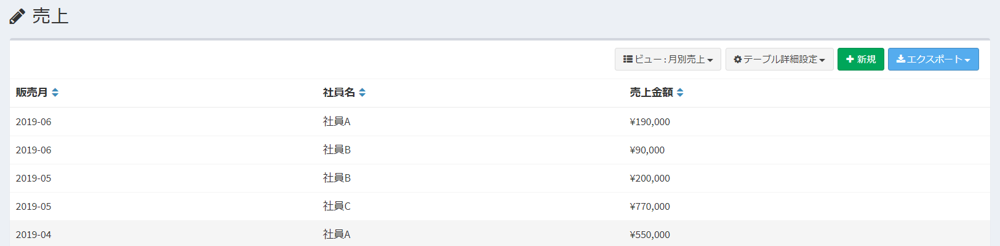
登録しているデータをグループ化し、合計、件数、最大値などの集計値を表示します。  
ダッシュボードでは、グラフを表示できます。

### カレンダービュー
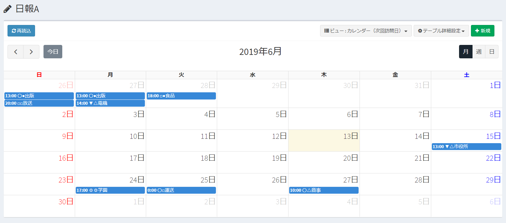
登録しているデータを、カレンダー形式で表示できます。

### 全件ビュー
基本的には通常ビューと同様ですが、以下の特徴があります。  
- システムで自動的に作成されます。    
- 1件のみ作成されます。ユーザーが新規作成や削除することはできません。
- [検索](/ja/search)画面で一覧表示されるときに使用されます。
- 集計ビューから、その明細データを表示する場合に使用されます。

### 条件ビュー
[通知](/ja/notify)時の通知条件や、カスタム列の列設定が「選択肢 (他のテーブルの値一覧から選択)」の場合に、絞り込みを行う場合に使用されます。
- 表示列設定は行いません。
- データ一覧画面では表示されません。
- 管理者のみ設定できます。一般ユーザーは設定できません。

## ページ表示
- カスタムテーブル一覧で、設定を行いたいテーブルにチェックを1つ入れ、右上の「テーブル詳細設定」をクリックします。  
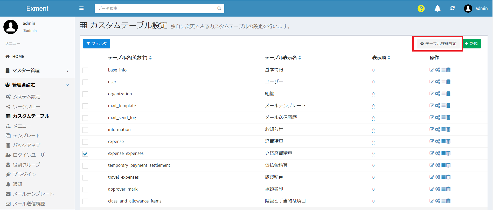
- もしくは、メニューから設定を行いたいテーブルを選択した後、同様に右上の「テーブル詳細設定」をクリックします。  
※該当のテーブルをメニューに表示する設定があらかじめ必要です。  
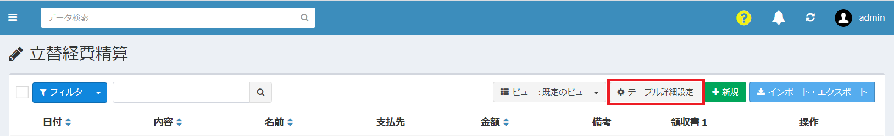
- 表示されたテーブル詳細設定の画面で、ビュー設定のアイコンをクリックします。
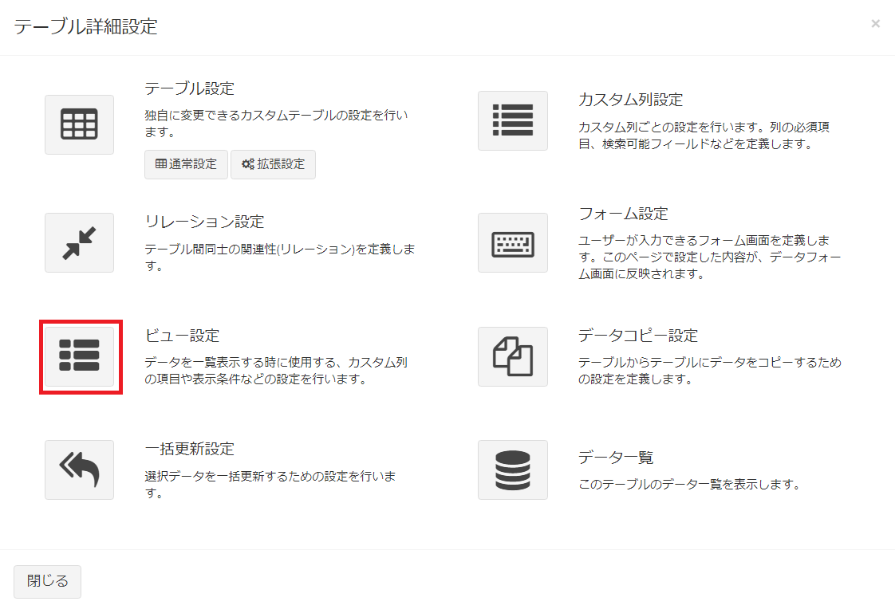

- これで、カスタムテーブルに設定してある、ビューの一覧を表示します。  

## ビューの新規追加
- 「カスタムビュー設定」画面で、ページ右上にある［新規］ボタンをクリックします。
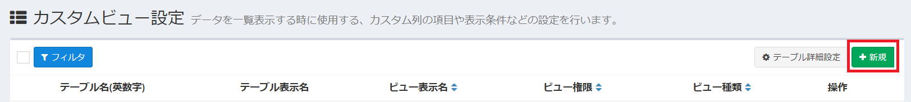
ダイアログに表示された中から、ビューとして作成したい種類のボタンをクリックします。
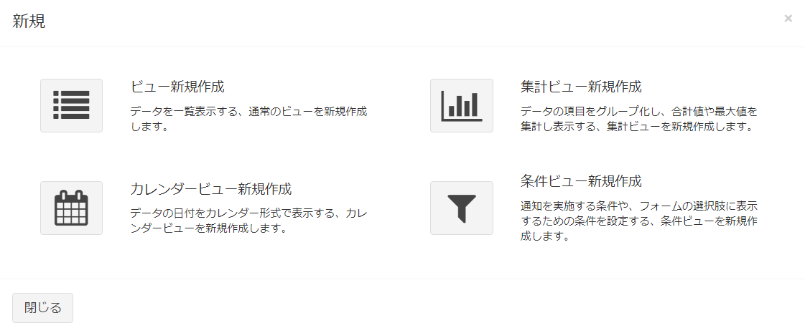
- ビューの新規追加画面が表示されるので、必要事項を入力します。
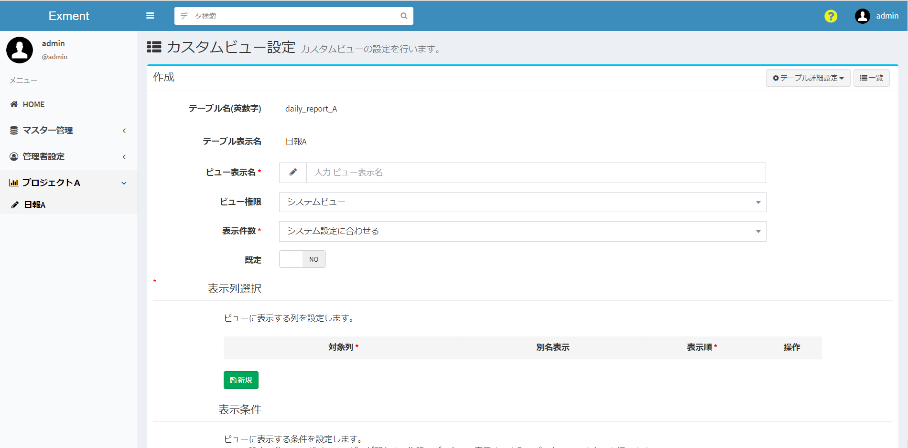

## ビューの設定項目
#### ビュー表示名
ビューの名前を入力します。  

#### ビュー権限
ビューを使用する権限を、システムビュー ・ ユーザービュー どちらかに設定します。

- システムビュー  
システム管理者のみが設定を行えます。  
テーブルへのアクセス権限がある全ユーザーが利用可能なビューになります。  

- ユーザービュー  
システム管理者以外でも設定を行えるビュー設定です。  
作成したユーザーのみが利用可能なビューになります。

※システムビューを後からユーザービューに変更することはできません。  
**システム管理者が作成したユーザービュー**に関しては、後からシステムビューに変更することが可能です。  
※[ユーザービュー無効](/ja/config.md?id=ユーザービュー無効)の設定を行うことで、一般ユーザーにはビューの作成が行えなくなります。

#### 表示件数
データ一覧において１ページあたり何件のデータを表示するか選択します。

#### 既定
ビューを複数作成する場合、ユーザーがデータ一覧を開いた際に表示されるのは「YES」に設定しているビューになります。  
※ビューの一覧から選択することで「NO」に設定しているビューも表示することが出来ます。  
※「既定」の項目を「YES」とできるのは、１つのカスタムテーブル内で１つのビューのみです。  
「既定」を２つ以上のビューで「YES」とする場合、最後に「YES」に設定したビュー以外は「NO」に変更されます。

#### 表示順
.envファイルの「EXMENT_SORT_CUSTOM_VIEW_OPTIONS」の設定値が0ではない場合に表示します。  
カスタムビューメニューボタンに表示されるビューの並び順を設定します。

#### ビューの情報ボックスを使用する
［YES］に設定することで、ビューの上部に情報ボックスを設けることができます。  
タイトルや本文を入力し、業務内容や、ユーザーへのメッセージとして表示することができます。
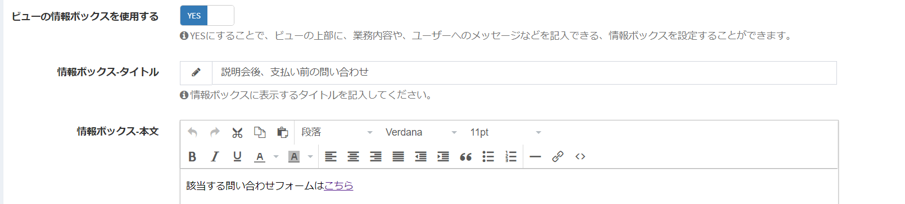

#### 表示列選択
ビューに表示する列の設定です。  
設定した列の一覧が、データ一覧画面などで表示されます。

##### 対象列  
ビューに表示する列です。  
  
##### 別名表示  
設定した名前でビューに表示されます。  

##### 表示順  
ビューに表示する項目の順序です。  
値が小さい順に、左から表示されます。

##### ［削除］ボタン  
ビューの表示を削除します。

##### ［新規］ボタン  
ビューの表示列を新規追加します。

#### 表示条件選択
ビューに表示する条件の設定です。  
期間内の項目のみを表示する、特定ステータスの内容のみを表示するなど、表示内容の絞り込みを行う場合に、条件を追加します。  
※この設定の他に、ログインユーザーが所有する権限のデータのみ表示するよう、データのフィルターを行います。権限のないデータは、この設定に関わらず表示されません。
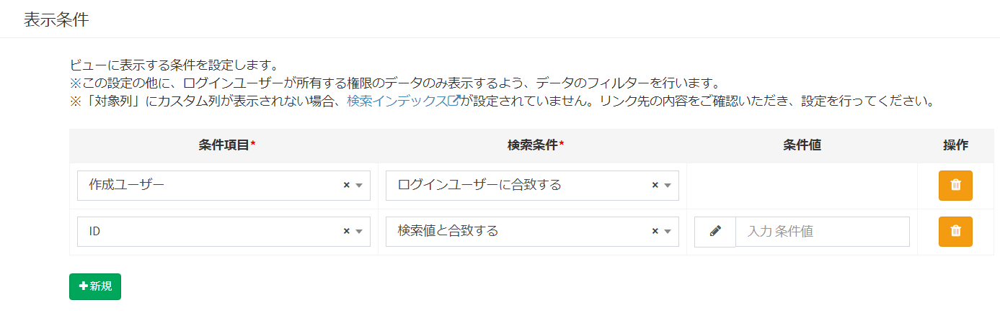
>条件項目の列種類が選択肢 (他のテーブルの値一覧から選択)の場合、条件値に表示される文言は、[見出し表示列設定](/ja/table#見出し表示列設定)で変更できます。

##### 対象列　　
絞り込み条件に使用する列です。  
  
##### 条件
条件の内容を選択します。  
詳細は、[検索条件について](/ja/view.md?id=検索条件について)をご確認ください。  

##### 検索値　　
検索条件の内容に合致するための条件を入力します。  
  
##### ［削除］ボタン　　
ビューの表示条件を削除します。
  
##### ［新規］ボタン　　
ビューの表示条件を新規追加します。

#####   条件の結合
「すべての条件に一致」を選択した場合は、全ての条件に一致するデータを表示します。  
「いずれかの条件に一致」を選択した場合は、いずれかの条件に一致するデータを表示します。

#####   条件の反転
「条件を反転する」をチェックオンした場合は、条件に一致しないデータを表示します。    
※集計ビューは表示条件反転機能の対象外です。

#### 検索条件について
「対象列」で選択した内容の種類（「日付」「ユーザー」など）によって、選択肢の項目は変更されます。  
このマニュアル項目では、特記すべき検索条件について記載します。

##### 対象列の種類が「日付」の場合
- X日前の日付以降  
- X日後の日付以降  
- X日前の日付以前  
- X日後の日付以前  
登録しているデータが、該当する範囲の日付で登録されている場合に、ビューに表示されます。  

例：現在日付が1/15で、検索値を「8」で登録している場合  

##### 対象列の種類が「ユーザー」の場合
- ログインユーザーに合致する  
登録しているデータが、ログインしているユーザーと合致する場合に、ビューに表示されます。  

- ログインユーザーに合致しない    
登録しているデータが、ログインしているユーザーと合致しない場合に、ビューに表示されます。  

## 集計ビューの新規追加
- 「カスタムビュー設定」画面で、ページ右上にある［新規］の「集計ビュー新規作成」をクリックします。

- 集計ビュー新規追加画面が表示されるので、必要事項を入力します。
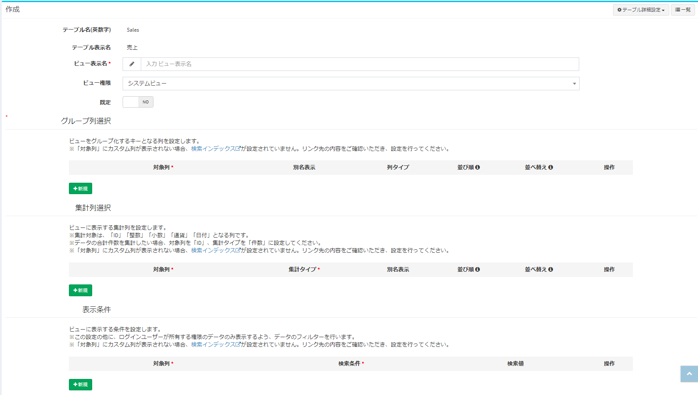

## 集計ビューの設定項目

#### ビュー表示名・ビュー権限・既定
上記の[ビューの設定項目](/ja/view.md?id=ビューの設定項目)と同様の設定項目になります。

#### グループ列選択
対象に選んだ列を基準として、集計におけるグループ化を行います。  
複数設定した場合には、複数項目による集計分けを行います。

##### 対象列  
グループ化にあたり基準とする列です。  

- 例1：対象列を２列設定した場合、画像のように、２列にわたりグループ化されて集計を行います。  
※"売上金額"はグループ列ではなく集計列として設定している列になっています。

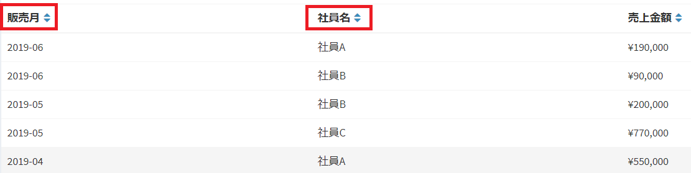  

- 例2："販売月"の列のみをグループ列として設定した場合には、例1で"社員名"の列を含めてグループ化されていたデータが、1つの列のグループに統合されて集計が行われます。  

  

##### 別名表示　　
設定した名前でビューに表示されます。  

##### 列タイプ　　
対象列のカスタム列種類が「日付」or「日付と時刻」の場合にのみ下記の中から選択できます。  
「年毎」「年月毎」「年月日毎」「月毎」「日毎」「曜日毎」  
対象列でのグループ化にあたり、設定した日付条件で行われます。  
※例1～3の画像は、販売月の列タイプを「年月毎」とした場合の表示となっています。

##### 並び順　　
集計ビューでのデータ表示の順番設定です。  
どの列における値の大小を優先させてデータを並べるか、参照する列の優先順位を設定します。  
設定する順番は、グループ列選択、集計列選択、両者を含めたものになります。  

- 例3：上記の 例2 では、並び順で"販売月"の列を1、"売上金額"を2としている場合の表示ですが、並び順で"販売月"を2、"売上金額"を1とした場合、下記画像のように、"売上金額"の列における値を優先させた並び順で表示されます。  

  

##### 並び替え  
対象列における並び替えにおいて、値の大小どちらを優先した順番にするかを設定します。  
「昇順(小さい順)」「降順(大きい順)」いずれかを選択します。  

- 例4：上記の 例3 では、並び替えで"売上金額"を降順としている場合の表示ですが、昇順とした場合には下記画像のように表示されます。  

  

##### ［矢印］ボタン
集計ビューにおける列の並び順を設定します。  
グループ列選択として上の項目にあるものが、集計ビューにおいて左に表示されます。  

##### ［削除］ボタン  
ビューのグループ列を削除します。

##### ［新規］ボタン  
ビューのグループ列を新規追加します。

#### 集計列選択
対象とする列の値によって集計を行います。  
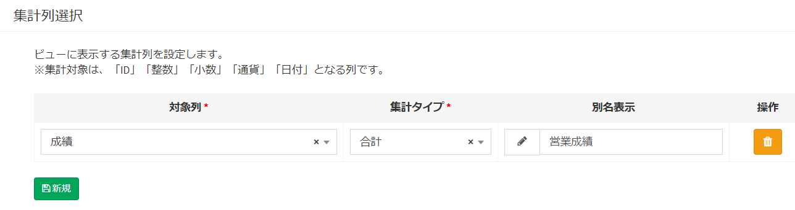
##### 対象列  
対象として値を集計する列です。  

##### 集計タイプ  
「合計」「件数」「最小値」「最大値」  
4種類の集計タイプの内、設定した集計結果が対象列のビューに表示されます。

##### 別名表示  
設定した名前でビューに表示されます。  

##### ［削除］ボタン  
ビューの集計列を削除します。
  
##### ［新規］ボタン  
ビューの集計列を新規追加します。

#### 表示条件
ビューに表示する条件の設定です。  
期間内の項目のみを表示する、特定ステータスの内容のみを表示するなど、表示内容の絞り込みを行う場合に、条件を追加します。  
※この設定の他に、ログインユーザーが所有する権限のデータのみ表示するよう、データのフィルターを行います。権限のないデータは、この設定に関わらず表示されません。

>条件項目の列種類が選択肢 (他のテーブルの値一覧から選択)の場合、条件値に表示される文言は、[見出し表示列設定](/ja/table#見出し表示列設定)で変更できます。

##### 対象列  
絞り込み条件に使用する列です。  
  
##### 検索条件  
条件の内容を選択します。  
詳細は、[検索条件について](/ja/view.md?id=検索条件について)をご確認ください。  
  
##### 検索値  
検索条件の内容に合致するための条件を入力します。  
  
##### ［削除］ボタン  
ビューの表示条件を削除します。
  
##### ［新規］ボタン  
ビューの表示条件を新規追加します。

## カレンダービューの新規追加

- 「カスタムビュー設定」画面で、ページ右上にある［新規］の「カレンダービュー新規作成」をクリックします。

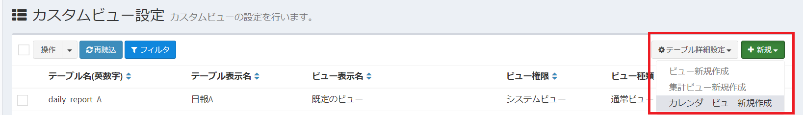

- カレンダービュー新規追加画面が表示されるので、必要事項を入力します。
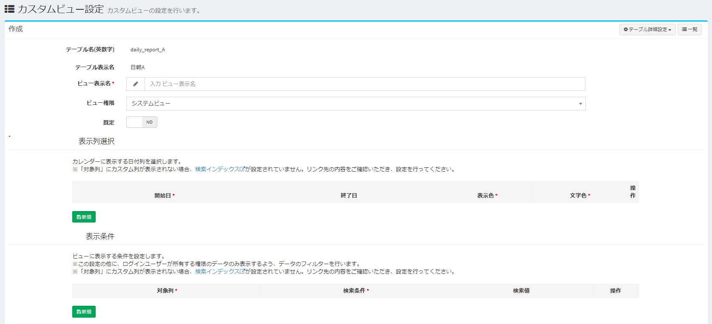

## カレンダービューの設定項目

#### ビュー表示名・ビュー権限・既定
上記の[ビューの設定項目](/ja/view.md?id=ビューの設定項目)と同様の設定項目になります。

#### 表示列選択
ビューに表示する列の設定です。  
カレンダービューでは、開始日と終了日を設定することにより、日付列のデータを期間として表示することが出来ます。  
※単日の表示をしたい列データの場合には、開始日のみを指定してください。

##### 開始日  
期間として開始日となる列を設定してください。  
※終了日の設定を行わない場合、開始日として設定した列が単日表示されます。

##### 終了日  
期間として終了日となる列を設定してください。

##### 表示色  
ビューに表示するデータの表示背景色を設定します。

##### 文字色  
ビューに表示するデータの表示文字色を設定します。

##### ［削除］ボタン  
ビューの表示を削除します。

##### ［新規］ボタン  
ビューの表示列を新規追加します。

#### 表示条件
ビューに表示する条件の設定です。  
期間内の項目のみを表示する、特定ステータスの内容のみを表示するなど、表示内容の絞り込みを行う場合に、条件を追加します。  
※この設定の他に、ログインユーザーが所有する権限のデータのみ表示するよう、データのフィルターを行います。権限のないデータは、この設定に関わらず表示されません。

>条件項目の列種類が選択肢 (他のテーブルの値一覧から選択)の場合、条件値に表示される文言は、[見出し表示列設定](/ja/table#見出し表示列設定)で変更できます。

##### 対象列  
絞り込み条件に使用する列です。  
  
##### 検索条件  
条件の内容を選択します。  
詳細は、[検索条件について](/ja/view.md?id=検索条件について)をご確認ください。  
  
##### 検索値  
検索条件の内容に合致するための条件を入力します。  
  
##### ［削除］ボタン  
ビューの表示条件を削除します。
  
##### ［新規］ボタン  
ビューの表示条件を新規追加します。

#### カレンダービューにおける見出し
画像例のように、カレンダービューではデータの対象日に見出しを表示することが出来ます。  

- 表示される見出しは、[見出し表示列設定](/ja/table#見出し表示列設定)で設定している部分になります。

- また、カスタム列の種類で「日付と時刻」にあたる列を表示列選択の開始日に設定している場合、登録データの時刻が見出しの先頭部分に表示されます。  

## 保存
設定を記入したら、［送信］をクリックしてください。

## 編集
ビューの編集を行いたい場合、該当する行の［編集］リンクをクリックしてください。  

## 削除
ビューの削除を行いたい場合、該当する行の［削除］リンクをクリックしてください。  

## カスタムビューの複製
［このビューの複製］リンクをクリックすると、同じ設定内容でビュー表示名だけ空欄のビューが複製されます。
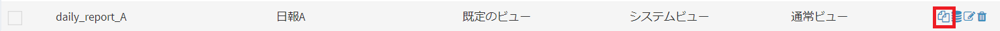

## データ一覧表示
［このビューでデータ一覧表示］ボタンをクリックすると、そのビュー設定でのデータ一覧が表示されます。

## カスタムビューの共有
作成したカスタムビューを、他のユーザー・組織に共有します。  
※共有対象となるのは「ユーザービュー」のみです。（「システムビュー」は最初から権限のある全てのユーザーに公開されています。）  
※共有先として選択できるのはテーブルへのアクセス権限があるユーザーまたは組織です。  

#### 共有方法
- カスタムビューの編集画面に「共有」ボタンが表示されているので、クリックします。  
※新規作成時にはこのボタンは表示されません。
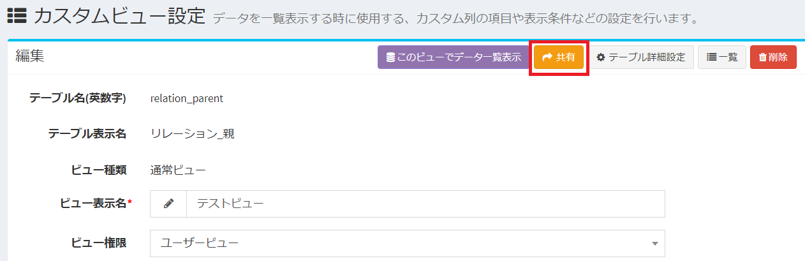  

- カスタムビューの共有ダイアログが表示されます。
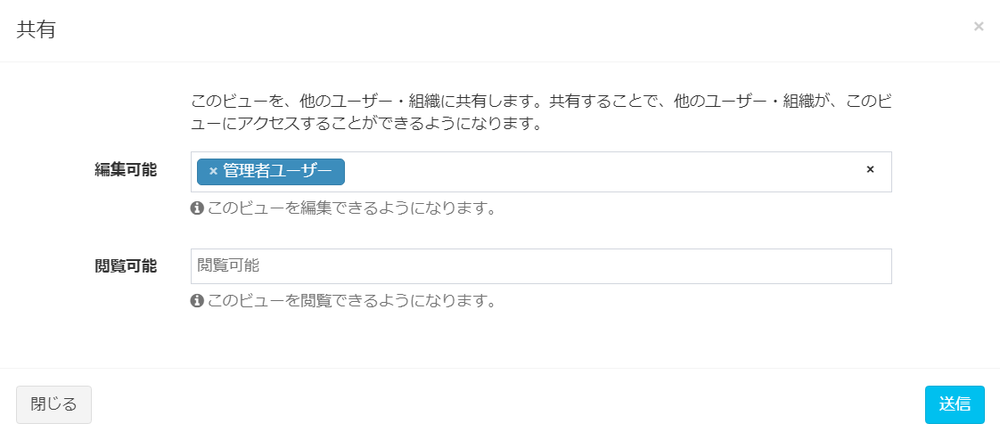  

- 共有したいユーザーまたは組織を追加して、「送信」をクリックし、共有を完了させます。  
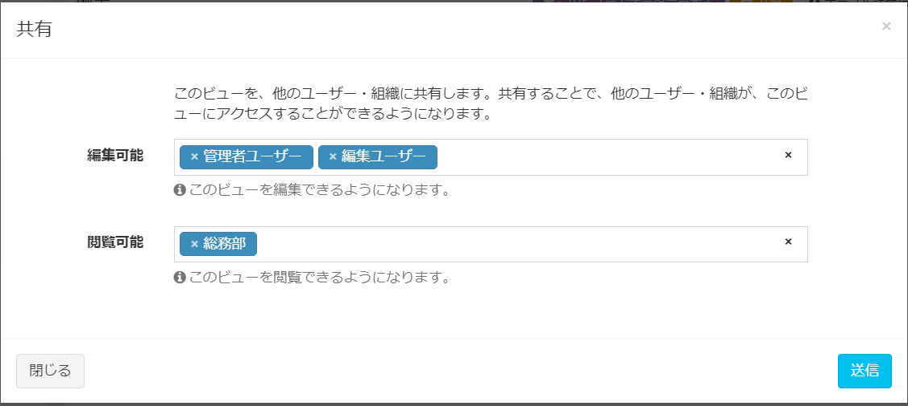  
