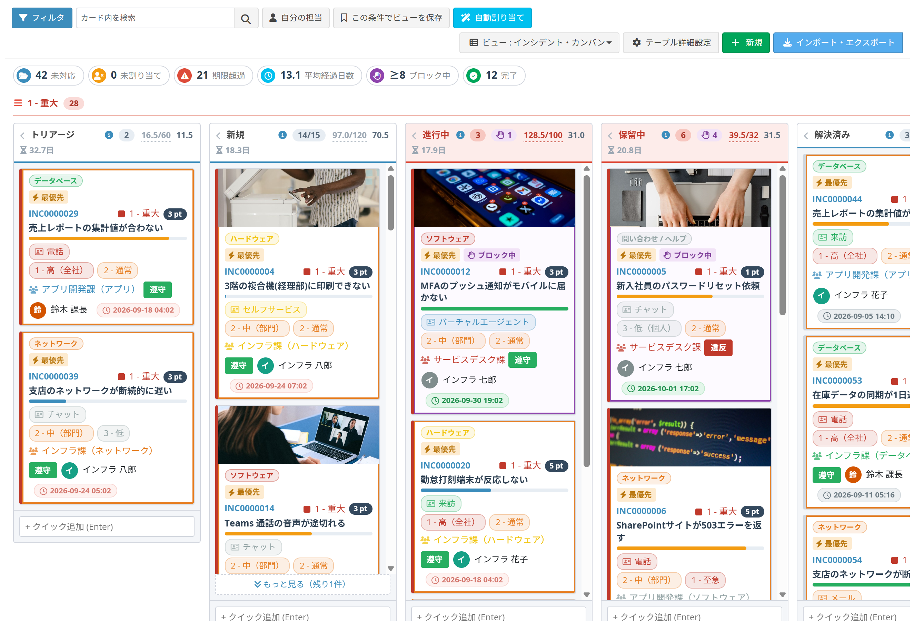
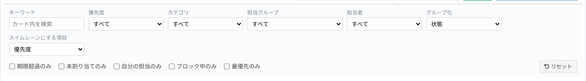

# カンバンビュー

データを「状態ごとの列」に並べたカード形式で表示し、ドラッグ＆ドロップで状態を変更できるビューです。

## カンバンビューとは

カンバン（かんばん）とは、仕事を1枚のカードで表し、「未対応」「対応中」「完了」のような工程の列に並べて管理する方法です。  
どの仕事がどの工程で止まっているかが一目で分かり、カードを次の列へ動かすだけで状態を進められます。

Exment のカンバンビューでは、次のことができます。

- 選択肢の列（状態・優先度など）、またはワークフローの状態を、そのまま縦の列にする
- カードをドラッグして、その項目の値を更新する
- カードに担当者・期限・ラベル・進捗バーなどを表示する
- 列ごとの件数・合計金額・平均滞留日数を見出しに表示する
- カードをクリックして、ボードの上で編集フォームを開く

## ビューの新規追加

1. カスタムビュー設定画面を開きます（[カスタムビュー](/ja/view.md)を参照）。
2. 右上の［新規］ボタンをクリックします。
3. 表示されたダイアログから「カンバンビュー新規作成」を選択します。

## 基本設定

#### カンバンの列の作り方
カンバンの縦の列を、どこから作るかを選びます。

| 選択肢 | 内容 |
| --- | --- |
| 選択肢の列から作る | 下の「カンバンの列にする項目」の選択肢が、そのまま列になります。 |
| ワークフローの状態から作る | このテーブルに適用されているワークフローの状態が列になります。カードを動かすと、その状態へ進めるワークフロー操作の確認画面が開きます。ワークフローで許可されていない移動はできません。 |

※ワークフローを設定していないテーブルでは、この項目は表示されません。

#### カンバンの列にする項目
この列の選択肢が、カンバンの縦の列になります。  
※選択肢の列（複数選択でないもの）のみ指定できます。  
※「カンバンの列の作り方」が「ワークフローの状態から作る」の場合、この設定は使いません。

#### カードのタイトルにする項目
カード内で太字のタイトルとして表示する列です。  
※指定した場合、カード上部にデータの表示名がリンクとして表示されます。  
※指定しない場合、データの表示名がそのままタイトルになります。

#### 担当者の項目
担当者を表す列です。カード下部にアバター付きで表示され、未入力のカードには「未割り当て」が表示されます。  
集計バーの「未割り当て」、フィルタの「未割り当てのみ」、一括変更の「担当一括変更」でも使用します。

※設定しない場合、アバター・集計バーの「未割り当て」・フィルタの「未割り当てのみ」・「担当一括変更」・カード上での担当者の変更・「自動割り当て」は表示されません。

#### 期限の項目(SLAタイマー)
期限（締切）の日付列です。現在時刻との差から、カードに「残○h内」「まもなく期限」「期限超過」のバッジを表示します。  
※「完了とみなす値」のデータは「達成」と表示します。  
※設定しない場合、期限のバッジ・集計バーの「期限超過」・フィルタの「期限超過のみ」・カード上での期限の変更は表示されません。

#### ドラッグ＆ドロップでの変更を許可する
YESにすると、カードを他の列へドラッグしたときに「カンバンの列にする項目」の値を更新します。  
※データの編集権限がないユーザーは、YESでもドラッグできません。

## カードに表示する列

カードの中に並べる項目を設定します。設定しない場合、カードにはタイトルのみ表示されます。

| 項目 | 内容 |
| --- | --- |
| 対象列 | カードに表示する列 |
| 別名表示 | カードに表示する名前を変更する場合に入力 |
| 表示位置 | カード内のどこに出すか |
| 表示スタイル | どのような見た目で出すか |
| アイコン | Font Awesome のクラス名（例：fa-phone） |

### 表示位置

| 選択肢 | 表示場所 |
| --- | --- |
| カード上部 | タイトルの上 |
| 本文1行目 | タイトルの下、1行目 |
| 本文2行目 | タイトルの下、2行目 |
| カード下部 | カードの一番下 |

### 表示スタイル

データ一覧と同じ「セルの表示プリセット」から選びます。見た目を一度決めれば、一覧でもカンバンでも同じ表示になります。

| 設定 | カードの表示 |
| --- | --- |
| プリセットを選ぶ | そのプリセットの見た目（タグ、ピル、バッジ、ドット、アバターなど）で表示します。**列の設定より優先されます** |
| 未選択 | 列側の「表示プリセット」または列の表示設定に従います |
| どちらも未設定 | 「項目名：値」の形で表示します |

値ごとの色は列側の設定がそのまま使われます。形だけをプリセットが決めるので、同じプリセットをどの列にも使えます。

鉛筆ボタンからプリセットの新規作成・編集ができます。詳しくは [セルの表示プリセット](/ja/cell_style_preset.md) を参照してください。

> 以前のバージョンでカンバン専用のスタイル（「タグ」「ピル」など）を設定していたビューは、バージョンアップ時に同じ見た目のプリセットへ自動的に置き換わります。以後は上の表のとおり、この欄で表示を変更できます。
>
> ワークフロー状態や作成日時など「列ではない項目」も、プリセットを選べば同じ見た目で表示できます。ただし値ごとの色は列の設定なので、これらの項目には適用されません。

### アイコン
Font Awesome のクラス名（例：fa-phone）を入力します。プリセットにアイコンが含まれている場合も、ここの指定が優先されます。  
選択肢ごとにアイコンを変えたい場合は「値:クラス名」をカンマ区切りで入力します。  
例：`phone:fa-phone,mail:fa-envelope,chat:fa-comments`

## 詳細設定（必要な場合のみ）

初期値のままでもカンバンは動作します。必要になったときだけ設定してください。

### カードの見た目を増やす

#### カバー画像の項目
カードの上部にカバーとして表示する画像列です。  
※画像が未登録のデータは、カバーなしで表示されます。複数登録されている場合は1枚目を使用します。

#### カバー画像の表示方法
「全面(はみ出しをカット)」は枠いっぱいに表示し、はみ出す部分をカットします。  
「全体表示(余白あり)」は画像全体を収め、余白が付きます。

#### ラベル(色付き)の項目
カード上部に色付きラベルとして表示する選択肢列です。複数選択できる列も指定できます。  
※指定した列はフィルタにも追加されます。

#### ラベルの表示方法
「チップ(文字付き)」は文字入りの小さなラベル、「カラーバーのみ」は色だけの細いバーです。

#### バッジの項目
カード右上に小さなバッジとして表示する列です（件数・ポイント・番号など）。値が空のデータには表示されません。

#### 進捗バーにする数値項目 / 進捗バーの最大値
カードのタイトルの下に進捗バーを表示します。  
0%〜49%は青、50%〜99%はオレンジ、100%は緑になります。  
「進捗バーの最大値」は、バーが100%になる値です（未入力の場合は100）。

#### 経過日数の基準となる項目 / 経過日数の色分け
経過日数を計算する基準の日付列です（受付日など）。経過日数に応じてカードの左端の色が変わります。  
「経過日数の色分け」は、色が変わる日数を小さい順にカンマ区切りで3つ入力します。  
例：`1,2,3` → 1日で黄、2日で橙、3日以上で赤。  
例：`3,7,14` → 長い工程向け。

#### 期限が近いと判断する時間(時間)
期限までこの時間を切ったカードを「まもなく期限」（黄色）にします。  
例：問い合わせなら 2（時間）、納期が日単位なら 48（＝2日）。未入力の場合は2時間です。

### 列の管理

#### スイムレーンにする項目
この列の値ごとに、カンバンを横方向に区切って表示します。指定しない場合、区切りなしで表示します。

#### 列見出しに合計を表示する項目
列の見出しの下に、この数値項目の合計を表示します。  
例：金額を選ぶと「役員承認 ¥34,700,000」のように、その列で止まっている金額が一目で分かります。  
※表示専用です。WIP上限には影響しません。

#### 列ごとの平均滞留日数を表示する
列の見出しの下に、その列のカードが平均何日そこに留まっているかを表示します。どの工程で滞留しているか（ボトルネック）が分かります。  
※ワークフローの場合は「その状態になった日時」、それ以外は「最終更新日時」から数えます。

#### WIP上限(列ごとの上限件数)
列ごとに「同時に持てる件数の上限」を設定します。上限を超えた列は、見出しが赤くなります。

| 項目 | 内容 |
| --- | --- |
| 対象の列 | 上限を設定する列（テーブルの選択肢から選びます） |
| 上限件数 | その列に同時に置ける件数 |

#### WIPの数え方(数値項目)
WIP上限を「件数」ではなく、この数値項目の合計で数えます。  
例：数量を選ぶと、列の見出しに「1550/1200」のように合計値と上限が表示されます。  
※整数・小数・通貨の項目のみ指定できます。

#### WIP上限を超える移動

| 選択肢 | 動作 |
| --- | --- |
| 許可する(見出しを赤くするだけ) | 従来どおり。見出しが赤くなるだけで、移動はできます。 |
| 確認してから許可する | 確認メッセージを出し、OKなら移動します。 |
| 許可しない | 上限に達した列はドラッグ中に灰色になり、移動できません。 |

※「最優先(特急)とみなす値」のカードは、この制限を受けません。ただし件数には数えます。

#### 列ごとのルール(方針)
列の見出しに、その列の決まりごとを表示します。マークにマウスを乗せると内容が出ます。  
例：「テスト中」の列に「テスト仕様書の全項目にOKが付いたら次へ」と書いておくと、次に進める条件が全員に見えます。

#### 完了とみなす値
「完了」として扱うカンバンの列を、テーブルの選択肢から選びます。  
選んだ列のデータは、期限のカウントを止め、集計バーの「完了」に数えます。  
※ワークフローから作る場合、「完了」と設定された状態は自動的に完了として扱うため、ここでの指定は不要です。

#### ブロック中とみなす値
「止まっている仕事」を表す値を選びます。選んだ値を持つカードは赤い枠と旗マークが付き、集計バーとフィルタに「ブロック中」が追加されます。

#### 最優先(特急)とみなす値
「割り込みの最優先案件」を表す値を選びます。選んだ値を持つカードは目立つ枠が付き、その値でスイムレーンを分けている場合はそのレーンが一番上に固定されます。  
※多くの値を最優先にすると意味がなくなります。1つか2つに絞ってください。

#### ボードに表示しない列
選んだ値の列をボードに表示しません。  
例：「完了」「取止め」を選ぶと、終わった仕事が消えて、進行中の仕事だけのボードになります。  
※非表示の列のデータは読み込みません。件数が多いテーブルでは、これだけで表示が大幅に速くなります。

### ボードの機能

| 項目 | 内容 |
| --- | --- |
| 「自分の担当」の判定に使う項目 | ツールバーの「自分の担当」ボタンが、どの列を見て「自分のカード」と判断するかを決めます。指定しない場合は「担当者の項目」を使います。 |
| 自動割り当ての基準となる項目 | 自動割り当ての判断に使う列です（担当グループなど）。同じ値のデータで最も多く担当している人を、未割り当てのカードに推奨します。 |
| 集計バー(KPI)を表示する | カンバンの上に件数の集計バーを表示します。 |
| クイック追加を表示する | 各列の下に入力欄を表示し、Enterキーだけでデータを追加できます。 |
| 複数選択・一括変更を許可する | Shift＋クリックで複数のカードを選択し、まとめて値を変更できます。 |
| カードのクリックで編集フォームを開く | カードをクリックしたときに、そのデータの編集フォームをボードの上に開きます。 |
| カードのクリックで詳細パネルを開く | カードをクリックしたときに右側から詳細パネルを開きます。 |
| 詳細パネルに承認履歴を表示する | カードの詳細パネルに、ワークフローの承認履歴を表示します。 |

※「編集フォームを開く」と「詳細パネルを開く」の両方をYESにした場合、クリックは編集フォームになり、詳細パネルはカード右上の「i」ボタンから開きます。  
※どちらもNOの場合、クリックするとデータの詳細画面へ移動します。

### 読み込み件数

#### 列ごとの読み込み件数
1つの列につき最初に読み込むカードの件数です。  
0（未入力）にすると、ボード全体で「最大表示件数」まで読み込みます。  
50などを入れると、列ごとに50件ずつ読み込み、列の下に［もっと見る］ボタンが出ます。

※件数・合計・平均滞留日数・集計バーは、読み込んだカードではなくデータベース全体を集計した正しい値になります。  
※**データが数千件ある場合はこの方式を推奨します。**「最大表示件数」の上限に縛られません。

#### 最大表示件数
カンバンに表示するデータの最大件数です。件数が多いと表示が遅くなります。

## ボードの使い方

### 画面の見方

#### ツールバー

| ボタン | 内容 |
| --- | --- |
| フィルタ | 絞り込みのパネルを開きます |
| カード内を検索 | キーワードでカードを絞り込みます |
| 自分の担当 | 自分が担当のカードだけを表示します |
| この条件でビューを保存 | いまの絞り込み条件で、新しいビューを作成します |
| 自動割り当て | 未割り当てのカードに担当者を推奨します |

#### 集計バー（KPI）

未対応・未割り当て・期限超過・平均経過日数・完了などの件数を表示します。  
※絞り込みたい場合は、［フィルタ］の「期限超過のみ」「未割り当てのみ」などのチェックを使用してください。

#### 列の見出し

左から、列名・件数（WIP上限がある場合は「件数/上限」）・合計金額・平均滞留日数が並びます。  
左端の「‹」をクリックすると、列を折りたたむことができます。

#### カード

設定に応じて、ラベル・番号・優先度・経過日数・タイトル・進捗バー・各項目・担当者・期限が表示されます。

### カードを動かす

カードを別の列へドラッグすると、「カンバンの列にする項目」の値が更新されます。  
更新後は画面下部に［元に戻す］が表示され、直前の移動を取り消せます。

※編集権限がない場合はドラッグできません。  
※ワークフローから作った列の場合は、ワークフロー操作の確認画面が開きます。

### フィルタ

［フィルタ］をクリックすると、絞り込みのパネルが開きます。

- 各項目の値で絞り込めます
- 「グループ化」「スイムレーンにする項目」は、この画面から一時的に切り替えられます
- 「期限超過のみ」「未割り当てのみ」「自分の担当のみ」のチェックが使えます

絞り込んだ状態で［この条件でビューを保存］をクリックすると、その条件のビューを新しく作成できます。

### 編集フォーム

「カードのクリックで編集フォームを開く」をYESにしている場合、カードをクリックするとボードの上に編集フォームが開きます。

- 保存するとフォームが閉じ、**そのカードだけ**が書き換わります。ボード全体の読み込み直しは発生しません。
- 入力エラーがある場合は、フォームを開いたまま項目の横にメッセージが表示されます。
- Esc キーで閉じられます。

### 詳細パネル

カード右上の「i」ボタン（詳細パネルのみ有効な場合はカードのクリック）で、右側から詳細パネルが開きます。

- カードに出していない項目も確認できます
- ［移動先］の選択で、ドラッグせずに列を変更できます
- ［データを開く］で通常の詳細画面へ移動します

ワークフローを設定しているテーブルでは、実行できるワークフロー操作のボタンと、承認履歴が表示されます。

### 複数選択・一括変更

「複数選択・一括変更を許可する」をYESにしている場合、**Shift＋クリック**（または Ctrl＋クリック）で複数のカードを選択できます。

- ［一括変更…］で、選択したカードの列（状態など）をまとめて変更します
- ［担当一括変更…］で、担当者をまとめて変更します
- ［選択解除］で選択を解除します

### クイック追加

「クイック追加を表示する」をYESにしている場合、各列の一番下に入力欄が表示されます。  
タイトルを入力して Enter キーを押すだけで、その列の値が入ったデータを新規登録できます。

※登録されるのは、表示名の列と、その列（状態など）の値だけです。ほかの項目は後から編集してください。

## ワークフローから列を作る

「カンバンの列の作り方」で「ワークフローの状態から作る」を選ぶと、テーブルに適用されているワークフローの状態がそのまま列になります。

- カードを動かすと、その状態へ進めるワークフロー操作の確認画面が開きます
- ワークフローで許可されていない移動はできません
- 「完了」と設定された状態は、自動的に完了として扱われます

申請・承認の業務では、承認待ちの件数や金額を列ごとに表示できるため、どこで承認が止まっているかがすぐに分かります。

## 大量データを扱うときは

データが数千件を超えるテーブルでは、次の設定を推奨します。

1. **「列ごとの読み込み件数」に 50 程度を設定する**  
   列ごとに少しずつ読み込み、必要な分だけ［もっと見る］で追加します。件数や合計は、読み込んだカードではなくデータベース全体の正しい値が表示されます。
2. **「ボードに表示しない列」で完了系の列を除く**  
   終わった仕事を読み込まないだけで、表示速度が大きく改善します。
3. **ビューの「データ表示条件」で対象を絞る**  
   期間や担当部署などで、そもそも読み込む範囲を狭めます。

## 関連項目

- [カスタムビュー](/ja/view.md)
- [データ一覧の操作ツール](/ja/data_grid_tools.md)
- [ワークフロー設定](/ja/workflow_setting.md)
- [フロー デザイナー](/ja/workflow_design.md)
