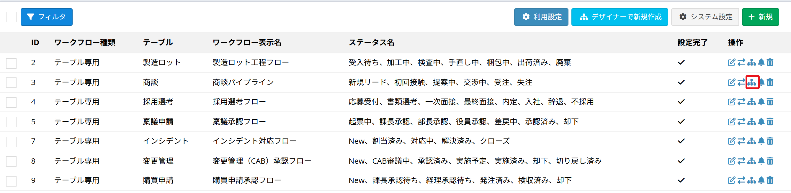
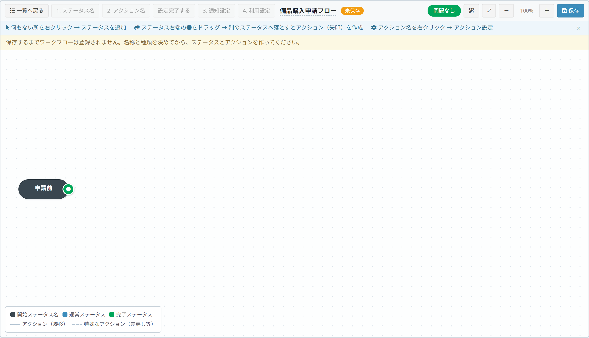

# フロー デザイナー

ワークフローのステータス（状態）とアクション（操作）を、フロー図の上で直接作成・編集できる画面です。

## フロー デザイナーとは

[ワークフロー設定](/ja/workflow_setting.md)では、ステータスを「ステップ1」の表で、アクションを「ステップ2」の表で設定します。  
表だけで設定していると、次のような点が分かりにくくなります。

- どのステータスから、どのステータスへ進めるのか
- 行き止まりになっているステータスがないか
- 差戻しの経路が正しくつながっているか

フロー デザイナーは、その内容を **図として見ながら** 作成・編集するための画面です。

- 保存先はステップ1・ステップ2と同じです。デザイナーで作ったものは、そのままステップ1・2の表に反映されます
- どちらの画面から設定しても構いません。図で作って、細かい条件は表で調整する、という使い方もできます

## 画面を開く

### 1. 既存のワークフローを図で編集する

ワークフロー設定の一覧で、対象の行の［フロー デザイナー］アイコンをクリックします。

ステップ1・ステップ2の画面からも、右上の［フロー デザイナー］ボタンで開けます。

### 2. 新しいワークフローを図から作る

ワークフロー設定の一覧で、右上の［デザイナーで新規作成］ボタンをクリックします。

## 画面の見方

### ツールバー

| 項目 | 内容 |
| --- | --- |
| 一覧へ戻る | ワークフロー設定の一覧に戻ります |
| 1. ステータス名 / 2. アクション名 | 表形式の設定画面（ステップ1・ステップ2）へ移動します |
| 3. 通知設定 / 4. 利用設定 | 設定完了後に使用できます |
| （ワークフロー名） | 編集中のワークフロー名です |
| 問題なし / 要確認 ○件 | 入力チェックの結果です。クリックすると内容が表示されます |
| 自動整列 | ノードの位置を自動で並べ直します |
| ⤢（全体表示） | 図全体が収まるように表示します |
| －／＋ | 表示倍率を変えます |
| 保存 | 編集内容を保存します |

### 操作のヒント

画面上部には、基本的な操作が常に表示されています。

### 凡例

| 表示 | 意味 |
| --- | --- |
| 黒いノード | 開始ステータス |
| 青いノード | 通常のステータス |
| 緑のノード | 完了ステータス |
| 実線の矢印 | アクション（次のステータスへ進む操作） |
| 破線の矢印 | 特殊なアクション（差戻しなど、作業ユーザーに含めない操作） |

ノードに付く「完了」「ロック」のマークは、それぞれ完了ステータス・データの編集不可を表します。

## 基本操作

### ステータスを追加する

図の **何もない場所を右クリック** し、［ステータスを追加］を選択します。

| 項目 | 内容 |
| --- | --- |
| ステータスを追加 | 右クリックした位置に新しいステータスを作ります |
| 自動整列 | ノードの位置を自動で並べ直します |
| 全体表示 | 図全体が収まるように表示します |

### アクション（矢印）を作る

ステータスの **右端にある●をドラッグ** し、別のステータスの上で離します。  
2つのステータスをつなぐアクション（矢印）が作成されます。

何もない場所で離した場合は、「新しいステータスを作成して接続」を選べます。ステータスの作成とアクションの作成を続けて行えます。

### アクションの設定を変える

**アクション名を右クリック** し、［アクション設定］を選択します。

| 項目 | 内容 |
| --- | --- |
| アクション設定 | アクション名・実行可能ユーザー・オプションを設定します |
| アクションを削除 | この矢印（アクション）を削除します |

### ステータスの設定を変える

**ステータスを右クリック** すると、ステータス名の変更、完了ステータスの指定、削除ができます。

※データが入っているステータスは削除できません。削除しようとすると「使用中のため削除できません」と表示されます。  
※開始ステータスは削除できません。名前の変更のみ行えます。

### 図の配置を整える

- ノードはドラッグで自由に動かせます
- ［自動整列］で、左から右へ流れる形に自動で並べ直します
- ［⤢（全体表示）］で、図全体が画面に収まる倍率にします

### 保存する

右上の［保存］ボタンをクリックします。  
保存するまで、変更内容はデータベースに反映されません。保存していない変更があるときは、ツールバーに「未保存」と表示されます。

※保存せずにページを離れようとすると、確認メッセージが表示されます。  
※他の人が同じワークフローを先に更新していた場合は、「ほかの画面でこのワークフローが更新されています」と表示されます。ページを再読み込みしてから、もう一度保存してください。

## 要確認（入力チェック）

ツールバーの右側には、入力内容のチェック結果が常に表示されます。

- 問題がない場合は緑の「問題なし」
- 問題がある場合はオレンジの「要確認 ○件」

クリックすると内容が一覧で表示され、さらにクリックすると該当する箇所へ移動します。

主なチェック内容は次のとおりです。

| メッセージ | 意味 |
| --- | --- |
| ワークフロー名が未入力です | 名前を入力しないと保存できません |
| 開始ステータス名が未入力です | 開始ステータスの名前を入力してください |
| 「○○」から始まるアクションがありません | 開始ステータスから次へ進む矢印がありません |
| 「○○」へ到達するアクションがありません | どこからも到達できないステータスがあります |
| 「○○」から出るアクションがなく、完了ステータスでもありません | 行き止まりのステータスがあります |
| アクション「○○」の実行前と実行後が同じステータスです | 同じステータスに戻る矢印は設定できません |
| アクション「○○」の実行可能ユーザーが未設定です | 誰が実行できるかを設定してください |
| アクション名が未入力の行があります | すべてのアクションに名前が必要です |

## デザイナーで新規作成

［デザイナーで新規作成］から開いた場合、最初に「基本情報」のダイアログが表示されます。

| 項目 | 内容 |
| --- | --- |
| ワークフロー表示名 | ワークフローの名前 |
| ワークフロー種類 | 「汎用」または「テーブル専用」 |
| 開始ステータス名 | 最初のステータスの名前（「起票中」「申請前」など） |

入力して［保存］すると、図の左側に開始ステータスが表示されます。

その後、右クリックでステータスを追加し、●をドラッグしてアクションをつないでいきます。

> **保存するまでワークフローは登録されません。**  
> ステータスとアクションを作って保存すると、ツールバーの［設定完了する］が押せるようになり、ステップ3（通知設定）・ステップ4（利用設定）へ進めます。

## ステップ2の「フロー プレビュー」

ステップ2（アクション設定）の画面にも、右側にフロー図が表示されます。

- 表を編集すると、図がすぐに更新されます
- 図の中のアクションをクリックすると、左の表の該当行が選択されます
- ［＋アクション追加］で、表に行を追加します
- ［要確認 ○件］は、デザイナーと同じ入力チェックです

### 配置を保存（ピンのボタン）

ノードを動かした配置を記録するかどうかを切り替えます。

- ピンが押された状態で画面を保存すると、いまの配置が記録され、次に開いたときも同じ並びになります
- 押されていない場合、配置は保存されず、毎回自動整列で表示されます

### プレビューを隠す

図が不要な場合は、［プレビューを隠す］で非表示にできます。表の入力欄を広く使えます。

## 注意点

#### 設定完了済みのワークフローを編集する場合
すでに運用を開始しているワークフローでも、ステータスの追加・並べ替えやアクションの編集はできます。  
ただし、**データが入っているステータスは削除できません。**

#### 完了ステータスが複数ある場合
フロー デザイナーでは、「承認済み」「却下」のように完了ステータスを複数設定できます。  
ただし、**ステップ1の画面で保存すると、表の最終行の1件だけが完了ステータスになります。**  
完了ステータスを複数使う場合は、ステップ1で保存せず、フロー デザイナーで保存してください。

#### 絞り込み条件（分岐）について
アクションの絞り込み条件は、ステップ2の画面で設定します。  
フロー デザイナーで保存しても、設定済みの条件は消えません。図の中では「条件1」「条件2」として分岐が表示されます。

## 関連項目

- [ワークフロー設定](/ja/workflow_setting.md)
- [ワークフロー設定例](/ja/workflow_example.md)
- [ワークフロー実施](/ja/workflow_execution.md)
- [カンバンビュー](/ja/view_kanban.md)
