# ワークフロー設定例
Exmentで使用する、ワークフローの設定例をいくつかご紹介します。

- [申請 → 承認・却下](#example1)  
データの申請、承認・却下を行う、シンプルなフローのご紹介です。  

- [申請 → 部長承認or課長承認・却下](#example2)  
申請したデータの金額に応じて、アクションの振り分け、担当者の変更を行う場合の、設定方法のご紹介です。  

- [未申請 → 確認1 → 確認2 → 完了(最初の実行ユーザー情報から取得)](#example4)   
「未申請 → 確認1 → 確認2 → 完了」のフローの設定方法のご紹介です。アクションの実行可能ユーザーは、「最初の実行ユーザー情報から取得」とします。

- [未申請 → 確認1 → 確認2 → 完了(実行ユーザー情報から取得)](#example5)  
「未申請 → 確認1 → 確認2 → 完了」のフローの設定方法のご紹介です。アクションの実行可能ユーザーは、「実行ユーザー情報から取得」とします。

- [データのロック](#example3)  
特定のデータをロック(編集・削除不可)させたい場合の、設定方法のご紹介です。  

<h2 id="example1"><a href="#/ja/workflow_example?id=example1" data-id="example1" class="anchor">申請 → 承認・却下</a></h2>

データの申請、承認・却下を行う、シンプルなフローの設定方法です。  

  
- ユーザーは、管理部に申請する
- 管理部は、申請を承認する。もしくは却下する
- 承認されたデータは、以降修正することはできない

### Step1.ステータス設定

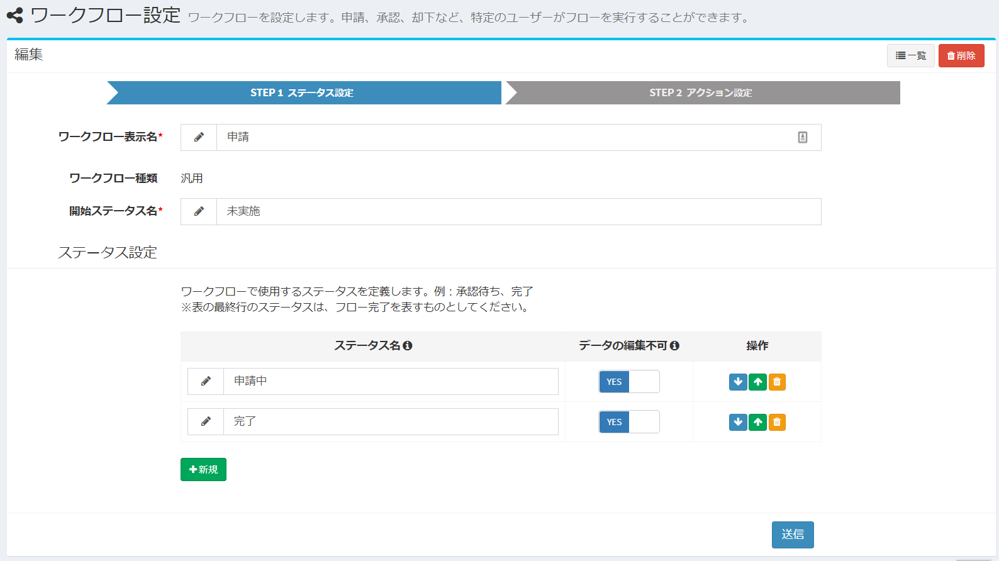  

- **ワークフロー表示名** : 任意の名称

- **ワークフロー種類** : 「汎用」

- **開始ステータス名** : 「未実施」

- **ステータス 1行目**  
ステータス名：「申請中」  
データの編集不可：「YES」  

- **ステータス 2行目**  
ステータス名：「完了」  
データの編集不可：「YES」  

### Step2.アクション設定

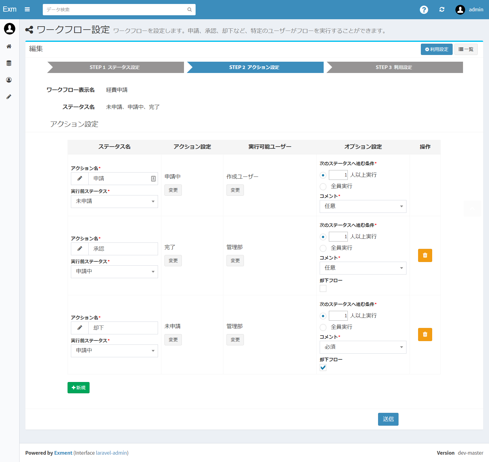  

- **アクション設定 1行目**  
アクション名：「申請」  
実行前ステータス：「未実施」  
アクション設定 > 実行後ステータス：「申請中」  
実行可能ユーザー : 「作成ユーザー」  
オプション設定 > 次のステータスへ進む条件 : 「1人以上実行」  
オプション設定 > コメント : 「任意」  

- **アクション設定 2行目**  
アクション名：「承認」  
実行前ステータス：「申請中」  
アクション設定 > 実行後ステータス：「完了」  
実行可能ユーザー : 「管理グループ」※あらかじめ、組織「管理グループ」を作成してください  
オプション設定 > 次のステータスへ進む条件 : 「2人以上実行」  
オプション設定 > コメント : 「任意」  
オプション設定 > 特殊なアクション : チェックなし  

- **アクション設定 3行目**  
アクション名：「却下」  
実行前ステータス：「申請中」  
アクション設定 > 実行後ステータス：「未実施」  
実行可能ユーザー : 「管理グループ」※あらかじめ、組織「管理グループ」を作成してください  
オプション設定 > 次のステータスへ進む条件 : 「1人以上実行」  
オプション設定 > コメント : 「必須」  
オプション設定 > 特殊なアクション : チェックあり  

<h2 id="example2"><a href="#/ja/workflow_example?id=example2" data-id="example2" class="anchor">申請 → 部長承認or課長承認・却下</a></h2>

申請したデータの金額に応じて、アクションの振り分け、担当者の変更を行う場合の、設定方法のご紹介です。    

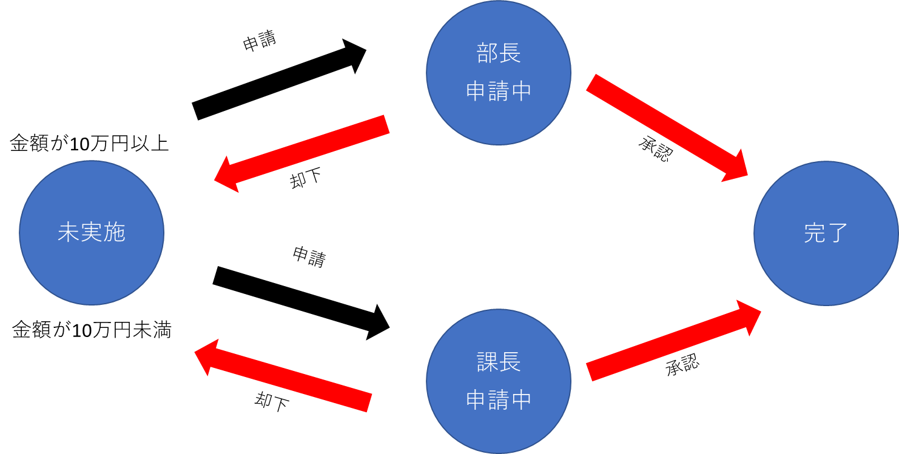
  
- ユーザーは、経費の申請を行う
- 申請データの「金額」が100,000円以上であれば部長に、100,000円未満であれば課長に、自動的に振り分けられる
- 部長もしくは課長は、申請を承認する。もしくは却下する
- 承認されたデータは、以降修正することはできない

### Step1.ステータス設定

  

- **ワークフロー表示名** : 任意の名称

- **ワークフロー種類** : 「テーブル専用」

- **テーブル** : ワークフローを実施するテーブルを選択

- **開始ステータス名** : 「未申請」

- **ステータス 1行目**  
ステータス名：「部長申請中」  
データの編集不可：「YES」  

- **ステータス 2行目**  
ステータス名：「課長申請中」  
データの編集不可：「YES」  

- **ステータス 3行目**  
ステータス名：「完了」  
データの編集不可：「YES」  

### Step2.アクション設定

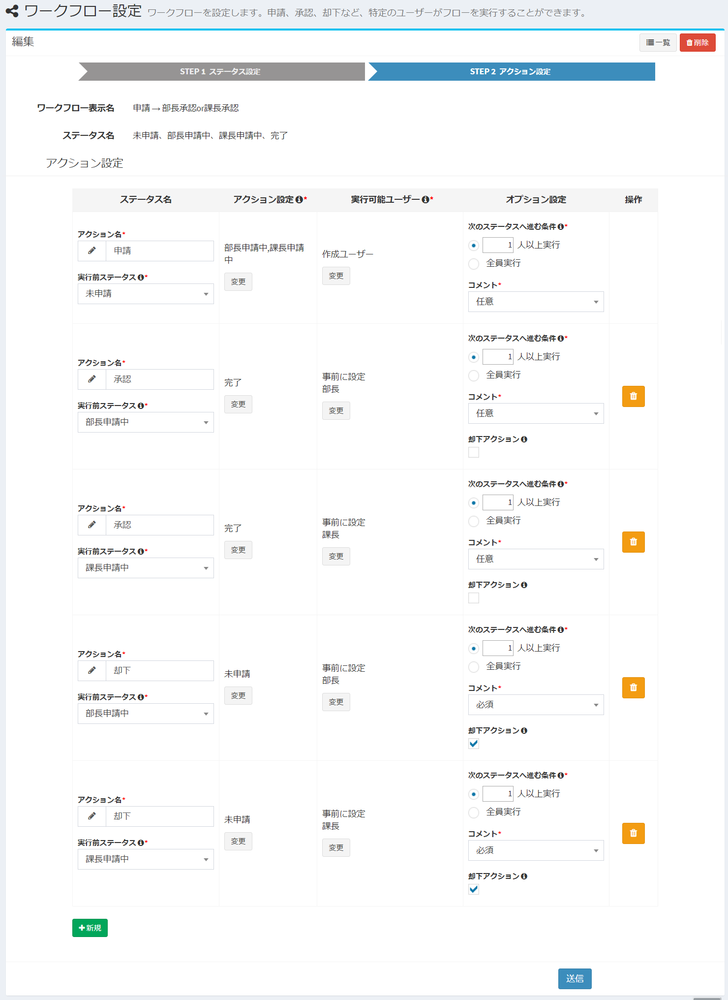  

- **アクション設定 1行目**  
アクション名：「申請」  
実行前ステータス：「未申請」  
アクション設定 > 実行後ステータス：下記画像を参照  

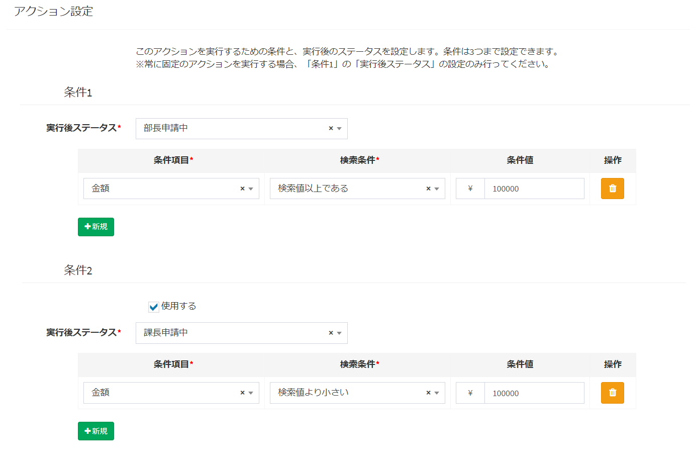  
>条件項目の列種類が選択肢 (他のテーブルの値一覧から選択)の場合、条件値に表示される文言は、[見出し表示列設定](/ja/table#見出し表示列設定)で変更できます。

実行可能ユーザー : 「作成ユーザー」  
オプション設定 > 次のステータスへ進む条件 : 「1人以上実行」  
オプション設定 > コメント : 「任意」  

- **アクション設定 2行目**  
アクション名：「承認」  
実行前ステータス：「部長申請中」  
アクション設定 > 実行後ステータス：「完了」  
実行可能ユーザー : 「部長」※あらかじめ、組織「部長」を作成してください  
オプション設定 > 次のステータスへ進む条件 : 「1人以上実行」  
オプション設定 > コメント : 「任意」  
オプション設定 > 特殊なアクション : チェックなし  

- **アクション設定 3行目**  
アクション名：「承認」  
実行前ステータス：「課長申請中」  
アクション設定 > 実行後ステータス：「完了」  
実行可能ユーザー : 「課長」※あらかじめ、組織「課長」を作成してください  
オプション設定 > 次のステータスへ進む条件 : 「1人以上実行」  
オプション設定 > コメント : 「任意」  
オプション設定 > 特殊なアクション : チェックなし  

- **アクション設定 4行目**  
アクション名：「却下」  
実行前ステータス：「部長申請中」  
アクション設定 > 実行後ステータス：「未実施」  
実行可能ユーザー : 「部長」※あらかじめ、組織「部長」を作成してください  
オプション設定 > 次のステータスへ進む条件 : 「1人以上実行」  
オプション設定 > コメント : 「必須」  
オプション設定 > 特殊なアクション : チェックあり  

- **アクション設定 5行目**  
アクション名：「却下」  
実行前ステータス：「課長申請中」  
アクション設定 > 実行後ステータス：「未実施」  
実行可能ユーザー : 「課長」※あらかじめ、組織「課長」を作成してください  
オプション設定 > 次のステータスへ進む条件 : 「1人以上実行」  
オプション設定 > コメント : 「必須」  
オプション設定 > 特殊なアクション : チェックあり  

<h2 id="example4"><a href="#/ja/workflow_example?id=example4" data-id="example4" class="anchor">未申請 → 確認1 → 確認2 → 完了(最初の実行ユーザー情報から取得)</a></h2>

「未申請 → 確認1 → 確認2 → 完了」のフローの設定方法のご紹介です。アクションの実行可能ユーザーは、「最初の実行ユーザー情報から取得」とします。   

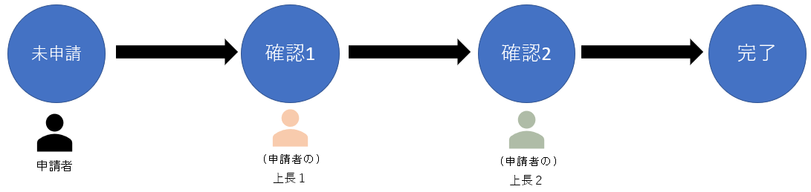
  
- アクション「確認1」は、申請者（フローの最初の実行ユーザー）の、列「上長1」に設定されているユーザーが実行可能となる
- アクション「確認2」は、申請者（フローの最初の実行ユーザー）の、列「上長2」に設定されているユーザーが実行可能となる

### Step0.ユーザー列設定

はじめに、「ユーザー」テーブルのカスタム列設定で、以下の列を追加してください。

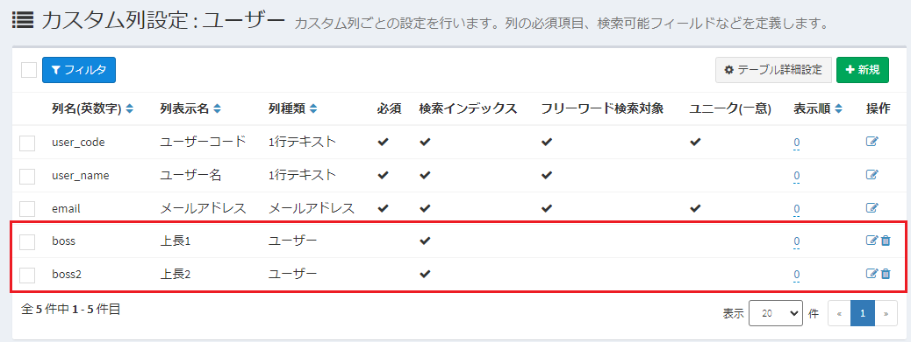  

- 列1：
    - 列名(英数字)：「boss1」
    - 列表示名：「上長1」
    - 検索インデックス：YES
    - 列種類：ユーザー

- 列2：
    - 列名(英数字)：「boss2」
    - 列表示名：「上長2」
    - 検索インデックス：YES
    - 列種類：ユーザー
  
その後、各ユーザー情報を編集し、列「上長1」「上長2」の項目を登録してください。

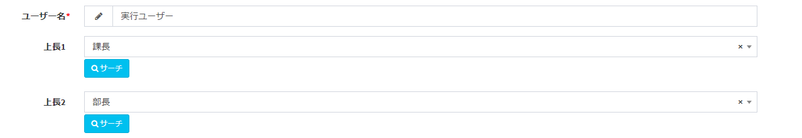  

※ユーザー「実行ユーザー」に、上記のようにデータが登録されていた場合、ワークフローは以下のように実行されます。

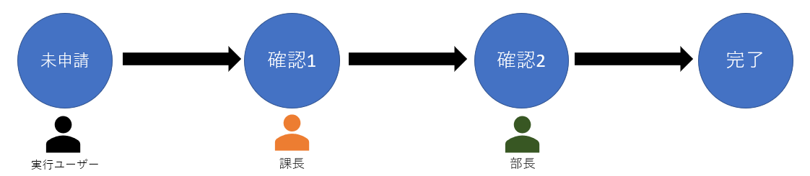  

### Step1.ステータス設定

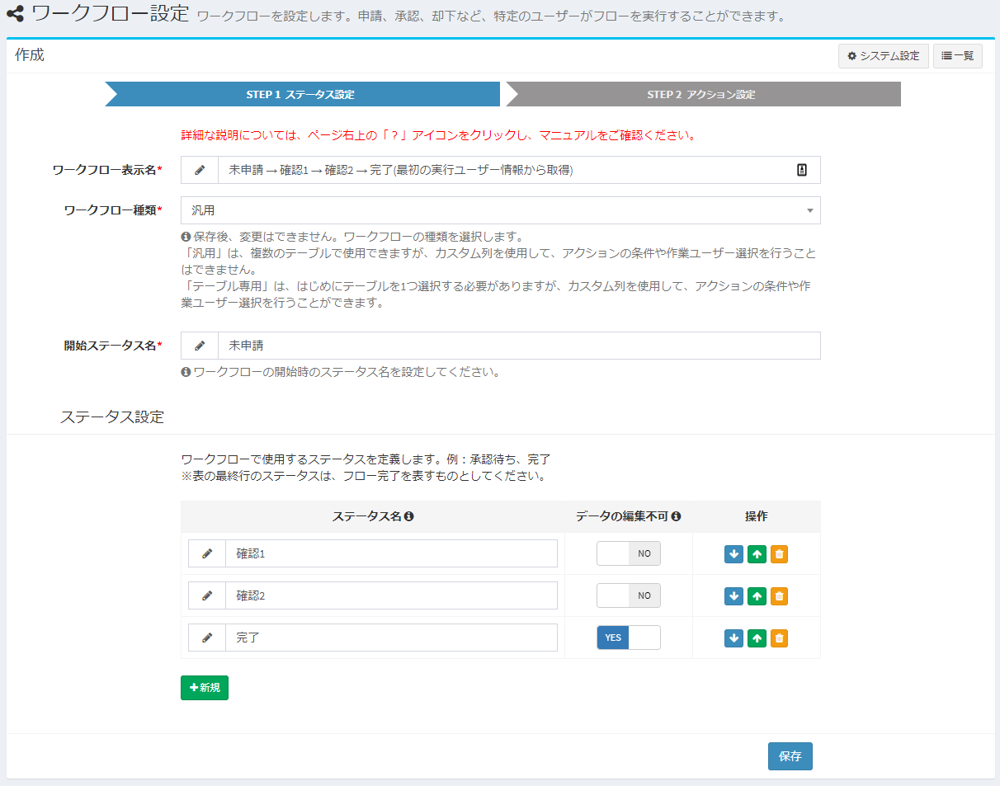

- **ワークフロー表示名** : 任意の名称

- **ワークフロー種類** : 「汎用」

- **開始ステータス名** : 「未申請」

- **ステータス 1行目**  
ステータス名：「確認1」  
データの編集不可：「NO」  

- **ステータス 2行目**  
ステータス名：「確認2」  
データの編集不可：「NO」  

- **ステータス 3行目**  
ステータス名：「完了」  
データの編集不可：「YES」  

### Step2.アクション設定

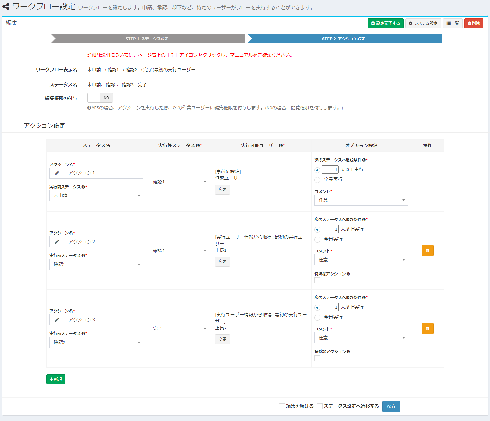  

- **共通設定**  
実行可能ユーザーの基準ユーザー : 「最初の実行ユーザー」  

- **アクション設定 1行目**  
アクション名：「アクション1」  
実行前ステータス：「未申請」  
実行後ステータス：確認1  
実行可能ユーザー : 「作成ユーザー」  
オプション設定 > 次のステータスへ進む条件 : 「1人以上実行」  
オプション設定 > コメント : 「任意」  

- **アクション設定 2行目**  
アクション名：「アクション2」  
実行前ステータス：「確認1」  
実行後ステータス：「確認2」  
実行可能ユーザー : (実行ユーザー情報から取得)上長1  
オプション設定 > 次のステータスへ進む条件 : 「1人以上実行」  
オプション設定 > コメント : 「任意」  
オプション設定 > 特殊なアクション : チェックなし  

- **アクション設定 3行目**  
アクション名：「アクション3」  
実行前ステータス：「確認2」  
実行後ステータス：「完了」  
実行可能ユーザー : (実行ユーザー情報から取得)上長2  
オプション設定 > 次のステータスへ進む条件 : 「1人以上実行」  
オプション設定 > コメント : 「任意」  
オプション設定 > 特殊なアクション : チェックなし  

#### 参考：「実行可能ユーザー」の変更ボタンをクリックしたときのダイアログ

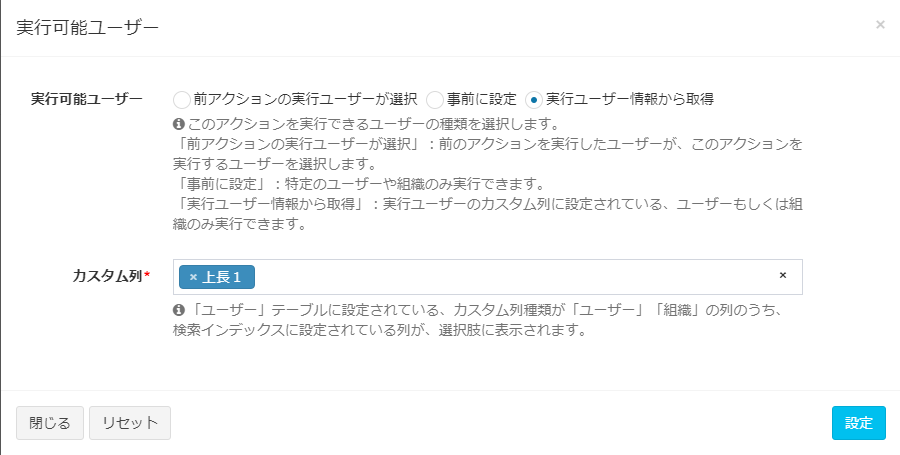  

<h2 id="example5"><a href="#/ja/workflow_example?id=example5" data-id="example5" class="anchor">未申請 → 確認1 → 確認2 → 完了(実行ユーザー情報から取得)</a></h2>

「未申請 → 確認1 → 確認2 → 完了」のフローの設定方法のご紹介です。アクションの実行可能ユーザーは、「実行ユーザー情報から取得」とします。   

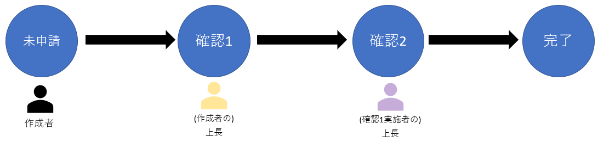
  
- アクション「確認1」は、申請者（フローの最初の実行ユーザー）の、列「上長」に設定されているユーザーが実行可能となる
- アクション「確認2」は、アクション「確認1」を実行したユーザーの、列「上長」に設定されているユーザーが実行可能となる

### Step0.ユーザー列設定

はじめに、「ユーザー」テーブルのカスタム列設定で、以下の列を追加してください。

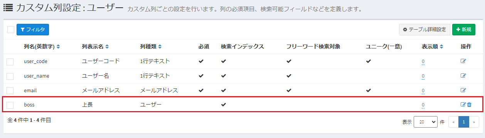  

- 列：
    - 列名(英数字)：「boss」
    - 列表示名：「上長」
    - 検索インデックス：YES
    - 列種類：ユーザー

  
その後、各ユーザー情報を編集し、列「上長」の項目を登録してください。  
まずは、最初のユーザー「実行ユーザー」のデータを、以下のようにします。

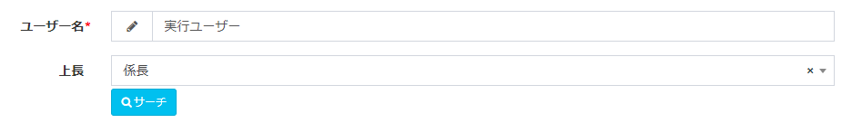  

また、ユーザー「係長」のデータを、以下のようにします。

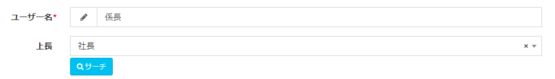  

※上記のようにデータが登録されていた場合、ワークフローは以下のように実行されます。

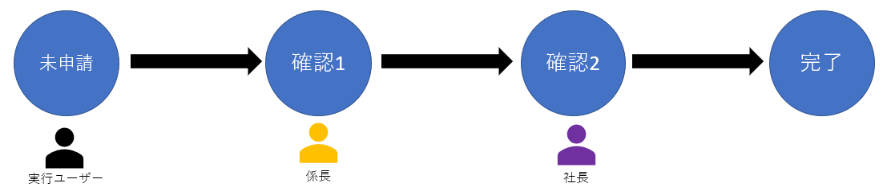  

### Step1.ステータス設定

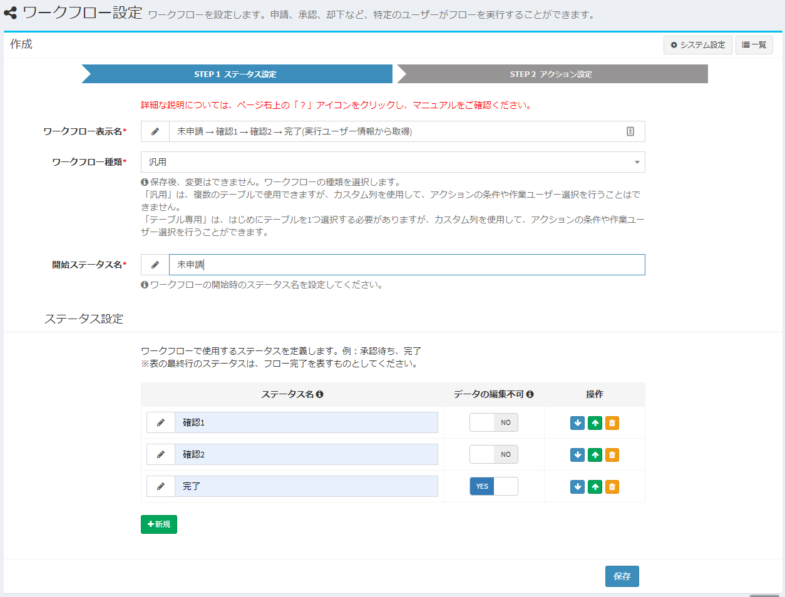

- **ワークフロー表示名** : 任意の名称

- **ワークフロー種類** : 「汎用」

- **開始ステータス名** : 「未申請」

- **ステータス 1行目**  
ステータス名：「確認1」  
データの編集不可：「NO」  

- **ステータス 2行目**  
ステータス名：「確認2」  
データの編集不可：「NO」  

- **ステータス 3行目**  
ステータス名：「完了」  
データの編集不可：「YES」  

### Step2.アクション設定

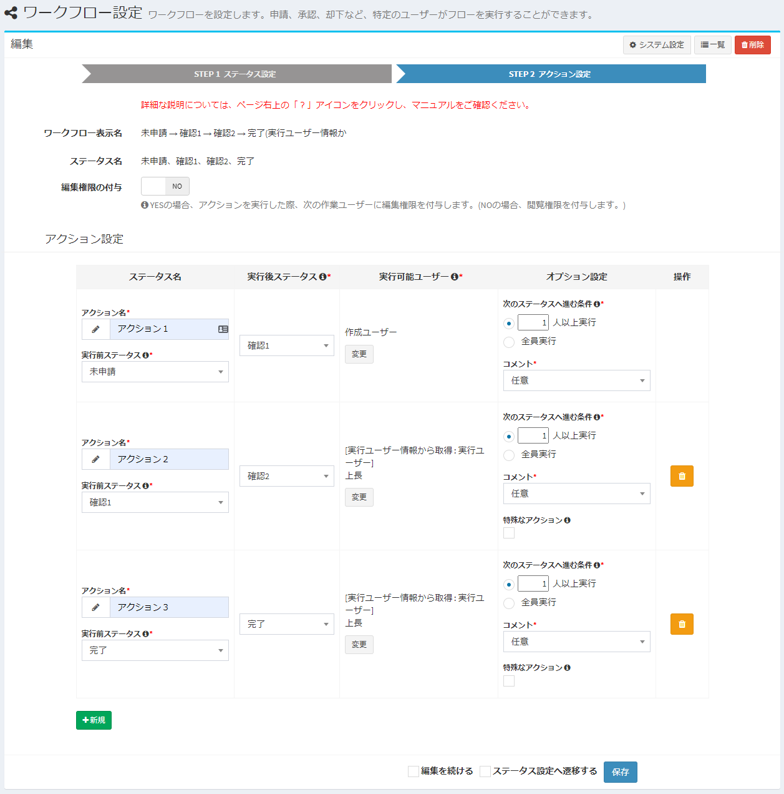  

- **共通設定**  
実行可能ユーザーの基準ユーザー : 「実行ユーザー」  

- **アクション設定 1行目**  
アクション名：「アクション1」  
実行前ステータス：「未申請」  
実行後ステータス：確認1  
実行可能ユーザー : 「作成ユーザー」  
オプション設定 > 次のステータスへ進む条件 : 「1人以上実行」  
オプション設定 > コメント : 「任意」  

- **アクション設定 2行目**  
アクション名：「アクション2」  
実行前ステータス：「確認1」  
実行後ステータス：「確認2」  
実行可能ユーザー : (実行ユーザー情報から取得)上長  
オプション設定 > 次のステータスへ進む条件 : 「1人以上実行」  
オプション設定 > コメント : 「任意」  
オプション設定 > 特殊なアクション : チェックなし  

- **アクション設定 3行目**  
アクション名：「アクション3」  
実行前ステータス：「確認2」  
実行後ステータス：「完了」  
実行可能ユーザー : (実行ユーザー情報から取得)上長  
オプション設定 > 次のステータスへ進む条件 : 「1人以上実行」  
オプション設定 > コメント : 「任意」  
オプション設定 > 特殊なアクション : チェックなし  

#### 参考：「実行可能ユーザー」の変更ボタンをクリックしたときのダイアログ

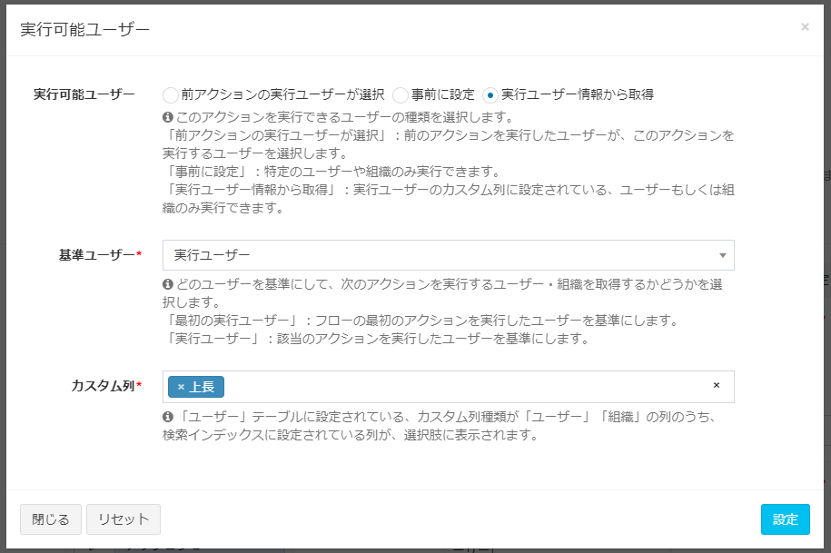  

<h2 id="example3"><a href="#/ja/workflow_example?id=example3" data-id="example3" class="anchor">データのロック</a></h2>

特定のデータをロック(編集・削除不可)させたい場合の、設定方法のご紹介です。  

  
- 作成者は、データをロック／ロック解除する
- ロックされたデータは、解除するまで修正することはできない

### Step1.ステータス設定

  

- **ワークフロー表示名** : 任意の名称

- **ワークフロー種類** : 「汎用」

- **開始ステータス名** : 「未実施」

- **ステータス 1行目**  
ステータス名：「ロック」  
データの編集不可：「YES」  

### Step2.アクション設定

  

- **アクション設定 1行目**  
アクション名：「ロック実施」  
実行前ステータス：「未実施」  
アクション設定 > 実行後ステータス：「ロック」  
実行可能ユーザー : 「作成ユーザー」  
オプション設定 > 次のステータスへ進む条件 : 「1人以上実行」  
オプション設定 > コメント : 「任意」  

- **アクション設定 2行目**  
アクション名：「ロック解除」  
実行前ステータス：「ロック」  
アクション設定 > 実行後ステータス：「未実施」  
実行可能ユーザー : 「作成ユーザー」  
オプション設定 > 次のステータスへ進む条件 : 「1人以上実行」  
オプション設定 > コメント : 「任意」  
オプション設定 > 特殊なアクション : チェックあり  

