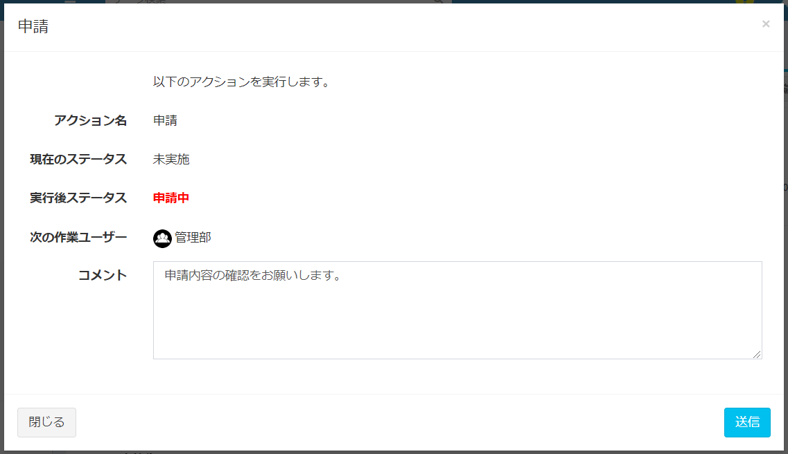

# ワークフロー実行
管理者が設定したワークフローを、各ユーザーが実行するための手順です。
あらかじめ、管理者が[ワークフロー設定](/ja/workflow_example)を行う必要があります。

## ワークフロー実施
- 各ユーザーがデータを参照時、現在のステータスと、次にアクションを行う作業ユーザー・組織が表示されます。
  

- ログインユーザーに次のアクションを行う権限がある場合、アクションボタンがページ右上に表示されます。  
  

- ボタンをクリックすることで、アクションの実行確認ダイアログが表示されます。  
  

   - アクション名  
   今回実行するアクションの名称が表示されます。  

   - ステータス  
   このアクションを実行する前後のステータスが表示されます。  

   - 次の作業ユーザー  
   このアクション実行後の、作業ユーザー・組織が表示されます。  

   - コメント  
   アクション実施時のコメントを入力してください。  

- 内容に問題なければ、［送信］をクリックすることで、アクションが実行されます。

- アクションが実行されると、「現在のステータス」や「現在の作業ユーザー」が変更されます。  
※この時、ワークフロー設定によって「現在のステータス」に鍵マークが表示されることがあります。その場合、データはロックされ、編集や削除ができなくなります。

  

