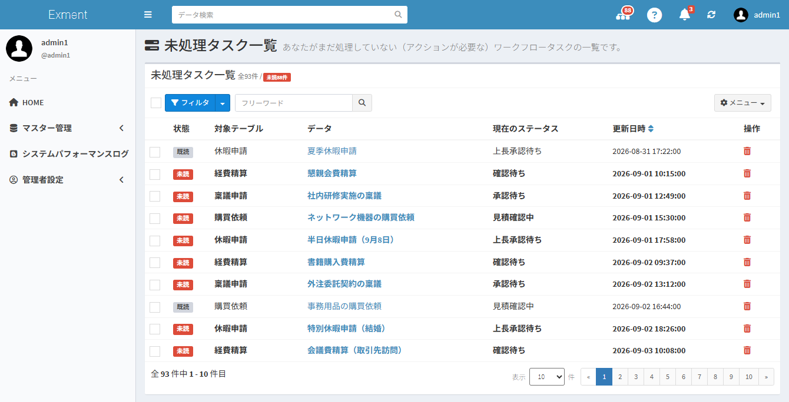
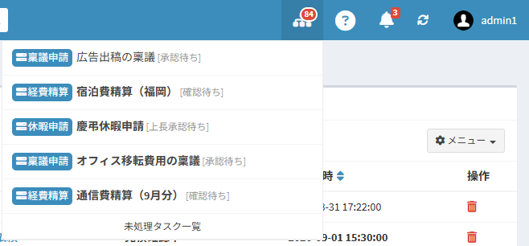
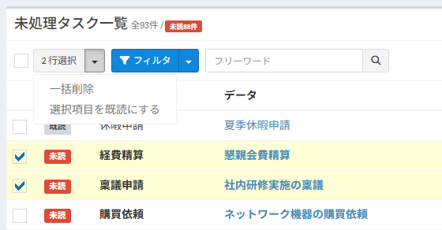
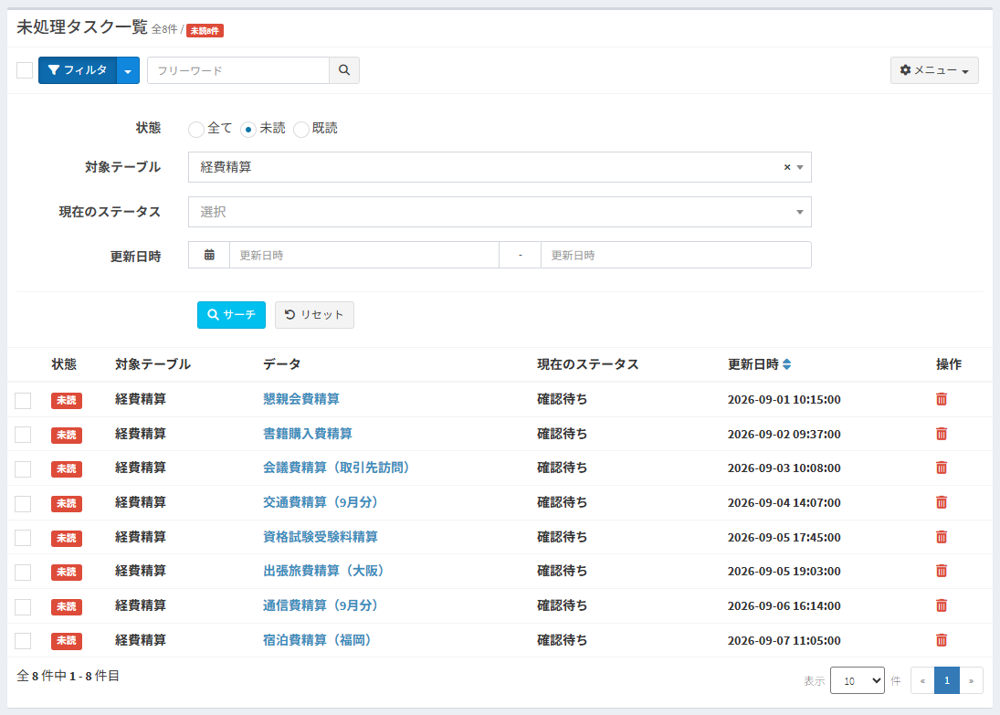
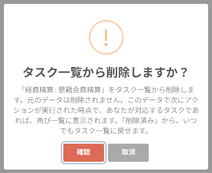
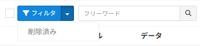

# 未処理タスク

ログインユーザーがアクションを実行する必要があるワークフローのデータ（タスク）を、すべてのテーブルからまとめて表示する画面です。  
ページ右上のアイコンからも、未処理のタスクをいつでも確認できます。

## 未処理タスクとは

ワークフローを利用していると、次のようなことが起こりがちです。

- 承認を待っているデータがどのテーブルにあるのか、テーブルを1つずつ開かないと分からない
- 申請が届いていることに気付かず、処理が止まってしまう

未処理タスク一覧は、ログインユーザーが **いまアクションを実行できるデータ** を、テーブルをまたいで1つの一覧に表示します。  
一覧から開くと、そのデータの詳細画面に移動し、そのままアクションを実行できます。

### 一覧に表示されるデータ

次の条件をすべて満たすデータが、タスクとして表示されます。

- 「使用する」に設定された、設定完了済みのワークフローのデータであること
- ログインユーザー、またはログインユーザーが所属する組織が、現在のステータスの作業ユーザーであること
- データの詳細画面に、ログインユーザーが実行できるアクションのボタンが表示されること
  - アクション設定の条件を満たさないデータは表示されません
  - 「次のステータスへ進む条件」が2人以上のアクションで、ログインユーザーがすでにアクションを実行した場合は表示されません
  - 「特殊なアクション」は、タスクの対象になりません
- ログインユーザーが、そのデータを参照する権限を持っていること

※一覧に表示されるのは、ログインユーザー自身のタスクだけです。システム管理者であっても、他のユーザーのタスクは表示されません。  
※開始ステータスのデータ（まだ申請していないデータなど）は、最初のアクション（申請など）を実行できるユーザーにタスクとして表示されます。  
※ワークフローの「使用終了日」を過ぎた場合でも、すでに進行中のデータは、完了するまでタスクとして表示されます。

## 画面を開く

### ページ右上のアイコンから開く

ログインすると、ページ右上に未処理タスクのアイコンが表示されます。  
赤い数字は、まだ開いていない（未読の）タスクの件数です。

アイコンをクリックすると、更新日時が新しいタスクから最大5件が表示されます。

- 未読のタスクは太字で表示されます
- タスクをクリックすると、そのデータの詳細画面が開きます。タスクは既読になります
- 一番下の「未処理タスク一覧」をクリックすると、一覧画面が開きます
- タスクがない場合は「未処理のタスクはありません。」と表示されます

※アイコンの件数は、5分ごとに自動で更新されます。未処理タスク一覧やアイコンから操作した場合（タスクを開く、既読にする、一覧から削除するなど）は、すぐに更新されます。それ以外の変更（他のユーザーがアクションを実行した場合など）は、次回以降の自動更新で反映されます。更新間隔は[設定値](/ja/config?id=ワークフロー)で変更できます。  
※未読の件数が増えると、アイコンが揺れてお知らせします。

### URLから開く

以下のURLにアクセスしても表示できます。

~~~
http(s)://(ExmentのURL)/admin/workflow_task
~~~

左のメニューに追加する場合は、[メニュー](/ja/menu)で、メニュー種類「カスタムURL」、URIに「workflow_task」を設定してください。

## 画面の見方

### 件数

一覧の見出しの右に、件数が表示されます。

| 表示 | 内容 |
| --- | --- |
| 全○件 | 一覧に表示されるタスクの件数です。絞り込み中は、条件に一致する件数です |
| 未読○件 | まだ開いていないタスクの件数です |
| 削除済み○件 | 一覧から削除したタスクの件数です。1件以上ある場合に表示されます。クリックすると、[削除したタスクの一覧](/ja/workflow_task?id=削除したタスクを一覧に戻す)を表示します |

### 一覧の列

| 列 | 内容 |
| --- | --- |
| （チェックボックス） | まとめて操作するタスクを選択します |
| 状態 | 「未読」または「既読」です。未読のタスクは、行全体が太字で表示されます |
| 対象テーブル | データが登録されているテーブルです |
| データ | データの見出しです。クリックすると、データの詳細画面が開きます |
| 現在のステータス | ワークフローの現在のステータスです。データが編集不可の場合は、鍵マークが表示されます |
| 更新日時 | データの更新日時です |
| 操作 | ごみ箱アイコンで、タスクを一覧から削除します。詳細は[タスクを一覧から削除する](/ja/workflow_task?id=タスクを一覧から削除する)をご確認ください |

- 最初は、更新日時が古い順に並びます。長く待たせているタスクほど上に表示されます。
- 「更新日時」の右のアイコンをクリックすると、新しい順・古い順を切り替えられます。
- 画面下部で、1ページに表示する件数（10・20・30・50・100件）を変更できます。最初は20件です。

## タスクを処理する

1. 一覧の行をクリックします。
2. データの詳細画面が開き、タスクは既読になります。
3. ページ右上のアクションボタンから、アクションを実行します。手順は[ワークフロー実施](/ja/workflow_execution)をご確認ください。
4. アクションを実行したデータは、次の作業ユーザーのタスクになります。ログインユーザーが次のステータスの作業ユーザーでなければ、一覧には表示されなくなります。

## 未読・既読

- 一覧やアイコンから開いていないタスクは「未読」です。
- タスクを開くと「既読」になります。
- 既読のタスクでも、そのデータで次のアクションが実行されると、再び「未読」になります。ステータスが変わった場合だけでなく、複数人の承認が必要なステップで、誰かが承認した場合も同じです。
- 未読・既読はユーザーごとに記録されます。他のユーザーの表示や、データそのものには影響しません。

### まとめて既読・未読にする

- **選択したタスクを既読にする**：チェックボックスで選択し、表示された［○ 行選択］ボタンの右の▼から「選択項目を既読にする」をクリックします。

- **すべて既読にする／すべて未読にする**：右上の［メニュー］から選択します。確認ダイアログで［確認］をクリックすると実行されます。

※絞り込み中の場合、条件に一致するタスクだけが対象になります。

## タスクを絞り込む

### フリーワード

［フィルタ］ボタンの右の入力欄に文字を入力し、検索アイコンをクリックします。  
データの見出し（[見出し表示列設定](/ja/table?id=見出し表示列設定)で設定した列）に、入力した文字を含むタスクを表示します。  
データのIDでも検索できます（例：「#15」または「15」）。

### フィルタ

［フィルタ］ボタンをクリックすると、条件の入力欄が開きます。条件を入力し、［サーチ］をクリックします。

| 項目 | 内容 |
| --- | --- |
| 状態 | 「全て」「未読」「既読」から選択します |
| 対象テーブル | 指定したテーブルのタスクだけを表示します |
| 現在のステータス | 指定したステータスのタスクだけを表示します。複数のワークフローに同じ名前のステータスがある場合は、1つの選択肢にまとめて表示されます |
| 更新日時 | 指定した期間に更新されたタスクだけを表示します |

- ［リセット］をクリックすると、フィルタの条件をクリアします。フリーワード・並び順・表示件数はそのまま残ります。
- 条件を指定している間は、フィルタの入力欄が開いた状態で表示されます。
- 条件はURLに含まれます。絞り込んだ画面をブックマークしておくと、次回も同じ条件で表示できます。

## タスクを一覧から削除する

担当を代わってもらった、別の方法で対応済みなど、一覧に表示しておく必要がないタスクは、自分の一覧から削除できます。

- **1件ずつ削除する**：行の右端のごみ箱アイコンをクリックし、確認ダイアログで［確認］をクリックします。
- **まとめて削除する**：チェックボックスで選択し、［○ 行選択］ボタンの右の▼から「一括削除」をクリックします。

- **データそのものは削除されません。** 自分の未処理タスク一覧に表示されなくなるだけです。他のユーザーの一覧にも影響しません。
- そのデータで次にアクションが実行され、そのときログインユーザーが作業ユーザーであれば、再び「未読」として一覧に表示されます。
- 一覧を表示した後にアクションが実行されたデータは、削除されません。一覧を表示し直し、最新の状態を確認してください。削除されなかった件数は、メッセージで表示されます。
- 誤ってすべてのタスクを見失わないよう、「すべて削除」の機能はありません。

## 削除したタスクを一覧に戻す

［フィルタ］ボタンの右の▼から「削除済み」を選択すると、一覧から削除したタスクが表示されます。  
件数の「削除済み○件」のリンクからも表示できます。

- 行の右端の戻すアイコンをクリックすると、そのタスクを一覧に戻します。
- まとめて戻す場合は、チェックボックスで選択し、［○ 行選択］ボタンの右の▼から「選択項目をタスク一覧に戻す」をクリックします。
- 一覧に戻したタスクは「未読」になります。
- 通常の一覧に戻るには、▼から「取消」を選択します。

※すでに処理され、ログインユーザーのタスクではなくなったデータは、「削除済み」にも表示されません。

## 同じ組織のメンバーへの通知

実行可能ユーザーに「組織」が設定されたアクションを、組織のメンバーの1人が実行してステータスが変わると、同じ組織のほかのメンバーに[システム内アラート](/ja/notify?id=システム内アラート)で通知されます。  
組織あてのタスクを誰かが処理したことが分かるため、同じタスクを二重に確認する手間を防げます。

- 件名：同じ組織のメンバーがワークフローを処理しました
- 本文：（実行したユーザー）さんが「（テーブル名）：（データの見出し）」のステータスを「（変更後のステータス）」に変更しました。

通知の条件は、次のとおりです。

- 通知されるのは、アクションの作業ユーザーになっている組織に所属するメンバーのうち、そのテーブルのデータを参照できるユーザーです。アクションを実行したユーザー本人には通知されません。
- 作業ユーザーが「ユーザー」だけの場合は、通知されません。
- 「次のステータスへ進む条件」が2人以上のアクションでは、ステータスが変わったとき（最後の1人が実行したとき）だけ通知されます。
- 組織の機能を使用していない場合は、通知されません。
- この通知は、ワークフローの通知設定とは別に送信されます。送信しない場合は、[設定値](/ja/config?id=ワークフロー)の「EXMENT_SAME_ORG_WORKFLOW_NOTIFY」をfalseにしてください。

## 設定値

「.env」ファイルで、次の設定を変更できます。詳細は[設定値一覧](/ja/config?id=ワークフロー)をご確認ください。

| 設定キー | 既定値 | 内容 |
| --- | --- | --- |
| EXMENT_WORKFLOW_TASK_NAVBAR | true | falseの場合、ページ右上の未処理タスクのアイコンを表示しません |
| EXMENT_WORKFLOW_TASK_NAVBAR_INTERVAL | 300 | アイコンの件数を自動で更新する間隔（秒）です |
| EXMENT_SAME_ORG_WORKFLOW_NOTIFY | true | falseの場合、同じ組織のメンバーへの通知を送信しません |
