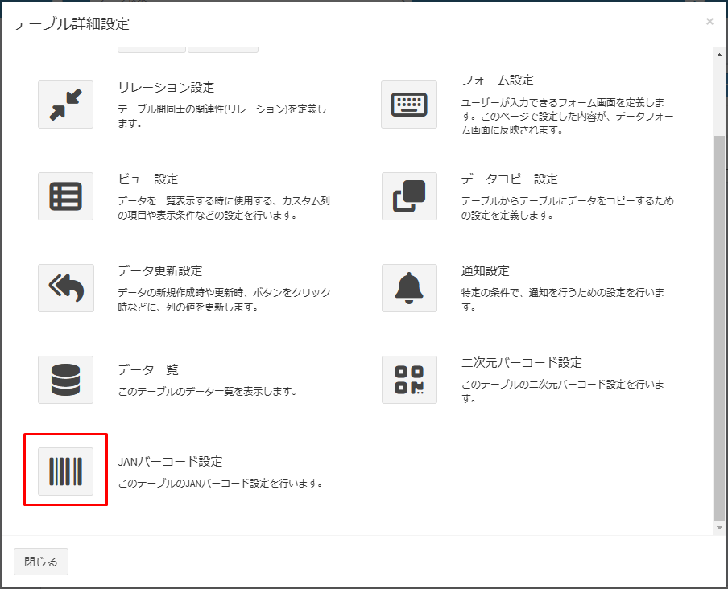
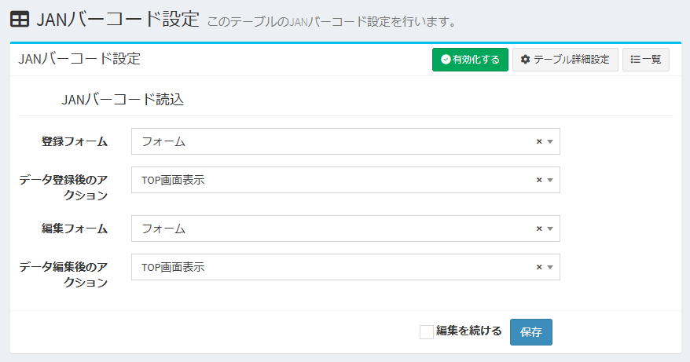
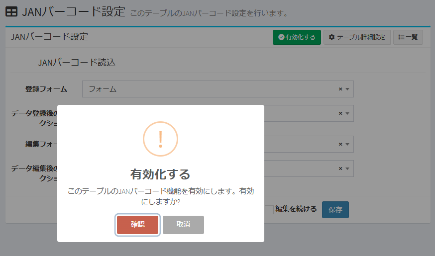
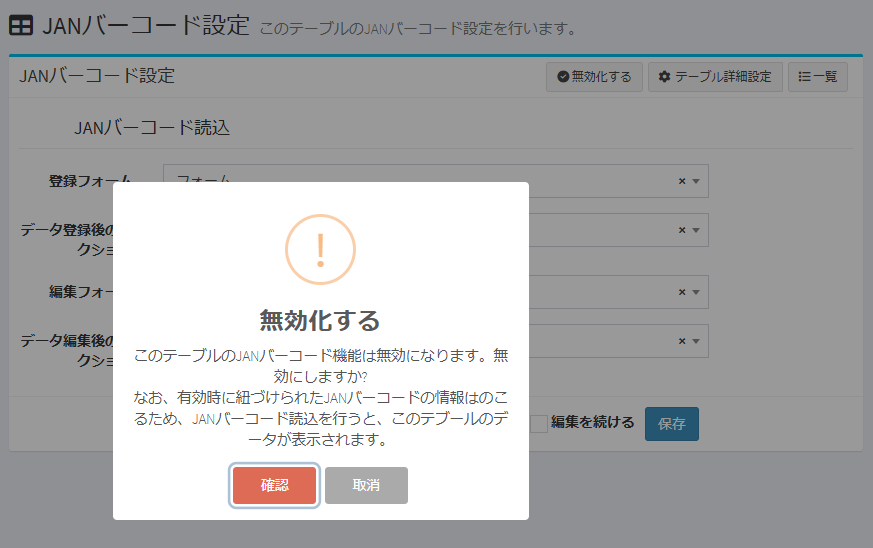

# JAN Barcode Settings
This section explains how to configure the JAN barcode settings for a table.

## Overview of the JAN Barcode Functionality
For an overview of the JAN barcode functionality, please refer to the [official website post](https://exment.net/release_v6-2-0/).

## Page Display
- In the custom table list, check the table to configure and click "Table Detail Settings" in the top-right corner.  

> **Note:** You can also navigate directly from the data list screen or the data registration screen of the target custom table. In this case, also click "Table Detail Settings" in the top-right corner.  

- On the displayed Table Detail Settings screen, click the JAN Barcode Settings icon to open the JAN Barcode Settings page.  

## JAN Barcode Configuration Items

### JAN Barcode Reading
Configure the information for reading JAN barcodes.

- #### Registration Form  
Set the registration form to use after reading a JAN barcode.  
You can select from the custom forms registered in the target table.

- #### Action After Data Registration  
Set the screen to display after data registration.  
You can select from the TOP screen, list screen, detail screen, edit screen, or camera launch screen.

- #### Edit Form  
Set the edit form to use after reading a JAN barcode.  
You can select from the custom forms registered in the target table.

- #### Action After Data Editing  
Set the screen to display after data editing.  
You can select from the TOP screen, list screen, detail screen, edit screen, or camera launch screen.

After configuration, click the "Save" button.

### Enabling JAN Barcode Settings  
- To make the JAN barcode functionality available for the target table, you need to "Enable" it. After saving, click the "Enable" button in the top-right corner of the page.  
- Only one of either the 2D barcode or the JAN barcode can be enabled at a time.  
  If the 2D barcode is enabled, the "Enable" button for JAN barcode functionality will not appear, and it cannot be enabled. Similarly, if the JAN barcode is enabled, the 2D barcode cannot be enabled.  

### Disabling JAN Barcode Settings  
- If you want to stop managing with JAN barcodes or manage JAN barcodes in another table, click the "Disable" button in the top-right corner of the page.  
- The information linked to JAN barcodes during enablement will remain. Therefore, when a JAN barcode is read, the data from this table will be displayed.  

## Launching the Camera Screen from Exment
- You can launch the camera screen for 2D/JAN barcode reading from the Exment dashboard.

- For instructions on how to add the "2D/JAN Barcode" item to the Exment dashboard, please refer to [this guide](/dashboard#_2djan-barcode).
