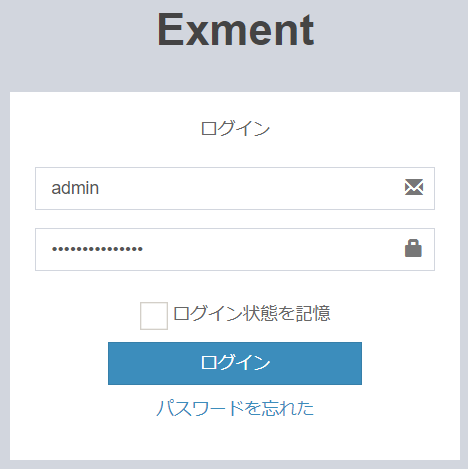
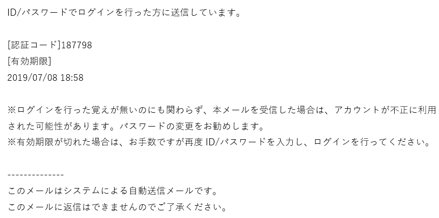
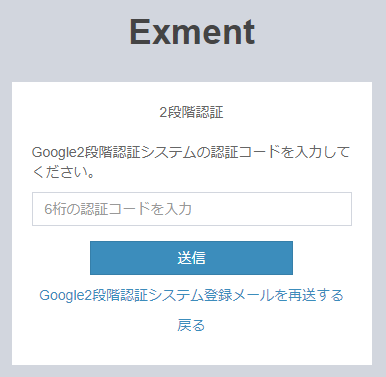
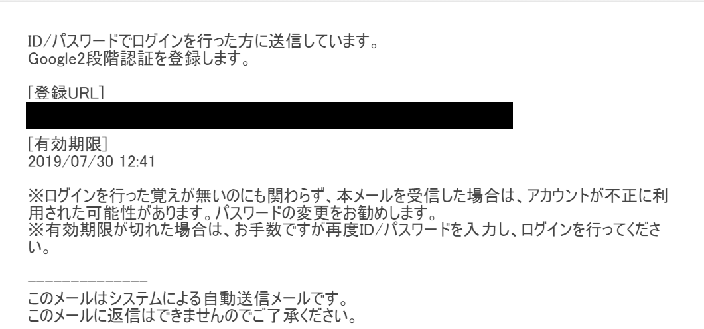

# Login (two-step verification)
Here's how to log in to Exment using two-factor authentication.  
The administrator sets the initial settings for 2-step authentication.  
[Click here](/login_2factor_setting) Please refer to.  

## Two-factor authentication method
Currently, the following two-step authentication methods are supported.  
Ask your administrator which method you are using.  

- E-mail: After logging in with your ID / password, an e-mail with the authentication code will be sent to the registered e-mail address.  
Enter the verification code in the form to complete the login.  

- Google Authenticator: After login with ID / Password, two-factor authentication is performed using Google Authenticator.  

### Two-step verification procedure (email)

- On the login screen, enter your ID / password and click the login button.
  

- The two-step verification screen is displayed, and the verification code input field is displayed.
  

- In addition, the authentication code will be sent to the email address of the user who has logged in. Check it.
  

### Two-step authentication procedure (Google authentication system)

- On the login screen, enter your ID / password and click the login button.
  

- The two-step verification screen is displayed, and the verification code input field is displayed.
  

- When you log in for the first time, you need to set up Google Authenticator first.  
By clicking the "Send" button, an email for registering with Google Authenticator will be sent to the registered email address.  
  

- The URL for Google Authenticator registration will be sent to the email address of the user who has logged in. Click it.
  

- Clicking on the sent URL will take you to the screen to install the two-factor authentication system. Perform steps 1-3.  
If you enter the authentication code correctly and send it, login with 2-step authentication will be completed.

  

> If you enter the authentication code incorrectly more than a certain number of times in 2-step authentication, login from the authenticated communication will be blocked. Please be careful.