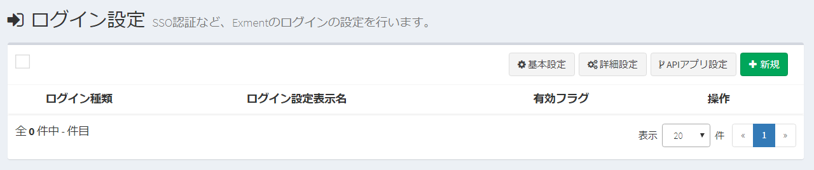
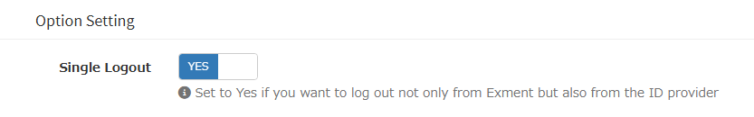
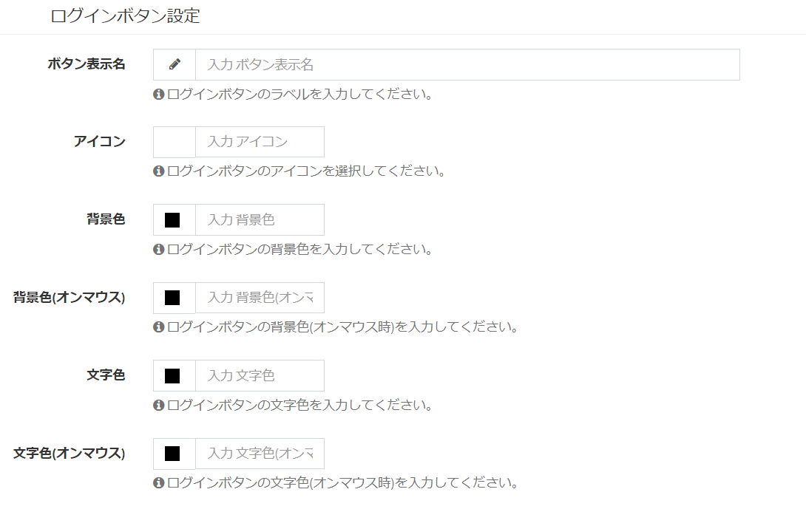

# Single sign-on (OAuth)
In Exment, you can add single sign-on (SSO) by [Login Settings](/login_setting).
This allows you to use the ID and password for each provider without having to manage a login password specifically for Exment.
  
This article describes how to set up SSO using OAuth.


#### important point
- In this example, single sign-on processing is implemented using [Socialite](https://github.com/laravel/socialite).
- **This manual is intended for those who are familiar with OAuth. Please refer to the respective documents for information on how to create the Client ID and Client Secret for each provider.**
- <span class="red">If you are using v3.0.16 or below and cannot log in to Google, please follow the steps here: (/patch/sso_google).</span>

#### Reference links
- [Open source web database "Exment" now supports SSO with Google accounts](https://qiita.com/hirossyi73/items/70dcc35305a96abace08)


## Server and provider settings
Before you can add a provider in the login settings screen, you need to enter a command on your server to install the extension.

### (1) In case of a provider provided as standard by Socialite
- The standard providers provided by Socialite are as follows. (The characters in parentheses will be used to specify the service later.)
    - Google (google)
    - Facebook (facebook)
    - Twitter (twitter)
    - GitHub (github)
    - LinkedIn (linkedIn)
    - Bitbucket (bitbucket)

- Create an application for Exment with each provider.
※The callback URL is as follows:   
http(s)://(Exment URL)/admin/auth/login/(socialite provider name)/callback  

    - Example 1 For GitHub: http(s)://(Exment URL)/admin/auth/login/github/callback  
    - Example 2 For Facebook: http(s)://(Exment URL)/admin/auth/login/facebook/callback  
    - Example 3 For Google: http(s)://(Exment URL)/admin/auth/login/google/callback  

- Run the following command in the Exment root directory:

~~~
composer require laravel/socialite=~5.1
~~~

- Carry out [Screen Settings](#On-screen-settings).


### (2) In case of provider provided by Exment extension
- Some providers provide their own providers as an extension of Exment. (The characters in parentheses will be used to specify the service later.)
    - Office365, Microsoft Graph (graph)

- Create an application for Exment with each provider.
※The callback URL is as follows:   
http(s)://(Exment URL)/admin/auth/login/(socialite provider name)/callback  

    - Example: For Office365: http(s)://(Exment URL)/admin/auth/login/graph/callback

- Run the following command in the Exment root directory:

~~~
composer require exceedone/microsoft-graph
~~~

- Carry out [Screen Settings](#On-screen-settings).


### (3) If you provide your own provider
If your provider is not listed in (1) or (2), add the unofficial provider at [Socialite Providers](https://socialiteproviders.github.io/).
Also, unofficial providers do not include a process for obtaining avatars, so if you want to obtain an avatar, you will need to add the process. (Optional)  
  
※There are several steps, so please see [How to create your own provider](#How to create your own provider) for details.

- Once the procedure is complete, proceed to [Settings on screen](#On-screen-settings).


## On-screen settings
Once the server setup is complete, go to the [Login Settings Screen](/login_setting) and add the provider.

- Go to the system settings screen using the administrator account.   
Click the Login Settings button in the top right of the page to go to the Login Settings screen.
  

- Click the New button to create a login setting.

### Provider type
  

- If you selected a provider in (1) in the Server/Provider Settings, please select the name of that provider.   

- If you selected provider (2) or (3) in the Server/Provider Settings, please select "Other."   
Also, if you select "Other", please enter the alphanumeric characters for the provider type specified by Socialite in the provider type (alphanumeric characters) that appears.   
Example: Microsoft Graph: "graph"  
Example: EntraID: "microsoft"

  


### Client ID, Client Secret
Please set the string provided by your provider.

### Scope
Basically, there is no explicit purpose for this when logging in, but we recommend setting it if you will be obtaining an access token with [obtain access token](#Obtaining-an-access-token).

### Option Setting
Set options according to the provider type selected.
(If you select a provider type with no options set, it will not be displayed.)

#### In case of the provider type is "other"
 

##### Single Sign-out
When you log out of Exment, you are also logged out of the provider you logged in with SSO.<span class="red">*Okta is not supported.</span>

<!---
  OAuth, write the same thing in Saml
-->
### User Setting
Set the settings for the logged in user.

  

#### Account search column
Set which columns to use to search for Exment accounts from accounts obtained via SSO.

#### Create a new user
If YES, if the logged in user does not exist in Exment, create a new Exment user with the login information.
If NO, you must create a user in Exment beforehand. If the logged in user does not exist in Exment, an error will be displayed.

#### Role group settings
If YES, you can associate a role group with a new Exment user when creating it.

#### Update user information
If YES, user information such as username will be updated when re-login.


- Once you save your data at least once, the Activate button and the Test Login button will be displayed.

- If the enable flag is set to YES, a button for SSO authentication will be displayed on the login screen.   
※Normally, the default login form for entering the user ID and password will also be displayed. You can hide it as shown in the image in [SSO Settings](/system_setting?id=sso-settings).  


### Login button settings
Set the login button to be displayed on the login screen.
※Even if you do not make this setting, if you are using a provider that is standard on Socialite (as in Example 1 above), it will be displayed in the respective format.

  


### Activation and login test
- Once you save your data at least once, the Activate button and the Test Login button will be displayed.

  

#### activation
- By enabling it, a button for SSO authentication will be displayed on the login screen.   
  

#### Login test
- You can test your login with the login information you set by clicking the Login Test button. This can be done even if you have not enabled the login settings.
**In that case, please temporarily add or change the URL displayed in the test redirect URL to the callback URL in the provider's OAuth authentication settings.**

  


- You can test whether the settings are correct by clicking the Login button.
The login result will be displayed in the Execution Result section.


### Obtaining an access token

- After logging in, to obtain an access token and refresh token, please follow the steps below.

~~~php
use Exceedone\Exment\Services\Login\LoginService;

$access_token = LoginService::getAccessToken();
$refresh_token = LoginService::getRefreshToken();
~~~


## How to create your own provider
If you are performing step (3), add the packages specified in [Socialite Providers](https://socialiteproviders.github.io/).
Also, create your own provider for avatar acquisition (optional).

### (Required) Provider settings/addition
- Create an application for Exment with each provider.
※The callback URL is as follows:   
http(s)://(Exment URL)/admin/auth/login/(socialite provider name)/callback  

    - Example: For Microsoft Graph: http(s)://(Exment URL)/admin/auth/login/graph/callback
    - Example: For EntraID: http(s)://(Exment URL)/admin/auth/login/microsoft/callback

- Run the following command in the Exment root directory:

~~~
composer require laravel/socialite=~5.1
~~~

- Add the packages specified in [Socialite Providers](https://socialiteproviders.github.io/).

~~~
    ### Example: Microsoft Graph
composer require socialiteproviders/microsoft-graph
~~~
~~~
    ### Example: EntraID
composer require socialiteproviders/microsoft
~~~

### (Optional) Development for obtaining avatars
※Creating your own provider is an optional step to obtain avatars. If you do not need to obtain avatars, there is no need to create this provider.

- To get avatars, create two classes that inherit from existing providers in the app/Socialite folder. ※If the app/Socialite folder does not exist, create it.   
The first one is MicrosoftGraphProvider.php. It implements the interface ProviderAvatar and getsAvatar.
In the getAvatar method, please write the API process to obtain the avatar. Please check the URL and endpoint for obtaining the avatar from each OAuth provider.   
The example below shows the steps for Microsoft Graph.

~~~php

// Example: Microsoft Graph

<?php

namespace App\Socialite;

use Exceedone\Exment\Auth\ProviderAvatar;
use SocialiteProviders\Graph\Provider;

class MicrosoftGraphProvider extends Provider implements ProviderAvatar
{
    /**
     * Get avatar stream
     * @param mixed $token
     * @return string
     */
    public function getAvatar($token = null){
        try
        {
            $client = $this->getHttpClient();
            $response = $client->get('https://graph.microsoft.com/v1.0/me/photo/$value', [
              'headers' => [
                  'Authorization' => 'Bearer'.$token,
                  'Content-Type' => 'application/json;odata.metadata=minimal;odata.streaming=true'
              ],
              'http_errors' => false,
            ]);

          if($response->getStatusCode() == 404){
              return null;
            }

            return $response->getBody()->getContents();

        }
        catch (Exception $exception)
        {
            return null;
        }
        return null;
    }

    /**
     * Get the logout URL for the OAuth provider.
     *
     * @param string|null $redirectUri The URI to redirect to after logout.
     * @return string The logout URL.
     */
    public function getLogoutUrl(?string $redirectUri = null)
    {
        $logoutUrl = sprintf('https://login.microsoftonline.com/%s/oauth2/logout', $this->getConfig('tenant', 'common'));

        return $redirectUri === null ?
            $logoutUrl :
            $logoutUrl.'?'.http_build_query(['post_logout_redirect_uri' => $redirectUri], '', '&', $this->encodingType);
    }

}

~~~

- The second one is GraphExtendSocialite.php. Specify the MicrosoftGraphProvider you created.

~~~php

// Example: Microsoft Graph

<?php

namespace App\Socialite;

use SocialiteProviders\Manager\SocialiteWasCalled;

class GraphExtendSocialite
{
    /**
     * Execute the provider.
     */
    public function handle(SocialiteWasCalled $socialiteWasCalled)
    {
        $socialiteWasCalled->extendSocialite(
            'graph', __NAMESPACE__.'\MicrosoftGraphProvider'
        );
    }
}

~~~

### (Required) Add service provider
- Add the service provider by filling in the file app/Providers/EventServiceProvider.php with the provider you added.   
The contents of the description will differ depending on whether or not you have developed your own avatar to obtain it.   
Also, the class name written in @handle is often listed in the manual of the provider added in [Socialite Providers](https://socialiteproviders.github.io/), so please check it.

~~~php

// Example: Microsoft Graph
<?php

namespace App\Providers;

use Illuminate\Support\Facades\Event;
use Illuminate\Foundation\Support\Providers\EventServiceProvider as ServiceProvider;

class EventServiceProvider extends ServiceProvider
{
    /**
     * The event listener mappings for the application.
     *
     * @var array
     */
    protected $listen = [
        // If you have developed your own avatar retrieval
        'App\Events\Event' => [
            'App\Listeners\EventListener',
        ],
        
        // Additional
        \SocialiteProviders\Manager\SocialiteWasCalled::class => [
            '\App\Socialite\GraphExtendSocialite@handle', // If you have developed your own avatar retrieval
            // 'SocialiteProviders\\Graph\\GraphExtendSocialite@handle', // For normal retrieval, comment this out and use it
        ],
    ];

    // ...
}
~~~
~~~php

// Example: EntraID

protected $listen = [
    // ... other listeners
    \SocialiteProviders\Manager\SocialiteWasCalled::class => [
        // ... other providers
        \SocialiteProviders\Microsoft\MicrosoftExtendSocialite::class.'@handle',
    ],
];

~~~


### (Required by Provider) Add optional settings
Depending on your OAuth sign-in provider, you may need to perform additional configuration.

  
Example: [OKTA](https://github.com/SocialiteProviders/Okta)
- Open config/services.php and add the following:

```php
'okta' => [    
  'base_url' => env('OKTA_BASE_URL'),
],
```

- Open the .env file and add the following:

```
OKTA_BASE_URL='https://<OKTA domain>'
```

> Originally, Socialite requires the setting values ​​of "client_id", "client_secret", and "redirect" in config/services.php, and in Exment's OAuth authentication, the values ​​set on the screen are automatically assigned.   
If you want to enter your own provider-specific configuration values, add the values ​​as shown above to config/services.php.


### (Required) Configure screen settings

- Once all server-side settings are complete, proceed to [On-screen settings](#On-screen-settings).

  
  
[← Return to login settings](/login_setting)
