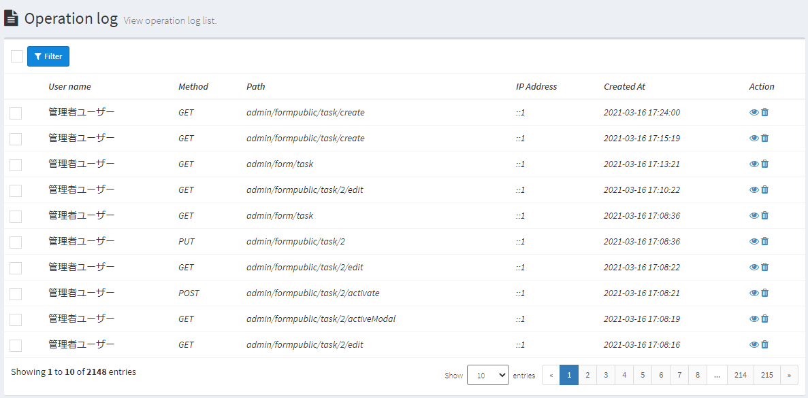
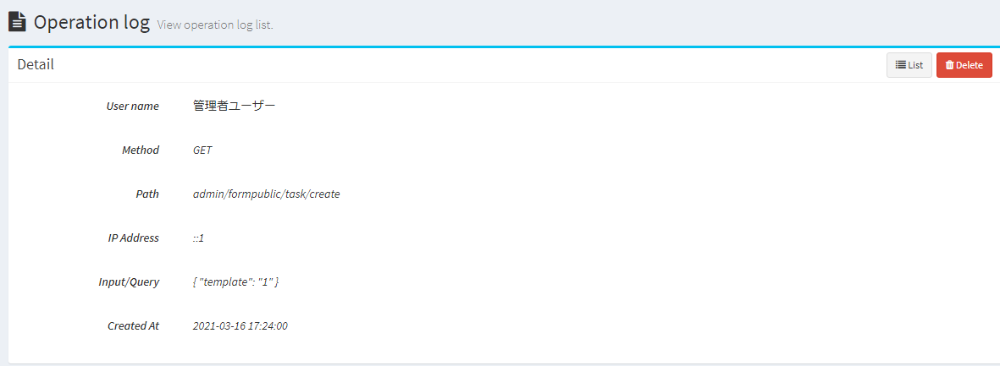

# Log
Describes various Exment logs.

## Log type
Currently, Exment has the following log types.

- **Operation Log**  
The contents operated by each user on the pages are listed on the Web page.  

- **Output Log**  
Outputs a log file on the server mainly when an error occurs.  

## Operation Log  
The contents operated by each user on the page are listed on the Web page.  
The main operations are as follows.  

- User displays pages, adds new data, updates, deletes, etc.
- API authentication and execution

### Confirmation Method
- The system administrator enters the following URL.  
http(s)://(Exment URL)/admin/auth/logs  

- Alternatively, add "API App Settings" to the menu.  
Open the "Administrator Settings" > "Menu" page and select the menu type "System Menu" to display the target "Operation Log". Select it and save it.  
* "Operation log" is not displayed in the menu by default.

- The operation log list screen is displayed.

  

- If you want to see the details of the data, click the corresponding row.  

  

### About Each Item

- ##### User Name  
The corresponding user who operated. * If the operation is not logged in, it will be left blank.

- ##### Method
The type of HTTP request method.

- ##### Path
The target URI of the HTTP request.  
* Even if the query string is included in the GET method, it will not be output to this item and "Input / Query" will be displayed instead.

- ##### IP Address
The IP address of the terminal that performed the operation.

- ##### Input・Query
The query string or POST value of the HTTP request.  

- ##### Creation date and time
The date and time when the operation was performed.

### Other
- For the item "Input / Query", the following values ​​are saved by replacing them with the character string "***" for confidential information.
    - password
    - password_confirmation
    - current_password
    - _token
    - verify_code
    - access_token
    - refresh_token

- Currently, it does not support exporting operation logs. note that.

## Log file output  
Outputs a log file on the server mainly when an error occurs.  
* Values ​​other than errors can be output by adding the settings described below.

### Confirmation Method
- On the server where Exment is built, access the following path.  
(Exment root folder)/storage/logs  

- Please check the laravel.log file.

### Add Setting Value
- The following contents can also be output by changing [Setting Value](/config). Please check [here](/config) for the setting procedure. * Please check [here](/config) for the setting procedure.

- ##### Request Value Output
    - Setting Key : EXMENT_DEBUG_MODE_REQUEST
    - Defaul Value ： false
    - Role : By setting it to true, the request value to the Exment Web service will be output to the log.  

- ##### SQL Log Output
    - Setting Key : EXMENT_DEBUG_MODE_SQL
    - Defaul Value ： false
    - Role : By setting it to true, you can log the SQL statement when executing SQL with Extension.

- ##### SQL Log Output - Function display
    - Setting Key : EXMENT_DEBUG_MODE_SQLFUNCTION
    - Defaul Value ： false
    - Role : When executing SQL with exment, when "EXMENT_DEBUG_MODE_SQL" is true, you can log the caller's function list at the same time as the SQL statement by setting it to true.

### Other
- In addition to the server output of the log file, Laravel has the following functions.
    - Output logs to other locations such as Slack
    - Change log format
    - Switch log output file daily

- Please set these settings according to [this manual](https://readouble.com/laravel/6.x/ja/logging.html).
