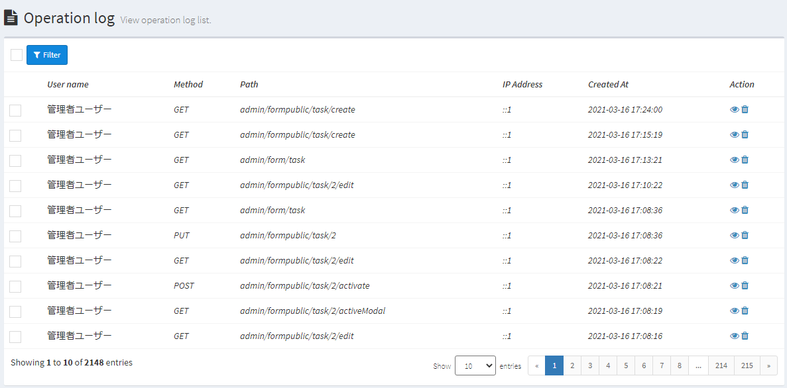
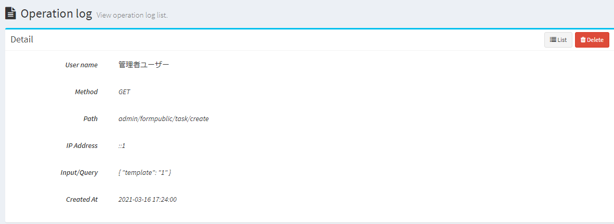
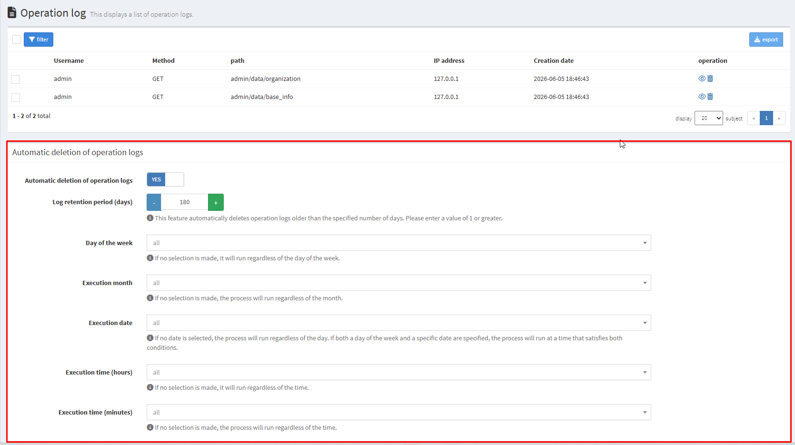

# Log
Describes various Exment logs.


## Log type
Currently, Exment has the following log types.

- **Operation Log**  
The contents operated by each user on the pages are listed on the Web page.  

- **Output Log**  
Outputs a log file on the server mainly when an error occurs.  


## Operation Log  
The contents operated by each user on the page are listed on the Web page.  
The main operations are as follows.  

- User displays pages, adds new data, updates, deletes, etc.
- API authentication and execution


### Confirmation Method
- The system administrator enters the following URL.  
http(s)://(Exment URL)/admin/auth/logs  

- Alternatively, add "API App Settings" to the menu.  
Open the "Administrator Settings" > "Menu" page and select the menu type "System Menu" to display the target "Operation Log". Select it and save it.  
* "Operation log" is not displayed in the menu by default.

- The operation log list screen is displayed.

  

- If you want to see the details of the data, click the corresponding row.  

  

### About Each Item

- ##### User Name  
The corresponding user who operated. * If the operation is not logged in, it will be left blank.

- ##### Method
The type of HTTP request method.

- ##### Path
The target URI of the HTTP request.  
* Even if the query string is included in the GET method, it will not be output to this item and "Input / Query" will be displayed instead.

- ##### IP Address
The IP address of the terminal that performed the operation.

- ##### Input・Query
The query string or POST value of the HTTP request.  

- ##### Creation date and time
The date and time when the operation was performed.


### Other
- For the item "Input / Query", the following values ​​are saved by replacing them with the character string "***" for confidential information.
    - password
    - password_confirmation
    - current_password
    - _token
    - verify_code
    - access_token
    - refresh_token

- Currently, it does not support exporting operation logs. note that.

### Masking Confidential Information

Operation logs may contain request values and URL path parameters entered by users or sent by APIs.

To prevent credentials and other confidential information from being stored in plain text, Exment masks configured request fields and URL path values when writing operation logs.

The masking behavior can be customized in the `operation_log` section of the following file.

`config/exment.php`

The following example shows how to configure the masking settings.

```php
'operation_log' => [
    'mask_columns' => [
        'client_secret',
    ],

    'mask_columns_by_uri' => [
        'oauth/*' => ['client_id'],
    ],

    'mask_path_prefixes' => [
        'auth/reset' => false,
    ],
],
```

#### mask_columns

- Specify request field names that should always be masked, regardless of the request URI.
- Use this setting for values that should always be treated as confidential, such as API keys or client secrets.
- If a field name listed here is also used as a normal business column in a user-defined table, that value is also masked.

#### mask_columns_by_uri

- Specify request field names that should be masked only on specific screens or APIs.
- The array key is a URI pattern relative to the `admin` prefix. The wildcard `*` can be used.
- Use this setting for common field names such as `id`, `secret`, `client_id`, `api_key`, and `token`, as these names may also be used as normal business data on other screens.
- Matching field names are masked recursively, including values in nested request structures.

#### mask_path_prefixes

- Specify URI prefixes, relative to the `admin` prefix, when the following path segment contains confidential information.
- The array value determines how the path segment is masked.
    - `true`: Keep only the first 8 characters (when the value is long enough) and replace the remainder with `***`. Use this for record IDs when traceability is required.
    - `false`: Replace the entire value with `***`. Use this for confidential values such as password reset tokens.
- For example, if `auth/reset` is configured as `false`, the password reset token included in the URL is replaced entirely with `***`.

#### Notes

- Masking is applied when new operation logs are written.
- If the operation log patch process is executed during an upgrade, existing operation log records are also masked according to the configured rules.
- When upgrading Exment, review the `operation_log` settings and add any newly introduced mask targets if necessary.
- Use `mask_columns` only for values that are always confidential. For values that are confidential only on specific screens, use `mask_columns_by_uri` or `mask_path_prefixes` to avoid masking normal business data.

### Operation Log Automatic Deletion
At the bottom of the Operation Log screen, you can configure settings for automatic deletion of operation logs.
  

#### Enable Automatic
- Enable or disable automatic deletion of operation logs.
- If enabled, logs older than the configured retention period will be deleted automatically.
- If disabled, logs will not be deleted automatically.
- The default value is "Yes".

#### Log Retention Period (Days)
- Specify the number of days to retain operation logs.
- Logs older than the specified number of days will be deleted automatically.
- Please enter a value of 1 or greater.
- This setting is displayed only when Enable Automatic is enabled.
- The default value is "180".

#### Execution Day of Week
- Specify the day(s) of the week on which automatic deletion will run.
- If no value is selected, automatic deletion will run regardless of the day of the week.
- The placeholder value is "All".

#### Execution Month
- Specify the month(s) in which automatic deletion will run.
- If no value is selected, automatic deletion will run regardless of the month.
- The placeholder value is "All".

#### Execution Day
- Specify the day(s) of the month on which automatic deletion will run.
- If no value is selected, automatic deletion will run regardless of the day of the month.
- If both Execution Day of Week and Execution Day are specified, automatic deletion will run only when both conditions are satisfied.
- The placeholder value is "All".


#### Execution Hour
- Specify the hour(s) at which automatic deletion will run.
- If no value is selected, automatic deletion will run regardless of the hour.
- The placeholder value is "All".

#### Execution Minute
- Specify the minute(s) at which automatic deletion will run.
- If no value is selected, automatic deletion will run regardless of the minute.
- The placeholder value is "All".


#### To disable automatic deletion
1. Set Enable Automatic to "No".
2. Click Save.

After saving, automatic deletion will be disabled.

## Log file output  
Outputs a log file on the server mainly when an error occurs.  
* Values ​​other than errors can be output by adding the settings described below.

### Confirmation Method
- On the server where Exment is built, access the following path.  
(Exment root folder)/storage/logs  

- Please check the laravel.log file.

### Add Setting Value
- The following contents can also be output by changing [Setting Value](/config). Please check [here](/config) for the setting procedure. * Please check [here](/config) for the setting procedure.

- ##### Request Value Output
    - Setting Key : EXMENT_DEBUG_MODE_REQUEST
    - Defaul Value ： false
    - Role : By setting it to true, the request value to the Exment Web service will be output to the log.  

- ##### SQL Log Output
    - Setting Key : EXMENT_DEBUG_MODE_SQL
    - Defaul Value ： false
    - Role : By setting it to true, you can log the SQL statement when executing SQL with Extension.

- ##### SQL Log Output - Function display
    - Setting Key : EXMENT_DEBUG_MODE_SQLFUNCTION
    - Defaul Value ： false
    - Role : When executing SQL with exment, when "EXMENT_DEBUG_MODE_SQL" is true, you can log the caller's function list at the same time as the SQL statement by setting it to true.

### Other
- In addition to the server output of the log file, Laravel has the following functions.
    - Output logs to other locations such as Slack
    - Change log format
    - Switch log output file daily

- Please set these settings according to [this manual](https://readouble.com/laravel/6.x/ja/logging.html).
