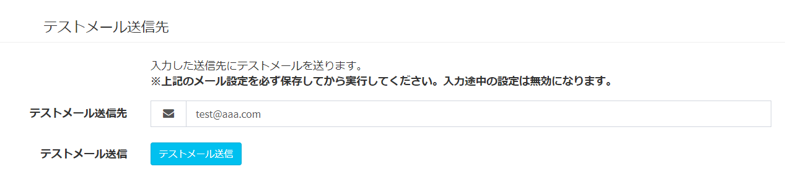

# Email sending settings
Make settings for sending emails from Exment.  
In addition, the procedure for sending a test email after setting is also described.  

> ※Email sending functions such as "Email does not arrive" and "Email is classified as junk email" are not subject to inquiries because they depend largely on each server and environment.

## Overview
- Exment may send emails from the system.  
Example:
    - Data update notification
    - Two-step certification

- In order to send mail, you need to make SMTP settings.  
This section describes the setting procedure for sending an email.  

- There are two ways to set up email transmission.  
    - [Set from screen (default)](#Setting-method-Set-from-screen):
    Set the mail sending settings by entering the SMTP settings on the system setting screen. It can be used when sending an email with a simple SMTP setting.
    
    - [Set in config file or env file](#Setting-method-Set-in-config-file-or-env-file):
    When setting mail by a method other than SMTP such as Amazon SES, edit the setting file on the server or use composer to make the setting. ※For advanced users.

### Setting method-Set from the screen
- The system administrator accesses the system setting screen.

- Enter the following settings.

※SMTP setting example (for Xserver): [here](https://www.xserver.ne.jp/manual/man_mail_setting.php)

※SMTP setting example (for Sakura Internet): [here](https://help.sakura.ad.jp/hc/ja/articles/206054132--%E3%83%A9%E3%82%A4%E3%83%88-%E3%82%B9%E3%82%BF%E3%83%B3%E3%83%80%E3%83%BC%E3%83%89-%E3%83%97%E3%83%AC%E3%83%9F%E3%82%A2%E3%83%A0-%E3%83%A1%E3%83%BC%E3%83%AB%E3%83%9C%E3%83%83%E3%82%AF%E3%82%B9-%E3%83%A1%E3%83%BC%E3%83%AB%E3%82%BD%E3%83%95%E3%83%88%E3%81%AE%E4%B8%80%E8%88%AC%E7%9A%84%E3%81%AA%E8%A8%AD%E5%AE%9A%E6%96%B9%E6%B3%95)

### Setting method-Set with config file or env file
- Open the .env file and enter the following settings.

~~~
EXMENT_MAIL_SETTING_ENV_FORCE = true
~~~

>  Originally, in Laravel, the setting value of ".env" file is used as a parameter of mail transmission, but from v1.3.6, the setting value of ".env" file is not used and the screen The value registered in "System Settings" of is now used.  
However, in some cases you may want to continue setting up the ".env" file.   
Especially with Laravel, you can also send emails using a sending method other than SMTP.  
In that case, by making this setting, the setting value entered in the ".env" file will continue to be used. 

- After that, please set various Laravel mail sending drivers.

- It is also recommended to enter the following settings in .env.

~~~
MAIL_FROM_ADDRESS = (source address)
MAIL_FROM_NAME = (name displayed to the sender)
~~~

## SPF record settings
- If the sent mail becomes junk mail, it is often due to the setting of "SPF record" of the domain.  Register your SPF record in your domain settings.  

[Reference 1] (https://sendgrid.kke.co.jp/blog/?p=3509)  
[Reference 2] (https://salt.iajapan.org/wpmu/anti_spam/admin/operation/information/spf_i01/)  

## Send test email
- You can use the above email sending settings to send a test email.  
You can execute it from the screen or from a command.  

### Run from screen
- The system administrator accesses the system setting screen.  

- In the "Send test email" item, enter the email destination and click [Send test email].

※For convenience of processing, it is necessary to save "System Mail Settings" at the top of the page.  
Please save it once and then send the test email.

### Execute from command
- Enter the following command in the root folder of your project.  

~~~
php artisan exment: notifytest --to = (mail destination)
~~~

### In case of transmission error
- The error log will be output to the path "storage / logs / laravel.log", so please check it.