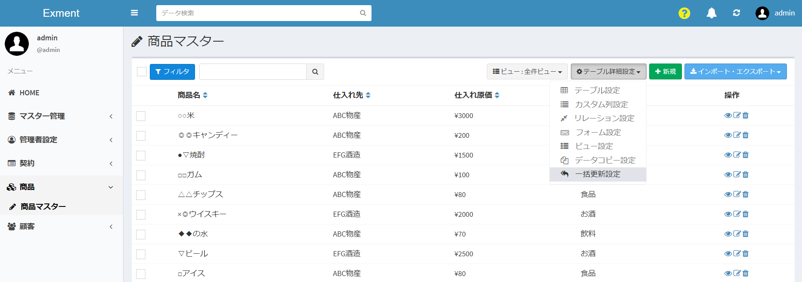
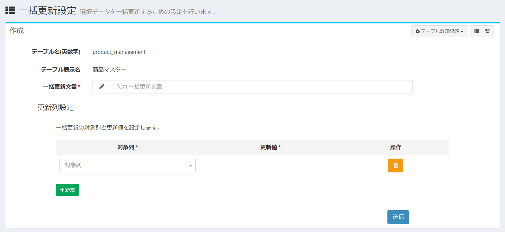

# Batch update settings
This is a setting to update the data contents stored in the table in multiple rows at once.  
The data content set as the target column in the setting can be updated to the same update value in all selected rows at once.  

## Settings screen
- In the list of custom tables, put a check in the table you want to set, and click "Batch update setting" on the upper right.  

- Or, after selecting the table you want to set from the menu, similarly click "Batch update setting" on the upper right.  
※ A setting to display the corresponding table on the menu is required in advance.

- Displays a list of batch update settings for the checked custom table.

## Add new batch update settings
- On the "Batch Update Settings" screen, click the "New" button at the top right of the page.  
- The screen for adding a new custom column is displayed. Enter the necessary information.  
- When multiple target columns are set, batch update can be performed simultaneously for all the set multiple columns.  

#### Bulk update wording
Please set the wording that indicates the content of the update. It is displayed as an option when performing bulk update.

#### Target column
Please select a column to update data in bulk.

#### Update value
Set the contents you want to update and register as data for the target column in a batch.  
※ The update value input field is displayed after selecting the target column.

## Save
After entering the settings, click “Submit”.

## Edit
If you want to edit the settings, click the "Edit" button in the corresponding line.

## Delete
If you want to delete the settings, click the "Delete" button on the corresponding line.

