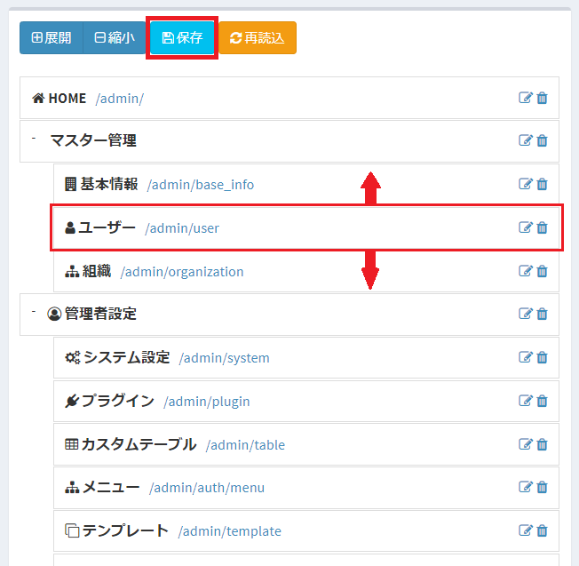

# menu
Manage the menu displayed on the left side of the page.

## Overview
After logging into the system, a menu will appear on the page.  
In this menu, you can add menu items that transition to "pages prepared by the system", "pages of plugins", "pages to each table", and "arbitrary URL".  
※ Menu items are displayed only on pages that can be displayed by the logged-in user.  

## Menu management
Describes how to manage menus.

### List screen display
Click "Menu" from the left menu.  
Or access the following URL.  
This will display the menu setting screen.  
http (s): // (Exment URL) / admin / auth / menu  
A list of menus currently registered in the system is displayed.

### Add new menu
In the "Menu" list screen, enter the required information in the "New" box on the right side of the page.

#### Parent ID
Select the parent item of the menu to be added. To add a menu to the top layer, add "Root".

#### Menu type
Select the type of menu to add. Please choose from the following options:  
- System menu: Select when you want to add the menu items prepared by Exment.  
- Plugin: Select this if you want to display the plugin uploaded by the user in the menu.  
- Table data: Select this to display a screen that lists the data of the custom table in the menu.  
- Parent Hierarchy: Select to list child hierarchies under the menu.  
- Custom URL: Select to add any URL to the menu.  

#### Target
Select the menu item to be added. The displayed items change depending on the "Menu type".
- When the menu type is "System Menu": A list of pages prepared by Exment is displayed.

- When the menu type is "Plugin": A list of plug-ins uploaded by the user is displayed.
- When the menu type is "Table data": A list of custom tables is displayed.

- When the menu type is "Parent hierarchy" or "Custom URL": Cannot be selected.

#### URI
Enter the URI to transition to when clicked.
- When the menu type is "System Menu", "Plugin", "Table Data", "Parent Hierarchy": Display only, there is no need for the user to fill out.

- If the menu type is "Custom URL": Enter the URI that will transition when clicked.  
※ The URL of the page that actually transitions is as follows. http (s): // (Exment URL) / admin / (filled URI)  
http(s)://(Exment URL)/admin/(filled URI)

#### Menu name
Enter the name of the menu in alphanumeric characters. Must be unique. It cannot be duplicated with other menus.  
Items that are not displayed on the screen.  
- When the menu type is "System menu", "Plugin", "Table data": When "Target" is selected, it is automatically filled.  
※However, if the same menu item has already been registered, the value cannot be duplicated and saved, so change the value.

- If the menu type is "Parent Hierarchy" or "Custom URL": Enter any alphanumeric characters to avoid duplication with other values.

#### Menu display name
Enter the name to be displayed on the left menu.  
※ If the menu type is "System Menu", "Plug-in", or "Table Data", it will be automatically filled when "Target" is selected.  

#### icon
Enter the icon to be displayed on the left menu.  
※ If the menu type is "System Menu", "Plug-in", or "Table Data", it will be automatically filled when "Target" is selected.  

### Save
After filling in the settings, click “Submit”.  
※ After saving, if you refresh the browser or access Exment again, the items will be reflected in the left menu.

### Sort order
If you want to rearrange menu items that have already been saved, you can change them on the list screen.  
Rearrange the order by dragging and dropping items.  
When you have completed your changes, click Save.  

### Edit
If you want to edit the menu, click the "Edit" link in the corresponding line.

### Delete
To delete a menu, click the "Delete" link in the corresponding line.

> The operation **log list** is not displayed in the menu item by default . If necessary, make settings from the list.  