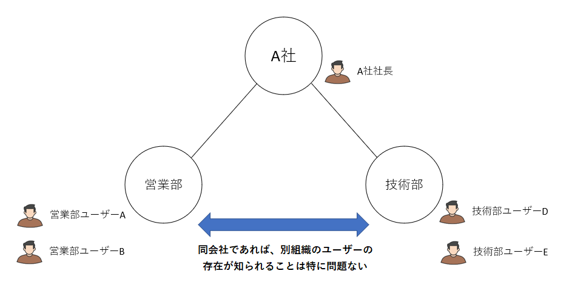
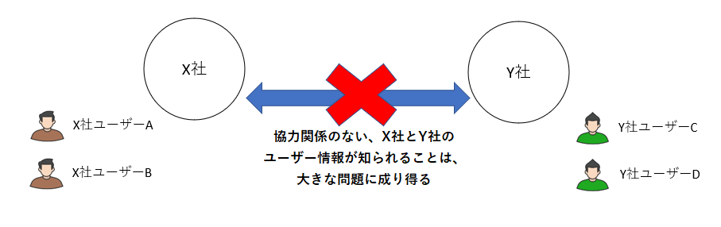
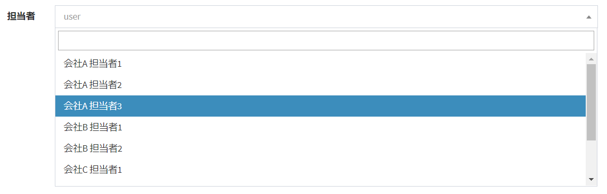
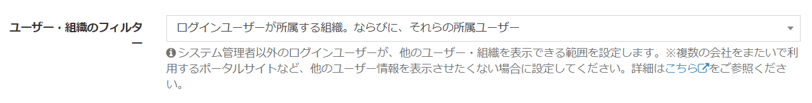
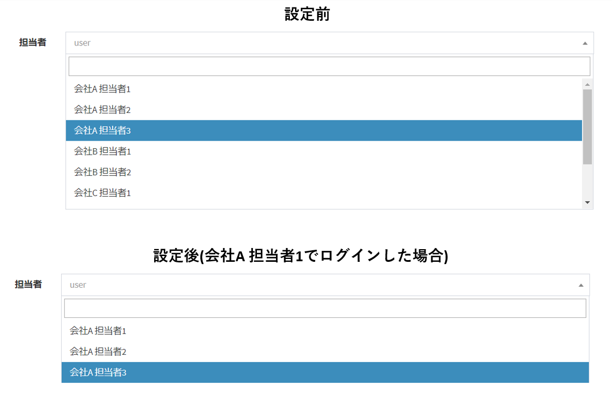
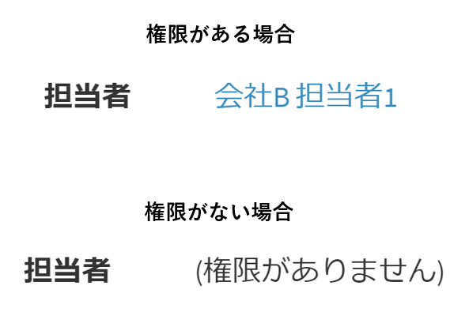
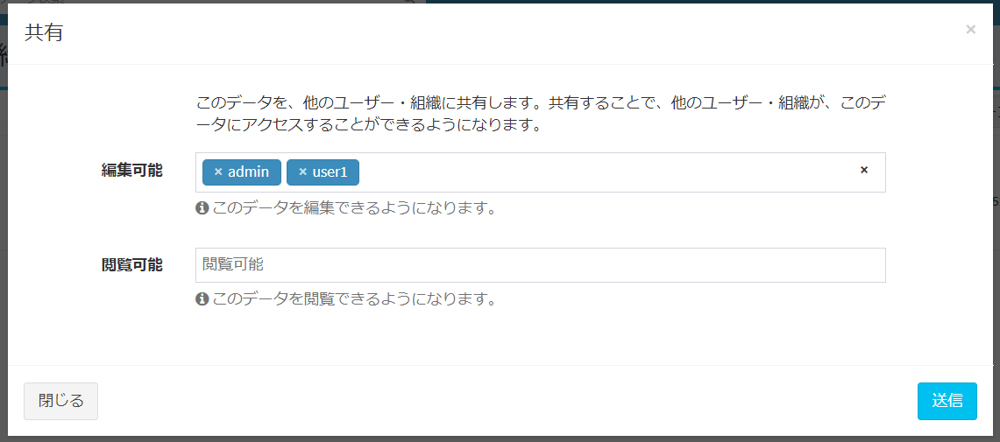
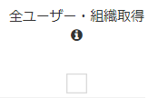

# Settings for external portal sites (when building a system where users from multiple organizations log in)  
This is recommended when you want to set ** "Display only the organization to which the logged-in user belongs and the users who belong to it" ** when displaying the user / organization on the data list screen or edit screen.

## Background
Originally, Exment was mainly intended for the following uses.

- Information sharing within companies and organizations
- Information sharing between group companies
- Publish REST API and possess data as a Web database

For these purposes, "which user is using the system" and "which organization / company is registered in the system" do not matter. Rather, it should be viewable.

However, when considering the following uses, ** "getting information about other users" ** can be a problem.

- Exment accounts are assigned to completely different companies that are not between group companies, and data is managed with a single Web database.
- Exment account is issued on an individual basis and a system is built as a portal site.  

When considering such uses, it may sometimes be a problem to be able to browse and acquire user information, company / organization information other than the company to which each user belongs. ** **
  

As an example, suppose you configure the following Exment.

- In a certain Exment environment, the person in charge of vendor companies A, B, and C can log in.
- The person in charge of each vendor has the authority to "edit the data in charge" in the table "product information" and inputs the product information in charge of the company.
- In the table "Product Information", there is a custom column "Person in charge". In the "Person in charge" column, set the person in charge of the product in-house.  

However, with such a setting, under normal settings, the person in charge of all vendor companies A, B, and C is displayed in the custom column "person in charge" candidate of the table "product information".  I will end up.  
This is because if you set the Users column in Exment, the choices would show all authorized users under normal settings.
  

  
In this way, you may want to achieve ** "Display only the organization or user to which that user belongs to the logged-in user of each organization" **.  
  
This chapter describes the procedure for making the following settings.
- Make it impossible to display only the organization to which the logged-in user belongs.
- And make it impossible to display only users who belong to those organizations.

## Setting method
- Transit to the system setting screen and click the "Detailed settings" button at the top right of the screen.

- Change the "User / Organization Filter" item in "Organization Settings" to the appropriate settings.

- The choice of settings depends on whether the "Use Organization Settings" setting for that Exment is YES.

### Setting value (for setting using organization)
#### Do not narrow down
- This is the default value. We do not narrow down the organization or users by logged-in users.

#### The organization to which the logged-in user belongs and the organization of the parent-child hierarchy. And their affiliated users
- Login users can only get information about the organization to which they belong and the organization information of their parent-child hierarchy.
- You can only get information about users who belong to those organizations.

#### The organization to which the logged-in user belongs and the organization of the parent hierarchy. And their affiliated users
- Login users can only get information about the organization to which they belong and the organization of their parent hierarchy.
- You can only get information about users who belong to those organizations.

#### The organization to which the logged-in user belongs and the organization of the child hierarchy. And their affiliated users
- Login users can only get information about the organization to which they belong and the organization information of their child hierarchy.
- You can only get information about users who belong to those organizations.

#### The organization to which the logged-in user belongs. And their affiliated users
- Login users can only get information about the organization to which they belong.
- You can only get information about users who belong to those organizations.

### Setting value (when the setting does not use the organization)
#### Do not narrow down
- This is the default value. Users are not narrowed down by logged-in users.

#### Login users only
- User information other than the logged-in user cannot be obtained.

## Specifications when this setting is made
When making this setting, the specifications are as follows.

- On the data edit screen, the options for the custom column "Organization" are narrowed down to only the organizations that the logged-in user can get.
In addition, the selection of the custom column "User" on the data edit screen is narrowed down to only the users that can be acquired by the logged-in user.

- When viewing data, if a user / organization that cannot be acquired by the logged-in user is set in a specific column, the link of the user / organization that is originally set is displayed, but instead, "(View permission)" Is missing) ”text is displayed.  
※This is not a function that makes it impossible to view the target data itself.  
This function hides only users / organizations.  
If this data is displayed, it is possible that the data is shared with users other than the target user / organization, so [Data permission settings](/permission#_3-data-unit) Please check.

- On the data sharing screen, the options are narrowed down to only the organizations / users that the logged-in user can acquire.

- Only the following users can get all organizations / users regardless of the organization to which they belong.
    - System Administrator
    - Login user who has the authority of "Get all users / organizations" in [Role group setting](/role_group)

