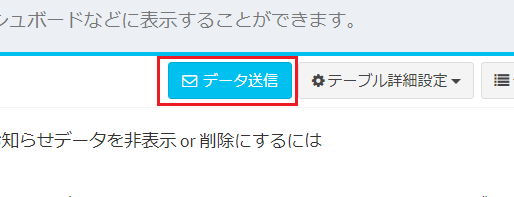
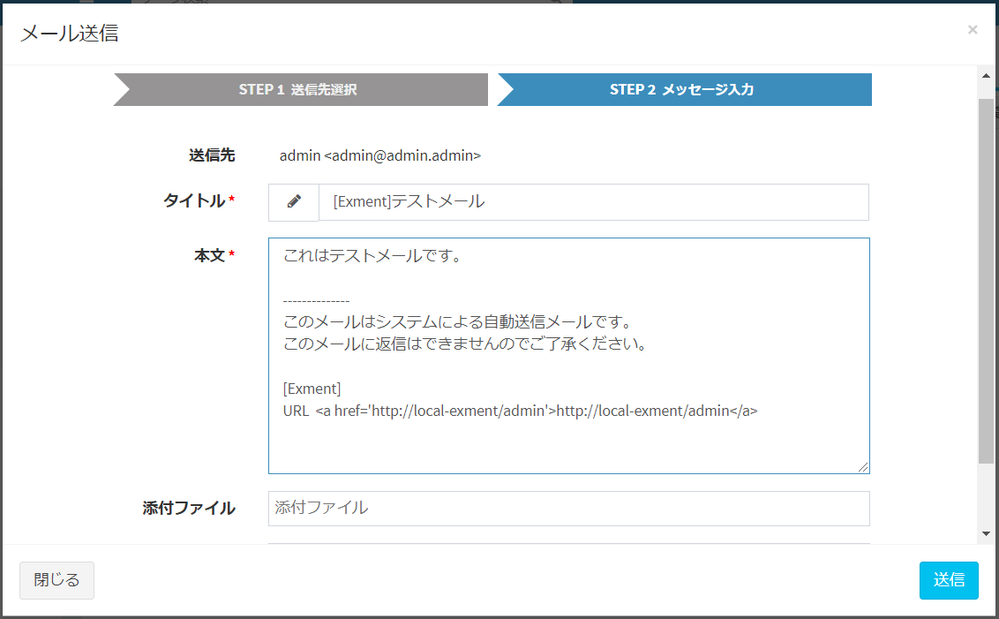
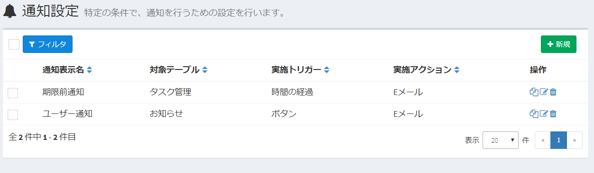
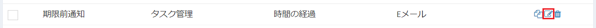
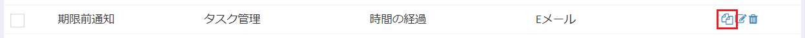
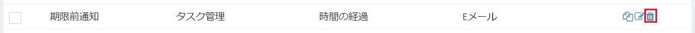
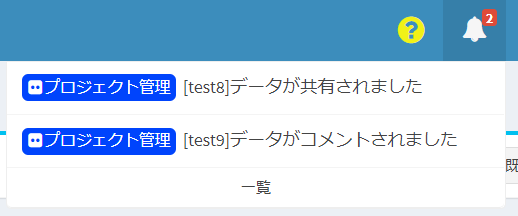

# Notification / Email sending settings
Under certain conditions, you can send an email to a user or a designated email address.
**※ To execute this function, you need to [configure the mail settings](/system_setting#System-mail-settings).**

### Notification type
Exment currently has the following notification types:

#### Passage of time
Notification is executed when the date registered in the data approaches the day before a certain date.  
Example: If the contract renewal date is "7/31" and "Notify 10 days ago" has been set in the settings, an email will be sent to "7/21".  
**※To execute this function, you need to set the [task schedule](/quickstart_more?id=task-schedule) in advance.**

#### Create / update / share / comment new data
Notification is executed when the following conditions are met.
- When creating new data  
- When data is updated  
- When comments are made on the datavv
- When a file is attached to the data  
- Please use it when you want to catch the update information as soon as the data is shared .  
※ You will not be notified.

#### Button
A notification button will be displayed on the data details screen.  
Send a message to a specified user or email address.  
It is also possible to attach saved files.  
  
  

## List screen display
From the menu, click “Admin Settings> Notification”.  
The currently saved notifications are displayed.  

  

## Create New
- Click the "New" button at the top right of the list screen.

- The notification new creation screen is displayed. Enter the necessary information.
※ Refer to the following items for details to enter.

- Click the "Send" button to save the settings. Notification settings are created.

## Edit
- Click the "Edit" link in the appropriate row.  
The screen changes to the edit screen, where you can change the settings.

  

## Duplication
- Click the "Replicate" link in the appropriate row.  
Move to the new creation screen while duplicating the setting value of the corresponding line.

  

## Delete
To delete a column, click the "Delete" link in the corresponding row.

  

## Setting item details
Set the conditions for notification "Notification condition setting" and "Notification action setting" for how to notify.

### Notification condition setting

  

#### Enforcement trigger
Select the setting that will be the condition for notification.  
For details on the settings, see the [notification types](#notification-types) above.  

#### Target table
Select the table to be notified and the table to be notified.

#### Target view
Select a [condition view](/view.md?id=condition-view) to narrow down the conditions for notification.  

### Notification condition setting (elapsed time)

#### Date target column
Select the custom column for which you want to determine notifications.  
The types of custom columns that can be selected are "Date" and "Date".  
※ If the selected custom table does not include "Date" and "Date", no options are displayed.  

#### Notification date
Please enter a date to be notified. Enter "0" to notify on the day.

#### Before and after notification
Select whether to notify you before or after the registered date.  
Example: When "Notification date" is 7 and "Before and after notification" is "Before", notification is executed 7 days before the date of the specified field.  

#### Notification time
The time to run the notification. Enter a number between 0 and 23.
Example: When "6" is entered, the notification is executed at 6:00.

### Notification condition setting (data creation / update / share / comment)

#### Notification condition setting
Set the conditions for notification.
  

### Notification condition setting (button)

#### Button display name
Enter the name of the button to be displayed on the screen.

### Notification action settings

  

#### Implemented actions
Select the action to perform the notification.  
Currently, there are "E-mail" and "In-system alert". Multiple selections are possible.  
- **Email** : Send notification email to the target email address.
- **In-system alert** :  When the target user logs in, a notification alert is displayed in the notification icon at the top right of the page.
  
- **Slack** : Send notifications to Slack. Webhook URL is required.
- **Microsoft Teams** : Sends notifications to Microsoft Teams. Webhook URL is required.

#### Webhook URL
Webhook URL required to notify Slack or Microsoft Teams. Please refer to [here](/notify_webhook) for how to get the URL.  

#### Notification target
Select the notification target.  
The items that can be selected are "Authorized user", "Email" column, "User" column, and "Choice (select from list of values ​​in other tables)".  
※ If the notification destination is "Slack" or "Microsoft Teams", this setting will be invalid.  
※"Choices (select from a list of values ​​in another table)" is only available when the referenced table has an "Email" column.  
※When "Execution action" is "Alert in system", the setting of "Email" column and "Choices (select from list of values ​​in other tables)" will be invalid.

#### Mail template
Select a template for the email to be sent. When creating a new template, create a new template on the mail template screen in advance.  
Click [here](/mail) for more information about email templates .
  
>  **When performing a notification with a file attached, the settings for [this setting](/notify_encript) will encrypt the attached file.**