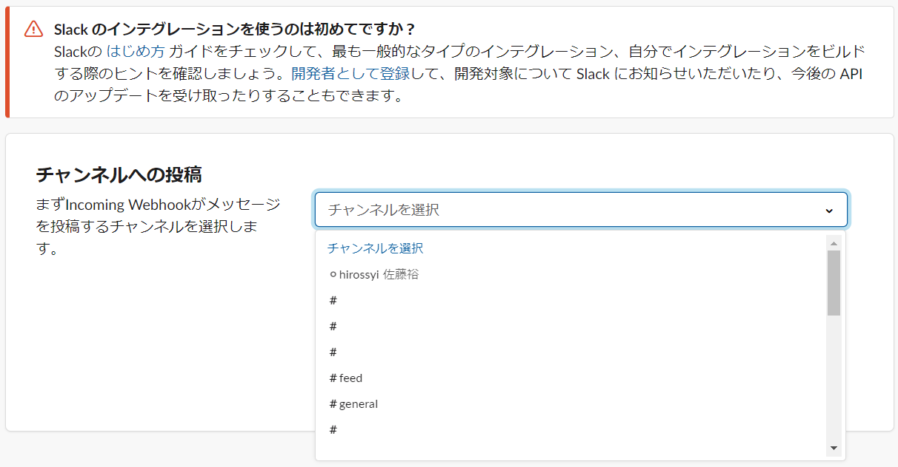
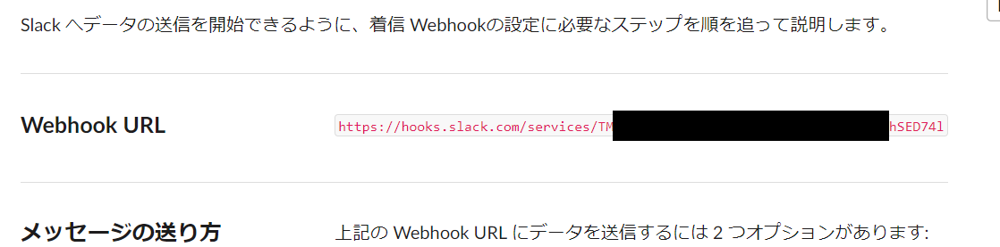
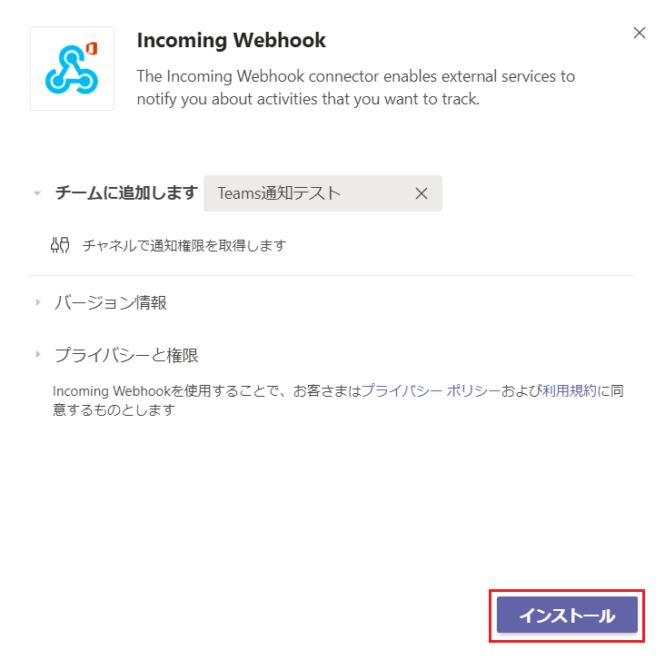

# Settings for notifying Webhook
To notify Slack and Microsoft Teams, you need to get a URL called a webhook.  
This section describes how to get Webhook URL.  

## Slack acquisition procedure
- Access the following URL.  
https://slack.com/services/new/incoming-webhook  

- Select a channel to notify.  
Then, click Add Incoming Webhook Integration.  
  

- A Webhook URL is created, so copy it.
  

- Paste the copied Webhook URL into the notification settings of Exment.  

Exment currently has the following notification types:

## Microsoft Teams acquisition procedure
- Open Teams and click "Manage Team" for the team you want to notify.
  

- Click the Apps tab.

- Click the "Other apps" tab.

- Click Incoming Webhook.

- Click "Install".

- Select the channel for notification. Then, click “Settings”.

- Enter a name to use for the notification and click Create.

- A Webhook URL will be created. Copy the URL and click Finish.

- Paste the copied Webhook URL into the notification settings of Exment.
