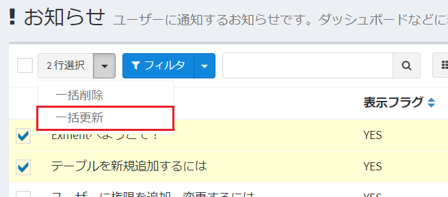
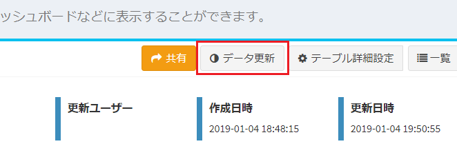
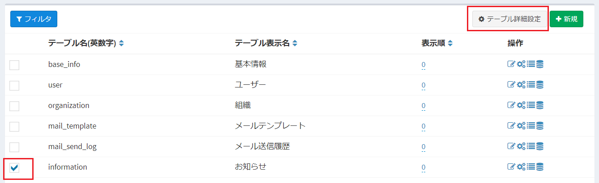
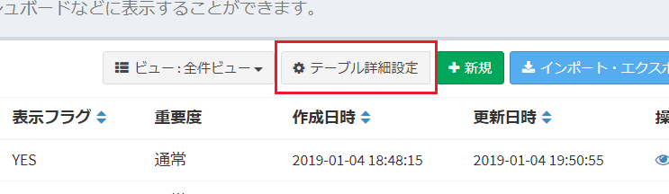
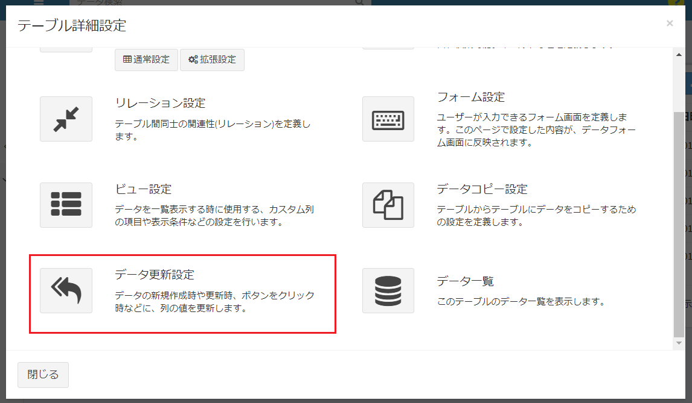
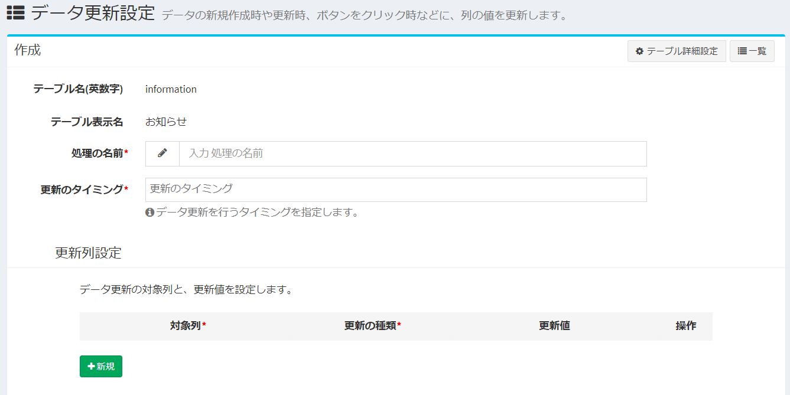
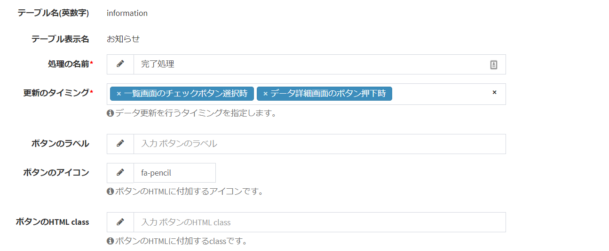
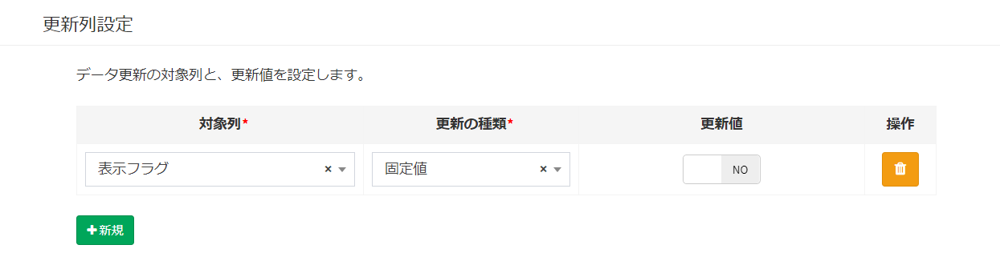
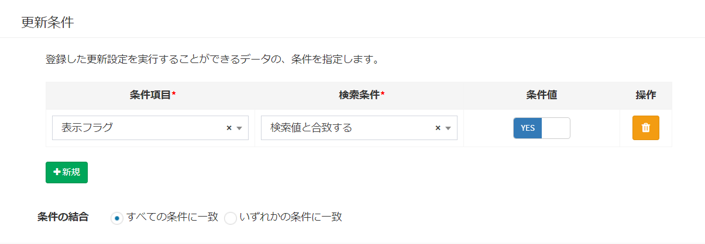
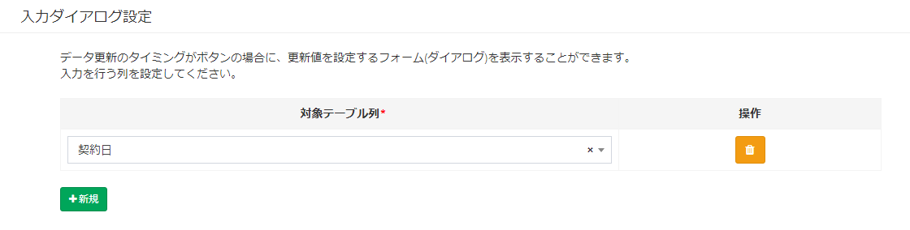

# Data update settings
A specific trigger such as "click a button" or "create new data" updates the data saved in Exment in a batch.  
As an example, it can be used for the following purposes.  

- Display the "Finish" button on the data details screen of the table "Task Information" and click the button to complete the value of the custom column "Status".  
- When updating data, the value of the custom column "person in charge" is automatically set for the logged-in user.  

> This function was implemented as "Batch data update" in v3.5.0 and below. The function has been expanded from v3.5.0.  

If you want to update more complicated conditions or more complicated contents, implement [Plug-in (button)](/plugin_quickstart_button) or [Plug-in (event)](/plugin_quickstart_event). Please give me.

## Update timing type

- ##### When check is selected on the list screen

A button will be added to the data list screen.  
By checking the check box on the list screen and clicking the button, the checked data will be updated with the set contents.  

- ##### When the button on the data details screen is pressed

A button is displayed on the data details screen.  
By clicking the button, the data will be updated with the set contents.  

- ##### When creating new data
When the user creates new data on the screen, API, import, etc., the data is updated with the set contents.  

- ##### When updating data
When the user updates the data by screen, API, import, etc., the data is additionally updated with the set contents.  

## Setting screen
- In the custom table list, check one of the tables you want to set, and click "Detailed table settings" in the upper right.  

- Alternatively, after selecting the table you want to set from the menu, click "Detailed table settings" in the upper right corner as well.  
※It is necessary to set in advance to display the corresponding table in the menu.  

- After that, the data update settings of the checked custom table will be displayed.  

- The data update setting screen is displayed.

## New addition
- On the "Data Update Settings" screen, click the [New] button at the top right of the page.

- The new addition screen for data update settings will be displayed. Enter the required information.

## Save
After entering the settings, click [Send].

## Edit
If you want to edit the data update settings, click the [Edit] link in the corresponding line.

## Delete
If you want to delete the data update settings, click the [Delete] link in the corresponding line.

## Details of entry items

### basic configuration

- ##### Process name
The name of this data update setting.

- ##### Update timing
Set the timing to set this data update.  
Please check the "update timing" at the top of this page and make the settings.  

- ##### Button label
Set the wording to be displayed on the buttons on the screen.  
※Displayed only when "Update timing" is "When the check on the list screen is selected" or "When the button on the data details screen is pressed".

- ##### Button icon
Set the icon to be displayed on the button on the screen.  
※Displayed only when "Update timing" is "When the button on the data details screen is pressed".

- ##### Button HTML class
Please set the HTML class to be added to the button on the screen.  
※Displayed only when "Update timing" is "When the button on the data details screen is pressed".

### Update column setting

Set the target column for data update and the update value.

- ##### Target column
Select the column to be updated.

- ##### Update type
If the custom column type of the target column is "Date", "Time", "Date and time", "User", or "Affiliation", one of "Fixed value" and "System value" is displayed.  
Otherwise, you will only have a "fixed value" option.  

- ##### Update value
    - If "Fixed value" was selected as the update type, enter the value you want to update.  
    - If the custom column type of the target column is "Date", "Time", "Date and time", and "System value" is selected as the update type, "Execution date and time" is displayed as a choice.  
    - If the custom column type of the target column is "User" and "System Value" is selected as the update type, "Login User" and "Created user" are displayed as a choice.  
    - If the custom column type of the target column is "Organization" and "System Value" is selected as the update type, "Affiliation Organization" is displayed as a choice.  

### Update conditions

Specify the conditions for the data that can execute the registered update settings. You can execute the set update settings only when the conditions are met.  
※If you have not set any conditions, you can update all the data.

### Input dialog settings

  

A dialog will be displayed when the update is executed, and you can manually enter the update value for the target column.  
※This can be selected only when "Update timing" is "When the check on the list screen is selected" or "When the button on the data details screen is pressed".

## Update execution
When the setting is completed, the update process will be executed at the timing set in the setting item "Update timing".  

### Updates
- Updates the data value to the value set in the setting item "Update column setting".  
However, if "System Value" is selected as the update type, update as follows.  

    - If the update value is "execution date and time", set the execution date and time when the update process was executed.
    - If the update value is "Login user", set the ID of the login user who performed the update process.
    - If the update value is "Created user", set the ID of the user who created the data.
    - If the update value is "Affiliated organization", set the ID of the organization to which the logged-in user who performed the update process belongs.  
    ※If the logged-in user belongs to multiple organizations and the column to be updated is not set to "Allow multiple selection", the first organization will be saved in the target data.  

- If the target table column is selected in the setting item "Input dialog setting", the dialog for inputting the update value is displayed.  

  
    
### Update conditions
- Data that does not meet the conditions set in "Update conditions" cannot be updated.  
- If "Update timing" is "When check is selected on the list screen", an error will be displayed if you check the data that does not meet the conditions and click the update button.  
In that case, other data that meets the conditions will not be updated either.